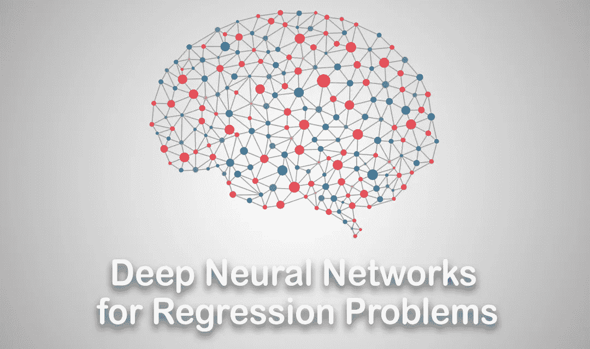
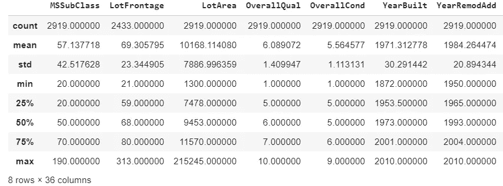
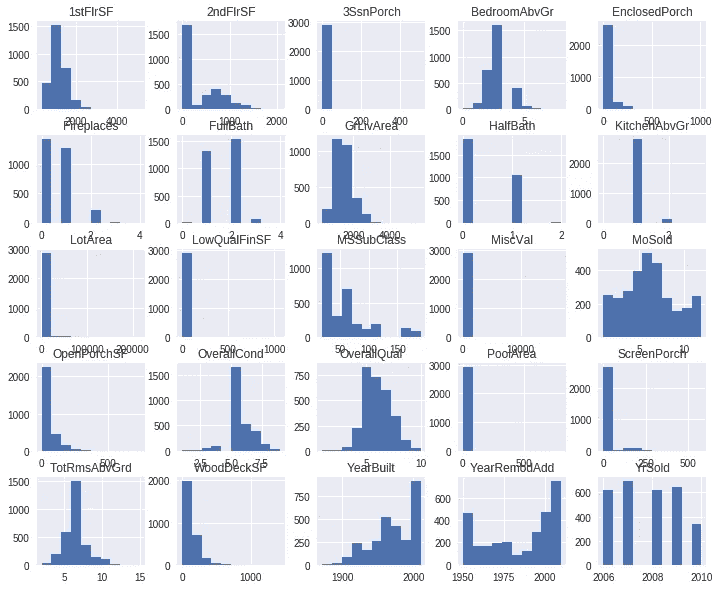
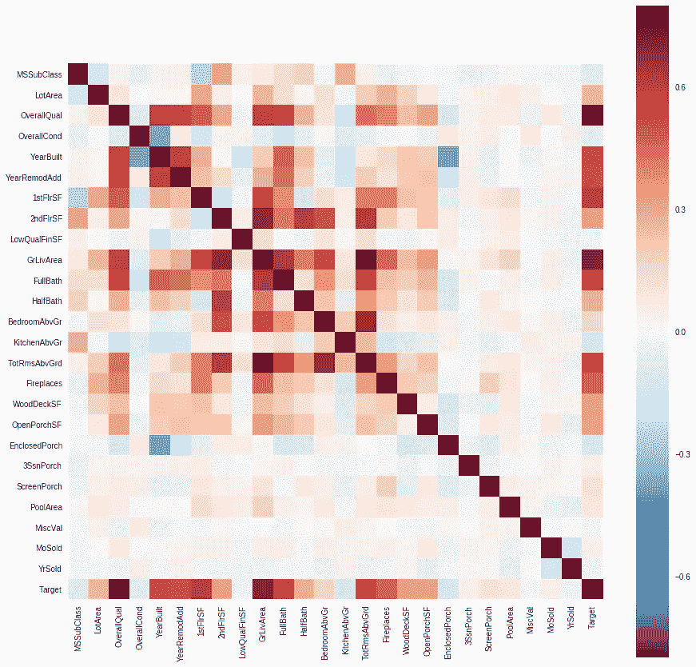
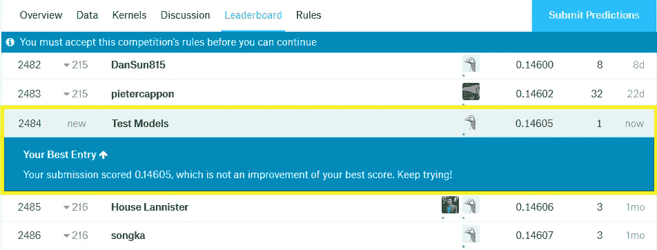
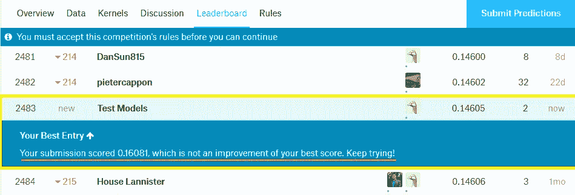
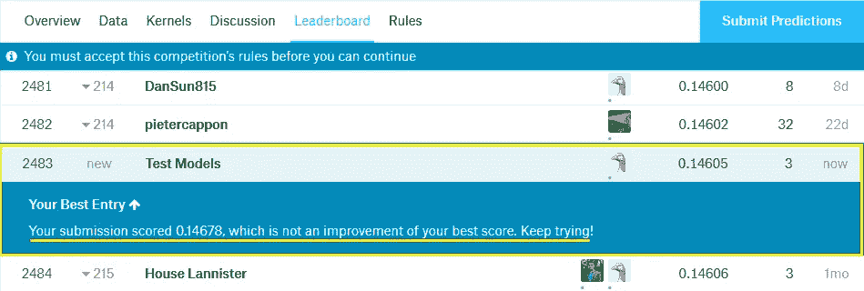

# 回归问题的深度神经网络

> 原文：<https://towardsdatascience.com/deep-neural-networks-for-regression-problems-81321897ca33?source=collection_archive---------1----------------------->



[Image Source](https://paulvanderlaken.files.wordpress.com/2017/10/1-0flvittznpkh8qkj7upleq.png?w=700)

神经网络在分类问题上是众所周知的，例如，它们被用于手写数字分类，但问题是，如果我们将它们用于回归问题，会有成效吗？

在本文中，我将使用一个深度神经网络，通过 Kaggle 的数据集来预测房价。

你可以从[这里](https://www.kaggle.com/c/house-prices-advanced-regression-techniques/data)下载数据集

我强烈推荐你试着用我的笔记本在 Google colab [ [这里](https://colab.research.google.com/drive/1J8ZTI2UIJCwml2nrLVu8Gg0GXEz-7ZK0) ]上运行代码

# 内容:

> `1- Process the dataset
> 2- Make the deep neural network
> 3- Train the DNN
> 4- Test the DNN
> 5- Compare the result from the DNN to another ML algorithm`

**首先，我们将导入所需的依赖项:**

# 首先:处理数据集

我们不会深入处理数据集，我们想要做的只是让数据集准备好输入我们的模型。

我们将去掉任何具有缺失值的特征，然后我们将对分类特征进行编码，就这样。

## 加载数据集:

*   将训练和测试数据加载到 pandas 数据框架中
*   组合训练和测试数据以一起处理它们

```
combined.describe()
```



让我们定义一个函数来获取没有任何缺失值的列

获取没有任何缺失值的列。

让我们看看有多少列

```
[out]:
Number of numerical columns with no nan values : 25 
Number of nun-numerical columns with no nan values : 20
```



Histogram of the features

**特征之间的相关性**



从上面的关联热图中，我们看到大约 15 个特征与目标高度相关。

**一个热编码分类特征:**

我们将使用一个热编码对分类特征进行编码。

```
[out]:
There were 45 columns before encoding categorical features 
There are 149 columns after encoding categorical features
```

现在，将组合数据帧拆分为训练数据和测试数据

# 第二:制作深度神经网络

*   定义顺序模型
*   添加一些密集层
*   使用' **relu** '作为隐藏层的激活功能
*   使用一个'**普通的**'初始化器作为内核初始化器

> `Initializers define the way to set the initial random weights of Keras layers.`

*   我们将使用平均绝对误差作为损失函数
*   定义只有一个节点的输出层
*   使用' **linear** '作为输出层的激活函数

```
[Out]:
_________________________________________________________________ Layer (type)                 Output Shape              Param #    ================================================================= dense_1 (Dense)              (None, 128)               19200      _________________________________________________________________ dense_2 (Dense)              (None, 256)               33024      _________________________________________________________________ dense_3 (Dense)              (None, 256)               65792      _________________________________________________________________ dense_4 (Dense)              (None, 256)               65792      _________________________________________________________________ dense_5 (Dense)              (None, 1)                 257        ================================================================= Total params: 184,065 Trainable params: 184,065 Non-trainable params: 0 _________________________________________________________________
```

**定义检查点回调:**

# 第三:训练模型:

```
[out]:
Train on 1168 samples, validate on 292 samples
Epoch 1/500
1168/1168 [==============================] - 0s 266us/step - loss: 19251.8903 - mean_absolute_error: 19251.8903 - val_loss: 23041.8968 - val_mean_absolute_error: 23041.8968  
Epoch 00001: val_loss did not improve from 21730.93555 
Epoch 2/500
 1168/1168 [==============================] - 0s 268us/step - loss: 18180.4985 - mean_absolute_error: 18180.4985 - val_loss: 22197.7991 - val_mean_absolute_error: 22197.7991  
Epoch 00002: val_loss did not improve from 21730.93555
.
.
.
Epoch 00500: val_loss did not improve from 18738.19831<keras.callbacks.History at 0x7f4324aa80b8>
```

我们看到最佳模型的验证损失是 18738.19

# 第四:测试模型

我们将把测试数据上的预测提交给 Kaggle，看看我们的模型有多好。



The result of the deep neural network’s submission on Kaggle

一点也不差，再做一些预处理和更多的训练，我们可以做得更好。

# 第五:尝试另一种 ML 算法:

现在，让我们尝试另一种 ML 算法来比较结果。

我们将使用随机森林回归器和 xgb 回归器。

**将训练数据分割成训练和验证数据**

**我们先试试随机森林模式:**

```
Random forest validation MAE =  19089.71589041096
```

**制作提交文件，提交给 Kaggle 看结果:**



The result of random forest’s submission on Kaggle

**现在，让我们试试 XGBoost 模型:**

```
[out]: 
XGBoost validation MAE =  17869.75410958904
```

**制作一个提交文件，提交给 Kaggle 看结果:**



The result of XGBoost’s submission on Kaggle

这不是一个惊喜吗，我真的不认为神经网络会击败随机森林和 XGBoost 算法，但让我们试着不要太乐观，记住我们没有在随机森林和 XGBoost 模型上配置任何超参数，我相信如果我们这样做，这两个模型会超过神经网络。

## 总结一下我们所做的事情:

*   我们加载并处理数据集
*   我们通过绘制一些直方图和特征的相关热图来熟悉数据集
*   我们使用了具有三个隐藏层的深度神经网络，每个隐藏层具有 256 个节点。
*   我们在输出层使用了线性激活函数
*   我们训练了模型，然后在 Kaggle 上测试。
*   我们还测试了另外两个模型
*   我们的深度神经网络能够超越这两个模型
*   我们相信，如果我们调整它们的超参数，这两个模型可以击败深度神经网络模型。

# 后续步骤:

*   尝试在处理数据集上投入更多精力
*   尝试其他类型的神经网络
*   尝试调整我们使用的两个模型的超参数
*   如果你真的想在回归问题上做得更好，遵循这个教程:

[ [累积回归:排行榜前 4% | ka ggle](https://www.kaggle.com/serigne/stacked-regressions-top-4-on-leaderboard)]

# 参考资料:

*   [Python 中 Keras 深度学习库回归教程](https://machinelearningmastery.com/regression-tutorial-keras-deep-learning-library-python/)

可以在推特上关注我 [@ModMaamari](https://twitter.com/ModMaamari)

## 您可能还喜欢:

*   [**AI 生成泰勒斯威夫特的歌词**](https://blog.goodaudience.com/ai-generates-taylor-swifts-song-lyrics-6fd92a03ef7e)
*   [**用 Python 介绍随机森林算法**](https://medium.com/datadriveninvestor/introduction-to-random-forest-algorithm-with-python-9efd1d8f0157)
*   [**带 TensorFlow APIs 的机器学习速成班汇总**](https://medium.com/@mamarih1/machine-learning-crash-course-with-tensorflow-apis-summary-524e0fa0a606)
*   [**如何用 Tensorflow 和 Keras**](https://medium.com/@mamarih1/how-to-make-a-cnn-using-tensorflow-and-keras-dd0aaaed8ab4) **制作一个 CNN？**
*   [**如何选择最好的机器学习模型？**](https://medium.com/@mamarih1/how-to-choose-the-best-machine-learning-model-e1dbb46bdd4d)