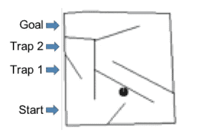

# 深层神经进化:遗传算法是用于强化学习的深层神经网络训练的竞争性替代方案——论文摘要

> 原文：<https://towardsdatascience.com/deep-neuroevolution-genetic-algorithms-are-a-competitive-alternative-for-training-deep-neural-822bfe3291f5?source=collection_archive---------4----------------------->

Photo by [veeterzy](https://unsplash.com/@veeterzy?utm_source=medium&utm_medium=referral) on [Unsplash](https://unsplash.com?utm_source=medium&utm_medium=referral)

2017 年 12 月，优步人工智能实验室发布了与[神经进化](https://www.oreilly.com/ideas/neuroevolution-a-different-kind-of-deep-learning)相关的[五篇论文](https://eng.uber.com/deep-neuroevolution/)，这是一种通过进化算法优化深层神经网络的实践。

本文是对题为“T4 深度神经进化:遗传算法是训练强化学习深度神经网络的一种竞争性选择”的论文的总结。它是为那些对机器学习相关主题有一些基本熟悉的人设计的。“遗传算法”和“梯度下降”等概念是前提知识。

优步人工智能实验室的五篇论文中的大部分研究，包括我正在总结的这篇论文，都是基于 OpenAI 在论文“[进化策略作为强化学习的可扩展替代方案”](https://arxiv.org/abs/1703.03864)中所做的研究。OpenAI 已经写了一篇[博客文章](https://blog.openai.com/evolution-strategies/)来总结他们的论文。一个更短的总结(我写的)可以在这里找到。

本文实验所用代码可在[找到，此处为](https://github.com/uber-research/deep-neuroevolution)。2018 年 4 月，该代码被优化为在一台个人电脑上运行。优步人工智能实验室的一篇博文描述了实现这一点的工作，具体代码可以在这里找到。

## 结果如何？

深度神经网络(DNN)通常使用基于梯度的方法(如反向传播)进行优化。本文表明，使用简单的遗传算法(g a)优化 dnn 是可能的，并且在应用于强化学习(RL)任务时，如学习玩雅达利游戏、模拟仿人运动或欺骗性迷宫问题时，GA 是基于梯度的方法的竞争替代品。

遗传算法的可伸缩性通过进化一个具有超过四百万参数的 DNN 来展示，这是有史以来用进化算法进化的最大的网络。并行化的能力意味着 GAs 的计算可以分布在许多 CPU 上，与基于梯度的方法相比，可以更快地训练 DNNs。此外，通过巧妙地将 DNN 参数表示为一系列随机种子，一个拥有超过 400 万个参数的网络可以在仅仅几千个字节内进行编码(小 1 万倍)。

[新奇搜索](https://link.springer.com/chapter/10.1007/978-1-4614-1770-5_3) (NS)，一种与 GAs 一起使用的技术，用于鼓励在具有欺骗性或稀疏奖励的任务中进行探索，在一个问题域(称为“图像硬迷宫”)中显示出优于其他仅针对奖励进行优化的基于梯度和进化的算法。

令人惊讶的是，在学习玩一些雅达利游戏时，随机搜索(RS)被发现是有竞争力的(尽管从未像 GAs 那样有竞争力)。这表明，在某些领域，围绕原点进行采样就足以找到合适的解决方案。

这些结果表明，GAs(和 RS)并不比其他优化 DNN 的方法更好或更差，但它们是一种“有竞争力的替代方案”,可以添加到他们的 RL 工具带中。

像 OpenAI 一样，他们指出，尽管 dnn 在监督学习中不会陷入局部最优，但由于欺骗性或稀疏的奖励信号，它们仍然会在 RL 任务中陷入困境。正是由于这个原因，与 RL 中其他流行的算法相比，基于非梯度的方法(如 GAs)可以执行得很好。

## 关于大会

关于天然气的介绍，我推荐 Vijini Mallawaarachchi 的[博客文章](/introduction-to-genetic-algorithms-including-example-code-e396e98d8bf3)。

RL 中流行的算法如 [Q-learning](https://en.wikipedia.org/wiki/Q-learning) 和[策略梯度](http://www.scholarpedia.org/article/Policy_gradient_methods)使用梯度下降。ES 也通过类似于[有限差分](https://en.wikipedia.org/wiki/Finite_difference)的运算跟随梯度。与这些方法不同，遗传算法不遵循梯度，而是通过变异进行探索，通过选择进行开发来进化群体中的个体。

这项工作使用一个非常简单的遗传算法，目的是建立一个埃及艾滋病的基线。它非常简单，甚至没有使用交叉，这是一种在 GAs 中非常常见的技术，以至于一开始把这种算法称为 GA 都感觉很奇怪。

在初始化群体后，前 T 个个体(在这种情况下是神经网络参数向量)被选为潜在的亲本。然后从均匀随机(有替换)中选择这些个体，并通过添加高斯噪声使其变异，该高斯噪声具有为每个实验凭经验确定的标准偏差。每一代中得分最高的个体也被添加到下一代中(一个个体的精英主义)。

**最先进的编码技术**

> 我们提出了一种新的方法，通过将每个参数向量表示为初始化种子加上产生应用于 theta 的一系列突变的随机种子的列表，来紧凑地存储大的参数向量。这项创新对于使遗传算法能够在深度神经网络的规模上工作至关重要，因此我们称之为深度遗传算法。这种技术还具有提供最先进的压缩方法的优势。

在没有交叉的情况下，定义个体的种子列表等于代数。它具有降低内存和网络传输成本的优势。对于交叉，需要一种新的更复杂的方法来对个体进行编码。这种编码方法非常酷。用相对少量的种子代表数百万个神经网络参数。

## 新颖性搜索

> [新奇搜索]是为欺骗性领域设计的，在这些领域中，基于奖励的优化机制会收敛到局部最优。NS 通过在进化过程中忽略奖励函数来避免这些局部最优，而是奖励代理执行以前从未执行过的行为(即，新颖的)。

NS 需要一个可以量化任意两个人行为差异的函数。在每一代之后，个人有小概率被添加到档案中。新个体的“新颖性”是通过与同代人以及档案中存储的人进行比较来确定的。

## 实验

实验集中在遗传算法在下列任务中的性能；从像素开始学习玩 Atari 游戏，连续控制模拟的人形学步车(MuJoCo)，以及一个已知的欺骗性局部优化问题，称为“图像硬迷宫”。

**雅达利**

A simple genetic algorithm can evolve a deep neural network with 4M+ weights to play Frostbite well

13 款雅达利游戏入选。五个被选中是因为 ES 在他们身上表现很好。其他四个被选中是因为 ES 表现不佳。最后，从可用游戏的集合中按字母顺序选择四个。

雅达利游戏上的 GAs 性能与其他强化学习算法的性能进行了比较，如 [DQN](https://arxiv.org/abs/1710.02298) (Q-learning)、es 和 [A3C](https://www.nature.com/articles/nature14236) (策略梯度)。ES 和 A3C 的结果都来自 OpenAI 的[论文](https://arxiv.org/abs/1703.03864)。为了便于比较，数据预处理和网络架构与 2015 年关于 DQNs 的[论文](https://www.nature.com/articles/nature14236)中介绍的相同。自 2015 年以来，对 DQNs 进行了许多改进，但作者认为，将结果与香草 DQN 进行比较是有意义的，因为这项工作只使用了香草遗传算法。为了与 OpenAI 最近在 es 上的工作进行比较，代理在 GA 运行过程中经历的游戏帧数保持不变(10 亿帧),就像在 ES 实验中一样。这意味着代理将看到不同数量的帧(取决于它们的成功程度)，并且 GA 运行中的代数是不固定的。

> 【本研究使用】Mnih 等人(2015) 提出的更大的 DQN 架构，由 3 个 32、64 和 64 信道的卷积层和一个 512 单元的隐藏层组成。卷积层使用跨度分别为 4、2 和 1 的 8 x 8、4 x 4 和 3 x 3 滤波器。所有隐藏层之后是整流器非线性(ReLU)。该网络包含超过 4M 个参数。

将遗传算法的结果与其他算法进行比较存在一些困难。不像 GA、ES 和 DQN 都是随机开始训练的，A3C 是使用人类开始样本的数据库来训练的。此外，DQN 的结果是使用大约 2 亿帧(由于计算时间过长)获得的，而 es、RS 和 GA 使用了 10 亿帧。

总的来说，遗传算法的性能与其他算法大致相当(见下表 1)。DQN、ES 和 GA 分别在三场比赛中获得最佳成绩，而 A3C 在四场比赛中获得最佳成绩。

对于某些游戏，GA 有时在一代或几十代内就胜过 DQN 和 es。在第一代中发现的那些解决方案本质上是随机的 dnn，因为甚至没有一轮选择。那么 GA 只是在做随机搜索吗？这里 RS 是 GA 的特例，代数等于 1。看结果，GA 总是胜过 RS。但是天哪，RS 可以在某些领域打败 DQN，A3C 和 ES。

A deep neural network found through random search plays Frostbite surprisingly well

> RS 对 DQN、A3C 和 ES 的成功表明，许多基于领先的深度 RL 算法的低性能而看起来很难的 Atari 游戏可能没有我们想象的那么难，相反，由于某种原因，这些算法在实际上很容易的任务上表现极差。

Table 1\. The Atari results reveal a simple genetic algorithm is competitive with Q-learning (DQN), policy gradients (A3C), and evolution strategies (ES). Shown are game scores (higher is better). Comparing performance between algorithms is inherently challenging (see main text), but we attempt to facilitate comparisons by showing estimates for the amount of computation (operations, the sum of forward and backward neural network passes), data efficiency (the number of game frames from training episodes), and how long in wall-clock time the algorithm takes to run. The GA, DQN, and ES, perform best on 3 games each, while A3C wins on 4 games. Surprisingly, random search often finds policies superior to those of DQN, A3C, and ES (see text for discussion). Note the dramatic differences in the speeds of the algorithm, which are much faster for the GA and ES, and data efficiency, which favors DQN. The scores for DQN are from [Hessel et al. (2017)](https://arxiv.org/abs/1710.02298) while those for A3C and ES are from [Salimans et al. (2017)](https://arxiv.org/abs/1703.03864).

**人形运动**

*Humanoid locomotion, controlled by a deep neural networks trained with a simple genetic algorithm.*

遗传算法接下来在一个连续控制问题上进行测试，其中一个模拟的人形机器人学习走路。使用的软件是[MuJoCo](https://gym.openai.com/envs/Humanoid-v2/)(open Dai 健身房的 Humanoid-v1 环境)。

> 这个问题包括将描述人形机器人状态(例如，其位置、速度、角度)的 376 个标量的向量映射到 17 个关节扭矩。机器人会收到一个标量奖励，每个时间步长由四个部分组成。它的站姿和在 x 轴正方向的速度会得到正回报，消耗的能量越多，撞击地面的力度越大，得到的回报就越低。这四项在一集的每一个时间点上相加，计算出总奖励。

与 es 相比，GA 需要更多的计算来获得类似的结果，这是令人惊讶的，因为 GA 在 Atari 游戏上表现得非常好。

**形象硬迷宫**

The Image Hard Maze domain

图像硬迷宫是一个包含局部最优(陷阱)的问题，它欺骗贪婪地接近目标的代理。

查新没有这个问题，因为它忽略了奖励，鼓励代理人去新的地方。如前所述，NS 需要一个行为差异函数来确定“新颖性”。对于这个问题，该函数是最终位置之间的平方欧几里得距离。

神经网络看到迷宫的鸟瞰图，这是 84×84 像素的图像，有超过 400 万个参数。它通过速度和旋转输出来控制机器人在迷宫中的导航。前三帧也是提供时间信息的输入的一部分。

执行新颖性搜索允许遗传算法解决这个任务，而只为奖励(到目标的最小距离)优化的遗传算法和专家系统陷入局部最优。DQN 和 A2C(A3C 的源代码不可用)也无法进行足够的探索来与 GA-n 竞争。

How different algorithms explore the deceptive Image Hard Maze over time. Traditional reward-maximization algorithms do not exhibit sufficient exploration to avoid the local optimum (going up). In contrast, a GA optimizing for novelty only (GA-NS) explores the entire environment and ultimately finds the goal. All 3 evolutionary algorithms had the same number of evaluations. For DQN and A2C, we plot the end-of-episode position of the agent for each of the 20K episodes prior to the checkpoint listed above the plot.

## 结论

实验表明，与 DQN、A3C 和 ES 等其他众所周知的算法相比，遗传算法是 RL 中有竞争力的替代算法，有时性能更好，有时性能更差。这项工作只使用了简单的遗传算法，通过将遗传算法与其他已知在神经进化领域有效的技术相结合，或者将遗传算法与其他 RL 算法相结合，可能会发现新的结果。

虽然这些结果看起来很有希望，但也有可能采取稍微悲观一点的观点。2018 年 3 月，Ben Recht 与人合著了一篇名为[简单随机搜索的论文，提供了一种增强学习的竞争方法](https://arxiv.org/abs/1803.07055)，其中他的团队利用 RS 实现了 MuJoCo 行走任务的最先进水平。他的[结论](http://www.argmin.net/2018/03/20/mujocoloco/)与本文中关于这些结果的结论相似，即 RS 在这些领域的成功表明这些问题并不像以前认为的那样困难。

然而，论文中的工作确实证明了一个简单的遗传算法可以优于 RS，并且通过继续在这个方向上的研究可能会有进一步的收获。它还表明，在当前流行的算法中，存在关于采样效率和计算时间的折衷。考虑到您的用例，这是可以考虑的。如果样品的成本很高，基于梯度的方法可能更好。如果时间是限制因素，遗传算法会更快地为你找到解决方案。也许在未来，我们将能够指定一个“速度与采样效率”的折衷方案，并找到一个同时使用 EAs 和基于梯度的方法的解决方案。