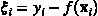
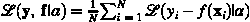
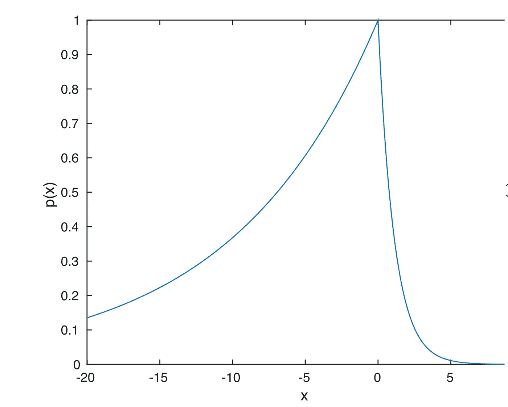
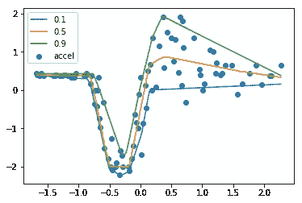

# 深度分位数回归

> 原文：<https://towardsdatascience.com/deep-quantile-regression-c85481548b5a?source=collection_archive---------4----------------------->

深度学习尚未广泛探索的一个领域是估计的不确定性。大多数深度学习框架目前专注于给出由损失函数定义的最佳估计。偶尔需要一些超出点估计的东西来做决定。这就是发行版有用的地方。贝叶斯统计很好地解决了这个问题，因为可以推断出数据集的分布。然而，贝叶斯方法迄今为止一直相当慢，并且应用于大型数据集将是昂贵的。

就决策而言，大多数人实际上需要分位数，而不是估计中的真正不确定性。例如，当测量给定年龄的儿童的体重时，个体的体重会变化。有趣的是(为了便于讨论)第 10 和第 90 百分位。请注意，不确定性不同于分位数，因为我可以请求第 90 个分位数的置信区间。本文将纯粹专注于推断分位数。

# 分位数回归损失函数

在回归中，最常用的损失函数是均方误差函数。如果我们取这个损失的负值并对其求幂，结果将对应于高斯分布。该分布的模式(峰值)对应于均值参数。因此，当我们使用使这种损失最小化的神经网络进行预测时，我们预测的是可能在训练集中有噪声的输出的平均值。

单个数据点的分位数回归损失定义为:


Loss of individual data point

其中，alpha 是所需的分位数(0 到 1 之间的值),而



其中 f(x)是预测(分位数)模型，y 是相应输入 x 的观测值。整个数据集的平均损失如下所示:



Loss funtion

如果我们取个体损失的负值并对其取指数，我们得到的分布称为不对称拉普拉斯分布，如下所示。这个损失函数起作用的原因是，如果我们要找到图中零左边的面积，它将是α，即所需的分位数。



probability distribution function (pdf) of an Asymmetric Laplace distribution.

当α= 0.5 时的情况很可能更熟悉，因为它对应于平均绝对误差(MAE)。这个损失函数始终估计中位数(第 50 个百分位数)，而不是平均值。

# Keras 中的建模

正向模型与你做 MSE 回归时的模型没有什么不同。改变的只是损失函数。下面几行定义了上一节中定义的损失函数。

```
**import** **keras.backend** **as** **K****def** tilted_loss(q,y,f):
    e = (y-f)
    **return** K.mean(K.maximum(q*e, (q-1)*e), axis=-1)
```

当涉及到编译神经网络时，只需简单地做:

```
quantile = 0.5
model**.**compile(loss**=lambda** y,f: tilted_loss(quantile,y,f), optimizer**=**'adagrad')
```

完整的例子见[这个 Jupyter 笔记本](https://github.com/sachinruk/KerasQuantileModel/blob/master/Keras Quantile Model.ipynb)，我在那里看了一段时间的摩托车碰撞数据集。结果如下，我显示了第 10、50 和 90 个分位数。



Acceleration over time of crashed motor cycle.

# 最终注释

1.  **注意，对于每个分位数，我必须重新运行训练。**这是由于每个分位数的损失函数是不同的，因为分位数本身就是损失函数的一个参数。
2.  由于每个模型都是简单的重新运行，因此存在分位数交叉的风险。即第 49 个分位数可能在某个阶段超过第 50 个分位数。
3.  请注意，分位数 0.5 与中位数相同，可以通过最小化平均绝对误差来实现，这可以在 Keras 中实现，与`loss='mae'`无关。
4.  不确定性和分位数是**而不是**一回事。但是大多数时候你关心的是分位数而不是不确定性。
5.  如果你真的想要深度网络结帐的不确定性[http://mlg.eng.cam.ac.uk/yarin/blog_3d801aa532c1ce.html](http://mlg.eng.cam.ac.uk/yarin/blog_3d801aa532c1ce.html)

# 编辑 1:

正如 [Anders Christiansen](https://medium.com/@andersasac?source=post_info_responses---------0----------------) (在回答中)指出的，我们可以通过设定多个目标一次获得多个分位数。然而，Keras 通过一个`loss_weights`参数组合了所有损失函数，如下所示:[https://keras . io/getting-started/functional-API-guide/# multi-input-and-multi-output-models](https://keras.io/getting-started/functional-api-guide/#multi-input-and-multi-output-models)。在 tensorflow 中实现会更容易。如果有人捷足先登，我会很乐意改变我的笔记本/帖子来反映这一点。作为一个粗略的指导，如果我们想要分位数 0.1，0.5，0.9，Keras 中的最后一层将有`Dense(3)`，每个节点都连接到一个损失函数。

# 编辑 2

感谢 [Jacob Zweig](https://medium.com/@jacob.zweig?source=post_info_responses---------1----------------) 在 TensorFlow 中实现同时多个分位数:[https://github . com/strong io/Quantile-regression-tensor flow/blob/master/Quantile % 20 loss . ipynb](https://github.com/strongio/quantile-regression-tensorflow/blob/master/Quantile%20Loss.ipynb)

## 思考后:

这些是我的一些想法，是我在一年前写这篇文章时补充的。

1.  多个分位数:我想得越多，我就越确信你应该一次完成所有的分位数。例如，如果我们需要分位数 0.05、0.5 和 0.95，则有 3 个输出节点，每个节点有一个不同的损失函数(求和得到最终损失)。这确保了数据的结构在前几层是共享的。
2.  分位数交叉:为了确保我们避免这种情况，非中位数分位数，例如 0.95，可以建模为(节点 0.5 + sigma * sigmoid(0.95 节点))。其中 sigma 是最大值，我们期望 0.95 分位数偏离中值。类似思想可以在 0.05 分位数上实施，而代之以 sigma * sigmoid(0.05 节点)上的负号。

看这里是我关于机器学习和深度学习的[课程](https://www.udemy.com/course/machine-learning-and-data-science-2021/?couponCode=DEEPSCHOOL-MARCH)(使用代码 Deep school-三月到九折)。