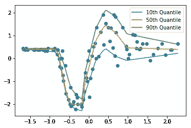

# 张量流中的深度分位数回归

> 原文：<https://towardsdatascience.com/deep-quantile-regression-in-tensorflow-1dbc792fe597?source=collection_archive---------6----------------------->

深度学习中的一个关键挑战是如何获得对预测器界限的估计。分位数回归最早由 Koenker 和 Bassett [1]在 70 年代引入，它允许我们估计潜在条件数据分布的百分位数，即使在它们不对称的情况下，也能让我们了解预测因子和反应之间的变异性关系。

如 Koeneker 和 Hallock [2]所述，OLS 回归的标准方法是通过绘制一条线来估计数据的条件平均值*,该线使该线和图上所有点之间的距离最小化。相反，分位数回归的目标是估计有条件的*中位数、*或任何其他分位数。为此，我们根据所选的分位数对图表上的点和我们的回归线之间的距离进行加权。例如，如果我们选择第 90 个分位数进行估计，我们将拟合一条回归线，使 90%的数据点低于该线，10%高于该线。*

## 张量流代码

Sachin Abeywardana 最近在 medium 上发表的一篇伟大的[文章展示了如何使用 Keras 进行深度分位数回归。然而，这种实现的限制是，它需要每个分位数单独拟合模型。然而，使用 Tensorflow，我们可以同时拟合任意数量的分位数。](/deep-quantile-regression-c85481548b5a)

用于此实现的[笔记本](https://github.com/strongio/quantile-regression-tensorflow/blob/master/Quantile%20Loss.ipynb)可以在 [Strong Analytics](http://strong.io) github 上找到。

我们首先实例化一个简单的回归模型，并为我们想要估计的每个分位数添加输出

```
# Define the quantiles we’d like to estimate
quantiles = [.1, .5, .9]# Add placeholders for inputs to the model
x = tf.placeholder(tf.float32, shape=(None, in_shape))
y = tf.placeholder(tf.float32, shape=(None, out_shape))# Create model using tf.layers API
layer0 = tf.layers.dense(x, units=32, activation=tf.nn.relu)
layer1 = tf.layers.dense(layer0, units=32, activation=tf.nn.relu)# Now, create an output for each quantile
outputs = []
for i, quantile in enumerate(quantiles):
    output = tf.layers.dense(layer1, 1, name=”{}_q{}”.format(i, int(quantile*100)))
    outputs.append(output)
```

现在，我们为每个分位数创建损失

```
losses = []
for i, quantile in enumerate(quantiles):
   error = tf.subtract(y, output[i])
   loss = tf.reduce_mean(tf.maximum(quantile*error, (quantile-1)*error), axis=-1)
   losses.append(loss)
```

最后，我们合并损失并实例化我们的优化器

```
combined_loss = tf.reduce_mean(tf.add_n(losses))
train_step = tf.train.AdamOptimizer().minimize(combined_loss)
```

基本上就是这样了！现在，我们可以拟合我们的模型，同时估计所有指定的分位数:

```
for epoch in range(epochs):
   # Split data to batches
   for idx in range(0, data.shape[0], batch_size):
     batch_data = data[idx : min(idx + batch_size, data.shape[0]),:]
     batch_labels = labels[idx : min(idx + batch_size, labels.shape[0]),:] feed_dict = {x: batch_data,
                 y: batch_labels} _, c_loss = sess.run([train_step, combined_loss], feed_dict)
```

将这些数据拟合到摩托车碰撞的数据集上([从此处开始](https://github.com/sachinruk/KerasQuantileModel))得到以下输出:



Estimated quantiles

## 参考文献

1.回归分位数。罗杰·科恩克；吉尔伯特·巴塞特,《计量经济学》,第 46 卷，第 1 号。(1978 年 1 月)，第 33-50 页。

2.分位数回归。罗杰·科恩克；凯文·f·哈洛克。《经济展望杂志》第 15 卷第 4 期，2001 年秋季。(第 143-156 页)。

***想和芝加哥的顶级数据科学家团队一起从事各种行业中具有挑战性的机器学习和人工智能工作吗？我们正在招聘有才华的数据科学家和工程师！***

在 [strong.io](http://strong.io) 了解更多信息，并在 [careers.strong.io](https://careers.strong.io/) 申请