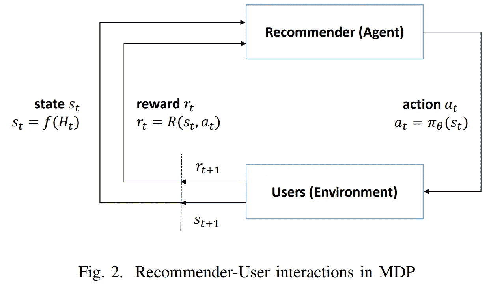
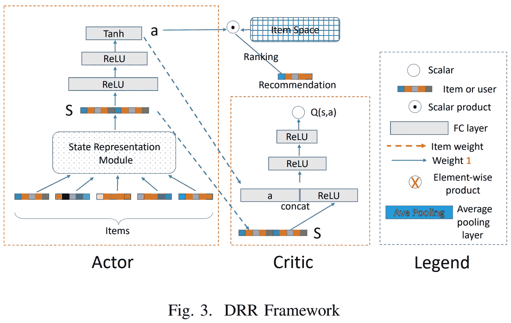
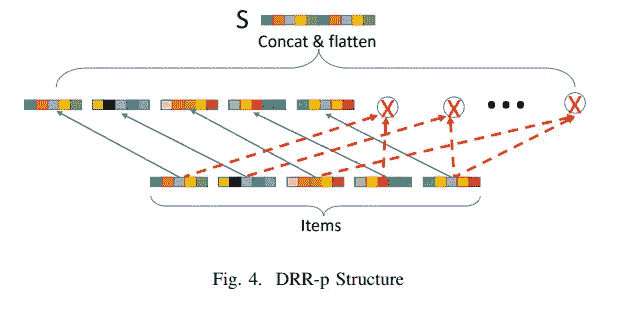
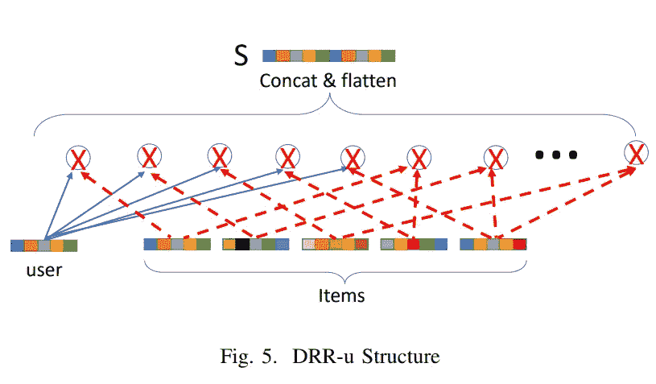
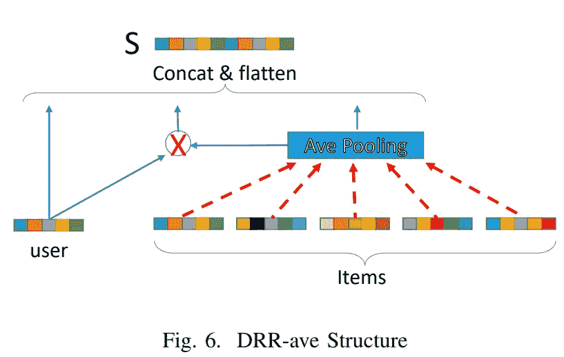

# 新闻推荐的深度强化学习。第 1 部分:架构。

> 原文：<https://towardsdatascience.com/deep-reinforcement-learning-for-news-recommendation-part-1-architecture-5741b1a6ed56?source=collection_archive---------8----------------------->

> 我将试着涵盖这篇文章的内容，如果你想了解更多细节，可以考虑阅读它。


.

.

.

# 重要说明

> 在这一点上，这篇文章已经过时了。它包含许多错误和不一致之处。我发表了另一篇 33 分钟(7k 字)的文章，对这个项目进行了深入的探讨。考虑改为阅读。附:绝对免费:[链接](/reinforcement-learning-ddpg-and-td3-for-news-recommendation-d3cddec26011)

[](/reinforcement-learning-ddpg-and-td3-for-news-recommendation-d3cddec26011) [## 用于新闻推荐的强化学习(DDPG 和 TD3)

### 强化学习是一个相当难的话题。当我开始深入挖掘时，我意识到需要一个好的…

towardsdatascience.com](/reinforcement-learning-ddpg-and-td3-for-news-recommendation-d3cddec26011) 

.

.

.

大多数现有的推荐系统使用静态方法进行新闻预测，也就是说，它们不理解你的行为(新闻选择)是连续的。第二个问题是，以前的方法往往是短视的，这意味着它们不会关注长期回报。使用较高的 gamma 值可以很容易地解决这个问题，但通常情况并非如此。

## 嵌入概述

嵌入是一种工具，它允许我们对一些对象的含义进行编码，以便找出它们之间的相似程度。在下面的例子中，你可以看到托尔斯泰的书彼此之间非常相似，但与希区柯克的有很大不同。它们用向量表示，相似性用点积符号计算

```
**books = ["War and Peace", "Anna Karenina", 
          "The Hitchhiker's Guide to the Galaxy"]****books_encoded_ideal = [[0.53,  0.85],
                       [0.60,  0.80],
                       [-0.78, -0.62]]****Similarity (dot product) between First and Second = 0.99
Similarity (dot product) between Second and Third = -0.94
Similarity (dot product) between First and Third = -0.97**
```

## 强化学习回顾:



强化学习简介:我们有一个在环境中行动的代理。相应地，这些行为会以分数的形式得到奖励。环境为代理提供状态并采取行动，将他带到下一步。整个过程被称为马尔可夫决策过程(或简称为 MDP)。基本上，有两种类型的预测:政策和 Q 学习。Q-Learning 训练一个神经网络，试图估计下一步和未来步骤的最佳回报(记住，不同的行动可能会有不同的回报)。然而，政策学习试图学习下一步行动的概率。

## 马尔可夫表示:

*   状态 s 是用户正面交互历史的表示
*   动作 a。动作 a 是排名分数的向量。这个动作是用户想要阅读的理想新闻。
*   状态被建模为用户的积极交互历史的表示。因此，一旦收集了用户的反馈，就定义了状态转换。
*   给定基于动作 a 和用户状态 s 的推荐，用户将提供她的反馈，即点击、未点击或评级等。推荐者根据用户的反馈接收即时奖励 R(s，a)。
*   贴现率γ。γ ∈ [0，1]是衡量长期报酬现值的一个因素。

## 以前的方法比较

Q-Learning 的问题是，由于对整体行动的评估，如果行动空间太大，这些方法可能会变得非常低效。尽管政策在更大的行动空间上更收敛，但它们不能理解序列特征。

介绍够了，我们来看看是什么样子的:

## 它是如何工作的

假设，我们观察了用户的行为，获得了他们点击的一些新闻帖子。它被输入到演员网络，演员网络决定我们接下来想读什么。它产生一个理想的新闻嵌入。可以和其他新闻嵌入进行对比，寻找相似之处。最匹配的会推荐给用户。评论家帮助判断演员，并帮助它找出错误。也有助于预测未来的行为。例如，推荐者建议用户购买一本书。它买它没有问题，并立即收到 100 英镑的奖励。但也可能发生的情况是，用户想要在未来归还这本书，惩罚我们-500。所有未来的行动都需要考虑在内。Q 网(评论家)也是如此，如前所述，政策方法往往是短视的，没有能力预测未来的回报。

## 体系结构



如你所见，这个网络由两层组成:演员和评论家。每一种都类似于不同的学习类型:行动者学习政策(下一步选择哪种行动的概率)，而批评家关注回报(Q 学习)。首先，一堆新闻**嵌入**被馈入演员的状态表示模块，在那里被编码。然后做出决定(动作)(以向量的形式)。结合项目嵌入，行动被输入到评论家模块，该模块旨在评估奖励将有多好。

## 状态模块

首先是状态表示模块，“它显式地对复杂的动态用户-项目交互进行建模，以追求更好的推荐性能”。简单地说，你可以把它看作是捕捉句子中单词语义的嵌入，但是用新闻和客户代替。嵌入的嵌入，多么可悲。它起着两个关键作用:用于排名和作为评论家网络的输入与行动相结合。

## 演员网络(政策)

对于给定的用户，网络负责基于她的状态 s 生成动作。由她的 n 个最近的积极交互项目的嵌入所表示的用户状态被用作输入。它们被馈送到状态模块，以便为用户产生状态的概括表示。然后，表示被转换成动作，一个大小为 n 的向量，范围在(-1，1)之间。

正如你所看到的，作者没有使用 softmax 来排名分数:

> 注意，在我们的模型中，一个动作既不对应于推荐一个项目，也不对应于推荐一个项目列表。相反，动作是一个连续的参数向量。采取这样的动作，通过执行具有项目嵌入的乘积(多重向量)，参数向量用于确定所有候选项目的排名分数。

下一步很重要:

## 批评家网络(Q 学习)

用来估计当前状态和动作的奖励会有多好:Qπ (s，a)。批评家网络的输入是用户状态表示模块产生的用户状态 s 和策略网络产生的动作，输出是 Q 值，Q 值是一个向量。根据 Q 值，演员网络的参数朝着提高动作 a 性能的方向更新，我不打算写所有的渐变，主要是因为我用的是 Pytorch。损失函数是简单的均方误差，因为我们要估计的是通常不归一化的实值回报，所以这是一个回归问题。

## 州立模块动物园



DRR-p-利用项目之间的成对依赖性。它通过使用元素级乘积运算符来计算 n 个项目之间的成对交互。(用户-项目交互被忽略！)



在 DRR 大学，我们可以看到用户嵌入也被纳入。除了项目之间的局部依赖，还考虑了用户-项目的成对交互。



当我们处理大量长期新闻时，我们并不期望立场有什么影响。但是，如果序列 H 是一个短期序列，记忆项目的位置可能会导致过拟合。由于采用了平均池层，我们将该结构称为 DRR-ave。从图 6 中可以看出，H 中的项目嵌入首先通过加权平均池层进行变换。然后，利用得到的向量来对与输入用户的交互进行建模。最后，嵌入的用户、交互向量和项目的平均池化结果被连接成一个向量来表示状态表示。

> 在下一篇文章中，我将尝试使用深度确定性策略梯度在 Pytorch 中实现这个网络，正如在原始论文中所描述的那样。如果这引起了足够的注意，我将详细解释算法。为它鼓掌，敬请关注！

Upd:开始了一个 github 项目(还不理想，但是模型正在学习)

经过处理的数据将很快上传，但现在需要几个小时来处理。需要的话就 Dm 我。我对下一篇文章有一些大的想法，这将是关于这个主题的最后一篇文章，但是非常大而且有解释性。别忘了开始！

[https://github.com/awarebayes/RecNN](https://github.com/awarebayes/RecNN)