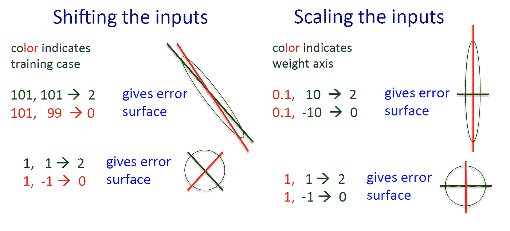
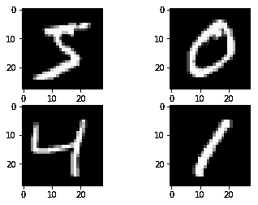
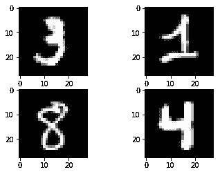
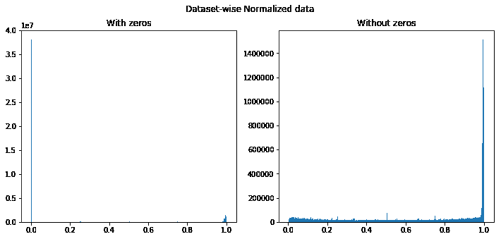
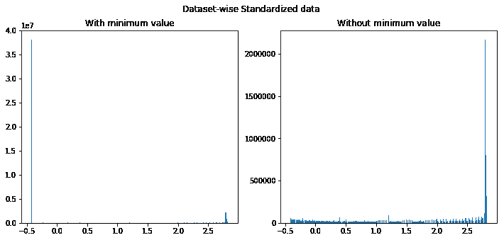
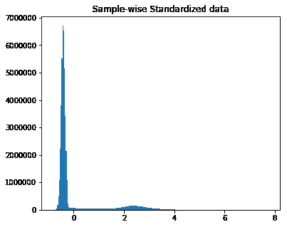
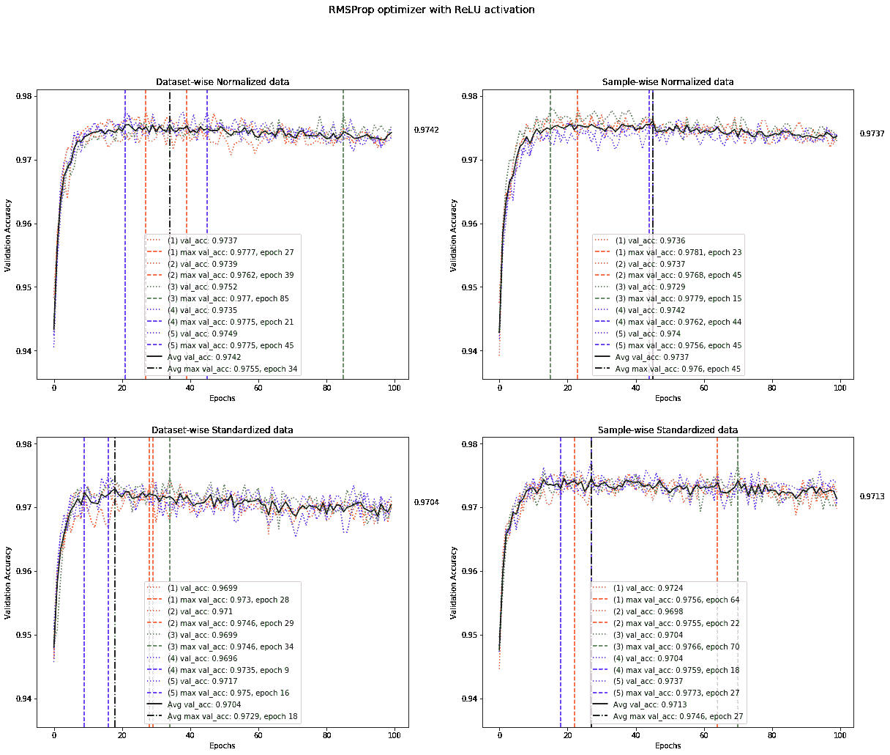
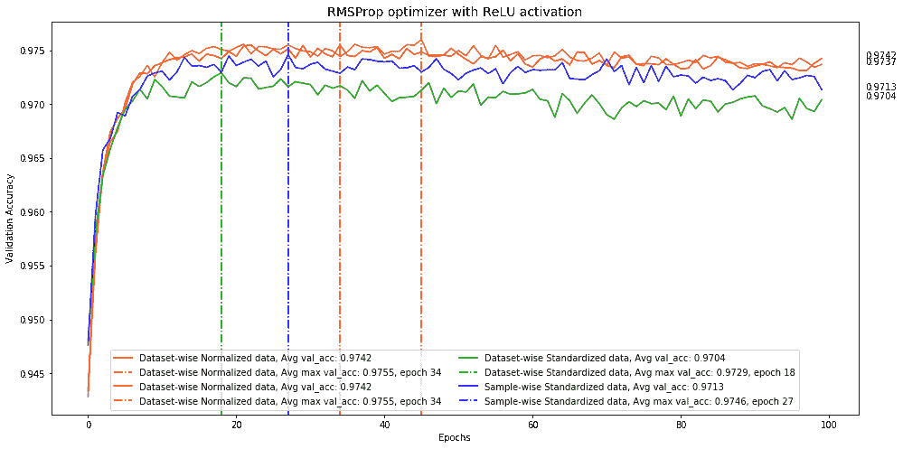

# 对一个不很深的神经网络的深入研究。第 1 部分:我们的数据中有什么

> 原文：<https://towardsdatascience.com/deep-study-of-a-not-very-deep-neural-network-part-1-whats-in-our-data-7971356037a3?source=collection_archive---------5----------------------->

# 介绍

开始深度学习之旅的人经常被为他们的神经网络选择正确的配置和超参数的问题所困惑。各种课程、教程和教科书只是简要描述了可用的选项，并没有提供关于它们的适用性和性能的指导。在大多数教程中，都提到一些函数、优化器或初始化器比其他的更好，但没有解释为什么，或者在什么条件下。某些参数，如单位数或时期数，有时没有任何正当理由。学生们被告知在课余时间和他们一起“玩耍”,看看是否能提高成绩。许多作者将寻找神经网络最佳配置的过程称为一门艺术，并表示选择正确值的能力来自经验。我不相信它总是对的。一些常识应该让在这一领域迈出第一步的人容易获得，而不需要浏览数百篇研究论文。

所以我开始写一系列文章，描述我在过去几个月里进行的一项实验的结果。也就是说，我已经评估了一个非常简单的神经网络的几乎每一个可调位，以了解这些变化如何影响最终的精度。

具体来说，在这个系列中，我们将看到:

*   训练数据的统计如何影响模型的质量；
*   对于全连接神经网络，激活函数和优化器的哪种组合工作得更好；
*   学习率过高有什么影响，如何处理；
*   如何让训练更稳定、可复制；
*   初始化器、正则化器和批处理规范化如何影响神经网络的内部结构；
*   模型的性能如何取决于单元和层数。

在这个系列中，我将只关注一个全连接的神经网络，它被设计用来从著名的 MNIST 数据集中对手写数字进行分类。使用 MNIST 的原因很简单:它很均衡，所以我们可以确信测试结果是充分的；它不是太大，所以我们可以在合理的时间内训练各种参数组合的模型，它内置在所有主要的深度学习框架中。

全连接神经网络架构可能是最简单的一种，而且它通常是深度学习书籍和课程中介绍的第一种。尽管这种架构很简单，但它有如此多的参数和选项可供选择，以至于人们常常将一切都保留为默认值，希望这些值会产生可接受的性能。

当然，还有更合适的方法来处理 MNIST，比如使用卷积神经网络。但在这里，我们的任务不是要打破最先进的模型的分数。相反，我们关注的是网络的每个参数在最终精度中的作用。

这不是一个介绍性的教程，读者应该至少对神经网络有基本的了解，它们是如何工作的，如何构建和训练它们。为了建立网络，我将使用 Keras 与 TensorFlow 后端。

# 试验设计

我们实验的基线代码将取自 [Keras 库的示例](https://github.com/keras-team/keras/blob/master/examples/mnist_mlp.py)。在本系列的课程中，我们将稍微修改它，以便让我们看到它的各个部分的变化是如何影响测试集的准确性的。

配置将基于验证准确性值进行评估，因为这是我们案例中最客观的指标。损失分数不提供太多信息，并且由于可能的过度拟合，训练集的准确性不具有代表性。

每个配置将被测试 5 次(即，对于每个配置，将从头开始训练 5 个神经网络),以便减少不可避免的随机性的影响，然后将对训练这些配置的结果精度进行平均。这将有助于确保我们看到更有代表性的结果。

我们的神经网络最初将由两个各有 64 个单元的全连接层和一个有 10 个单元和 softmax 激活的输出层组成。

# 数据准备

本系列的第一部分讨论了在将数据输入神经网络之前用于转换数据的各种技术。

MNIST 数据集包含 60 000 幅训练图像和 10 000 幅测试图像，每幅图像为 28x28 像素。每个像素都有一个介于 0 和 255 之间的值，其中 0 表示完全黑色，255 表示白色。在数据科学中，数据通常被换算成小的实数。这样做的原因是为了使模型更快地收敛，并找到更好的极小值。

下面是 Geoffrey Hinton [如何表述这个问题](http://www.cs.toronto.edu/~tijmen/csc321/slides/lecture_slides_lec6.pdf):“当误差面是一个二次碗的时候”……“下坡减少了误差，但是最陡下降的方向并不指向最小值，除非椭圆是一个圆。”以下是他对这个问题的设想:

Fig.1 Error surfaces with shifted and scaled inputs. Source: [http://www.cs.toronto.edu/~tijmen/csc321/slides/lecture_slides_lec6.pdf](http://www.cs.toronto.edu/~tijmen/csc321/slides/lecture_slides_lec6.pdf)

有两种方法可以在将数据输入神经网络之前对其进行转换，并使误差曲面更加平滑。

一种是转换数据，使所有矢量分量都适合[0；1]范围。这叫正常化。这里，我们取输入向量的每个分量的最小值，从各自的分量中减去它们，然后除以每个分量的最大值。

另一种方法是使数据具有 0 均值和单位方差(等于 1)。它是通过计算每个分量的平均值和标准偏差，然后从每个分量值中减去平均值，再除以各个分量的标准偏差来实现的。有时这也被称为标准化，但是为了清楚起见，我们称之为标准化。

在处理 MNIST 时，我们使用 28x28 的图像，为了能够将其输入到一个完全连接的网络中，我们首先需要将它们展平，即将每个图像转换为 28x28 = 784 维的向量。在 MNIST，这个向量的所有分量都代表像素，像素的值只能在 0 到 255 之间。

因此，可以自然地假设每个图像应该具有至少一个完全黑色和完全白色的像素，并且只使用整个数据集的全局最小值和最大值，或者平均值和标准偏差值。实际上，数据集中的每个样本可能都有自己的统计数据，因此，如果使用全局值对它们进行变换，数据集作为一个整体将具有所需的统计数据，但每个单独的样本将会发生移位和缩放。为了说明这一点，让我们看看前 4 个 MNIST 样本:

Fig.2 MNIST Sample Images

几乎可以肯定，这些图像中的每一个都具有至少一个完全黑色的像素(即零值)。但是代表白色的值 255 可能不是这种情况。看看这些样品:

Fig.3 MNIST Sample Images

令人惊讶的是，这些样本没有完全白色的像素，即使你可能认为粗体白色区域应该是白色的。因此，如果您使用全局最小值和最大值对它们进行规格化，则这些图像的值范围会以不同于样本的方式进行缩放，样本的最小值和最大值等于全局值。对于我们的黑白图像来说，这不是一个大问题，人眼甚至不会注意到这样的变化。但在其他情况下，如彩色图像，这可能会完全转换图像，因此单独归一化每个样本总是更好的方法。

标准化也是如此。直观地，我们可以理解，对于每个图像，各种像素值的分布是不同的，并且使用全局平均值和标准偏差值来标准化它们可能会错误地转换样本，并且最终导致模型的较差性能。我们将很快验证这个假设。

现在让我们看一下归一化数据分布图(数据集和样本的归一化几乎相同，所以我只给出第一种情况):

Fig.4 MNIST data. Pixel values distribution after dataset-wise normalization.

该直方图显示了数据中每个离散值的计数。从左侧的直方图中，我们可以看到大部分数据为零。事实上，零值构成了我们的归一化数据中所有数据点的大约 20%，即我们的 MNIST 图像数据中 20%的像素是黑色的。如果我们绘制不带 0 的数据分布，下一个大组是 1，代表完全白色的像素。

标准化数据的统计数据:

数据集标准化数据的直方图是相同的，只是水平轴的范围现在为-0.424 到 2.822。

Fig.5 MNIST data. Pixel values distribution after dataset-wise standardization.

数据的形式没有改变，但它被移动和缩放了。现在让我们来看看数据集标准化数据的统计数据:

数据集现在作为一个整体被标准化了(数据集的平均值实际上是零)，但是每个样本都有不同的平均值和方差。还要注意，数据分布形状的身份由与归一化数据相同的全局偏斜度和峰度来确认。

现在让我们对每个样本进行标准化。这是样本标准化数据的曲线图:

Fig.6 MNIST data. Pixel values distribution after sample-wise standardization.

统计数据是:

显著的差异。现在每个样本都是标准化的，但是整个数据集也是标准化的:平均值非常小，我们可以把它算作零，方差非常接近 1。

现在让我们来看看，这些转变是否真的有所不同。我们将使用所有四个转换数据集来训练我们的简单神经网络。

# 培训结果

示例代码最初使用 RMSProp 优化器和 ReLU 激活，所以我们将在第一个实验中使用它们。我们将比较在四种数据转换类型中的每一种上训练相同配置的神经网络的结果:标准化数据集和样本，以及标准化数据集和样本。

它们将通过以下方法进行比较:

*   最后一个时期的平均值:第 100 个时期的验证准确度值在 5 次实验中取平均值；
*   达到的平均最大值:5 次实验的平均训练统计的最高验证准确度值；
*   最后一个时期的总最大值:5 次实验中第 100 个时期的最高验证准确度值
*   达到的总最大值:在该激活的所有实验中观察到的最高验证准确度值；
*   平均最大历元:达到平均最大值时的历元数。

*注意:为了计算该实验和进一步实验中的平均最大精度，而不是找出特定配置的 5 个实验中每个实验的最大值，然后将它们除以 5，我对整个训练过程进行平均，即对于步骤 N，我取在步骤 N 的 5 个实验中的每个实验中观察到的精度，然后对它们进行平均。这样，我计算平均训练进度，并取其最大精度。我相信，这种方法更好地代表了特定配置下的典型训练结果。*

很明显，在我们的网络配置中，标准化数据比标准化数据显示出更好的结果。从这些结果来看，不可能判断数据集的标准化是否优于样本的标准化，但这可能只是因为我们数据集的特殊性。最有可能的是，对于其他数据集，您将通过样本标准化获得更高的结果。

至于标准化，我们已经证实，使用全局值来标准化我们的训练数据是错误的。然而，在我们的实验中，样本标准化导致较低的准确性，这一事实并不意味着情况总是如此。在后面的部分中，我们将看到在一些特定的神经网络配置中，样本标准化可能会导致比标准化数据高得多的结果。

下图显示了四种数据在训练过程中的准确度变化:

Fig.7 Validation accuracy for dataset-wise and sample-wise input data transformations.

虚线代表单个实验，黑线代表这些实验的平均精度。以下是所有四个平均值的比较结果:

Fig.8 Average validation accuracy for networks trained on various transformations of the input data.

同样，根据标准化数据训练的网络彼此非常接近，样本标准化训练稍差，但不像数据集标准化那样差。此外，请注意，对于标准化数据，训练的稳定性稍差，即，随着训练的进行，精确度上下变化较大。这可以通过调整学习速率来部分解决，我们将在下一部分中尝试。

第一部分的学习要点:

*   在建立你的神经网络和开始训练之前，看一下你的数据:统计数据和它的底层结构可能在实现你的模型的高性能方面发挥很大的作用；
*   规范化或标准化数据组件的方式，而不是使用全局统计值，否则您可能会改变它，使一些有价值的信息隐藏您的数据可能会丢失或损坏。

实验的代码可以在我的 github 上找到。[在下一部分](https://medium.com/@maksutov.rn/deep-study-of-a-not-very-deep-neural-network-part-2-activation-functions-fd9bd8d406fc)我们将研究激活函数，它是神经网络的一部分，将你准备好的输入数据转化为输出。敬请期待！

我总是很高兴认识新朋友并分享想法，所以如果你喜欢这篇文章，可以考虑[在 LinkedIn](https://www.linkedin.com/in/rinat-maksutov-79bbb517/) 上加我。

**深度学习一个不是很深的神经网络系列:**

*   [第 1 部分:我们的数据中有什么](https://medium.com/@maksutov.rn/deep-study-of-a-not-very-deep-neural-network-part-1-whats-in-our-data-7971356037a3)
*   [第二部分:激活功能](https://medium.com/@maksutov.rn/deep-study-of-a-not-very-deep-neural-network-part-2-activation-functions-fd9bd8d406fc)
*   [第 3a 部分:优化器概述](https://medium.com/@maksutov.rn/deep-study-of-a-not-very-deep-neural-network-part-3a-optimizers-overview-ed1631127fb7)
*   [第 3b 部分:选择优化器](https://medium.com/@maksutov.rn/deep-study-of-a-not-very-deep-neural-network-part-3b-choosing-an-optimizer-de8965aaf1ff)
*   [第四部分:如何找到合适的学习率](https://medium.com/@maksutov.rn/deep-study-of-a-not-very-deep-neural-network-part-4-how-to-find-the-right-learning-rate-e06d6da26b2e)
*   [第 5 部分:压差和噪声](https://medium.com/@maksutov.rn/deep-study-of-a-not-very-deep-neural-network-part-5-dropout-and-noise-29d980ece933)
*   第 6 部分:权重初始化
*   第 7 部分:正规化
*   第 8 部分:批处理规范化
*   第 9 部分:大小很重要
*   第 10 部分:将它们融合在一起