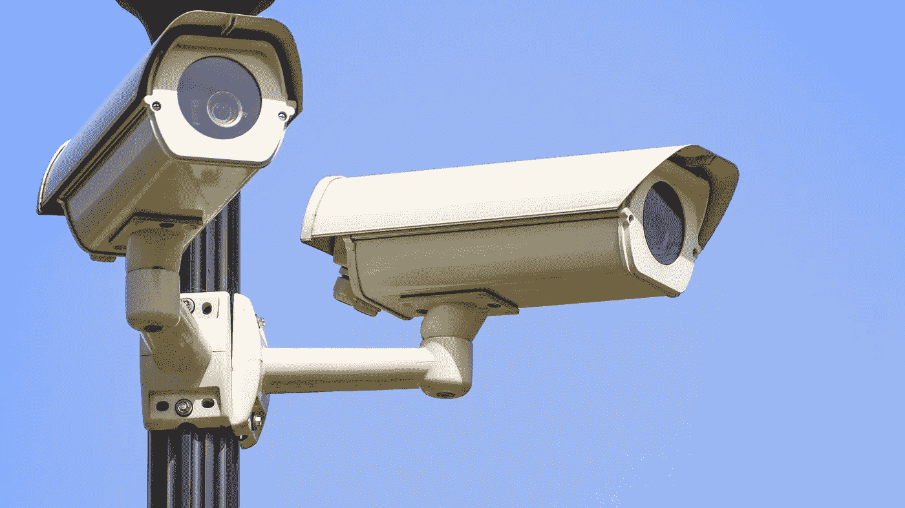
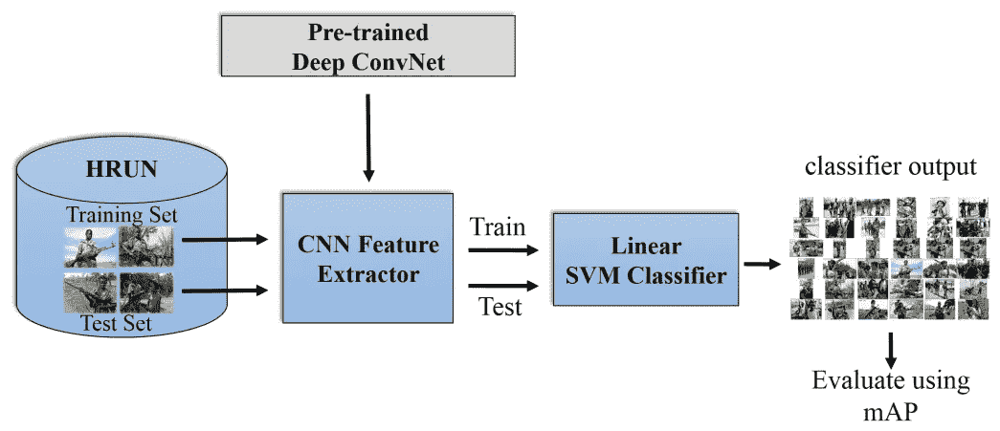
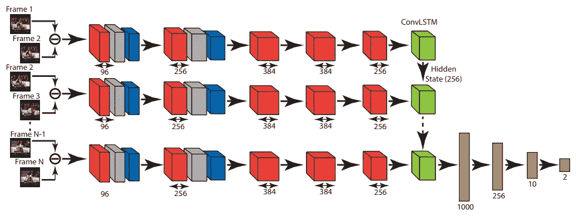
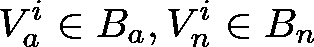
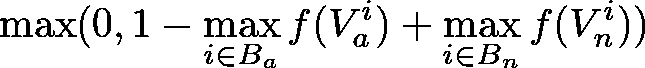
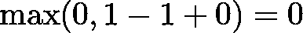
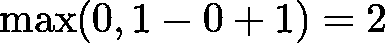
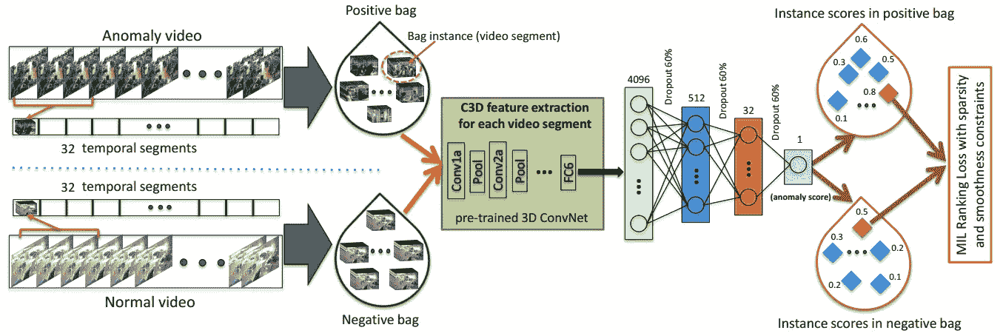

# 深度监视

> 原文：<https://towardsdatascience.com/deep-surveillance-6b389abeaf95?source=collection_archive---------4----------------------->

## 用神经网络检测暴力

根据 IHS Markit 关于视频监控的年度出版物，今年可能会有 1.3 亿台监控摄像机出货。[1]

英国安全行业协会 2013 年委托的一份报告得出结论，英国安装了 410 万至 590 万个闭路电视摄像机。[2]最高估计是每 11 个人有一台监控摄像机。

除了围绕国有和私营摄像头的政策问题，视频监控也给大数据和机器学习带来了挑战。

一份报纸估计，中国天津市的 60 万个摄像头每天产生 50pb 的数据。[3]

许多监控系统仍然需要人工监管。因此，计算机视觉的最新进展被视为视频监控的一个重要趋势，可能会带来显著的效率提升。

本文重点关注一个重要方面，探索最先进的深度神经网络可以在多大程度上“看到”图像和视频中的暴力。

在下面描述的模型中有两个反复出现的主题:首先，迁移学习用于提高以小训练集为特征的设置中的性能。第二，已经成功应用于图像分类和时间序列分析的构建块可以重新用于与视频相关的任务。

# 图像中暴力检测的迁移学习

Kalliatakis 等人(2017 年)[4]汇编了*人权理解数据集*。这个由 400 个手动标记的图像文件组成的集合包括儿童士兵的照片和警察与平民之间的暴力互动。

只有借助迁移学习，才能有效处理如此小规模的数据集。

为此，作者比较了 10 个已建立的卷积神经网络的性能。这些模型要么在 *ImageNet* 数据集上进行预训练，要么——在 8 层 *Places* 架构的情况下——针对 1000 万张场景照片的集合进行优化[5]。要将模型用作特征提取器，需要移除生成预测的图层。

该模型的第二部分是线性 SVM 分类器，其在 HRUN 数据集上被训练，并接受提取的特征作为输入。

Human rights violations recognition pipeline in Kalliatakis et al. (2017)

使用 50/50 分割的训练和测试图像，作者报告了极好的结果。迁移学习方法对儿童兵类别的平均准确率达到 90%，对警察与平民之间的暴力互动的平均准确率接近 96%。有趣的是，最好的结果是用*位置*架构实现的。

# 暴力视频的检测

当然，视频是图像序列。虽然大多数最先进的图像分类系统以某种形式使用卷积层，但顺序数据经常由长短期记忆(LSTM)网络处理。因此，这两个构件的组合有望在视频分类任务中表现良好。

一个这样的组合有一个自我描述的名字*convltm*[6]。标准 LSTM 使用简单的矩阵乘法来衡量不同门内的输入和先前状态。在 ConvLSTM 中，这些运算被卷积所取代。

Sudhakaran 和 Lanz (2017)的一篇论文测试了这种方法在检测视频内容中的暴力方面的效果如何[7]。

为了迫使网络模拟随时间的变化，作者使用两个相邻帧的差异作为每一步的输入。然后使用 *AlexNet* 架构生成一个向量表示，并发送给 ConvLSTM 实例。在所有帧被处理之后，最终的隐藏状态被转发到计算分类的完全连接的层序列。

Block diagram of the model proposed by Sudhakaran & Lanz (2017)

在小数据集上评估该模型。*冰球比赛数据集*由 500 个冰球比赛视频组成，显示比赛或其他内容。电影数据集包含 100 个打斗场景和 100 个没有暴力的场景。*暴力流人群暴力数据集*是 246 个视频的集合，描述了体育赛事中暴力和非暴力的人群行为。为了扩充数据，作者进行了随机裁剪和水平翻转。

该论文报告了在*暴力流*数据集上的第二名，冰球视频中暴力检测的最先进结果，以及在*电影数据集*上的完美结果。

对于曲棍球数据集，使用两个相邻帧的差异作为输入，并使用预训练的 *AlexNet* 进行特征提取，与使用单个帧作为输入的随机初始化网络相比，精确度从 94%提高到 97%。

考虑到暴力和非暴力场景可能表现出高度的特征重叠，这些结果是显著的。需要仔细观察一些较低层次的细节，例如，区分冰球比赛中的打斗和拥抱。

# 暴力是可以察觉的异常现象

在文明社会中，和平共处是常态，暴力是例外。这一幸运的事实允许 Sultani 等人(2018)[8]将智能监控视为异常检测问题。除了人际暴力，他们考虑的 13 种异常情况还包括其他纵火、盗窃和事故。

利用 YouTube 和 LiveLeak 上的搜索功能，研究人员汇编了一组显示真实世界异常情况的视频。只有监控摄像头拍摄的未经编辑的录像进入了 1900 个视频的最终集合。数据集在异常事件(标记为正)和正常事件(标记为负)之间保持平衡。

## 多示例学习

每个视频被表示为一包 *m* 个时间片段。在肯定的情况下，假定至少一个 *m* 段包含异常。在否定的情况下，没有一个段包含异常。

为了收集大量视频的例子，注释者在包的层次上提供标签，而不是在单个片段的层次上。换句话说，数据集告诉你一个给定的视频是否显示任何异常。它不会告诉你异常发生的时间。

以下符号指的是代表视频 *V* 的包 *B* 中的第 *i* 段。字母 *a* 和 *n* 分别用于表示异常和正常事件:

函数 *f* 为每个片段分配 0 到 1 之间的异常分数。

一个关键的想法是将得分最高的积极部分推得尽可能远离得分最高的消极部分。这一基本目标用以下铰链损失函数表示:

在最好的可能情况下，对于异常视频，最高分段分数是 1，对于正常视频，最高分段分数是 0。这会导致 0:

最差情况下，分数颠倒，损失为 2:

## 基于 C3D 的时空特征学习

评分函数 *f* 使用从预训练的卷积 3D (C3D)网络中提取的表示，这是一种专门针对迁移学习而设计的架构。

图像是二维的。视频分析是时空的:它增加了时间作为第三维。在 Tran 等人(2015)[9]描述的 C3D 网络中，视频的大小被调整为 128 x171(4:3 的纵横比)，并被分成每个 16 帧的剪辑。使用三个颜色通道，输入的大小为 3x16x128x171。该网络中的卷积滤波器具有 *d x k x k* 格式，其中 *d* 指时间维度，而 *k x k* 指空间维度。经验结果表明，3x3x3 配置是一个合适的选择。

网络中的前五个块由一个或两个卷积层组成，随后是一个汇集操作。为了生成预测，计算由两个全连接层(标识为 *fc6* 和 *fc7* )的序列继续，并最终由 softmax 层完成。C3D 网络的作者在 Sports-1M 数据集上训练了该模型，该数据集收集了来自 487 个体育类别的超过 100 万个视频。

经过训练的模型的表达能力可以在其他任务中重复使用。来自不同数据集的视频首先被分割成所需格式的 16 帧长的剪辑。然后，对各个片段的 *fc6* 片段激活进行平均，以形成具有 4096 个条目的 L2 归一化特征向量。

## 实时处理

回到异常检测器，该特征向量被用作具有丢失的 3 层全连接神经网络的输入。该架构中的最后一层只有一个单元，通过将 sigmoid 激活函数应用于加权输入来计算异常分数。

Flow diagram of the anomaly detection approach proposed by Sultani et al. (2018)

该论文报告了对于 50%的分类阈值，接收器工作特性(ROC)的曲线下面积(AUC)值为 0.754，并且虚警率为 1.9。对于这两个指标，与其他三种方法相比，本系统获得了最高分。

要在现实世界的应用中可行，异常检测器需要计算效率高，并及时发出警报。在极端情况下，慢速和快速性能之间的差异可能是生死攸关的问题。使用 Nvidia Geforce GTX 1080 GPU 作为参考，作者报告说，该模型能够以每秒 367 帧的运行速度进行实时处理。

深度学习模型在图像分析方面取得的成功正在被复制到视频内容中。

暴力检测是一个重要的应用，但还有许多其他应用。神经网络已被用于检测跌倒，这是老年人的一个主要风险，可以通过智能家庭医疗保健系统来解决。[10]在灵长类动物学中，自动处理通过相机陷阱录制的视频可以帮助科学家全面研究我们进化亲属的行为[11]。

虽然可能有人会说这种技术天生就偏向某一方，但它既有做好事的潜力，也有做坏事的潜力。

智能监控可以被那些致力于确保公共安全、保护亲人和威慑罪犯的人所使用。或者它可能被那些试图建立或扩大警察国家的人滥用。

视频平台上的自动内容分类可以被视为维护社区标准的有效方式。或者，它可以被视为审查制度的一种手段，有可能扼杀挑战性和非传统的表达方式。

为了成功实现人工智能的大众化，我们需要探索并有可能促进双刃技术的防御用途。

# 感谢您的阅读！如果你喜欢这篇文章，请点击拍手按钮并关注我，以获得更多关于最新机器学习应用程序的信息。

# 参考

[1] *IHS Markit 的 2018 年顶级视频监控趋势。*检索到 108 年 3 月 23 日。

[2] [英国安全行业协会—概述](https://www.bsia.co.uk/Portals/4/Publications/302-bsia-overview.pdf)。2018 年 3 月 23 日检索。

[3]肖军，廖，李，胡军，陈，杨，胡，2015 .利用大监控视频数据中的全局冗余进行高效编码。*集群计算*， *18* (2)，第 531–540 页。

[4] Kalliatakis，g .，Ehsan，s .，Fasli，m .，Leonardis，a .，Gall，j .，McDonald-Maier，K.D .，2017 年。图像中人权侵犯的检测:卷积神经网络有帮助吗？。 *arXiv 预印本 arXiv:1703.04103* 。

[5]周，b .，拉佩德里扎，a .，科斯拉，a .，奥利瓦，a .，托拉尔巴，a .，2017。地点:用于场景识别的 1000 万图像数据库。IEEE 模式分析与机器智能汇刊*。*

[6]邢建华、陈志军、王、杨、黄伟光和吴伟光，2015 年。卷积 LSTM 网络:降水临近预报的机器学习方法。在*神经信息处理系统的进展*(第 802–810 页)。

[7] Sudhakaran，s .和 Lanz，o .，2017 年 8 月。学习使用卷积长短期记忆检测暴力视频。在*基于先进视频和信号的监控(AVSS)，2017 年第 14 届 IEEE 国际会议上*(第 1–6 页)。IEEE。

[8]苏丹尼，w .，陈，c .和沙阿，m .，2018 年。监控视频中的真实世界异常检测。 *arXiv 预印本 arXiv:1801.04264* 。

[9] Tran，d .，Bourdev，l .，Fergus，r .，Torresani，l .和 Paluri，m .，2015 年 12 月。用 3d 卷积网络学习时空特征。在*计算机视觉(ICCV)，2015 IEEE 国际会议上*(第 4489–4497 页)。IEEE。

[10]王，s，陈，l，周，z，孙，x，董，2016 .基于 PCANet 的监控视频中人体跌倒检测。*多媒体工具与应用*， *75* (19)，第 11603–11613 页。

[11] Pebsworth，P.A .和 LaFleur，m .，2014 年。通过使用照相机陷阱推进灵长类动物的研究和保护:特刊介绍。*《国际灵长类动物杂志*， *35* (5)，第 825–840 页。