# 面向自然语言处理的深度迁移学习——基于通用嵌入的文本分类

> 原文：<https://towardsdatascience.com/deep-transfer-learning-for-natural-language-processing-text-classification-with-universal-1a2c69e5baa9?source=collection_archive---------2----------------------->

## 揭秘通用句子编码器指南


# 介绍

迁移学习是一个令人兴奋的概念，我们试图将一个领域和任务中的现有知识运用到另一个领域和任务中。灵感来自我们——人类，我们自己——我们有一种天生的能力，不需要从零开始学习一切。我们将过去学到的知识转移并加以利用，以解决各种各样的任务。有了计算机视觉，我们有了优秀的大数据集，如 Imagenet，在此基础上，我们可以获得一套世界级的、最先进的预训练模型，以利用迁移学习。但是自然语言处理呢？考虑到文本数据是如此多样、嘈杂和非结构化，这就是挑战所在。我们最近在单词嵌入方面取得了一些成功，包括像 Word2Vec、GloVe 和 FastText 这样的方法，所有这些都在我的文章 [***【文本数据的特征工程】***](/understanding-feature-engineering-part-4-deep-learning-methods-for-text-data-96c44370bbfa) 中有所涉及。

[](/understanding-feature-engineering-part-4-deep-learning-methods-for-text-data-96c44370bbfa) [## 理解特征工程(第 4 部分)——深度学习的直观实践方法…

### 驯服非结构化文本数据的更新、高级策略

towardsdatascience.com](/understanding-feature-engineering-part-4-deep-learning-methods-for-text-data-96c44370bbfa) 

在本文中，我们将展示几种最先进的通用句子嵌入编码器，与单词嵌入模型相比，它们往往会提供令人惊讶的良好性能，特别是在迁移学习任务的少量数据上。我们将介绍以下型号:

*   **基线平均句子嵌入**
*   **Doc2Vec**
*   **神经网络语言模型(动手演示！)**
*   **跳过思维向量**
*   **快速思考矢量**
*   **推断**
*   **通用语句编码器**

我们将尝试涵盖基本概念，并展示一些利用 Python 和 Tensorflow 的实际例子，这是一个侧重于情感分析的文本分类问题！

# 为什么我们对嵌入如此着迷？

嵌入式背后突然出现的热潮是什么？我相信你们中的许多人可能在任何地方都能听到它。让我们先搞清楚基本情况，从炒作中切入。

> 嵌入是固定长度的向量，通常用于编码和表示实体(文档、句子、单词、图形！)

在我以前的一篇文章 中的 [*中，我谈到了在文本数据和 NLP 的上下文中嵌入的需要。但是为了方便起见，我在这里简单重申一下。关于语音或图像识别系统，我们已经获得了嵌入在高维数据集中的丰富密集特征向量形式的信息，如音频频谱图和图像像素强度。然而，当涉及到原始文本数据时，尤其是像单词包这样的基于计数的模型，我们处理的是单个单词，这些单词可能有自己的标识符，并且没有捕获单词之间的语义关系。这导致文本数据的巨大稀疏词向量，因此，如果我们没有足够的数据，我们可能最终会得到糟糕的模型，甚至由于维数灾难而过度拟合数据。*](/understanding-feature-engineering-part-4-deep-learning-methods-for-text-data-96c44370bbfa)

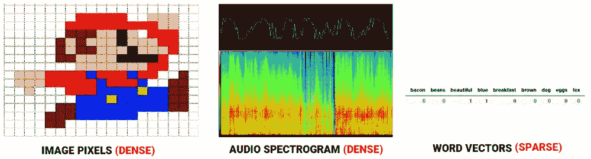

Comparing feature representations for audio, image and text

***预测方法*** 像 [***基于神经网络的语言模型***](http://www.scholarpedia.org/article/Neural_net_language_models) 尝试通过查看语料库中的单词序列来预测单词，在此过程中，它学习分布式表示，给我们提供密集的单词嵌入。

现在你可能会想，没什么大不了的，我们从文本中得到一堆向量。现在怎么办？对嵌入的狂热在于，如果我们有一个很好的文本数据的数字表示，甚至可以捕捉上下文和语义，我们就可以用它来完成各种下游的真实任务，比如情感分析、文本分类、聚类、摘要、翻译等等。事实是，机器学习或深度学习模型在数字上运行，嵌入是编码这些模型将使用的文本数据的关键。

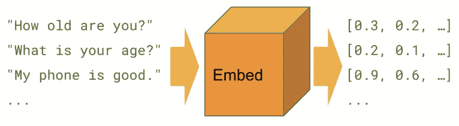

Text Embeddings

这里的一个大趋势是找出所谓的 ***【通用嵌入】*** ，这些嵌入基本上是在巨大的语料库上训练深度学习模型获得的预训练嵌入。这使我们能够在各种各样的任务中使用这些预训练(通用)嵌入，包括缺乏足够数据等约束的场景。这是一个迁移学习的完美例子，利用来自预训练嵌入的先验知识来解决一个全新的任务！下图展示了通用词&句子嵌入的一些最新趋势，这要感谢 [*HuggingFace*](https://medium.com/huggingface) 的朋友们[](https://medium.com/huggingface/universal-word-sentence-embeddings-ce48ddc8fc3a)*的一篇精彩文章！*

*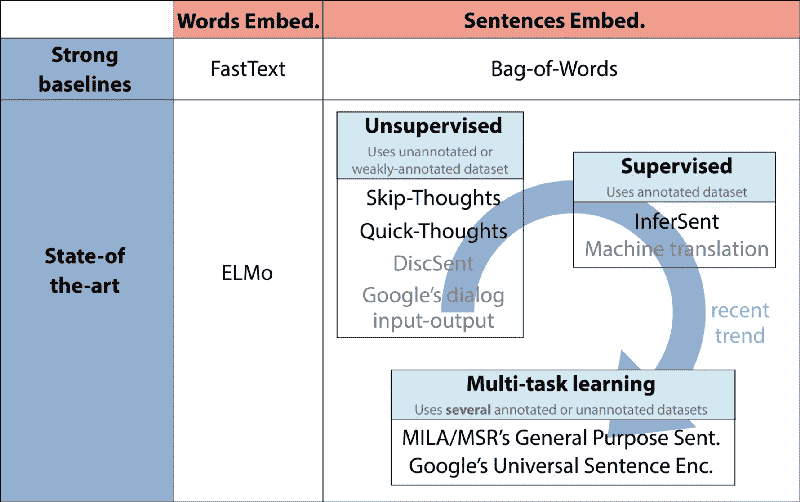*

*Recent Trends in Universal Word & Sentence Embeddings (Source: [https://medium.com/huggingface/universal-word-sentence-embeddings-ce48ddc8fc3a](https://medium.com/huggingface/universal-word-sentence-embeddings-ce48ddc8fc3a))*

*当然，上图中有一些有趣的趋势，包括谷歌的通用句子编码器，我们将在本文中详细探讨！我绝对推荐读者去看看 [*来自*](https://medium.com/huggingface/universal-word-sentence-embeddings-ce48ddc8fc3a) *[*HuggingFace*](https://huggingface.co/) 的关于通用嵌入趋势* 的文章。*

*[](https://medium.com/huggingface/universal-word-sentence-embeddings-ce48ddc8fc3a) [## 📚当前最好的通用单词嵌入和句子嵌入

### 单词和句子嵌入在过去的几个月里发展得非常快——关于发生了什么的简要介绍

medium.com](https://medium.com/huggingface/universal-word-sentence-embeddings-ce48ddc8fc3a) 

现在，在深入研究通用句子编码器之前，让我们先简要了解一下单词和句子嵌入模型的趋势和发展。

# 单词嵌入模型的发展趋势

word 嵌入模型可能是从 2013 年的 Word2Vec 开始开发的一些更老、更成熟的模型。基于在基于语义和上下文相似性的连续向量空间中嵌入单词向量，利用深度学习(无监督方法)模型的三种最常见的模型是:

*   ***Word2Vec***
*   ***手套***
*   ***快速文本***

这些模型是基于 [***分布语义学***](https://en.wikipedia.org/wiki/Distributional_semantics#Distributional_Hypothesis) ***，*** 领域中的 [***分布假说***](https://en.wikipedia.org/wiki/Distributional_semantics#Distributional_Hypothesis) 的原理，它告诉我们，在同一语境中出现和使用的词在语义上彼此相似，并且具有相似的含义(*【一个词由其所保持的伙伴来表征】)*。如果你对血淋淋的细节感兴趣，请参考我的关于单词嵌入的文章，这篇文章详细介绍了这三种方法。

最近在这方面开发的另一个有趣的模型是[***【ELMo】***](https://allennlp.org/elmo)。这是艾伦人工智能研究所开发的[](https://allennlp.org)**。ELMo* 是一个取自著名电视剧《芝麻街》的同名著名布偶角色，但实际上是一个缩写，代表“***E****mbedings from****L****语言****Mo****dels”。**

**

*Elmo from Sesame Street!*

*基本上， *ELMo* 为我们提供了从深度双向语言模型(biLM)中学习的单词嵌入，该模型通常在大型文本语料库上进行预训练，使这些嵌入的迁移学习能够跨不同的 NLP 任务使用。艾伦·艾告诉我们，ELMo 表征是上下文相关的、深层的和基于字符的，它使用形态学线索来形成表征，即使是对于 OOV(词汇之外)表征。*

# *通用句子嵌入模型的发展趋势*

*句子嵌入的概念并不是一个非常新的概念，因为当构建单词嵌入时，构建基线句子嵌入模型的最简单的方法之一是平均。*

*一个 ***基线句子嵌入模型*** 可以通过平均每个句子\文档的单个单词嵌入来构建(有点类似于单词袋，其中我们丢失了句子中单词的固有上下文和序列)。我们会在我的文章 中详细介绍 [*。下图显示了实现这一点的方法。*](/understanding-feature-engineering-part-4-deep-learning-methods-for-text-data-96c44370bbfa)*

*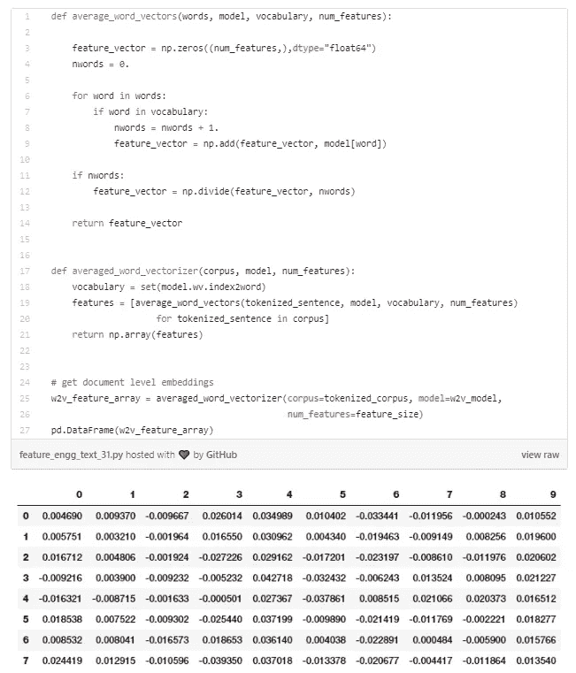*

*当然，还有更复杂的方法，比如以单词嵌入的线性加权组合对句子进行编码，然后去除一些共同的主要成分。一定要检查一下， [*【一个简单但难以击败的句子嵌入基线】*](https://openreview.net/forum?id=SyK00v5xx) 。*

****Doc2Vec*** 也是米科洛夫等人提出的一种非常流行的方法。艾尔。在他们的论文 [*【句子和文件的分布式表示】*](https://arxiv.org/abs/1405.4053) *。*在这里，他们提出了段落向量，这是一种无监督的算法，可以从可变长度的文本片段(如句子、段落和文档)中学习固定长度的特征嵌入。*

*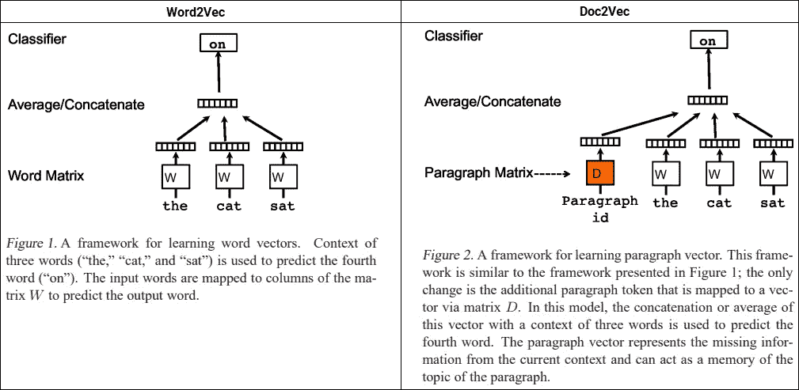*

*Word2Vec vs. Doc2Vec (Source: [https://arxiv.org/abs/1405.4053](https://arxiv.org/abs/1405.4053))*

*基于上述描述，该模型通过被训练来预测文档中的单词的密集向量来表示每个文档。唯一的区别是段落或文档 ID，它与常规单词标记一起用来构建嵌入。这样的设计使得该模型能够克服单词袋模型的弱点。*

****【NNLM】***神经网络语言模型(Neural-Net Language Models)是基于 Bengio 等人提出的神经概率语言模型的一个非常早期的想法。在他们的论文[*【A Neural probability Language Model】*](http://www.jmlr.org/papers/volume3/bengio03a/bengio03a.pdf)中，他们在 2003 年谈到学习单词的分布式表示，这允许每个训练句子通知模型关于指数数量的语义相邻句子。该模型同时学习每个单词的分布式表示以及用这些表示表达的单词序列的概率函数。获得概括是因为如果从未见过的单词序列由与形成已经见过的句子的单词相似的单词组成(在具有邻近表示的意义上),则该单词序列获得高概率。*

*Google 已经建立了一个通用的句子嵌入模型，[**nnlm-en-dim 128**](https://tfhub.dev/google/nnlm-en-dim128/1)，这是一个基于标记的文本嵌入训练模型，在英文 Google News 200B 语料库上使用了一个三隐层前馈神经网络语言模型。这个模型将任何文本映射成 128 维嵌入。我们不久将在实际操作演示中使用它！*

****跳过思维向量*** 也是基于无监督学习的通用句子编码器领域的首批模型之一。在他们提出的论文 [*【跳过思维向量】*](https://arxiv.org/abs/1506.06726) 中，他们利用书籍中文本的连续性，训练了一个编码器-解码器模型，试图重建编码段落的周围句子。共享语义和句法属性的句子被映射到相似的向量表示。*

*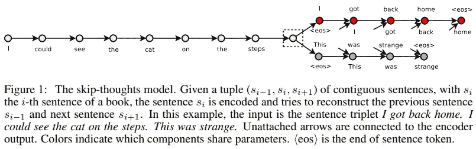*

*Skip-Thought Vectors (Source: [https://arxiv.org/abs/1506.06726](https://arxiv.org/abs/1506.06726))*

*这就像 Skip-gram 模型，但是对于句子，我们试图预测给定源句子的周围句子。*

****快速思维向量*** 是一种最近才出现的学习句子提示的无监督方法。详细内容在论文 [*【学习句子表征的高效框架】*](https://openreview.net/forum?id=rJvJXZb0W) *中有所提及。*有趣的是，他们通过用常规编码器-解码器架构中的分类器替换解码器，将预测句子出现的上下文的问题重新表述为分类问题。*

*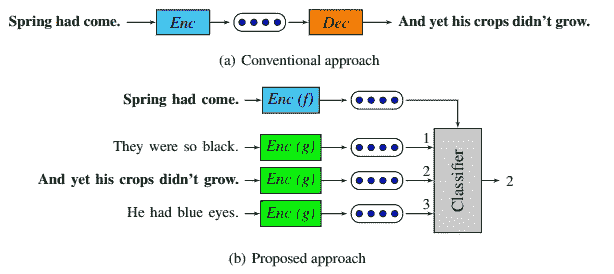*

*Quick Thought Vectors (Source: [https://openreview.net/forum?id=rJvJXZb0W](https://openreview.net/forum?id=rJvJXZb0W))*

*因此，给定一个句子和它出现的上下文，分类器根据它们的嵌入表示将上下文句子与其他对比句子区分开来。给定一个输入句子，首先使用某种函数对其进行编码。但是该模型不是生成目标句子，而是从一组候选句子中选择正确的目标句子。将生成视为从所有可能的句子中选择一个句子，这可以被视为对生成问题的一种有区别的近似。*

****推断*** 有趣的是，它是一种使用自然语言推断数据学习通用句子嵌入的监督学习方法。这是核心的监督迁移学习，就像我们在计算机视觉的 ImageNet 数据集上训练的预训练模型一样，他们使用斯坦福自然语言推理数据集的监督数据训练通用句子表示。详细内容在他们的论文中提到， [*【从自然语言推理数据中监督学习通用句子表示】*](https://arxiv.org/abs/1705.02364) 。该模型使用的数据集是 SNLI 数据集，包括 570，000 个人工生成的英语句子对，人工标记为三个类别之一:蕴涵、矛盾和中性。它捕捉对理解句子语义有用的自然语言推理。*

*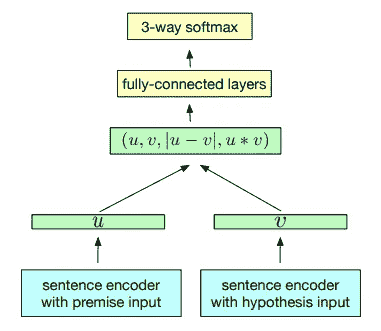*

*InferSent training scheme (Source: [https://arxiv.org/abs/1705.02364](https://arxiv.org/abs/1705.02364))*

*基于上图所示的架构，我们可以看到它使用了一个共享的句子编码器，该编码器输出前提*和假设 ***v*** 的表示。一旦生成了句子向量，就应用 3 种匹配方法来提取 u 和 v 之间的关系:**

*   **串联 ***(u，v)*****
*   **逐元素乘积***u∫v*****
*   **绝对元素差异***| u v |*****

**然后将得到的矢量输入到一个三级分类器中，该分类器由多个完全连接的层组成，最终形成一个 softmax 层。**

**来自 Google 的 ***通用句子编码器*** 是 2018 年初发布的最新最好的通用句子嵌入模型之一！通用语句编码器将任何文本编码成 512 维嵌入，可用于各种 NLP 任务，包括文本分类、语义相似性和聚类。它在各种数据源和各种任务上接受训练，目的是动态适应各种各样的自然语言理解任务，这些任务需要对单词序列而不仅仅是单个单词的含义进行建模。**

**他们的主要发现是，使用句子嵌入的迁移学习往往优于单词嵌入水平迁移。请查看他们的论文， [*【通用句子编码器】*](https://arxiv.org/abs/1803.11175) 了解更多详情。本质上，他们在 [*TF-Hub*](https://tfhub.dev/) 中有两个版本的模型，即 [**通用语句编码器**](https://tfhub.dev/google/universal-sentence-encoder/2) 。版本 1 利用基于变换器网络的句子编码模型，版本 2 利用深度平均网络(DAN ),其中单词和二元模型的输入嵌入首先被一起平均，然后通过前馈深度神经网络(DNN)产生句子嵌入。我们将很快在实际操作演示中使用版本 2。**

# **理解我们的文本分类问题**

**是时候通过动手演示将这些通用句子编码器付诸实践了！正如文章中提到的，我们今天演示的前提将集中在一个非常流行的 NLP 任务，文本分类——在情感分析的背景下。我们将使用基准测试 [***IMDB 大型电影评论数据集***](http://ai.stanford.edu/~amaas/data/sentiment/) 。随意在这里下载[](http://ai.stanford.edu/~amaas/data/sentiment/)**或者*你甚至可以从[***我的 GitHub 资源库***](https://github.com/dipanjanS/data_science_for_all/tree/master/tds_deep_transfer_learning_nlp_classification) *下载。****

****

**该数据集包括总共 50，000 条电影评论，其中 25，000 条具有正面情绪，25，000 条具有负面情绪。我们将在总共 30，000 条评论上训练我们的模型作为我们的训练数据集，在 5，000 条评论上验证，并使用 15，000 条评论作为我们的测试数据集。主要目标是正确预测每个评论的正面或负面情绪。**

# **行动中的普遍句子嵌入**

**现在我们已经明确了我们的主要目标，让我们把通用句子编码器付诸行动吧！整篇教程可在 [***我的 GitHub 资源库***](https://github.com/dipanjanS/data_science_for_all/tree/master/tds_deep_transfer_learning_nlp_classification) 中作为 [***Jupyter 笔记本***](http://nbviewer.jupyter.org/github/dipanjanS/data_science_for_all/blob/master/tds_deep_transfer_learning_nlp_classification/Deep%20Transfer%20Learning%20for%20NLP%20-%20Text%20Classification%20with%20Universal%20Embeddings.ipynb) 。随意 [*下载吧*](https://github.com/dipanjanS/data_science_for_all/tree/master/tds_deep_transfer_learning_nlp_classification) 随便玩玩。我推荐使用一个基于 GPU 的实例来试验这一点。我喜欢使用[***paper space***](https://www.paperspace.com)，在这里你可以在云端旋转笔记本，而无需担心手动配置实例。**

**[](https://www.paperspace.com) [## 图纸空间

### 云机器学习、人工智能和轻松的 GPU 基础设施

www.paperspace.com](https://www.paperspace.com) 

我的设置是一个 8 CPU，30 GB，250 GB 的 SSD 和一个 [NVIDIA Quadro P4000](https://www.leadtek.com/eng/products/workstation_graphics(2)/NVIDIA_Quadro_P4000_(10775)/detail) ，它通常比大多数 AWS GPU 实例便宜(尽管我喜欢 AWS！).

> **注意:**本教程完全是使用 TensorFlow 构建的，因为它们提供了对句子编码器的简单访问。然而，我不太喜欢他们的旧 API，我正在找人帮助我使用`**tf.keras**`API 而不是`**tf.estimator**`重新实现代码。如果你有兴趣投稿的话，请联系我，我们甚至可以在上面刊登你的作品！(我的个人资料和页脚中的联系链接)

## 加载依赖项

我们从安装`**tensorflow-hub**`开始，这使我们能够容易地使用这些句子编码器。

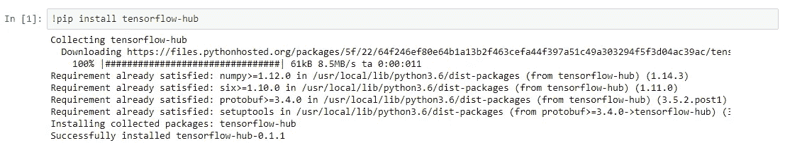

现在让我们加载本教程的基本依赖项！

```
**import** **tensorflow** **as** **tf**
**import** **tensorflow_hub** **as** **hub**
**import** **numpy** **as** **np**
**import** **pandas** **as** **pd**
```

以下命令帮助您检查`**tensorflow**`是否将使用 GPU(如果您已经设置了一个！)

```
**In [12]: tf.test.is_gpu_available()
Out[12]: True****In [13]: tf.test.gpu_device_name()
Out[13]: '/device:GPU:0'**
```

## 加载和查看数据集

我们现在可以加载数据集，并使用`**pandas**` **查看它。**我在我的存储库中提供了数据集的压缩版本，您可以按如下方式使用。

```
**<class 'pandas.core.frame.DataFrame'>
RangeIndex: 50000 entries, 0 to 49999
Data columns (total 2 columns):
review       50000 non-null object
sentiment    50000 non-null object
dtypes: object(2)
memory usage: 781.3+ KB**
```

我们将情感列编码为 1 和 0，只是为了在模型开发过程中使事情更容易(标签编码)。

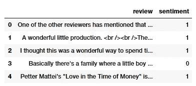

Our movie review dataset

## 构建训练、验证和测试数据集

在开始建模之前，我们将创建训练、验证和测试数据集。我们将使用 30，000 条评论用于训练，5，000 条用于验证，15，000 条用于测试。您可以使用类似于`scikit-learn`中的`train_test_split()`的列车测试分割功能。我很懒，使用简单的列表切片对数据集进行了子集化。

```
**((30000,), (5000,), (15000,))**
```

## 基本文本争论

我们需要做一些基本的文本争论和预处理，以消除文本中的一些干扰，如缩写、不必要的特殊字符、HTML 标签等。下面的代码帮助我们构建了一个简单而有效的文本辩论系统。请务必安装以下库，以防您没有这些库。

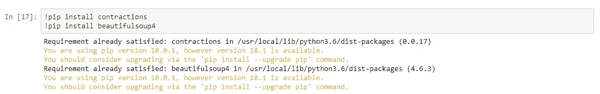

下面的函数帮助我们构建我们的文本辩论系统。

现在，让我们使用上面实现的函数对数据集进行预处理。

## 构建数据摄取功能

由于我们将使用`**tf.estimator**` API 在`**tensorflow**`中实现我们的模型，我们需要定义一些函数来构建数据和特性工程管道，以使数据在训练期间流入我们的模型。以下函数将帮助我们。我们利用了`**numpy_input_fn()**`，它有助于将 numpy 数组的字典输入到模型中。

我们现在准备建立我们的模型！

## 用通用语句编码器构建深度学习模型

在构建模型之前，我们需要首先定义利用通用句子编码器的句子嵌入特性。我们可以使用下面的代码来实现。

```
**INFO:tensorflow:Using /tmp/tfhub_modules to cache modules.**
```

正如我们所讨论的，我们使用通用句子编码器版本 2，它作用于我们输入字典中的`**sentence**` 属性，这将是我们评论的`**numpy**`数组。我们将建立一个简单的前馈 DNN，现在有两个隐藏层。只是一个标准模型，没有什么太复杂的，因为我们想看看这些嵌入在一个简单的模型上表现如何。这里，我们以预训练嵌入的形式利用迁移学习。我们在这里不是通过设置`**trainable=False**`来保持嵌入权重固定来进行微调。

我们已经将我们的`**batch_size**`设置为 **256** ，并且我们将在 **1500 步**的 **256** 记录中分批流入数据，这大致相当于**12–13 个时期**。

## 模特培训

现在，让我们在训练数据集上训练我们的模型，并在步骤 100 在训练和验证数据集上进行评估。

```
--------------------------------------------------------------------
**Training for step = 0** Train Time (s): 78.62789511680603
**Eval Metrics (Train):** {**'accuracy': 0.84863335**, 'accuracy_baseline': 0.5005, **'auc': 0.9279859**, 'auc_precision_recall': 0.92819566, 'average_loss': 0.34581015, 'label/mean': 0.5005, 'loss': 44.145977, **'precision': 0.86890674**, 'prediction/mean': 0.47957155, **'recall': 0.8215118**, 'global_step': 100}
**Eval Metrics (Validation):** {**'accuracy': 0.8454**, 'accuracy_baseline': 0.505, **'auc': 0.92413086**, 'auc_precision_recall': 0.9200026, 'average_loss': 0.35258815, 'label/mean': 0.495, 'loss': 44.073517, **'precision': 0.8522351**, 'prediction/mean': 0.48447067, **'recall': 0.8319192**, 'global_step': 100}

--------------------------------------------------------------------
**Training for step = 100**
Train Time (s): 76.1651611328125
**Eval Metrics (Train):** {**'accuracy': 0.85436666**, 'accuracy_baseline': 0.5005, **'auc': 0.9321357**, 'auc_precision_recall': 0.93224275, 'average_loss': 0.3330773, 'label/mean': 0.5005, 'loss': 42.520508, **'precision': 0.8501513**, 'prediction/mean': 0.5098621, **'recall': 0.86073923**, 'global_step': 200}
**Eval Metrics (Validation):** {**'accuracy': 0.8494**, 'accuracy_baseline': 0.505, **'auc': 0.92772096**, 'auc_precision_recall': 0.92323804, 'average_loss': 0.34418356, 'label/mean': 0.495, 'loss': 43.022945, **'precision': 0.83501947**, 'prediction/mean': 0.5149463, **'recall': 0.86707073**, 'global_step': 200}

--------------------------------------------------------------------
...
...
...
--------------------------------------------------------------------
**Training for step = 1400**
Train Time (s): 85.99037742614746
**Eval Metrics (Train):** {**'accuracy': 0.8783**, 'accuracy_baseline': 0.5005, **'auc': 0.9500882**, 'auc_precision_recall': 0.94986326, 'average_loss': 0.28882334, 'label/mean': 0.5005, 'loss': 36.871063, **'precision': 0.865308**, 'prediction/mean': 0.5196238, **'recall': 0.8963703**, 'global_step': 1500}
**Eval Metrics (Validation):** {**'accuracy': 0.8626**, 'accuracy_baseline': 0.505, **'auc': 0.93708724**, 'auc_precision_recall': 0.9336051, 'average_loss': 0.32389137, 'label/mean': 0.495, 'loss': 40.486423, **'precision': 0.84044176**, 'prediction/mean': 0.5226699, **'recall': 0.8917172**, 'global_step': 1500}

--------------------------------------------------------------------
**Training for step = 1500**
Train Time (s): 86.91469407081604
**Eval Metrics (Train):** {**'accuracy': 0.8802**, 'accuracy_baseline': 0.5005, **'auc': 0.95115364**, 'auc_precision_recall': 0.950775, 'average_loss': 0.2844779, 'label/mean': 0.5005, 'loss': 36.316326, **'precision': 0.8735527**, 'prediction/mean': 0.51057553, **'recall': 0.8893773**, 'global_step': 1600}
Eval Metrics (Validation): {**'accuracy': 0.8626**, 'accuracy_baseline': 0.505, **'auc': 0.9373224**, 'auc_precision_recall': 0.9336302, 'average_loss': 0.32108024, 'label/mean': 0.495, 'loss': 40.135033, **'precision': 0.8478599**, 'prediction/mean': 0.5134171, **'recall': 0.88040406**, 'global_step': 1600}
```

我在上面的输出日志中突出显示了感兴趣的指标，如您所见，在我们的验证数据集上，我们获得了接近 87%的总体精度，以及 94%的 T21 AUC，这在这样一个简单的模型上是非常好的！

## 模型评估

现在，让我们评估我们的模型，并检查训练和测试数据集的整体性能。

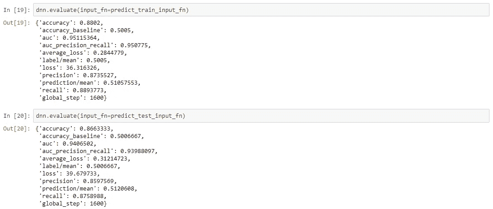

根据我们之前在验证数据集上观察到的情况，我们获得了接近 87%的测试数据总体准确性，从而为我们提供了一致的结果！因此，这应该让您知道利用预先训练的通用句子嵌入是多么容易，而不用担心功能工程或复杂建模的麻烦。

# 额外收获:不同通用句子嵌入的迁移学习

现在让我们尝试基于不同的句子嵌入来构建不同的深度学习分类器。我们将尝试以下方法:

*   NNLM-128
*   使用-512

我们还将在这里讨论两种最重要的迁移学习方法。

*   使用冻结的预训练句子嵌入建立模型
*   建立一个模型，我们在训练期间微调和更新预训练的句子嵌入

下面这个通用函数可以从`**tensorflow-hub**`开始即插即用不同的通用语句编码器！

我们现在可以使用上面定义的方法来训练我们的模型。

```
**====================================================================
Training with** [**https://tfhub.dev/google/nnlm-en-dim128/1**](https://tfhub.dev/google/nnlm-en-dim128/1) **Trainable is: False
====================================================================**
--------------------------------------------------------------------
**Training for step = 0**
Train Time (s): 30.525171756744385
**Eval Metrics (Train): {'accuracy': 0.8480667, 'auc': 0.9287864, 'precision': 0.8288572, 'recall': 0.8776557}**
**Eval Metrics (Validation): {'accuracy': 0.8288, 'auc': 0.91452694, 'precision': 0.7999259, 'recall': 0.8723232}**
--------------------------------------------------------------------
...
...
--------------------------------------------------------------------
**Training for step = 1500**
Train Time (s): 28.242169618606567
**Eval Metrics (Train): {'accuracy': 0.8616, 'auc': 0.9385461, 'precision': 0.8443543, 'recall': 0.8869797}
Eval Metrics (Validation): {'accuracy': 0.828, 'auc': 0.91572505, 'precision': 0.80322945, 'recall': 0.86424243}** **====================================================================
Training with** [**https://tfhub.dev/google/nnlm-en-dim128/1**](https://tfhub.dev/google/nnlm-en-dim128/1) **Trainable is: True
====================================================================**
--------------------------------------------------------------------
**Training for step = 0**
Train Time (s): 45.97756814956665
**Eval Metrics (Train): {'accuracy': 0.9997, 'auc': 0.9998141, 'precision': 0.99980015, 'recall': 0.9996004}
Eval Metrics (Validation): {'accuracy': 0.877, 'auc': 0.9225529, 'precision': 0.86671925, 'recall': 0.88808084}**
--------------------------------------------------------------------
...
...
--------------------------------------------------------------------
**Training for step = 1500** Train Time (s): 44.654765605926514
**Eval Metrics (Train): {'accuracy': 1.0, 'auc': 1.0, 'precision': 1.0, 'recall': 1.0}
Eval Metrics (Validation): {'accuracy': 0.875, 'auc': 0.91479605, 'precision': 0.8661916, 'recall': 0.8840404}** **====================================================================
Training with** [**https://tfhub.dev/google/universal-sentence-encoder/2**](https://tfhub.dev/google/universal-sentence-encoder/2) **Trainable is: False
====================================================================**
--------------------------------------------------------------------
**Training for step = 0** Train Time (s): 261.7671597003937
**Eval Metrics (Train): {'accuracy': 0.8591, 'auc': 0.9373971, 'precision': 0.8820655, 'recall': 0.8293706}
Eval Metrics (Validation): {'accuracy': 0.8522, 'auc': 0.93081224, 'precision': 0.8631799, 'recall': 0.8335354}**
--------------------------------------------------------------------
...
...
--------------------------------------------------------------------
**Training for step = 1500** Train Time (s): 258.4421606063843
**Eval Metrics (Train): {'accuracy': 0.88733333, 'auc': 0.9558296, 'precision': 0.8979955, 'recall': 0.8741925}
Eval Metrics (Validation): {'accuracy': 0.864, 'auc': 0.938815, 'precision': 0.864393, 'recall': 0.860202}** **====================================================================
Training with** [**https://tfhub.dev/google/universal-sentence-encoder/2**](https://tfhub.dev/google/universal-sentence-encoder/2) **Trainable is: True
====================================================================**
--------------------------------------------------------------------
**Training for step = 0** Train Time (s): 313.1993100643158
**Eval Metrics (Train): {'accuracy': 0.99916667, 'auc': 0.9996535, 'precision': 0.9989349, 'recall': 0.9994006}
Eval Metrics (Validation): {'accuracy': 0.9056, 'auc': 0.95068294, 'precision': 0.9020474, 'recall': 0.9078788}**
--------------------------------------------------------------------
...
...
--------------------------------------------------------------------
**Training for step = 1500** Train Time (s): 305.9913341999054
**Eval Metrics (Train): {'accuracy': 1.0, 'auc': 1.0, 'precision': 1.0, 'recall': 1.0}
Eval Metrics (Validation): {'accuracy': 0.9032, 'auc': 0.929281, 'precision': 0.8986784, 'recall': 0.9066667}**
```

我已经在上面的输出中描述了重要的评估指标，你可以看到我们的模型确实得到了一些好的结果。下表很好地总结了这些比较结果。

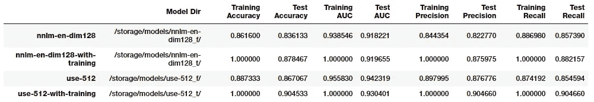

Comparing results from different Universal Sentence Encoders

看起来谷歌的带有微调的通用句子编码器在测试数据上给了我们最好的结果。让我们加载这个保存的模型，并对测试数据进行评估。

```
**[0, 1, 0, 1, 1, 0, 1, 1, 1, 1]**
```

评估模型性能的最佳方法之一是以混淆矩阵的形式可视化模型预测。

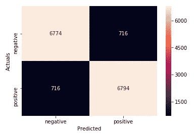

Confusion Matrix from our Best Model Predictions

我们还可以使用 scikit-learn 打印出模型的分类报告，以显示可以从混淆矩阵中获得的其他重要指标，包括精确度、召回率和 f1 分数。


Model Performance Metrics on Test Data

我们在测试数据上得到了整体模型**精度**和**f1-得分**的 **90%** ，这真是太好了！去试试吧，也许会得到更好的分数，然后告诉我！

# 结论和未来范围

通用的句子嵌入无疑是在多样化的自然语言处理任务中实现迁移学习的一个巨大进步。事实上，我们已经看到像 ELMo，Universal Sentence Encoder，ULMFiT 这样的模型确实成为头条新闻，因为它们展示了预先训练的模型可以用于在 NLP 任务中实现最先进的结果。著名的研究科学家和博客 [Sebastian Ruder](http://ruder.io/about/) ，根据他最近写的一篇非常有趣的文章 在他最近的推文中提到了同样的事情。

我对进一步推广 NLP，使我们能够轻松解决复杂任务的未来充满期待！** 

**本文中用于动手演示的代码可以在 [***我的 GitHub 资源库***](https://github.com/dipanjanS/data_science_for_all/tree/master/tds_deep_transfer_learning_nlp_classification) 中找到，作为一个 [***Jupyter 笔记本***](http://nbviewer.jupyter.org/github/dipanjanS/data_science_for_all/blob/master/tds_deep_transfer_learning_nlp_classification/Deep%20Transfer%20Learning%20for%20NLP%20-%20Text%20Classification%20with%20Universal%20Embeddings.ipynb) 你可以随便摆弄！**

****需要帮助:**正如我提到的，我正在找人帮我转换这段代码，以使用更新的`**tf.keras**`API，而不是`**tf.estimator**`。感兴趣吗？向我伸出手来！**

**有反馈给我吗？或者有兴趣与我一起从事研究、数据科学、人工智能甚至发表一篇关于[***TDS***](https://towardsdatascience.com/)的文章？可以在[**LinkedIn**](https://www.linkedin.com/in/dipanzan/)**上联系我。****

**[](https://www.linkedin.com/in/dipanzan/) [## 人工智能顾问&数据科学导师-跳板| LinkedIn

### 查看 Dipanjan Sarkar 在世界最大的职业社区 LinkedIn 上的个人资料。Dipanjan 有 2 份工作列在…

www.linkedin.co](https://www.linkedin.com/in/dipanzan/) 

感谢 [*Durba*](https://www.linkedin.com/in/durba-dutta-bhaumik-44532ab1/) 编辑此文。***