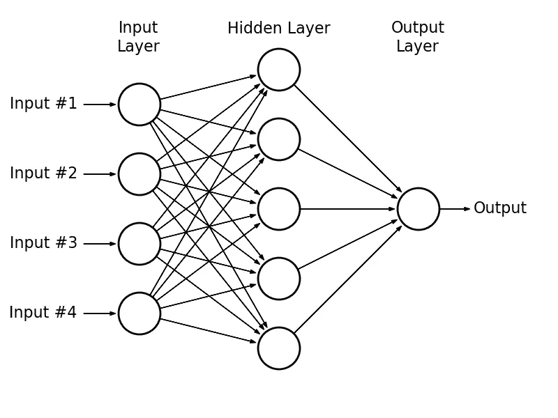
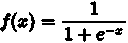
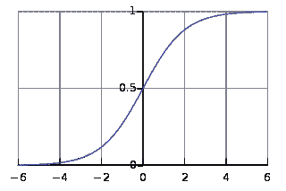

# DeepClassifyML 第 2 周第 2 部分

> 原文：<https://towardsdatascience.com/deepclassifyml-week-2-part-2-1b65739c0f35?source=collection_archive---------5----------------------->

*这篇文章是“Hasura 实习”系列的一部分，涵盖了*[***git***](https://git-scm.com/)*是什么。此外，我们开始实现和设计一个神经网络，根据学生的成绩来查找哪些学生被大学录取。还查看了我以前的帖子:* [*第一部分*](https://medium.com/@akshaybhatia10/deepclassifyml-week-1-part-1-b1c53e0a7cc) *，* [*第二部分*](https://medium.com/towards-data-science/deepclassifyml-week-1-part-2-3b234ca3fcb4) *，* [*第三部分*](https://medium.com/towards-data-science/deepclassifyml-week-2-part-1-1e1bafca79eb) *对于 app 的想法以及一些计算机视觉和神经网络的基础知识。*

Git 是一个版本控制系统，用于管理一个项目或一组文件，并随着时间的推移跟踪它们的变化。Git 是由 Linus Torvalds 开发的。它允许您将文件恢复到以前的状态，将整个项目恢复到以前的状态，比较一段时间内的更改，查看谁最后修改了可能导致问题的内容，谁在何时引入了问题，等等。使用 Git 或任何其他版本控制系统也意味着，如果你搞砸了事情或丢失了文件，你可以很容易地恢复它们。它有 3 种主要状态:提交、修改和暂存。提交是指所有数据都安全地存储在本地数据库中的状态。修改是指用户已经更新或更改了文件中的某些内容，但尚未提交到数据库。暂存意味着用户已在其当前版本中标记了一个修改过的文件，以便进入您的下一个提交快照。

Git 将这些信息存储在一个称为存储库的数据结构中。git 存储库包含以下内容:

*   一组提交对象。
*   提交对象的一组引用，称为 heads。

存储库存储在与项目本身相同的目录中，在一个名为. git 的子目录中。

*   只有一个。git 目录，在项目的根目录下。
*   存储库存储在项目旁边的文件中。没有中央服务器存储库。

提交对象包含三样东西:

*   定义项目在给定时间点的状态的一组文件。
*   对父提交对象的引用。
*   SHA1 名称，一个 40 个字符的字符串，唯一标识提交对象。

基本的 Git 工作流程可以用 3 个步骤来描述:

*   修改/更新/更改项目存储库中的文件。
*   暂存已修改的文件。
*   提交暂存文件，并将它们永久存储到 Git 目录中。

修改文件但不添加它会导致 g it 将以前的版本(修改前)包括到提交中。因此，修改后的文件将保留在原处。

[*这篇*](http://blog.udacity.com/2015/06/a-beginners-git-github-tutorial.html) 优秀的博文详细涵盖了你需要了解的关于 Git 的一切。 [*Hubspot 在 Git 和 Github 上的帖子*](http://product.hubspot.com/blog/git-and-github-tutorial-for-beginners) 也是入门初学者的绝佳入门。

现在转到机器学习。上次我们用 Numpy 从基础数学开始。让我们看看如何应用它来解决问题。

神经网络从数据中学习的方式可以分为 3 个步骤:

1.  我们为神经网络提供训练示例，它由输入单元的活动模式和输出单元的期望活动模式组成。
2.  我们确定网络的实际输出与期望输出的匹配程度。
3.  我们改变每个连接的权重，以便网络产生更好的期望输出的近似值。



A 3 layer Neural Network

这是一个 3 层神经网络。每一层都有独立的块，我们称之为神经元，这些是神经网络的基本单位。每个人都查看输入数据并决定如何对这些数据进行分类*。*箭头代表连接，可以想象为“重量”。

假设我们想知道一个学生是否能以他/她的 4 门学科的成绩进入大学。我们有他们的分数，也知道他们是否被录取。我们现在想知道当一个新学生进来时会发生什么。分数是我们网络的输入，被称为“特征”。输出层中的输出节点会给我们‘接受’或‘拒绝’，称为目标变量。总而言之，输入数据(分数)被输入到一个由相互连接的节点组成的网络中。现在，在上面的例子中，如果输入组合在一起并且超过了某个阈值，我们输出一个“是”,这个学生被大学录取了。网络决定一个学生的分数是否足够高，可以被大学录取。

现在你可能想知道它是如何知道哪些主题在做出接受决定时更重要的。一开始，当我们初始化神经网络时，我们不知道哪一个对决策最重要。这是使用“权重”完成的。网络的每个输入都有代表其重要性的相关权重，这些权重是在神经网络的学习过程中确定的。我们将权重表示为' ***W'*** ，将输入(科目等级)表示为' ***S '。*** 网络使用这些权重对输入进行求和，这一过程称为 ***线性组合*。**方程式如下:

## *x = w*1 ⋅s1+*w*2⋅*s*2+w3 . S3+w4 . S4

但是对于这个例子，我们只有 4 个输入。一般来说，我们可能有许多科目，或者其他功能，如课外活动等。假设我们有 *m* 个不同的输入(特征)，我们将它们标记为 s(1)，s( 2)，。….s( *m* )。我们也假设 s 1 对应的权重是 *w* 1 等等。在这种情况下，我们可以将线性组合简洁地表示为:

## **x =*w*1 ⋅s1+*w*2⋅*s*2+w3 . S3+w4 . S4+……..+ *w* m⋅sm**

或者

## **x =(1∑*m)*[(*w*t39】I⋅s*I)】***

适马(≘)用来表示**求和。**这个表示我们多次向右计算等式，然后将结果相加。这里 1 ∑ *m* 表示迭代所有的 *i* 值，从 1 到 *m* 。

上面的等式意味着:

*   我们从 1 号主题开始，即 *i* =1
*   评估⋅s 1 号并记住结果
*   移动到 *i* =2
*   评估 *w* 2 ⋅s2 并将这些结果添加到 *w* 1 ⋅ *xs* 1
*   重复上述过程，直到 *i* = *m* 为止，其中 *m* 为输入(对象)数。

(注意:你可以把从 1 到 m 的总和∑写成 ***∑w i ⋅s i。)***

还记得第二部分中的激活功能吗？给定神经元的输入，它们是决定神经元输出的函数。它决定实际输出，因此其输出通常被称为“激活”。

现在，通过将线性组合输入到**激活函数**，使用该激活函数将来自输入层的输出(求和)转换成最终输出，即“*接受*或“*拒绝*”。一些激活功能是[](https://en.wikipedia.org/wiki/Sigmoid_function)*， [*tanh*](https://reference.wolfram.com/language/ref/Tanh.html) ， [*softmax*](https://en.wikipedia.org/wiki/Softmax_function) 和 [*relu*](https://en.wikipedia.org/wiki/Rectifier_(neural_networks)) 功能。我们将使用 [sigmoid](https://wikimedia.org/api/rest_v1/media/math/render/svg/faaa0c014ae28ac67db5c49b3f3e8b08415a3f2b) 给出的激活函数:*

**

*Sigmoid Function*

**

*sigmoid 函数介于 0 和 1 之间，输出以成功概率的形式给出。(1 代表“接受”，0 代表“拒绝”)。*

*我们还在线性组合中加入一个术语叫做' ***偏差*** '。偏置，在等式中表示为 *b* ，允许我们将激活功能向左或向右移动，这对于成功的学习可能是至关重要的。像“权重”一样，神经网络不会预先知道为偏差选择什么值。因此，偏差也可以在训练期间更新和改变。因此输入层输出变成*

## ***x = *∑w i ⋅s i +b****

*让我们使用 Numpy 来计算我们的神经网络的输出，该神经网络具有 4 个输入(受试者)节点和一个带有 sigmoid 激活函数的输出节点(“接受”或“拒绝”)。我们将此任务分为 3 个步骤:*

*   *计算线性组合(输入层的输出)。*
*   *应用激活功能。*
*   *计算产量*

*为了计算线性组合或权重的和，我们将使用 Numpy 的[点积函数](https://docs.scipy.org/doc/numpy/reference/generated/numpy.dot.html)，它允许我们执行元素级乘法和求和。*

```
*import numpy as npdef sigmoid(x):
    return 1/(1 + np.exp(-x)) ##numpy's exponential function inputs = np.array([50, 60, 10, 45])
weights = np.array([0.1, 0.8, 0.02, -0.7])
bias = -0.1output = sigmoid(np.dot(weights, inputs) + bias)print('Output: {}'.format(output)) ##Output: 0.999999999584*
```

*神经网络的这种操作称为“*前向传播*”，让我们观察我们的模型执行得如何。下一步是实际更新权重并进行预测。这被称为“*反向传播*”，是实际学习发生的阶段。我们从数据中学习权重，然后使用它们进行预测。*

*在下一篇文章中，我们将讨论'*反向传播*和'*梯度下降'*，这是机器学习的主干和最重要的概念之一。*

*编辑:你可以在 akshaybhatia10@gmail.com 找到我*