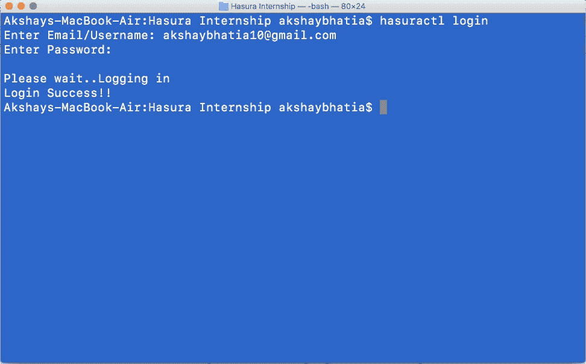
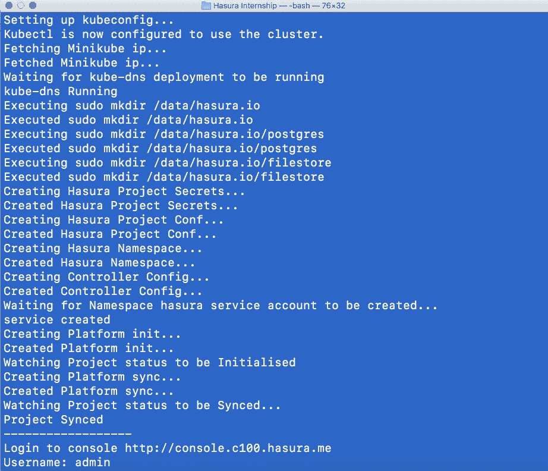
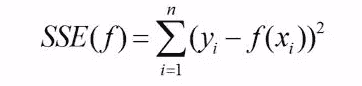
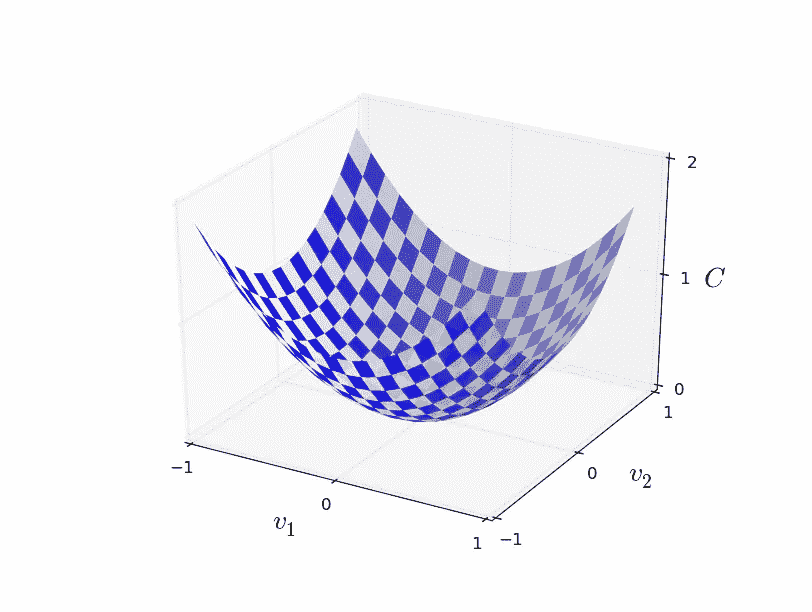
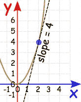

# DeepClassifyML 第 2 周第 3 部分

> 原文：<https://towardsdatascience.com/deepclassifyml-week-2-part-3-7c080af22f8a?source=collection_archive---------10----------------------->

*这篇文章是“Hasura 实习”系列文章的一部分，讲述了如何为当地发展建立 Hausra。除此之外，我们终于看到‘神经网络如何学习’。还查看了我以前的帖子:* [*第一部分*](https://medium.com/@akshaybhatia10/deepclassifyml-week-1-part-1-b1c53e0a7cc)*[*第二部分*](https://medium.com/towards-data-science/deepclassifyml-week-1-part-2-3b234ca3fcb4)*[*第三部分*](https://medium.com/towards-data-science/deepclassifyml-week-2-part-1-1e1bafca79eb)*[*第四部分*](https://medium.com/towards-data-science/deepclassifyml-week-2-part-2-1b65739c0f35) *对于 app 的想法以及一些计算机视觉和神经网络的基础知识。****

**为本地开发设置 Hasura 非常简单，因为 Hasura 在这个 [*自述文件*](https://github.com/hasura/local-development) 中提供的指令都有很好的文档记录，并且非常容易实现。以下是我在我的系统上是如何做到的:**

*****第一步:*** 安装[*virtualbox*](https://www.virtualbox.org/wiki/Downloads)*。* **VirtualBox** 是一款免费、开源、跨平台的应用，用于创建和运行虚拟机(VM)——其硬件组件由运行程序的主机计算机模拟的计算机。它允许在其上安装额外的操作系统，作为来宾操作系统，并在虚拟环境中运行。需要注意的是，主机应该至少有 4GB 的内存(因为虚拟机可能会占用高达 2GB 的内存)。还要确保你应该有一个 64 位操作系统。**

*****第二步:*** 安装 *hasuractl。*在我的系统(mac)上安装它的命令是:**

```
**curl -Lo hasuractl https://storage.googleapis.com/hasuractl/v0.1.2/darwin-amd64/hasuractl && chmod +x hasuractl && sudo mv hasuractl /usr/local/bin/**
```

*****第三步:*** 安装 [*kubectl*](https://kubernetes.io/docs/tasks/kubectl/install/) *。***

**要在 Hasura 上开始一个项目，在 [beta.hasura.io](https://beta.hasura.io/) 上创建一个帐户，然后运行以下命令:**

```
**hasuractl login**
```

****

**Hausra Login**

**登录后，运行以下命令(*注意:如果您是第一次运行下一个命令，它将大致下载大约 1–1.5 GB 的 docker 映像。*):**

```
**hasuractl local start**
```

****

**Starting a project**

**停止和删除 Hasura 项目的附加命令:**

```
****hasuractl local stop**      ## To stop the running hasura platform.***hasuractl local clean    *** ## To clean up the incomplete setup.**hasuractl local delete**    ## To delete the underlying VM**
```

**让我们快速进入'*'反向传播'*和'*'梯度下降'*。在 [*第四部分*](https://medium.com/towards-data-science/deepclassifyml-week-2-part-2-1b65739c0f35) 中，我们看到了神经网络如何在我们称之为“*正向传播*的过程中做出预测。我们根据一个学生以前的分数来预测他是否能进入大学。现在我们有了一个预测，我们如何知道它是否正确，以及我们离正确答案有多近。这是在“*训练”*或更新这些权重以进行预测的过程中发生的。**

**我们想要的是一种算法，它能让我们找到这些权重和偏差，从而使网络的输出接近正确答案。(请记住，在培训期间，我们有他们的分数，也知道他们是否被录取，也就是说，我们事先知道正确答案。我们想知道当一个新学生进来时会发生什么。为了衡量这一点，我们需要一个指标来衡量预测的不正确程度。让我们称之为'*误差*'(你会注意到它也被称为'*成本函数'*或'*损失函数'*)。该误差可以用下式表示:**

****

**Sum of Squared Errors (SSE)**

**我在这里使用的误差指标被称为误差平方和(SSE)。我决定选择这个(也有其他损失函数)，因为平方确保误差总是正的，较大的误差比较小的误差受到更多的惩罚。此外，它使数学看起来很好，不那么吓人。这里 *f(x)* 是预测值，y 是真实值，然后我们对所有数据点 *i* 求和。这也是有意义的，因为最终我们想从正确的答案中发现我们的预测有多差。这意味着如果我们的神经网络做得不好，这个'*误差*'将会很大——这将意味着对于大量数据点来说 *f(x)* 并不接近输出 *y* 。此外，如果成本(误差)变小，即 *SSE(f)* ≈0，精确地说，当 *y* 近似等于预测值 *f(x)* 时，对于所有训练输入 I，我们可以得出结论，NN 已经做得很好。因此，我们的训练算法的目标将是最小化作为权重和偏差的函数的这个'*误差'*。换句话说，我们希望找到一组权重和偏差，使这个“*误差*”尽可能小。我们将使用一种叫做*梯度下降*的算法来实现。**

**梯度下降是执行优化的最流行算法之一，也是迄今为止优化神经网络的最常见方法。它要求我们计算损失函数(误差)相对于网络中所有权重的梯度，以执行权重更新，从而最小化损失函数。反向传播以系统的方式计算这些梯度。反向传播和梯度下降可以说是训练深度神经网络的最重要的算法，可以说是最近出现的[深度学习](https://en.wikipedia.org/wiki/Deep_learning)的驱动力。**

**让我们通过一个经典的例子来理解这一点。假设你在一座山的山顶，想到达山脚(也就是山的最低点)。那么，你会怎么做呢？最好的方法是环顾四周所有可能的方向，检查你附近的地面，观察哪个方向最容易下降。这会给你一个方向的想法，你应该采取你的第一步。然后我们一遍又一遍地重复这个过程。如果我们继续沿着下降的路径，很可能你会到达底部。**

****

**Plot for the Loss Function**

**把大山想象成误差函数。该图表面上的随机位置是权重和偏差的当前值的成本。山的底部(也是图的底部)是最佳权重和偏差集的成本，加上最小误差。我们的目标是继续尝试这些权重和偏差的不同值，评估误差，并选择导致误差稍好(较低)的新系数。重复这个过程足够多次，就会到达山的底部。**

**我们朝着目标迈出了一小步。在这种情况下，我们希望逐步改变权重以减少误差。因为下山最快的路是在最陡的方向，所以应该在误差最小的方向走。我们可以通过计算平方误差的*梯度*找到这个方向。**

***梯度(*或*导数)*是变化率或斜率的另一个术语。导数是微积分中的一个概念，指的是函数在给定点的斜率。我们需要知道斜率，以便知道移动系数值的方向(符号),从而在下一次迭代中获得更低的成本。**

**让我们找到一个函数的导数 *f* ( *x* )。我们取一个简单的函数 *f(x) =* *x* 。导数将给我们另一个函数*f*'(*x*)，该函数返回 *f* ( *x* )在点 *x* 的斜率。 *x* 的导数为*f*'(*x*)= 2*x*。所以，在 *x* =2 时，斜率为*f*'(2)= 4。画出这个，看起来像:**

****

**Graph of f(x) = x² and its derivative at x = 2**

**梯度只是一个推广到具有多个变量的函数的导数。我们可以使用微积分来找到误差函数中任意一点的梯度，这取决于输入权重。你将在下一页看到梯度下降步骤是如何推导出来的。**

**权重将更新为:**

****W += n*delta****

**其中 n 称为“学习率”，δ是误差( *y-f(x)* )和激活函数的导数(*f’(x*))的乘积。梯度告诉我们函数具有最大增长率的方向，但是它没有告诉我们应该沿着这个方向走多远。由一个常数:*学习率(*或步长)决定，它是训练神经网络中最重要的超参数设置之一。**

**为此，我们再次使用 numpy:**

```
**import numpy as np*## Sigmoid (Activation) function* **def sigmoid(x):                    
    return 1/(1+np.exp(-x))***## Derivative of the Sigmoid (Activation) function* **def sigmoid_derivative(x):
    return sigmoid(x) * (1 - sigmoid(x))***## Grades for single student in 4 subjects i.e only 1 data point* **inputs = np.array([50, 22, 10, 45])***## Correct answer (1 : admitted, 0: not admitted)* **y = np.array([1])** *## Initialise the weights and bias randomly* **initial_weights = np.array([0.01, 0.8, 0.02, -0.7])
bias = -0.1**## Set a value for learning rate
**learning_rate = 0.001***## Our Prediction (f(x))* **output = sigmoid(np.dot(weights, inputs) + bias)***## Calculate the error i.e how incorrect are we* **error = y - output****delta = error * sigmoid_derivative(output)***# Gradient descent step***change_in_weights = learning_rate * delta * inputs***## Updating our weights* **new_weights = initial_weights + change_in_weights****print ('Initial Weights: {}'.format(initial_weights))
print('Our prediction: {}'.format(output))
print('Amount of Error: {}'.format(error))
print('Change in Weights: {}'.format(change_in_weights))
print('New weights: {}'.format(new_weights))****
```

**输出:**

```
**Initial Weights: [ 0.01  0.8   0.02 -0.7 ] 
Our prediction: 1.6744904055114616e-06 
Amount of Error: [ 0.99999833] 
Change in Weights: [ 0.01249998  0.00549999  0.0025      0.01124998] New weights: [ 0.02249998  0.80549999  0.0225  -0.68875002]**
```

**虽然理解反向传播背后的概念总是有帮助的，但是如果你发现数学很难理解，那也没关系。我们使用的机器学习和深度学习库(scikit-learn、Tensorflow 等。)有内置的工具为你计算一切。**

***(编辑:请在评论中报告任何错误或差异，或者您可以联系我:akshaybhatia10@gmail.com)***