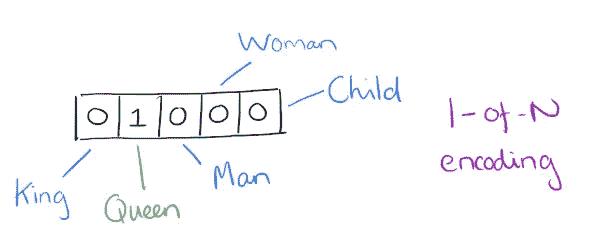
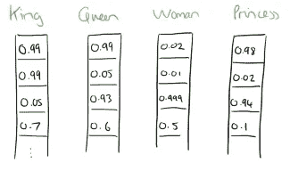
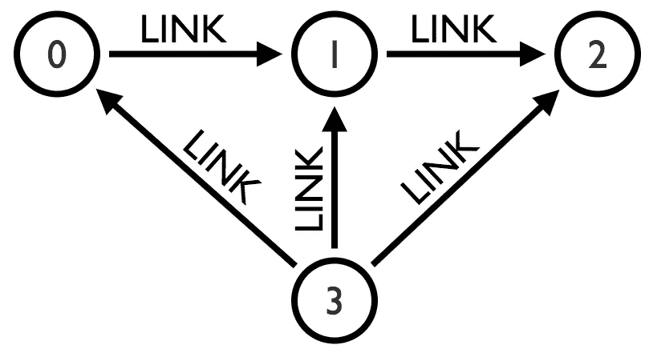
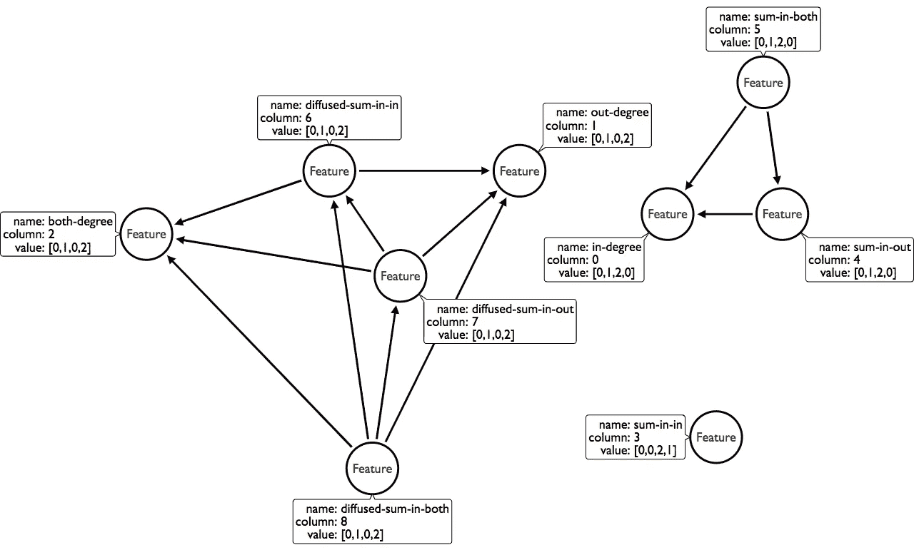
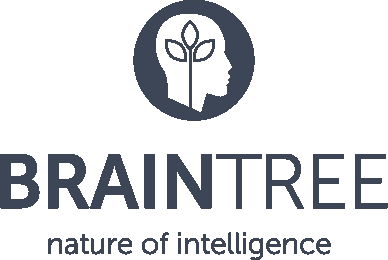
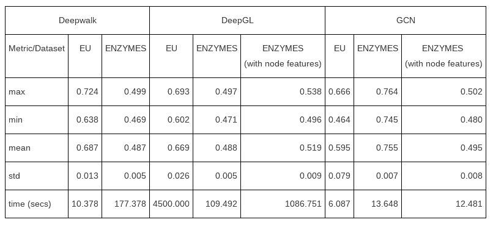

# 用 DeepGL 在 Neo4j 上提取图形数据的 ML 特征

> 原文：<https://towardsdatascience.com/deepgl-on-neo4j-b27e8c64190f?source=collection_archive---------12----------------------->

# 图的深度特征学习

2013 年，托马斯·米科洛夫和他的谷歌同事发布了一篇描述 [word2vec](https://arxiv.org/pdf/1301.3781.pdf) 的论文，并推广了生成嵌入来表示数据片段的想法。

# 什么是嵌入？

嵌入是一个数组或数字向量，用来表示某种东西，在 word2vec 中是一个单词。

Adrian Colyer 有一个很好的图表，展示了一个词汇的非常简单的 hot 编码表示(下面有一个元素“hot”):



One hot encoding of a vocabulary of words

在这个例子中，每个单词有一列，一个单词的向量在适当的列中为 1，在其他地方为 0。

使用这种简单的表示，我们实际上无法在我们的嵌入之间进行任何有意义的比较，但是 word2vec 比这更进一步，它为每个单词提供了一种表示，这是这些元素之间的权重分布。

例如，我们可能会以这样的单词表示法结束:



自从 word2vec 发布以来，其他人已经使用类似的方法为单词之外的东西提供了嵌入。Pinterest 创建了 [pin2vec](https://medium.com/the-graph/applying-deep-learning-to-related-pins-a6fee3c92f5e) ，用于向用户推荐 pin，Airbnb 使用嵌入功能[寻找相似的房产列表](https://medium.com/airbnb-engineering/listing-embeddings-for-similar-listing-recommendations-and-real-time-personalization-in-search-601172f7603e)。

# 我们如何处理这些嵌入？

嵌入可以被认为是[表征学习](https://en.wikipedia.org/wiki/Feature_learning)的一种实现，在这种情况下，我们会自动提出一些特征来输入我们的机器学习模型，而不是手动创建它们。

例如，这些算法的输出可以用作张量流模型的*输入。*

我们还可以*使用图形算法库 3.4.7.0 版本中引入的[余弦相似性过程](https://neo4j.com/docs/graph-algorithms/current/algorithms/similarity-cosine/)从嵌入中构建一个 kNN 相似性图*。

然后，可以使用相似性图作为 k-最近邻查询的一部分来进行推荐。

# 图形嵌入

有几种算法可以用来生成图嵌入。这些是我们知道的:

*   [节点 2Vec](https://snap.stanford.edu/node2vec/)
*   [struc2vec:从结构同一性中学习节点表示](https://arxiv.org/abs/1704.03165)
*   [DeepWalk——在线学习社交表征](https://arxiv.org/abs/1403.6652)

这个想法和单词嵌入算法是一样的。我们希望为图中的每个实体(通常是节点)确定一个向量表示，然后将这些表示输入到机器学习算法中。

列表中最近增加了一个由 Ryan A. Rossi、Rong Zhou 和 Nesreen K. Ahmed 创建的[图形深度特征学习](https://arxiv.org/abs/1704.08829) (DeepGL)。

这个对我们来说非常有趣，因为它是专门设计来保持低内存使用率的，并且还返回它提出的功能的名称，这在机器学习模型可解释性和功能提取的这些天很有帮助。另一个很好的特性是，它允许你将数字节点属性传递给算法，而其他的*只有*依赖于图形结构。

# DeepGL 是如何工作的？

## 提供初始功能

我们首先为每个节点构建一组基本特征:入度、出度和两个度。我们还可以选择包含节点的任何其他数字属性(或投影)。

这篇论文描述了更多可以通过本地 graphlet 分解生成的基本特性，但是我们还没有实现。

对于一个包含 4 个节点的非常简单的图形，这些基本特征可能如下所示:



## Bin 值

然后我们对这些值按列应用[对数宁滨](https://en.wikipedia.org/wiki/Data_binning)。这导致以下嵌入:

## 对每个邻域的要素应用运算符

接下来，我们对每个节点的(入、出、整体)邻域的这组特征应用一组操作符。我们应用的运算符有

*   哈达玛，
*   意思是，
*   总和，
*   最大值，
*   L1·诺姆，
*   和径向基函数。

这意味着，比方说，对于 **sum** 运算符，我们将为每个节点创建 9 个新列:

*   在邻域中我们**的入度之和**
*   我们的**在**邻域的外向度之和
*   我们的**在**邻域中的双度之和
*   我们的**出**邻域的入度之和
*   我们的 **out** 邻域的 out 度之和
*   我们**外**邻区的双度之和
*   我们**整个**邻居的入度之和
*   我们**整个**邻居的外向度之和
*   我们的**整体**邻域的双度之和

让我们看看，如果我们将**和**运算符应用于邻域中的**，会发生什么。我们以 3 个额外的列结束，汇总了每个节点的邻居对于*入度*、*出度*和*双度*的得分。**

我们得到的一组特征如下所示:

我们为我们的其他邻域以及所有其他操作符计算相同的值，这给我们一个 57 列 4 行的矩阵**。**

## 在邻居之间分配分数

然后我们应用一个*扩散过程*，其中每个节点*将其分数分配给其邻居*。我们实现这一点的方式是，每个节点为每个特征取其所有邻居的平均值。

扩散过程不包括基本特征，因此在我们的示例中，我们将只扩散*输入求和*、*输出求和*和*输入和输出求和。*

我们得到的一组特征如下所示:

在我们继续下一阶段之前，我们再次应用对数宁滨，从而产生这组特征:

## 修剪特征

在这一步之后，我们应用*特征修剪*，这包括在*特征相似性图*上运行**弱连通分量算法**，然后只保留每个连通分量的一列。

我们通过对每一列中的值进行逐项比较来计算特征的相似性。如果两列中的所有值都相同，则该列的相似性得分为 1。在我们的例子中，*扩散入和*和*扩散入和*以及其他几对列就是这种情况。

假设剪枝λ为 0.7 以移除较低等级的关系，这是我们最终得到的特征图:



Our feature graph

连通分量算法将给出 3 个分量:

*   *累计金额*
*   *两者相加*、*入度*、*出度和*
*   *双学位*、*双学位*、*双学位*、*双学位*、*双学位*

我们倾向于保留早期迭代中的特性，这意味着基础特性。我们为每个组件保留一个特性，这在本例中意味着我们保留:

*   *求和输入*
*   *输入度数*
*   *双学位*或*双学位*(我们在这两者之间随机选择)

## 反复重复该过程

我们根据需要重复这个过程。在第二次和随后的迭代中，我们将把操作符应用到上一次迭代留下的*特征上，而不是再次应用到基础特征上。*

## 结果

一旦算法完成，我们将为图中的每个节点获得等长的向量。

在我们的例子中，这些向量是:

因此，节点 0 的向量是*【0，0，0】*，节点 1 的向量是*【1，1，0】*，节点 2 的向量是*【2，0，2】*，节点 3 的向量是*【0，2，1】*

# 我如何使用 DeepGL？

在过去的几个月里 [Pete Meltzer](https://www.linkedin.com/in/pete-meltzer-400607148/) ，他作为研究助理在 [BrainTree](http://braintree.com/) 工作，并且正在 [UCL](https://www.ucl.ac.uk/) 攻读博士学位，我已经将这个算法作为 Neo4j 程序来实现，并且**现在已经有了一个版本供您试用！**



DeepGL 算法作为 [ml-models](https://github.com/neo4j-graph-analytics/ml-models/) 库的一部分可用。你会想抓住 [1.0.2 版本](https://github.com/neo4j-graph-analytics/ml-models/releases/tag/1.0.2)。

一旦你安装了它(存储库中的指令)，你会找到两个版本的算法供你使用:

*   *embedding.deepgl* —这将嵌入作为每个节点上的属性进行存储
*   *embedding . deepgl . stream*—返回*节点的流，嵌入*

当你在玩算法的时候，流式可能是有意义的，但是一旦你想在一个合适的数据集上使用它，我建议使用第一个版本。

这是算法的签名:

```
CALL embedding.deepgl("NodeLabel" ,"RelationshipType", {
  nodeFeatures: [string]
  pruningLambda: double,
  diffusions: integer, 
  iterations: integer,
  writeProperty: string
})
```

*   *nodeFeatures* —包含一个附加属性名的数组，您希望将其用作算法基本功能的一部分(默认为[])
*   *pruningLambda* —移除相似特征时算法应该有多严格。较低意味着积极修剪莫尔斯(默认为 0.7)
*   *扩散* —算法应该执行多少次扩散(默认为 10 秒)
*   *迭代* —算法应该运行多少次迭代(默认为 10 次)
*   *writeProperty* —将存储嵌入数组的属性的名称(默认为“deepgl”)

您还可以通过传递 *graph: "cypher"* config 参数并提供对节点 id 和关系列表的 cypher 查询来利用[图形投影](https://neo4j.com/docs/graph-algorithms/current/introduction/#cypher-projection)(视图)，而不是*节点标签*和*关系类型。*

我们设置的默认值似乎在我们测试的数据集上工作得很好，但它们与论文中建议的不同，所以 YMMV。

# 效果如何？

我们已经在论文中引用的 Enzyme 和 EU 网络数据集上测试了该算法，与使用其他算法创建的嵌入相比，它似乎工作得相当好。



F1 scores of graph embeddings on various datasets

# 后续步骤

我们希望这种算法是有用的，并且你能在你自己的数据集上使用它。

如果你对我们下一步应该做什么有任何问题或建议，请在评论中告诉我们，或者给我们发电子邮件到[devrel@neo4j.com](mailto:devrel@neo4j.com)。您也可以在我们新的 [Neo4j 社区论坛](https://community.neo4j.com/c/integrations/ai-ml-nlp)中提出任何问题。

如果你想和皮特·梅尔策联系，你可以在 p.meltzer@braintree.com 的[找到他。](mailto:p.meltzer@braintree.com)