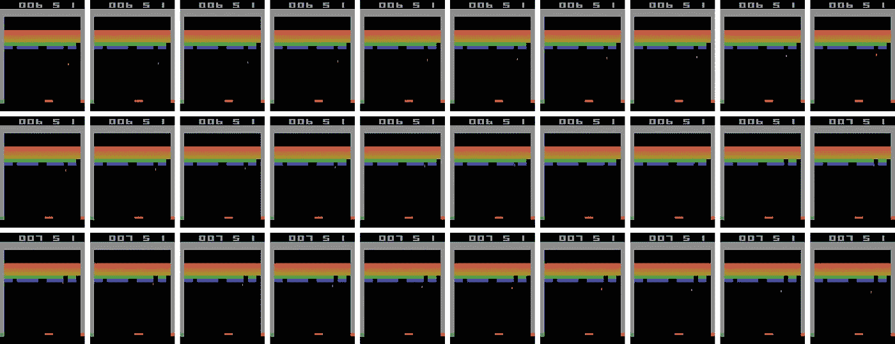
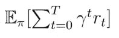
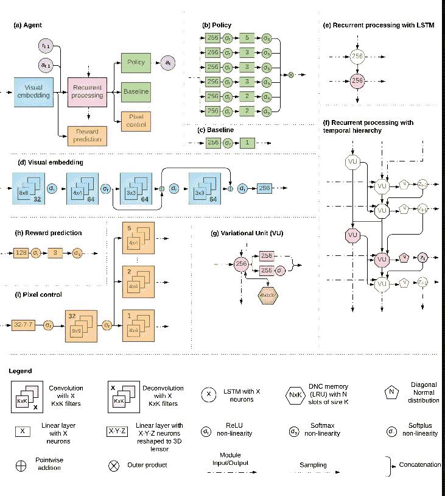
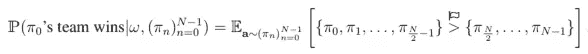
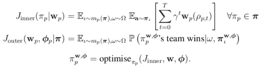
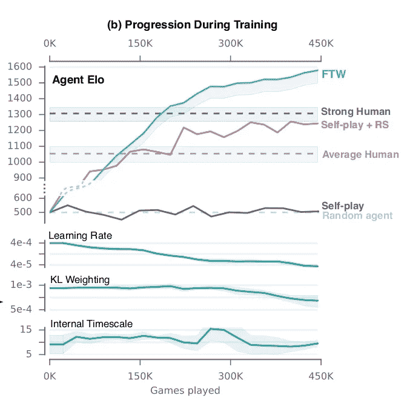
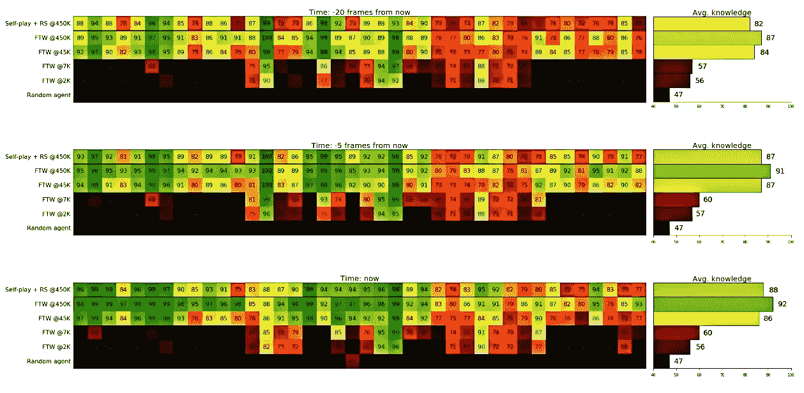
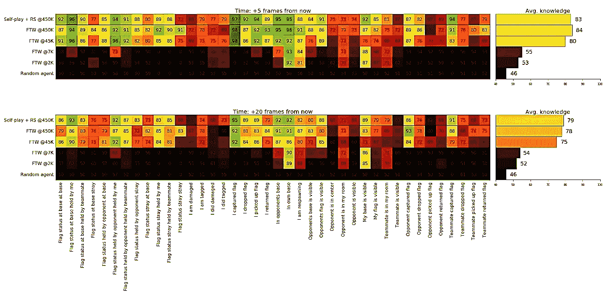
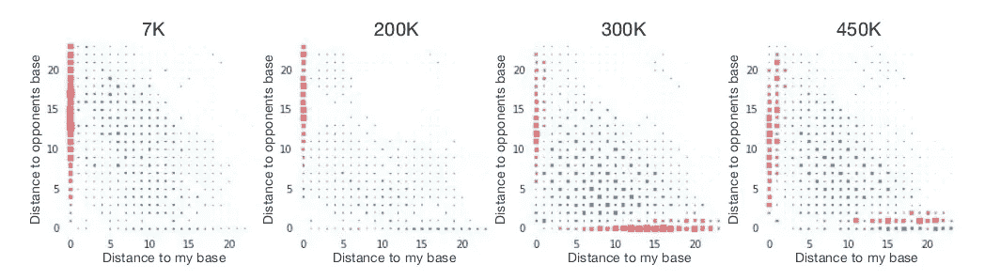
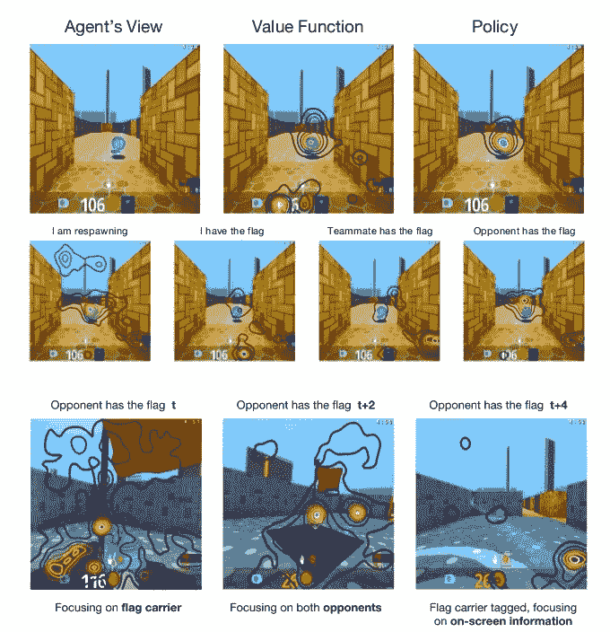

# DeepMind 的游戏《用深度强化学习捕捉旗帜》

> 原文：<https://towardsdatascience.com/deepminds-playing-capture-the-flag-with-deep-reinforcement-learning-a9f71256442e?source=collection_archive---------4----------------------->

## #4 [研究论文](https://arxiv.org/abs/1807.01281)讲解

DeepMind 和其他大学发表了许多端到端强化学习论文，用于解决可以由单个代理解决的问题。端到端 RL 算法通过将像素作为输入并将控制作为输出来学习网络中的特征表示和决策制定。

Previous Work: Single player game [Source](https://www.google.com/url?sa=i&source=images&cd=&cad=rja&uact=8&ved=2ahUKEwicj_D8ppncAhUGu48KHT4hAlEQjRx6BAgBEAU&url=https%3A%2F%2Fdanieltakeshi.github.io%2F2016%2F11%2F25%2Fframe-skipping-and-preprocessing-for-deep-q-networks-on-atari-2600-games%2F&psig=AOvVaw21UK-nNUVQJ4JpWaWKWSZw&ust=1531475887884647)

现实世界中存在一些问题，这些问题需要多个独立行动的个体共同协作来实现一个目标。从踢足球或打篮球到让火箭登陆月球，一组人按照一个策略一起工作，通过降低失败的风险来更快、更安全地完成任务。这张纸可以用来解决很多现实生活中的任务，所以让我们分解这张纸来了解它们的解决方案。

DeepMind 已经建立了一个端到端的基于群体的 RL 算法，该算法使用两层优化过程成功解决了这个问题&通过在基于团队的 3D 多智能体环境(捕捉旗帜)中训练个体，彼此独立地行动和学习，战略性地一起工作以实现单一目标。

这导致模型遭受学习问题的高度复杂性，该学习问题是由环境中其他学习代理的并发适应引起的。

游戏*夺取旗帜*具有上述问题的所有特征:

1。3D 第一人称视角多代理游戏。(*由于 fpv 的相似性*，也可以在机器人中实现)

2。在与对手或队友相同的环境中比赛时，代理不知道彼此的决定。

3。学习高级认知技能的基于策略的游戏*。*

此外，每个游戏的室内和室外主题地图都是随机生成的。由多名个人玩家组成的两个对立团队通过战略性地导航、标记和躲避对手来争夺对方的旗帜。五分钟后获得最多旗帜的队伍赢得比赛。

## **特设小组**

为了开发能够获得通用技能的更通用的策略和学习代理，在固定地图上训练固定的代理团队减少了训练数据的多样性——相反，本文设计了一种算法和训练程序，使代理能够获得对地图、玩家数量和队友选择的可变性具有鲁棒性的策略，这是一种与**特设团队** **游戏**密切相关的范例。

最终的赢/输是从环境接收到的延迟的偶发信号，使得在 5 分钟游戏结束时仅基于一个二进制信号来优化代理执行的 1000 个动作变得困难。

这使得我们很难从那些没有帮助的行为中辨别出哪些行为对赢得比赛是有效的。

我们可以通过增加游戏中的奖励数量来解决这个问题。通过使用更频繁的**内部奖励**，可以根据代理执行的操作给予奖励。

高级战略 CTF 游戏的记忆和长期时间推理要求通过引入一种代理架构来满足，该架构具有多时间尺度表示，令人想起在灵长类动物大脑皮层和外部工作记忆模块中观察到的情况，主要受人类情景记忆的启发。

这 3 项创新集成在一个可扩展的大规模分布式异步计算框架中。

在游戏中，代理在时间步长`t`接收来自第一人称视角的原始 RBG 像素输入`**X***t*`，产生控制动作`**a***t*` ，并接收游戏点数`**ρ***t*` 来训练代理的策略`π`。

强化学习的目标是找到一个策略，使得在 T 个时间步的 CTF 博弈中期望的累积γ折扣奖励最大化。

**Expected cumulative γ-discounted reward over a CTF game**

`π`由具有外部记忆的多时间尺度递归神经网络参数化。

agent 的体系结构模型构建了一个时间层次的时间表示空间，并使用递归潜变量来促进顺序 agent 对记忆和时间连贯动作序列的使用。

**(Figure S10 in paper) Network architectures of agents**

## 获胜概率

**对于****特设团队，代理人的策略πo 应该最大化其团队获胜的概率，`{ π0, π1, π2, ……… , π(N-1/2) }`及其队友的策略`{ π1, π2, ……… , π(N-1/2) }`，对于游戏中总共 N 个玩家:**

****

****Ad-hoc probability of winning****

**其中，如果左边赢了，获胜运算符`>`返回 1，如果输了，返回 0，并随机打破平局。此外，ω代表游戏的特定地图。**

**团队中的 **F** 或**T**he**W**——现在我们使用更频繁的内部奖励`**r***t*`， 我们可以通过基于可用的游戏点信号`**ρ***t*` *【点被注册为例如捕获旗帜的事件】*指定`**r***t =* w(**ρ***t*)`并允许代理学习转换`w`来操作每个代理具有更密集的奖励函数的想法，从而内部奖励 r t 的策略优化优化 **F** 或**T**h**W**in，给我们 *FTW 代理*。**

**不支持用于在如此高的规模下一起训练 1000 个多智能体环境的传统方法，这使得这些方法不稳定。**

****可扩展性—** 总人口`**P**` 通过在玩家中引入多样性来稳定训练，不同的代理被彼此并行地训练(54)。**

****配对—** 为了提高代理的技能，从群体`P`中抽取队友&对手。由 **ι** 索引的代理为使用随机匹配方案`mp(π)` 的训练游戏，该随机匹配方案使合作玩家偏向于具有与玩家`p`相似的技能，增加了不确定性。**

****代理技能等级—** 代理技能分数是根据训练游戏的输出，通过计算 *Elo 分数* (15)在线估算的。**

****元优化—** 用一种优化方法训练其他优化者的方法。本文使用群体来元优化 RL 流程本身的内部奖励&超参数。这可以看作是*两层*优化 RL 问题。**内部优化**又名**J***Inner***:**内部优化由 RL 解决，它最大化 J inner，代理的预期未来贴现内部报酬。**外部优化**又名 **J** *外部* **:** 它是通过基于人口的训练(PBT)来解决的，并且它被最大化 w.r.t .内部奖励方案`**w**p` 和超参数`**φ**p` ，内部
优化提供元转换动态。**

****PBT** 是一个在线进化过程，它适应内部奖励和超参数，并通过用更好的代理的变异版本替换表现不佳的代理来执行模型选择。**

**代理策略的这种联合优化有助于利用将学习和进化结合在一起的潜力，从而最大化:**

****

## **训练期间的评估|锦标赛**

**为了评估训练期间代理人的综合表现，在程序生成的地图上进行一场比赛，其中包括三种类型的代理人的特别比赛。**

1.  **FTW 的烧蚀版本。**
2.  **雷神之锤 3 竞技场脚本机器人**
3.  **具有第一人称游戏经验的人类参与者。**

## **结果**

**1。**FTW 明显超过了人类在地图上的胜率，这是代理人和人类之前都没有见过的，即零射击一般化，两个人组成的团队平均每场比赛捕获 16 面旗帜，少于两个 FTW 代理人组成的团队。****

********

****2。 **人-代理 v/s 代理-代理—** 只有作为 h-a 团队的一部分，我们才观察到一个人赢了一个 a-a 团队(赢的概率为 5%)。****

****3。 **职业游戏玩家 v/s FTW —** 即使在 12 个小时的练习后，人类游戏测试员也只能在与代理团队的比赛中赢得 25%的胜利。****

****4。 **特工 FTW 特工的标记准确率**为 80%，而人类落后，只有 48%的成功率。即使他们的标记准确性被人为降低到人类的准确性，代理人还是赢得了比赛。****

****人类卓越的观察和控制分辨率帮助他们在**成功远程标记**中超过 FTW 代理 17% &代理 0.5%。****

****但 FTW 再次以 258 毫秒的短距离标记反应时间超过了人类，以 559 毫秒超过了人类。****

## ****点燃网络中的神经元！！！知识表示📺****

****研究网络是如何学习到具有如此高级丰富表征的技能的。网络询问游戏的过去、现在或未来状态。比如说—****

*   ****问:我有旗子吗？*(目前)*****
*   ******问:**我最近见到我的队友了吗？*(过去)*****
*   ******问:**我会很快进入对手的基地吗？(*未来)*****

****类似地，基于游戏的特征，总共询问了 200 个二元问题，以观察网络的内部表现。****

## ****结果****

****根据作者的说法，如果对主体内部状态的逻辑回归准确地模拟了特征，那么主体就知道给定的特征。有趣的是，FTW 代理的表示被发现特别好地编码了与过去相关的特征:例如，FTW 代理能够以 91%的 AUCROC ( *在接收器操作特性曲线*下的面积)对两个标志都偏离的状态进行分类(*标志未落在基础*)，相比之下，自播放基线的分类率为 70%。****

*****我鼓励你看看报纸，看看更详细的统计数据。*****

****************

******(*Fig: S4 in paper*) 40 Question on high-level game state feature(Columns) for different agents(Rows) for FTW agent******

## ****(英)可视化(= visualization)****

****论文中有更多的视觉化图像可以帮助你。我选择了几个不需要解释的:****

********

******(Fig: S7 in paper) Hilton Diagrams. At 450K the agent appears to have learned to read from near its own base and just outside the opponent base.******

********

****(Figure S6 in paper)**Top two rows:** Selected saliency analysis of FTW agent. **Bottom:** Saliency analysis of a single neuron that encodes whether an opponent is holding a flag.****

********

******(Fig:- S8 in paper) internal representations learned from playing CTF for the FTW and Self-play + RS agent******

# ****结论****

****在本文中，仅使用像素和游戏点数作为输入的人工智能体可以在丰富的多智能体环境中学习进行高度竞争性的游戏。这是通过将智能体训练中的许多创新(基于群体的智能体训练、内部奖励优化和时间分级 RL)与可扩展的计算架构结合起来实现的。****

****本文可用于解决您周围的其他问题，这些问题的解决方案中包含内存和临时扩展接口方面的困难。所以，我鼓励你们阅读这篇论文，从中获得乐趣&理解在我们关于机器学习的知识的边缘出现的方法，并通过实现这篇论文来突破边界，解决现实世界的问题，以生活在人类知识的边缘。****

****感谢您阅读文章。阅读更多你最喜欢的论文，并获得#PaperExplained 通知。在[媒体](https://medium.com/@sagarsharma4244)和[推特](https://twitter.com/SagarSharma4244)上关注我。****

****************

# ****你会喜欢的以前的故事:****

**** [## DeepMind 惊人的混搭 RL 技术

### #1 研究论文解释

hackernoon.com](https://hackernoon.com/deepminds-amazing-mix-match-rl-techique-a6f8ce6ac0b4)  [## 用 6 个神经元玩雅达利|开源代码

### #2 研究论文解释

towardsdatascience.com](/playing-atari-with-6-neurons-open-source-code-b94c764452ac)  [## Google X 在机器人领域使用视觉的深度强化学习

### #3 研究论文解释

hackernoon.com](https://hackernoon.com/google-xs-deep-reinforcement-learning-in-robotics-using-vision-7a78e87ab171)  [## 激活函数:神经网络

### Sigmoid，tanh，Softmax，ReLU，Leaky ReLU 解释！！！

towardsdatascience.com](/activation-functions-neural-networks-1cbd9f8d91d6)  [## 纪元与批量大小与迭代次数

### 了解您的代码…

towardsdatascience.com](/epoch-vs-iterations-vs-batch-size-4dfb9c7ce9c9)****