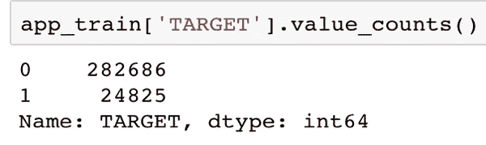
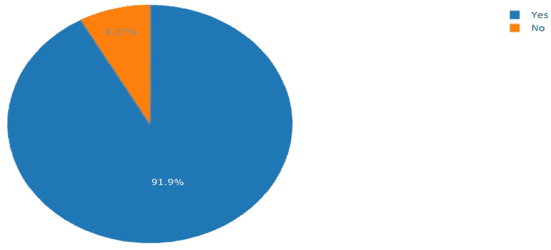
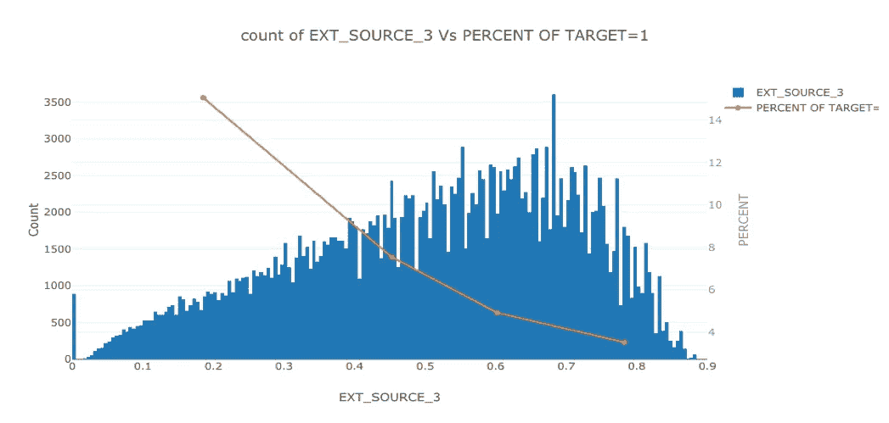
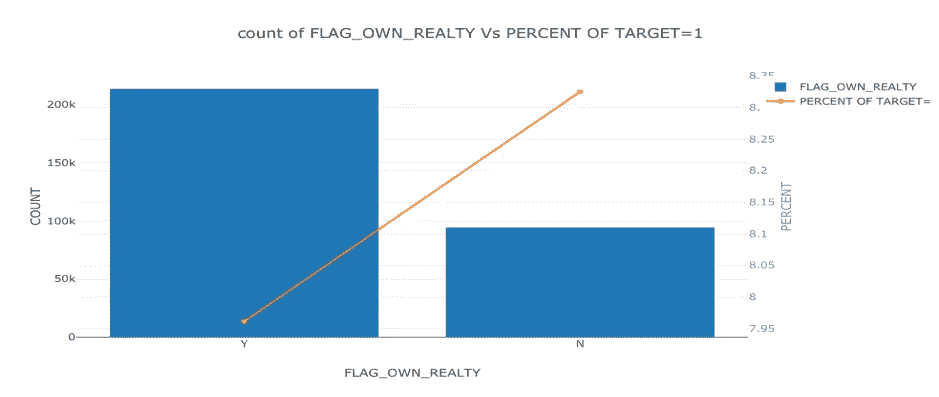
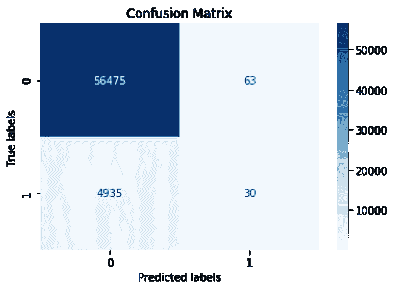
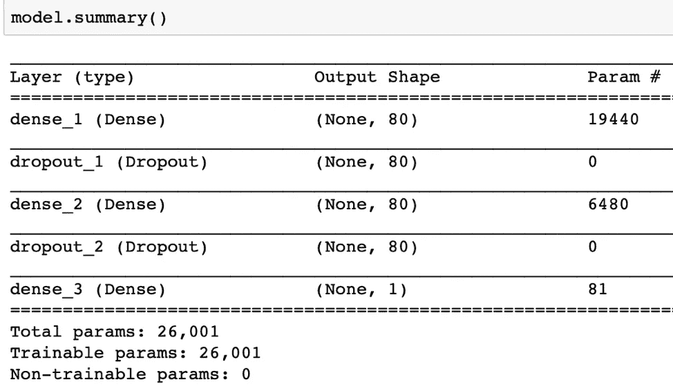
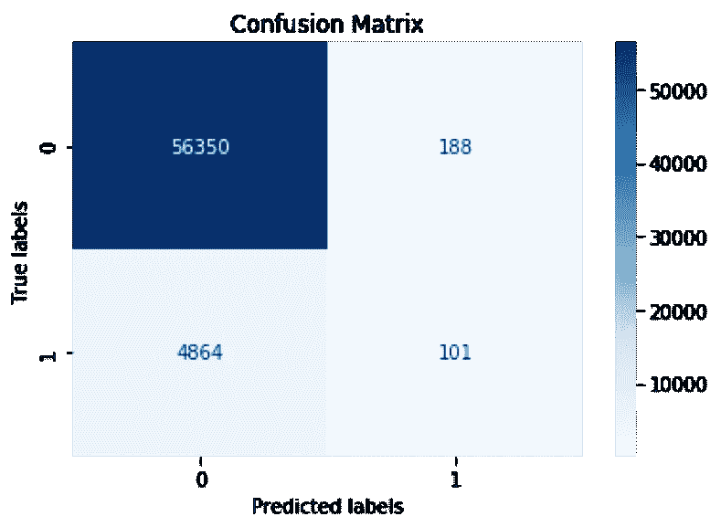
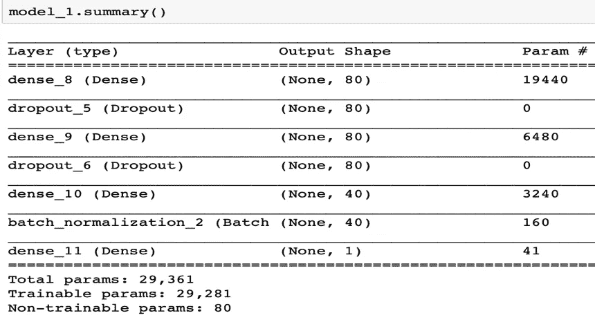

# 使用深度学习的违约风险

> 原文：<https://towardsdatascience.com/default-risk-using-deep-learning-6924cdada04d?source=collection_archive---------8----------------------->

由于信用记录不足或不存在，许多人很难获得贷款。不幸的是，这些人经常被不可信的贷方利用。像 Home Credit 这样的公司通过提供积极安全的借贷体验，努力扩大无银行账户人群的金融包容性。为了确保这些得不到充分服务的人群拥有积极的贷款体验，Home Credit 利用各种替代数据(例如，包括电信和交易信息)来预测其客户的还款能力。通过使用各种统计、机器学习和深度学习方法，我们释放了他们数据的全部潜力。这样做将确保有能力还款的客户不会被拒绝，并且贷款的本金、到期日和还款时间表将使他们的客户获得成功。

这个项目的目标是使用历史贷款申请数据来预测申请人是否能够偿还贷款。这是一个标准的监督分类任务:

*   **监督:**标签包含在训练数据中，目标是训练一个模型来学习根据特征预测标签
*   **分类:**标签为二元变量，0(会按时还贷)，1(会有困难还贷)

在这个项目中，实现的目标是:

*   **数据探索例程**被设计和实现来进行统计分析和可视化。
*   **建立分类模型**如**朴素贝叶斯、逻辑回归、支持向量机(SVM)、决策树、随机森林、梯度推进机(GBM)** 和**深度学习**来预测申请人是否能够偿还贷款。
*   通过**准确度、混淆矩阵、精确度、召回率、真阴性率(TNR)、假发现率(FDR)、增益图、提升图、K-S 图、ROC — AUC 图**评估分类模型。
*   将最终的解决方案部署为一个 Web 应用程序。

# 数据源

数据由 Home Credit ( [Dataset](https://www.kaggle.com/c/home-credit-default-risk/data) )提供，这是一项致力于向没有银行账户的人群提供信贷额度(贷款)的服务。预测客户是否会偿还贷款或有困难是一项关键的业务需求，Home Credit 希望释放他们数据的全部潜力，看看可以开发什么样的机器学习/深度学习模型来帮助他们完成这项任务。

# 数据探索

数据探索是一个开放式的过程，在这个过程中，我们计算统计数据并制作图表，以发现数据中的趋势、异常、模式或关系。数据探索的目标是了解我们的数据能告诉我们什么。它通常从高层次的概述开始，然后缩小到特定的领域，因为我们发现了数据中有趣的领域。这些发现本身可能是有趣的，或者它们可以用于通知我们的建模选择，例如通过帮助我们决定使用哪些功能。

**检查目标列的分布**

目标是我们被要求预测的:要么 0 表示贷款按时偿还，要么 1 表示客户有支付困难。我们首先检查属于每个类别的贷款数量，并绘制计数百分比的饼图。

**编码分类变量**

我们对任何只有两个类别的分类变量使用标签编码，对任何有两个以上类别的分类变量使用一次性编码。标签编码的问题是它给了类别一个任意的顺序。分配给每个类别的值是随机的，并不反映该类别的任何固有方面。如果一个分类变量只有两个唯一值(比如男性/女性)，那么标签编码就可以了，但是对于两个以上的唯一类别，一键编码是安全的选择。

# 最有价值图(MVP) —组合图

我们对数字和分类变量进行统计分析和可视化。我们生成描述性统计数据，总结数据分布的集中趋势、离散度和形状。

对于数值变量，我们绘制直方图，用一个 y 轴表示数值变量的分布，用于计算数值变量中的值，并用另一个 y 轴表示目标百分比=1(偿还贷款有困难)的线图。

Above Plot shows that as the count of numeric variable EXT_SOURCE_3 is increasing, the percent of Target=1 is decreasing, so with the increasing in EXT_SOURCE_3, more loans are being repaid. EXT_SOURCE_3 can be a potential feature for our predictive modeling

对于分类变量，我们绘制条形图以显示分类变量的分布，并用一个 y 轴按降序排序，y 轴表示类别值的计数，还用另一个 y 轴绘制线图，表示目标百分比=1(将难以偿还贷款)。

Above plot shows as the FLAG_OWN_REALTY is decreasing, the percent of Target=1 is increasing, so with the decrease in FLAG_REALTY, less loans are being repaid.

这个图叫做最有价值图(MVP)，也叫组合图。组合图是展示预测者(X 轴)相对于目标(Y 轴)的可预测能力的最佳可视化方法。它们向我们展示了变量如何影响 Target=1 的百分比，从而证明了变量对我们预测建模的可预测性。从视觉上，我们可以说，随着变量的计数增加/减少，Target=1 的百分比根据直线的陡度而减少或增加，因此贷款的偿还或多或少分别取决于百分比的减少或增加。

# 数据建模

我们使用以下机器学习算法，并为我们的监督分类任务建立分类模型。

1.  **朴素贝叶斯**
2.  **逻辑回归**
3.  **随机森林**
4.  **梯度推进机(GBM)**
5.  **深度学习**

在上述模型中，前三个是基线模型，后三个是改进模型。

# 深度学习

在我们将数据输入深度神经网络之前，我们对数据集执行特征缩放。我们把数据集做成 numpy 数组。我们使用最小最大缩放器进行预处理。我们拟合转换特征训练数据并转换特征测试数据。

**4 层深度神经网络**

具有 4 层的深度神经网络具有 2 个隐含层，每个隐含层具有 80 个神经元。在两个隐藏层之间以及第二个隐藏层和输出层之间添加了下降层，以防止过拟合。`Binary_crossentropy`用作损失函数，更新方法为`ADAM. The number of Epochs is 500.`

对于我们的数据，输入层具有 242 的维度，2 个隐藏层具有整流器作为其激活函数，每个层具有 80 个神经元。输出层具有 sigmoid 激活函数，因为我们正在进行二元分类。深度神经网络采用 Adam 优化器、二元交叉熵损失函数编译，评价指标为精度。

**Confusion Matrix for** **Deep neural network with 4 layers**

**Summary of Deep neural network model with 4 layers summary**

**5 层深度神经网络**

具有 5 层的深度神经网络具有 3 个隐含层，第一和第二隐含层具有 80 个神经元，第三隐含层具有 40 个神经元。在隐层之间和第三隐层与输出层之间增加了剔除层，在第三隐层与输出层之间插入了批量归一化层以防止过拟合。`The number of Epochs is 400.`

对于我们的数据，输入层具有 242 的维度，3 个隐藏层具有整流器作为其激活函数，第一和第二隐藏层具有 80 个神经元，第三隐藏层具有 40 个神经元。输出层具有 sigmoid 激活函数，因为我们正在进行二元分类。深度神经网络采用 Adam 优化器、二元交叉熵损失函数编译，评价指标为精度。

**Confusion Matrix for** **Deep neural network with 5 layers**

**Summary of Deep neural network model with 5 layers**

# 模型评估

通过准确度、混淆矩阵、精确度、召回率、真阴性率(TNR)、假发现率(FDR)、增益图、提升图、K-S 图、ROC-AUC 图评估分类模型。在对上述技术**的性能进行比较后，**的性能最好，其次是**深度学习神经网络分类器**，再次是**随机森林。**

我们使用 Python 内置的持久性模型(pickle 或 dill)将模型保存到磁盘，并使用该模型对新数据进行预测。

# Python ->机器学习/深度学习模型-> pickle 模型-> flask ->在 Heroku 上部署

Flask 是 Python 的一个“微”框架。之所以称之为微框架，是因为他们希望保持核心简单但可扩展。虽然一开始会有些困惑，但使用 Jinja2 模板在 Flask 上建立一个网站还是相对容易的。

现在我们创建一个简单的 flask 应用程序。flask 应用程序由两个主要组件组成:python 应用程序(app.py)和 HTML 模板。虽然我们可以从 python 文件本身返回 HTML 代码，但是在 python 文件中将整个 HTML 编码为一个字符串会很麻烦。[模板](http://jinja.pocoo.org/docs/2.9/)前来救援！

Heroku 是一个云平台即服务(PaaS ),支持多种编程语言。

点击查看应用[的工作版本。本教程的代码可以在](http://default-risk.herokuapp.com) [Github](https://github.com/jayborkar/Home-Credit) 上找到。关于模型性能的更多信息在 GitHub 知识库的 pdf 报告中。

# 最后的话

我们基于 python ML 库制作了一个简单的基于 web 的预测应用程序。要查看默认风险应用程序的完整工作版本，请查看在 Heroku 云平台上部署为 Web 应用程序(Restful API)的最终解决方案，演示链接:[http://default-risk.herokuapp.com](http://default-risk.herokuapp.com/)

**关于我**:我热衷于通过使用数据科学和机器学习技术解释数据来推动和帮助有洞察力的商业决策。我的热情是用数据解决复杂的现实世界的问题。在 Linkedin 上与我联系。

查看我的作品集[jayborkar . github . io。](https://jayborkar.github.io)

**领英:**[https://www.linkedin.com/in/jayborkar/](https://www.linkedin.com/in/jayborkar/)

**Github**:[https://github.com/jayborkar](https://github.com/jayborkar)

**参考:**

1.  [AE Khan dani、AJ Kim 和 AW Lo 通过机器学习算法建立的消费者信贷风险模型研究论文](https://dspace.mit.edu/openaccess-disseminate/1721.1/66301)
2.  [Github 资源库](https://github.com/jayborkar/Home-Credit)
3.  [在生产中将机器学习模型部署为 API(使用 Flask)](https://www.analyticsvidhya.com/blog/2017/09/machine-learning-models-as-apis-using-flask/)