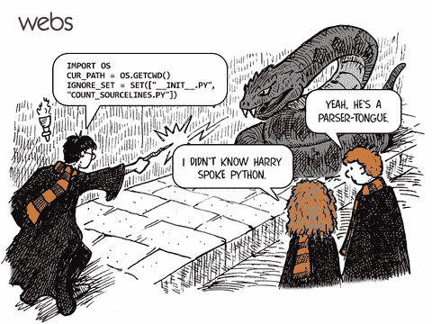
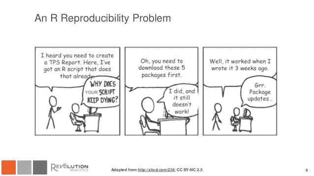
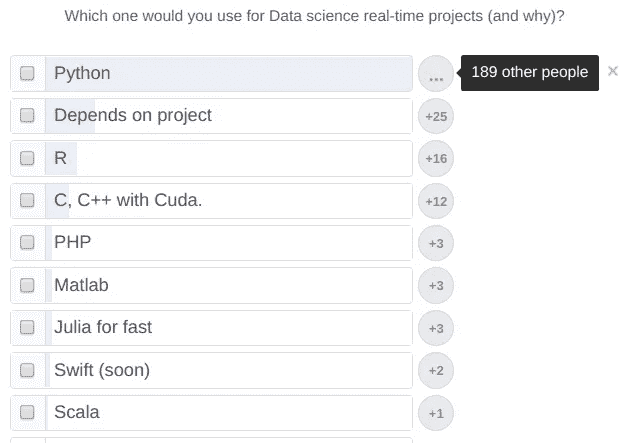

# 数据艺术的防御:Python v/s R

> 原文：<https://towardsdatascience.com/defence-against-the-data-arts-python-v-s-r-5f4529c1d90f?source=collection_archive---------7----------------------->

## 场景(哈利波特参考)- **邓布利多**挥舞着一根带有抽象**蟒蛇**芯的魔杖，格林德沃使用一根带有经典 **R** 芯的魔杖。两者同样熟练。权杖核心会在数据世界中产生权力差异吗？？？让我们找出答案。

在我们开始防御数据艺术历史上最伟大的决斗之前，让我们检查一下他们各自的魔杖…

一边是 **2** 时代世界魔杖冠军(2007&2010)**巨蟒**。根据 TIOBE 指数，它目前排名第第**第四**，比 2017 年上升了一位。它是由一个名叫**吉多·范·罗苏姆** (1991)的著名巫师创建的，以支持使用多种编程范例的魅力、可读性和支持高层次的抽象。

对于那些对巨蟒魔杖有兴趣的人->[https://en.wikipedia.org/wiki/Zen_of_Python](https://en.wikipedia.org/wiki/Zen_of_Python)

另一个强大的元老权杖 **R** 在 TIOBE 指数中上升了 3 位，并在 2018 年 4 月占据了第 12 位。它是由两位巫师罗斯·伊哈卡&罗伯特·绅士创造的，唯一的目的是赢得一场统计决斗。它为统计计算和图形提供了魅力。它的特殊魅力使它能够执行统计建模、经典统计测试、时间序列分析、分类、聚类和图形技术。

# **第一轮:粉丝群&科学界**

> 你基本上是跟着人群走。

当我在本文中谈到 Python 时，并不是指作为一个整体的通用语言能力(这是不公平的)，而是指包的子集(numpy、scipy 等)..)构建，以满足大数据时代日益增长的统计问题的需求。

根据 TIOBE 评级，Python 比 R 更受欢迎。

让 python 更受欢迎的是它的**通用编程风格(Python 之禅)**，**更快的学习曲线**，而最重要的原因是**过量的高级包和机器框架&深度学习(SK-learn、Keras、Pytorch、Tensorflow 等)**。您执行数据分析的最终目标是做出决策，因此，如果决策制定(DM)工具本身是用 Python 编写的，您会更喜欢用同样的语言来完成分析部分，因为这样将来更容易与 DM 算法集成。r 也有等价的框架，但是不太为人所知。

# 在这两种情况下，科学界都是好的。但是，受欢迎程度再次让我们像羊群一样涌向蟒蛇那一边。Python 赢了！！！

credits:xkcd

# **第二轮:初学者的运气**

正如我前面提到的，Python 非常直观，而 as R 的学习曲线非常陡峭。我第一次使用 python 时，我喜欢上了它。一切都很容易。我以为我可以用它征服软件世界。但是我太天真了。下学期的 C 课让我看到了自己的位置。(谁刚学完 Python 就教 C？).

即使我碰到它的时候已经有了比较好的编程知识，R 还是很麻烦。一开始，编写一段代码(检查包和不同的构造是一件痛苦的事)所花的时间是编写一段同等 Python 代码所花时间的三倍。随着你熟悉 R 编码风格，它会变得更好，但我仍然因为 R 中的非直观构造而感到痛苦。这可能是因为我对 **python 上瘾了**。****

**Ipython notebook 让编码更干净更简单(magic cmds)。它支持 R 和 Python 内核。**

**尽管如此，我还是倾向于 Python。**

# 第三轮:美女与野兽

任何使用过 ggplot2(& others)和 matplotlib.pyplot 的人可能都会同意我的说法，与前者相比，后者是一只粗糙的野兽。还有其他 Python 可视化包，比如 seaborn，它们很好，但是没有达到 R 的标准。

**R 横扫本轮！！！**

# 第四轮:数据分析能力

如果我们谈论统计计算和建模能力的话，R 显然优于 Python。它有更多经过验证的统计计算包，还没有用 Python 实现。Python 每小时都在缩小差距。

那么问题就来了——**R 是不是一种即将消亡的语言？**

不，这不是真的。 **R 是有学问的人的语言** - **统计学家、医学研究人员&生命科学研究人员**等发现 R 是比 python 更好的工具。原因可以认为是优越的统计软件包和习惯的结果。

这个问题主要出现在我们的脑海中，因为围绕深度学习和神经网络产生的**蓬勃发展的宣传，其中 Python 主导了该领域，并产生了一种感觉，即 R 正在失去其在该领域的地位，因为深度学习与数据科学密切相关(&分析)。这就像一个诱饵效果。**

我在脸书(AI & DL 集团)进行了一次民意调查，以验证上述推理，结果统计数据与推理一致。

因此，R 在这一回合中设法战胜了 python。

# 决定谁是赢家？

就像巫师们自己一样(在著名的决斗——哈利·波特引用之前),没有明确的证据表明一个比另一个优越。

像一个外交政治家一样，我会说，如果你的目标是经典的统计分析，那么用 R，如果你的目标是机器学习，那么用 Python，因为支持更好，编码更容易。

但是我相信对于一个数据科学和 ML 爱好者来说，成为两个行业的杰克是很好的。

我试图融入虚构的元素，给这篇文章带来幽默。希望你喜欢它。如果我在上课时间写这篇文章时，遗漏了什么重要的特征，请评论。