# 揭开“混乱矩阵”混乱的神秘面纱

> 原文：<https://towardsdatascience.com/demystifying-confusion-matrix-confusion-9e82201592fd?source=collection_archive---------4----------------------->

如果你对混淆矩阵感到困惑，那么我希望这篇文章可以帮助你理解它！快乐阅读。

我们将使用 UCI 钞票认证数据集来揭开混淆矩阵背后的混乱。我们将预测和评估我们的模型，并在此过程中发展我们的概念理解。也将在需要的地方提供进一步阅读的链接。

# **了解数据**

数据集包含钞票 400x400 像素小波变换图像的属性，可以在[这里](https://archive.ics.uci.edu/ml/datasets/banknote+authentication)找到。建议读者下载数据集并跟随学习。进一步参考，可以在这里找到 Kaggle 笔记本[。](https://www.kaggle.com/ritesaluja/binaryclassification-and-modelevaluation-example/)

```
*#Skipping the necessary Libraries import* **#Reading the Data File** df = pd.read_csv('../input/BankNote_Authentication.csv')
df.head(5)
```

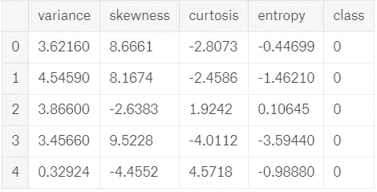

Sample Data (using Head)

```
**#To check if the data is equally balanced between the target classes** df['class'].value_counts()
```

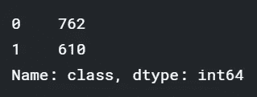

Target Class is balanced enough

# **建立模型**

将数据分为训练集和测试集，我们将在训练集上训练我们的模型，评估将在测试集上执行，由于简单和缺乏足够的数据，我们在这里跳过验证集。总的来说数据分为三组训练、测试和验证，这里阅读更多。

```
**#Defining features and target variable**
y = df['class'] #target variable we want to predict 
X = df.drop(columns = ['class']) #set of required features, in this case all**#Splitting the data into train and test set** 
X_train, X_test, y_train, y_test = train_test_split(X, y, test_size=0.25, random_state=42)
```

接下来，我们将为我们的预测建立一个简单的逻辑回归模型。

```
**#Predicting using Logistic Regression for Binary classification** 
from sklearn.linear_model import LogisticRegression
LR = LogisticRegression()
LR.fit(X_train,y_train) *#fitting the model* 
y_pred = LR.predict(X_test) *#prediction*
```

# **模型评估**

我们来绘制最混乱的混淆矩阵？开个玩笑，让我们有一个简单的混淆矩阵( [Scikit-learn 文档](https://scikit-learn.org/stable/auto_examples/model_selection/plot_confusion_matrix.html)用于下面的代码)。

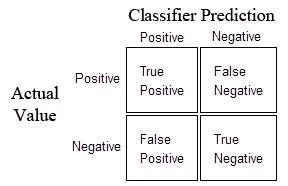

Confusion Matrix for Binary Classification

```
**#Evaluation of Model - Confusion Matrix Plot**
def plot_confusion_matrix(cm, classes,
                          normalize=False,
                          title='Confusion matrix',
                          cmap=plt.cm.Blues):
    *"""*
 *This function prints and plots the confusion matrix.*
 *Normalization can be applied by setting `normalize=True`.*
 *"""*
    if normalize:
        cm = cm.astype('float') / cm.sum(axis=1)[:, np.newaxis]
        print("Normalized confusion matrix")
    else:
        print('Confusion matrix, without normalization')

    print(cm)

    plt.imshow(cm, interpolation='nearest', cmap=cmap)
    plt.title(title)
    plt.colorbar()
    tick_marks = np.arange(len(classes))
    plt.xticks(tick_marks, classes, rotation=45)
    plt.yticks(tick_marks, classes)

    fmt = '.2f' if normalize else 'd'
    thresh = cm.max() / 2.
    for i, j **in** itertools.product(range(cm.shape[0]), range(cm.shape[1])):
        plt.text(j, i, format(cm[i, j], fmt),
                 horizontalalignment="center",
                 color="white" if cm[i, j] > thresh else "black")

    plt.ylabel('True label')
    plt.xlabel('Predicted label')
    plt.tight_layout()

**# Compute confusion matrix**
cnf_matrix = confusion_matrix(y_test, y_pred)
np.set_printoptions(precision=2)

**# Plot non-normalized confusion matrix**
plt.figure()
plot_confusion_matrix(cnf_matrix, classes=['Forged','Authorized'],
                      title='Confusion matrix, without normalization')
```

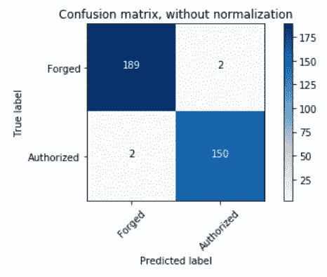

Confusion Matrix for the Binary Classification performed

```
**#extracting true_positives, false_positives, true_negatives, false_negatives**
tn, fp, fn, tp = confusion_matrix(y_test, y_pred).ravel()
print("True Negatives: ",tn)
print("False Positives: ",fp)
print("False Negatives: ",fn)
print("True Positives: ",tp)
```

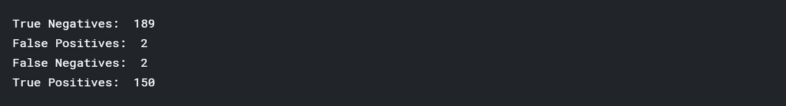

**我们的模型有多精确？**

```
**#Accuracy**
Accuracy = (tn+tp)*100/(tp+tn+fp+fn) 
print("Accuracy {:0.2f}%:",.format(Accuracy))
```


**准确性重要吗？**

不总是这样，有时这可能不是正确的衡量标准，尤其是当你的目标阶层不平衡时(数据是有偏差的)。然后，您可能会考虑其他指标，如精确度、召回率、F 分数(组合指标)，但在深入讨论之前，让我们先退后一步，理解构成这些指标基础的术语。

**一些基本术语**

***真阳性*** —被预测为阳性(在我们的场景中是认证的钞票)并且实际上是阳性(即属于阳性‘授权’类)的标签。

***真阴性*** —被预测为阴性(在我们的场景中是伪造的钞票)而实际上是阴性(即属于阴性‘伪造’类)的标签。

***假阳性*** —被预测为阳性，但实际上是阴性的标签，或者简单地说，被我们的模型错误地预测为真实，但实际上是伪造的票据。在假设检验中，它也被称为 1 型错误或对零假设的不正确拒绝，[参考此](https://www.ncbi.nlm.nih.gov/pmc/articles/PMC2996198/)阅读更多关于假设检验的信息。

***假阴性*** —预测为阴性，但实际为阳性的标签(预测为伪造的真实票据)。这也被称为第二类错误，它导致拒绝零假设的失败。

现在让我们看看每个机器学习从业者应该知道的最常见的评估指标！

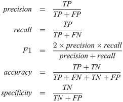

Mathematical Definitions (Formulas)

# **指标超出准确度**

**精度**

它是“精确性”，即模型只返回相关实例的能力。如果您的用例/问题陈述涉及最小化误报，即在当前场景中，如果您不希望伪造的纸币被模型标记为真实的，那么精确度是您需要的。

```
**#Precision** 
Precision = tp/(tp+fp) 
print("Precision {:0.2f}".format(Precision))
```

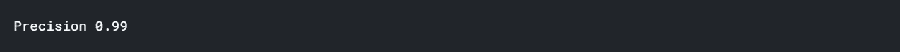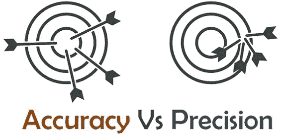

Precision is about Repeatability & Consistency

**召回**

它是“完整性”，模型识别所有相关实例的能力，真正的阳性率，也称为敏感度。在目前的情况下，如果你的重点是最大限度地减少假阴性，也就是说，你不会把真钞错误地归类为伪钞，那么召回就能帮你一把。

```
**#Recall** 
Recall = tp/(tp+fn) 
print("Recall {:0.2f}".format(Recall))
```


**F1 测量**

精确度和召回率的调和平均值，用于表示精确度和召回率之间的平衡，提供相等的权重，范围从 0 到 1。F1 分数在 1 时达到最佳值(完美的精确度和召回率)，在 0 时达到最差值，在此阅读更多。

```
**#F1 Score**
f1 = (2*Precision*Recall)/(Precision + Recall)
print("F1 Score {:0.2f}".format(f1))
```


**F-beta 测量**

这是 F 值的一般形式——β0.5 和 2 通常用作度量，0.5 表示倾向于精确，而 2 表示倾向于回忆，给予它两倍于精确的权重。

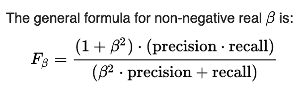

```
**#F-beta score calculation**
def fbeta(precision, recall, beta):
    return ((1+pow(beta,2))*precision*recall)/(pow(beta,2)*precision + recall)

f2 = fbeta(Precision, Recall, 2)
f0_5 = fbeta(Precision, Recall, 0.5)

print("F2 {:0.2f}".format(f2))
print("\nF0.5 {:0.2f}".format(f0_5))
```

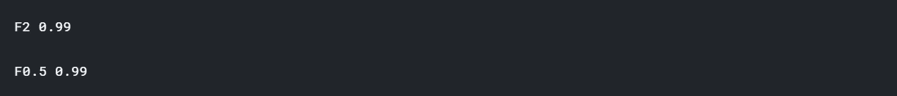

**特异性**

它也被称为“真阴性率”(正确识别的实际阴性的比例)，即数据包含的真阴性越多，其特异性就越高。

```
**#Specificity** 
Specificity = tn/(tn+fp)
print("Specificity {:0.2f}".format(Specificity))
```

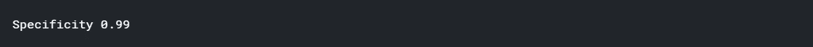

**ROC(受试者工作特性曲线)**

不同分类阈值下“真阳性率”(灵敏度/召回率)与“假阳性率”(1-特异性)的关系图。

ROC 曲线下面积(AUC)测量曲线下的整个二维面积。这是一个衡量参数如何区分两个诊断组的指标。通常用作分类模型质量的度量。

随机分类器的曲线下面积为 0.5，而完美分类器的 AUC 等于 1。

```
**#ROC**
import scikitplot as skplt #to make things easy
y_pred_proba = LR.predict_proba(X_test)
skplt.metrics.plot_roc_curve(y_test, y_pred_proba)
plt.show()
```

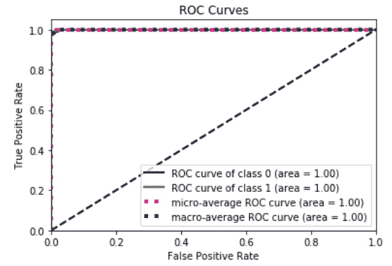

# **结论**

由于选择用来说明混淆矩阵和相关指标的使用的问题很简单，您可以找到更高水平(98%或以上)的每个值，无论是精确度、召回率还是准确度；通常情况下不会这样，您将需要关于数据的领域知识来在一个度量或另一个度量(通常是度量的组合)之间进行选择。

例如:如果是关于发现“你邮箱里的垃圾邮件”，你的模型的*高精度*将是非常重要的(因为你不希望这个邮件被贴上垃圾邮件的标签)，它将告诉我们被我们归类为垃圾邮件的邮件中有多少是垃圾邮件。真阳性(分类为垃圾邮件的单词，实际上是垃圾邮件)与所有阳性(分类为垃圾邮件的所有单词，无论其分类是否正确)的比率。在欺诈检测中，您可能希望您的*回忆*更高，以便您可以正确地分类/识别欺诈，即使您没有将一些非欺诈活动分类为欺诈，也不会造成任何重大损失。