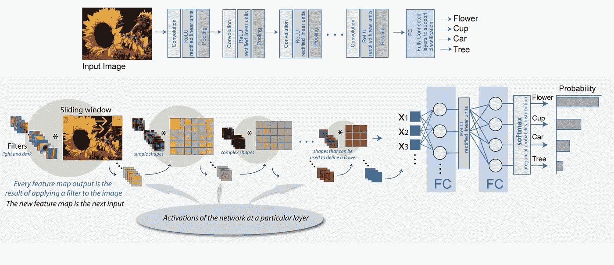
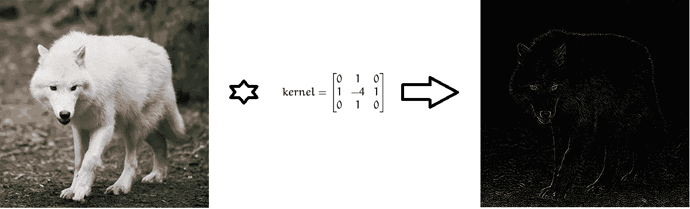
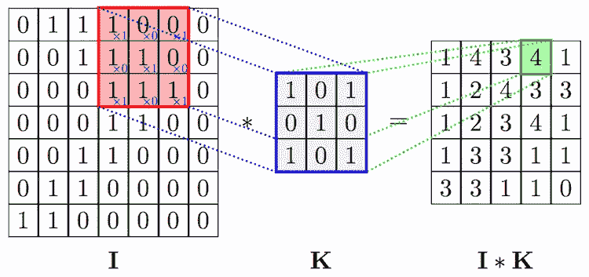
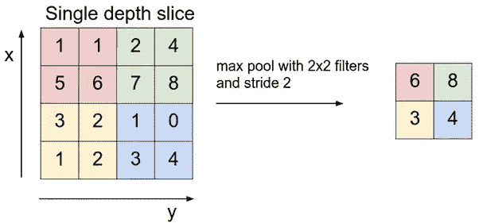
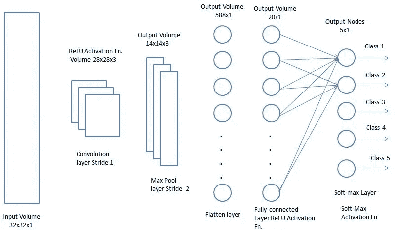
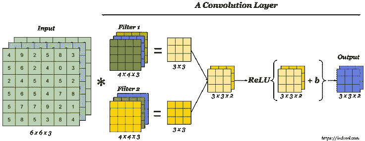
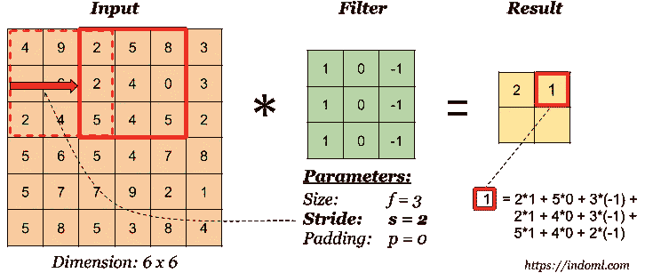
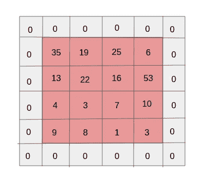
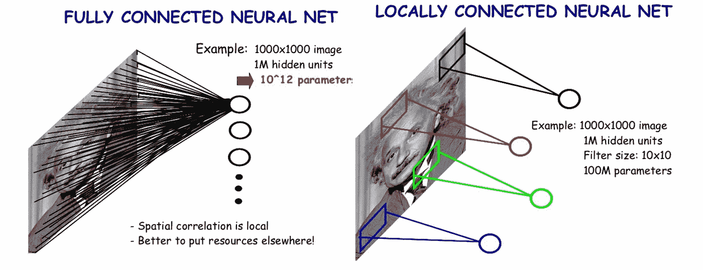

# 揭秘卷积神经网络

> 原文：<https://towardsdatascience.com/demystifying-convolutional-neural-networks-384785791596?source=collection_archive---------8----------------------->

Convolutional Neural Networks

## 简史

在过去的十年中，计算机视觉领域取得的进步确实令人惊叹，前所未有。机器现在可以识别视频中的图像和帧，准确率(98%)超过人类(97%)。这一惊人壮举背后的机械装置是受人类大脑功能的启发。

当时，神经学家正在对猫进行实验，他们发现图像的相似部分会导致猫大脑的相似部分变得活跃。换句话说，当猫看着圆圈时，大脑中的阿尔法区被激活。当它看着正方形时，大脑中的β区被激活。他们的发现得出结论，动物的大脑包含一个对图像的特定特征做出反应的神经元区域，即它们通过大脑中神经元的分层结构来感知环境。每一幅图像在进入大脑之前都要经过某种特征提取器。

受大脑功能的启发，数学家们囤积了一个系统来模拟不同组的神经元对图像的不同方面放电，并相互交流以形成更大的图像。

## 特征提取器

他们将一组被激活的神经元的想法具体化，提供特定的输入，成为多维矩阵的数学概念，代表特定特征集的检测器，也称为**过滤器**或**内核**。每个这样的过滤器将用于检测图像中特定的东西，例如用于检测边缘的*过滤器*。然后，这些学习到的特征将通过另一组设计用于检测更高级特征的过滤器，即*眼睛、鼻子等*。

Convolution of an image with Laplacian filter to detect edges

在数学上，我们将在给定输入图像(表示为像素强度矩阵)之间执行卷积运算，并进行滤波以产生所谓的特征图。该特征图将作为另一层过滤器的输入。

**为什么卷积？**

卷积是一个过程，在这个过程中，网络试图通过参考它在过去学习到的内容来标记输入信号。如果输入信号看起来像它以前见过的先前的猫图像，则“猫”参考信号将与输入信号卷积或混合到输入信号中。产生的输出信号然后被传递到下一层(这里，输入信号是根据 RGB 像素强度的输入图像的 3d 表示，而“猫”参考信号是用于识别猫的核心学习信号)。

Convolution operation of image and filter. [Source](https://www.google.com/url?sa=i&rct=j&q=&esrc=s&source=images&cd=&cad=rja&uact=8&ved=2ahUKEwiSooq_qbLdAhUHr48KHci2CPcQjB16BAgBEAQ&url=https%3A%2F%2Fanhvnn.wordpress.com%2F2018%2F02%2F01%2Fdeep-learning-computer-vision-and-convolutional-neural-networks%2F&psig=AOvVaw3D_1FfTTxQ8rjAQ2cP5o_w&ust=1536733702327424)

卷积运算的一个很好的性质是它是**跨国不变量**。这意味着每个卷积滤波器代表特定的特征集，例如眼睛、耳朵等。这也是 CNN 算法擅长的工作，它可以学习哪个特征集包含了结果参考，例如 cat。输出信号强度不取决于特征的位置，而仅仅取决于特征是否存在。因此，一只猫可以坐在不同的位置，CNN 算法仍然能够识别它。

## 联营

通过追踪大脑生物功能的轨迹，他们能够建立提取特征所需的数学装置。然而，在了解了为了跟踪复杂的几何形状而需要分析的级别和特征的总数后，他们意识到他们的内存不足以容纳所有这些数据。甚至处理所有这些所需的计算能力也会随着功能的增加而呈指数级增长。很快，他们想出了一种被称为池的技术来解决这个问题。它的核心思想非常简单。

> 如果一个区域包含强烈表达的特征，我们可以避免搜索该区域的其他特征。

Demonstration of max pooling

这种池操作，除了节省额外的内存和计算能力要求，还有助于消除图像中的噪声。

## 全连接层

到目前为止还不错，但是如果一个网络最终只能检测图像中的一组特征，那么它有什么用呢？我们需要一种方法，让网络能够将给定的图像分类到一些类别中。这就是可以利用传统神经网络设置的地方。特别是，从早期图层检测到的要素地图到用于分类的标注数量，我们可以拥有一个完全连通的图层。最后一层将为输出类别中的每个类别分配概率。基于这些输出概率，我们可以最终将图像分类到输出类别之一。

Fully Connected Layer. [Source](https://www.google.com/url?sa=i&rct=j&q=&esrc=s&source=images&cd=&cad=rja&uact=8&ved=2ahUKEwiCmqSRr7LdAhUEKY8KHefjDZMQjB16BAgBEAQ&url=http%3A%2F%2Fshukra.cedt.iisc.ernet.in%2Fedwiki%2FNeural_Network_based_classification_of_traffic_signs&psig=AOvVaw10lXcVhPvts0qpYV_Qgihy&ust=1536735179279422)

## 最终建筑

剩下的唯一事情是将所有这些学到的概念结合到一个单一的框架中，我们称之为**卷积神经网络**又名 **CNN** 。本质上，CNN 由一系列卷积层组成，这些卷积层可选地与汇集层结合以生成特征图，该特征图然后被馈送到一堆完全连接的层以产生分类概率。反向传播输出的错误，我们将能够训练这个设置来生成准确的结果。

现在，功能性的观点被恰当地奠定，让我们稍微深入 CNN 的操作方面。

## 卷积神经网络

Convolution layer

卷积层是 CNN 的主要组成部分。每个这样的层由一组独立的过滤器组成，每个过滤器在给定的图像中寻找不同的特征集。

Convolution operation. [Source](https://www.google.com/url?sa=i&rct=j&q=&esrc=s&source=images&cd=&cad=rja&uact=8&ved=2ahUKEwi3pb3V2_3dAhUGY48KHW4PDm4QjB16BAgBEAQ&url=https%3A%2F%2Fmedium.com%2Fmachine-learning-bites%2Fdeeplearning-series-convolutional-neural-networks-a9c2f2ee1524&psig=AOvVaw0h063FdhExCVR9Y1C3xdll&ust=1539324138377060)

在数学上，我们采用固定大小的过滤器，并将其滑过完整的图像，在过滤器和输入图像块之间进行点积。这种点积的结果将是一个标量，它将进入结果特征图。然后，我们向右滑动过滤器，执行相同的操作，将结果添加到特征映射中。在用滤波器卷积完整的图像之后，我们最终得到一个表示不同特征集的特征图，该特征集再次作为进一步层的输入。

**大步走**

滤波器移动的量是跨距。在上面的图像中，我们用因子 1 滑动过滤器。这可能不是我们一直需要的。使用大于 1 的跨距背后的直觉是相邻像素是强相关的(特别是在最低层中)，因此通过应用适当的跨距来减小输出的大小是有意义的。但是，大步长可能会导致大量信息丢失。所以，我们在选择步幅的时候一定要小心。

Example with a stride of 2\. [Source](https://www.google.co.in/url?sa=i&source=images&cd=&cad=rja&uact=8&ved=2ahUKEwjblbihjp_eAhVHpo8KHaq_CjMQjB16BAgBEAQ&url=https%3A%2F%2Findoml.com%2F2018%2F03%2F07%2Fstudent-notes-convolutional-neural-networks-cnn-introduction%2F&psig=AOvVaw3aJpkYPPqBuDtqvM_qJXSs&ust=1540471530232841)

**填充**

Padding of one layer. [Source](https://www.google.co.in/url?sa=i&source=images&cd=&cad=rja&uact=8&ved=2ahUKEwjymYzWjp_eAhUMRY8KHSeyCV0QjB16BAgBEAQ&url=https%3A%2F%2Fblog.xrds.acm.org%2F2016%2F06%2Fconvolutional-neural-networks-cnns-illustrated-explanation%2F&psig=AOvVaw2OUPjpFyzLpgXsLg63meBb&ust=1540471686480309)

步幅的一个不良影响是，随着我们一次又一次地执行卷积，特征图的大小随之减小。这可能不是我们想要的结果，因为这里的收缩也意味着信息丢失。要了解为什么会出现这种情况，请注意过滤器应用于中间单元格和角落单元格的次数差异。显然，没有什么特别的原因，来自中间细胞的信息比来自边缘细胞的信息更重要。为了保留先前层的有用信息，我们可以用零层包围给定的矩阵。

## 参数共享

当我们已经有一个很好的深度神经网络设置时，为什么还要 CNN 呢？有趣的是，如果我们使用深度神经网络进行图像分类，每一层的参数数量将是 CNN 的数千倍。

Parameter sharing in CNN

*请通过你的评论让我知道这篇文章可以容纳的任何修改/改进。*