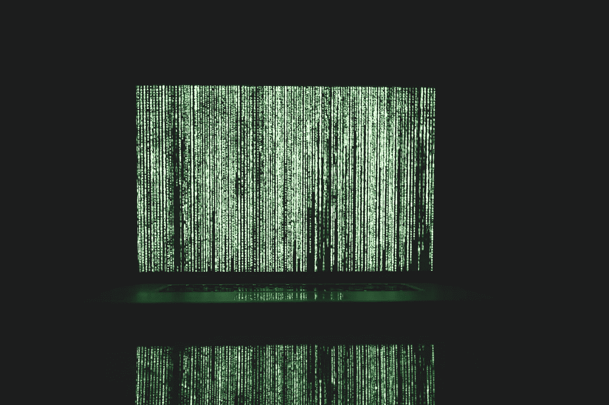
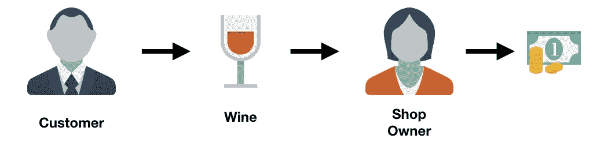
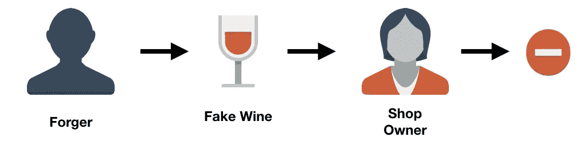
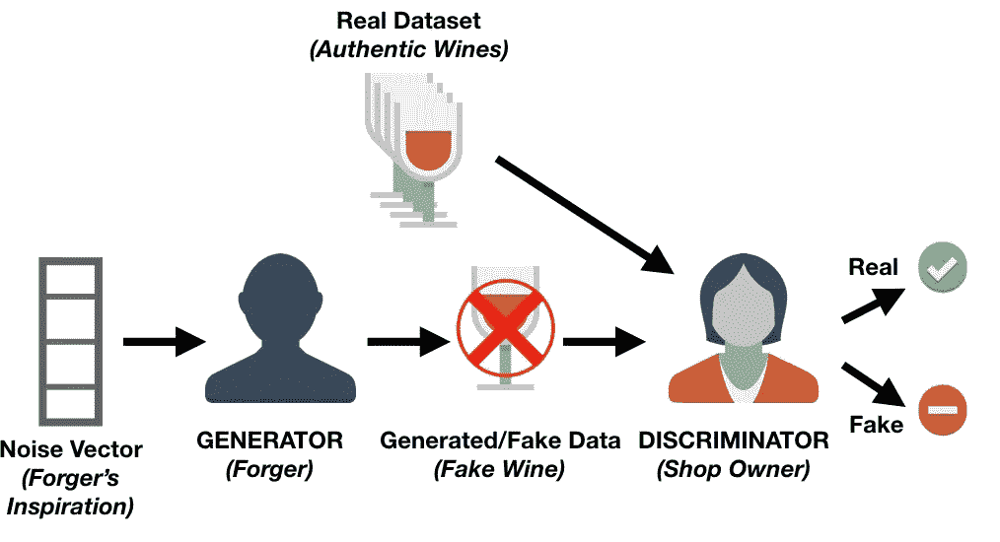
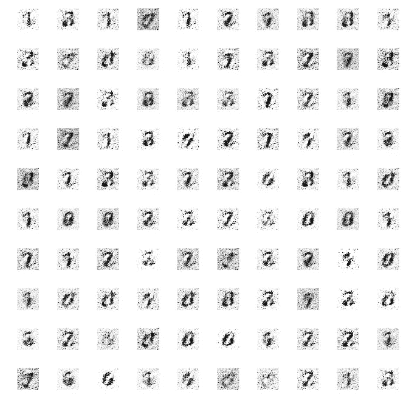
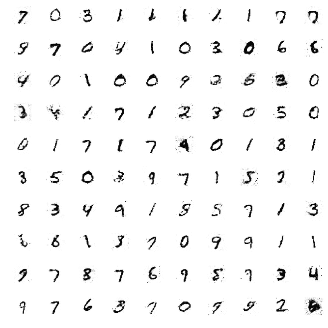
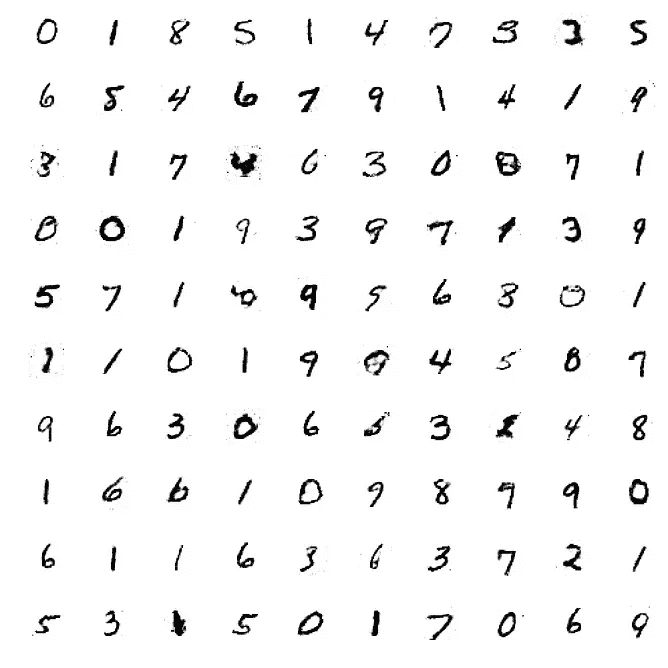

# 揭开生成对抗网络的神秘面纱

> 原文：<https://towardsdatascience.com/demystifying-generative-adversarial-networks-c076d8db8f44?source=collection_archive---------6----------------------->

在本教程中(源自我的原始帖子[这里](https://www.datacamp.com/community/tutorials/generative-adversarial-networks))，你将学习什么是生成性对抗网络(gan ),而无需深入数学细节。之后，你将学习如何编写一个简单的可以创建数字的 GAN！



# 类似

理解什么是 gan 的最简单方法是通过一个简单的类比:

假设有一家商店从顾客那里购买某些种类的酒，然后他们再转卖。



但是，也有穷凶极恶的客户为了捞钱，卖假酒。在这种情况下，店主必须能够区分真假葡萄酒。



你可以想象，最初，伪造者在试图出售假酒时可能会犯很多错误，店主很容易识别出这种酒不是真的。由于这些失败，伪造者将继续尝试不同的技术来模仿真正的葡萄酒，有些人最终会成功。既然伪造者知道某些技术通过了店主的检查，他就可以开始在这些技术的基础上进一步改进假酒。

与此同时，店主可能会从其他店主或葡萄酒专家那里得到一些反馈，说她拥有的一些葡萄酒不是原创的。这意味着店主将不得不改进她如何确定一种酒是假的还是真的。伪造者的目标是创造出与真品难以区分的葡萄酒，而店主的目标是准确辨别一款葡萄酒的真假。

这种来回的竞争是 GANs 背后的主要思想。

# 生成性对抗网络的组成部分

利用上面的例子，我们可以得出 GAN 的架构。



GANs 中有两个主要组件:生成器和鉴别器。示例中的店主被称为鉴别器网络，通常是一个[卷积神经网络](https://www.datacamp.com/community/tutorials/convolutional-neural-networks-python)(因为 gan 主要用于图像任务)，它分配图像是真实图像的概率。

伪造器被称为生成网络，也是典型的卷积神经网络(具有[反卷积层](https://blog.openai.com/generative-models/))。该网络采用一些噪声矢量并输出图像。当训练生成网络时，它学习图像的哪些区域要改进/改变，以便鉴别器将更难区分其生成的图像和真实的图像。

生成网络不断产生在外观上更接近真实图像的图像，而辨别网络试图确定真实图像和虚假图像之间的差异。最终目标是拥有一个生成网络，能够生成与真实图像无法区分的图像。

# 带有 Keras 的简单生成对抗网络

既然您已经理解了什么是 gan 以及它们的主要组成部分，我们现在可以开始编写一个非常简单的代码了。你将使用`Keras`，如果你不熟悉这个 Python 库，你应该在继续之前阅读[本教程](https://www.datacamp.com/community/tutorials/deep-learning-python)。这个教程就是基于这个很酷很好理解的甘开发的[这里](https://github.com/Zackory/Keras-MNIST-GAN/blob/master/mnist_gan.py)。

您需要做的第一件事是通过`pip`安装以下软件包:

```
- keras
- matplotlib
- tensorflow
- tqdm
```

您将使用`matplotlib`进行绘图，`tensorflow`作为 Keras 后端库，`tqdm`为每个时期(迭代)显示一个漂亮的进度条。

下一步是创建 Python 脚本。在这个脚本中，您首先需要导入您将使用的所有模块和函数。当它们被使用时，将给出每一个的解释。

您现在想要设置一些变量:

在开始构建鉴别器和生成器之前，应该首先收集和预处理数据。您将使用流行的 MNIST 数据集，该数据集包含一组从 0 到 9 的一位数的图像。


Example of MINST digits

**请注意**`mnist.load_data()`是 Keras 的一部分，允许您轻松地将 MNIST 数据集导入工作空间。

现在，您可以创建自己的生成器和鉴别器网络。您将为两个网络使用 [Adam 优化器](https://machinelearningmastery.com/adam-optimization-algorithm-for-deep-learning/)。对于发生器和鉴别器，您将创建一个具有三个隐藏层的神经网络，激活函数为 [Leaky Relu](https://www.quora.com/What-are-the-advantages-of-using-Leaky-Rectified-Linear-Units-Leaky-ReLU-over-normal-ReLU-in-deep-learning) 。你还应该为鉴别器添加[脱落层](https://medium.com/@amarbudhiraja/https-medium-com-amarbudhiraja-learning-less-to-learn-better-dropout-in-deep-machine-learning-74334da4bfc5)，以提高其对不可见图像的鲁棒性。

终于到了把发生器和鉴别器合二为一的时候了！

为了完整起见，您可以创建一个函数，每隔 20 个时期保存您生成的图像。因为这不是本课的核心，所以您不需要完全理解该函数。

现在，您已经对网络的大部分进行了编码。剩下的就是训练这个网络，看看你创造的图像。

经过 400 个纪元的训练后，您可以查看生成的图像。查看第一个时期后生成的图像，您可以看到它没有任何真实的结构，查看 40 个时期后的图像，数字开始成形，最后，400 个时期后生成的图像显示清晰的数字，尽管有一对数字仍然无法识别。



Results after 1 epoch (left) | Results after 40 epochs (middle) | Results after 400 epochs (right)

这段代码在 CPU 上每个时期大约需要 2 分钟，这也是这段代码被选中的主要原因。您可以通过使用更多的历元以及向发生器和鉴别器添加更多(和不同的)层来进行试验。然而，当使用更复杂和更深入的架构时，如果只使用 CPU，运行时间也会增加。然而，不要因此而停止尝试！

# 结论

恭喜你，你已经完成了本教程的学习，在本教程中，你以直观的方式学习了生成性对抗网络(GANs)的基础知识！此外，您在 Keras 库的帮助下实现了第一个模型。