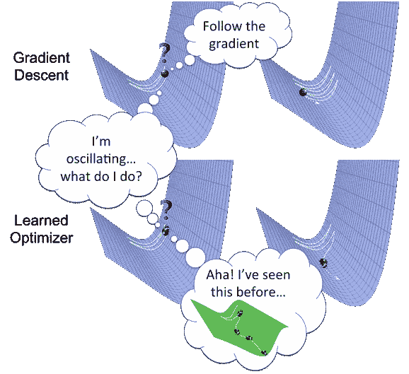
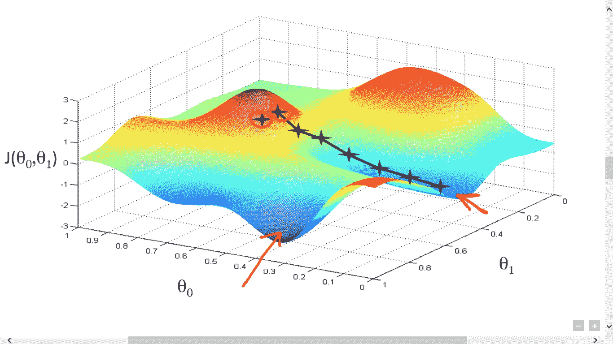
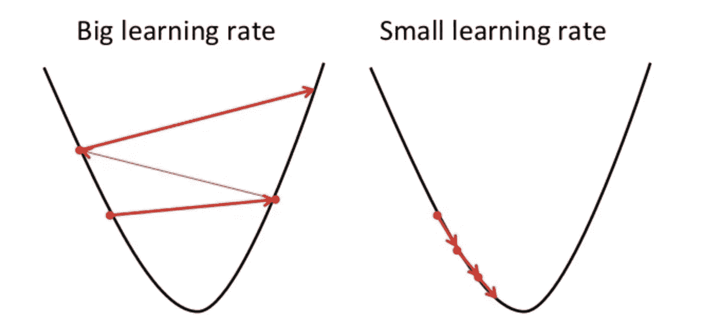
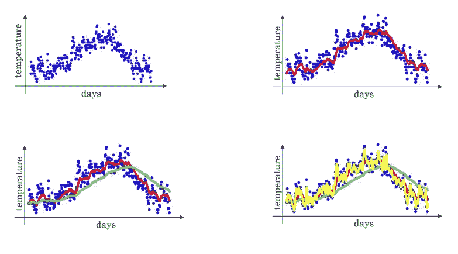
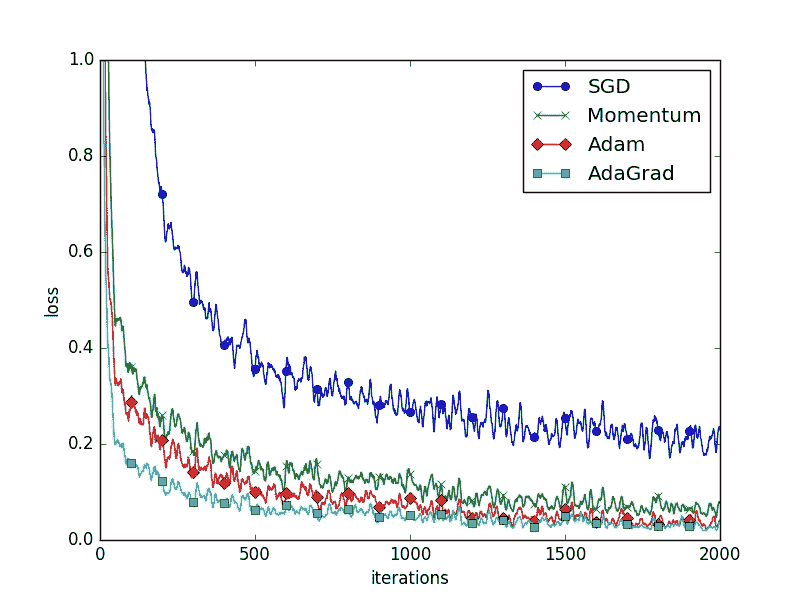

# 揭开机器学习优化的神秘面纱

> 原文：<https://towardsdatascience.com/demystifying-optimizations-for-machine-learning-c6c6405d3eea?source=collection_archive---------3----------------------->



Gradient descent for machine learning

优化是机器学习算法配方中最重要的成分。它从定义某种损失函数/成本函数开始，以使用一个或另一个优化例程最小化 It 结束。优化算法的选择可以在几小时或几天内获得良好的精度。最优化的应用是无限的，是工业界和学术界广泛研究的课题。在本文中，我们将介绍深度学习领域中使用的几种优化算法。*(可以通过* [*这篇文章*](/common-loss-functions-in-machine-learning-46af0ffc4d23) *了解损失函数的基础知识)*

## 随机梯度下降

*随机梯度下降* (SGD)是最简单的优化算法，用于寻找最小化给定成本函数的参数。显然，对于收敛到最优最小值的梯度下降，成本函数应该是凸的。出于演示的目的，想象以下成本函数的图形表示。



Illustration of gradient descent

我们从定义一些参数的随机初始值开始。优化算法的目标是找到对应于成本函数最小值的参数值。具体来说，梯度下降从计算每个参数 w.r.t 成本函数的梯度(导数)开始。这些梯度为我们提供了需要对每个参数进行的数值调整，以便最小化成本函数。这个过程一直持续到我们达到局部/全局最小值(成本函数相对于其周围值最小)。数学上，

```
**for i in range(iterations_count):**          
    **param**_**gradients = evaluate_gradients(loss_function, 
                                         data, 
                                         params)** **params -= learning_rate * param_gradients**
```



Effect of learning rate on gradient descent

*学习率*定义每次迭代中参数应该改变多少。换句话说，它控制着我们应该以多快或多慢的速度收敛到最小值。一方面，小的学习率可能需要迭代才能收敛，大的学习率可能会超过最小值，如上图所示。

尽管在实践中很容易应用，但当涉及到深度神经网络时，它有相当多的缺点，因为这些网络有大量的参数要适应。为了说明梯度下降的问题，让我们假设我们有一个只有两个参数的成本函数。假设成本函数对其中一个参数的变化非常敏感，例如在垂直方向上，而对其他参数(即水平方向)不太敏感(这意味着成本函数具有高条件数)。


Zig zag motion with gradient descent

如果我们在这个函数上运行*随机梯度下降*，我们会得到一种锯齿形行为。实质上，SGD 正在缓慢地向不太敏感的方向发展，而更多地向高度敏感的方向发展，因此没有向最小值的方向调整。在实践中，深度神经网络可能有数百万个参数，因此有数百万个方向来适应梯度调整，从而使问题复杂化。

SGD 的另一个问题是局部最小值或[鞍点](https://en.wikipedia.org/wiki/Saddle_point)的问题。鞍点是在所有方向上梯度为零的点。因此，我们的新加坡元将只停留在那里。另一方面，局部最小值是最小 w.r.t .周围的点，但总体上不是最小的。由于梯度在局部最小值处为零，所以当全局最小值在其他地方时，我们的梯度下降会将其报告为最小值。

为了纠正普通梯度下降的问题，近年来开发了几种先进的优化算法。我们将逐一查看。

## 带动量的随机梯度下降

为了理解高级优化背后的动力，我们首先必须掌握*指数加权平均值*的概念。假设我们得到了一年 365 天中任何一个特定城市每天的温度数据。绘制它，我们在左上角得到一个图表。



Demonstration of exponentially weighted average

现在，如果我们希望计算全年的当地平均温度*,我们将如下进行。*

```
**NOTE :-
     alpha = 0.9** is randomly chosen weight.        
     **t(i)**  is temperature at ith day.
     **v(i)**  is average temperature for ith day averaged over **1/(1 - alpha)** days.**v(0) = 0
v(1) = 0.9 * v(0) + 0.1 * t(1)
v(2) = 0.9 * v(1) + 0.1 * t(2)
...
v(i) = alpha * v(i-1) + (1 - alpha) * t(i)**
```

每天，我们都会计算前一天温度和当天温度的加权平均值。上述计算的曲线图显示在右上角。该图是过去 10 天的平均温度(α= 0.9)。左下角(绿线)显示的是过去 50 天的平均数据图(alpha = 0.98)。

> 这里需要注意的重要一点是，随着我们对更多天数进行平均，该图对温度变化的敏感度将会降低。相比之下，如果我们对更少的天数进行平均，则该图将对温度变化更加敏感，从而对蠕动行为更加敏感。

这种延迟的增加是由于我们给予前一天的温度比今天的温度更多的权重。

> 到目前为止一切顺利，但问题是这一切给我们带来了什么。非常类似地，通过平均过去几个值的梯度，我们倾向于减少更敏感方向的振荡，从而使其收敛更快。

实际上，基于动量的优化算法几乎总是比普通梯度下降法更快。数学上，

```
**moment = 0
for i in range(iterations_count):**          
    **param**_**gradients = evaluate_gradients(loss_function, 
                                         data, 
                                         params)
    moment = gamma * moment +** **param**_**gradients**
    **params** **+= learning_rate * moment
           (where *moment* is building moving average of gradients.
                 *gamma* gives kind of friction = 0.9 or 0.99).**
```

## AdaGrad 优化

这个想法是，对于每个参数，我们存储其所有历史梯度的平方和。这个总数后来被用来衡量学习率。

> 注意，与之前的优化不同，这里我们对每个参数都有不同的学习率。

```
**squared_gradients = 0
for i in range(iterations_count):**          
    **param**_**gradients = evaluate_gradients(loss_function, 
                                         data, 
                                         params)
    squared_gradients += param**_**gradients * param**_**gradients
    params -= learning_rate * param**_**gradients/
                         (np.sqrt(squared_gradients) + 1e-8)
                           *{1e-8 is to avoid divide by zero}***
```

现在的问题是，当我们的损失函数有很高的条件数时，这个标度如何帮助我们？

> 对于具有高梯度值的参数，平方项将很大，因此除以大项将使梯度在该方向上缓慢加速。类似地，具有低梯度的参数将产生较小的平方项，因此梯度将在该方向加速更快。
> 
> 但是请注意，由于梯度在每一步都是平方的，移动估计将随时间单调增长，因此我们的算法收敛到最小值所需的步长将越来越小。

从某种意义上说，这对凸问题[是有利的，因为在这种情况下，我们应该向最小值减速。然而，随着陷入鞍点的机会增加，在](https://www.researchgate.net/post/What_is_the_difference_between_convex_and_non-convex_optimization_problems)[非凸优化](http://www.robots.ox.ac.uk/~seminars/seminars/Extra/2015_06_30_AnnaChoromanska.pdf)问题的情况下，同样的礼物变成了诅咒。

## RMSProp 优化

这是 AdaGrad 的一个微小变化，在实践中效果更好，因为它解决了它遗留的问题。类似于 AdaGrad，这里我们也将保持平方梯度的估计，但是不是*让平方估计在训练中累积，而是让该估计逐渐衰减*。为此，我们将平方梯度的当前估计值乘以衰减率。

```
**squared_gradients = 0
for i in range(iterations_count):**          
    **param**_**gradients = evaluate_gradients(loss_function, 
                                         data, 
                                         params)
    squared_gradients = decay_rate * squared_gradients + (1 -  
                  decay_rate) * param**_**gradients * param**_**gradients
    params -= learning_rate * param**_**gradients/
                              (np.sqrt(squared_gradients) + 1e-8)**
```

## 圣经》和《古兰经》传统中）亚当（人类第一人的名字

这包含了 RMSProp 和带动量的梯度下降的所有优点。

> 具体而言，该算法计算梯度和平方梯度的指数移动平均值，而参数*β_ 1*和*β_ 2*控制这些移动平均值的衰减率。

```
**first_moment = 0
second_moment = 0
for step in range(iterations_count):
**    **param**_**gradients = evaluate_gradients(loss_function, 
                                         data, 
                                         params)
    first_moment = beta_1 * first_moment + (1 - beta_1) *   
                                                    param**_**gradients
    second_moment = beta_2 * second_moment + (1 - beta_2) * 
                                  param**_**gradients * param**_**gradients**      **
    params -= learning_rate * first_moment/(np.sqrt(second_moment) + 
                                                              1e-8)**
```

请注意，我们已经将 *second_moment* 初始化为零。因此，一开始， *second_moment* 会被计算为非常接近零的某个值。因此，我们通过除以一个很小的数来更新参数，从而对参数进行大的更新。*这意味着最初，算法会进行更大的步骤*。为了纠正这一点，我们通过合并当前步骤来创建这些一阶和二阶矩无偏估计。然后我们基于这些无偏估计而不是一阶和二阶矩来更新参数。数学上，

```
**first_moment = 0
second_moment = 0
for step in range(iterations_count):
    param**_**gradients = evaluate_gradients(loss_function, 
                                         data, 
                                         params)
    first_moment = beta_1 * first_moment + (1 - beta_1) *   
                                                    param**_**gradients
    second_moment = beta_2 * second_moment + (1 - beta_2) * 
                                  param**_**gradients * param**_**gradients**      
    **first_bias_correction** = **first_moment/(1 - beta_1 ** step)
    second_bias_correction = second_moment/(1 - beta_2 ** step)
    params -= learning_rate * first_bias_correction/
                           (np.sqrt(second_bias_correction) + 1e-8)**
```

下图展示了每种优化算法在迭代过程中的性能。显然，增加动量有助于提高精确度。然而，在实践中，众所周知，Adam 在处理大型数据集和复杂特征时表现非常出色。



Performance measure for optimizations

## 资源

[](https://www.coursera.org/lecture/deep-neural-network/rmsprop-BhJlm) [## RMSprop -优化算法| Coursera

### 这个课程会教你让深度学习很好工作的“魔法”。而不是深度学习过程…

www.coursera.org](https://www.coursera.org/lecture/deep-neural-network/rmsprop-BhJlm) 

更多数学背景可以找[这个](https://www.coursera.org/lecture/deep-neural-network/rmsprop-BhJlm)。*请通过你的评论让我知道这篇文章可以容纳的任何修改/改进。*