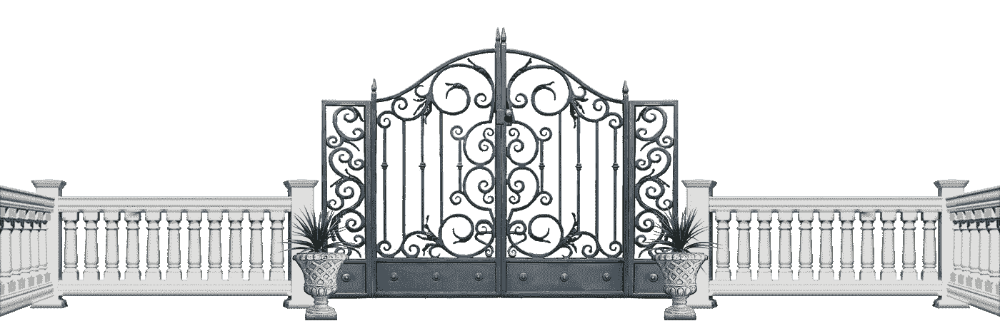
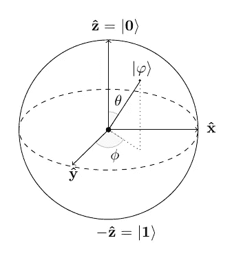
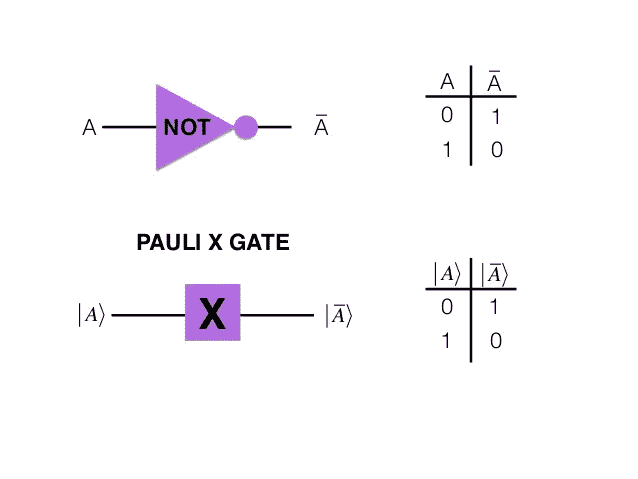
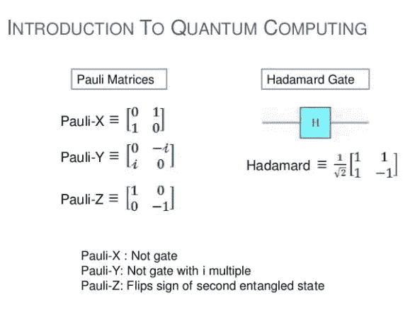
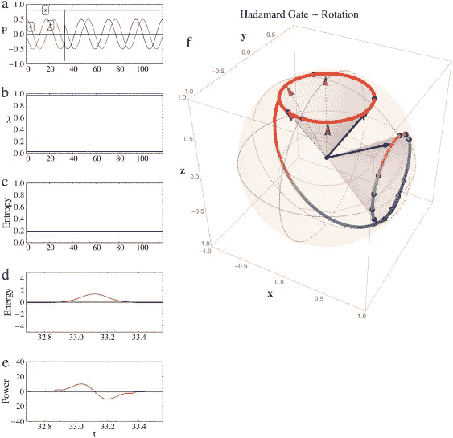
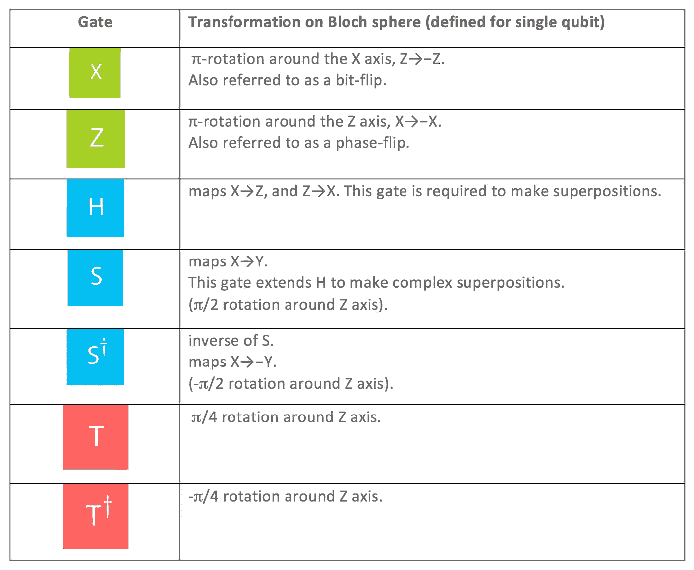
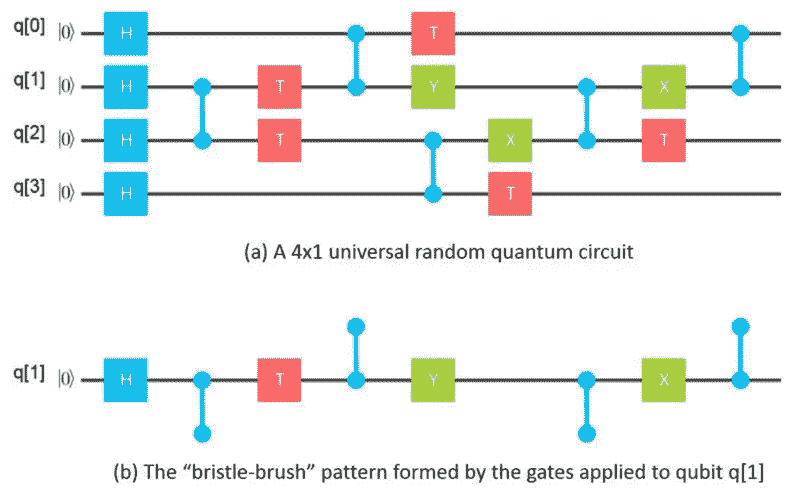

# 揭开量子门的神秘面纱——一次一个量子位

> 原文：<https://towardsdatascience.com/demystifying-quantum-gates-one-qubit-at-a-time-54404ed80640?source=collection_archive---------2----------------------->



(我已经写了一篇关于量子计算的介绍，在这里可以找到。如果你是这个领域的新手，这将是一个更好的起点。)

如果你想进入量子计算领域，没有别的路可走:你必须掌握*量子门*的模糊概念。像量子计算中的一切一样，更不用说量子力学了，量子门被笼罩在一层不熟悉的术语和矩阵数学的迷雾中，这反映了量子的神秘。我在这篇文章中的目标是揭开这个神秘的面纱。不过我给你省点悬念:没人能完全摆脱。至少，2018 年不会。我们今天所能做的就是揭示经典门和量子门之间惊人的相似性和惊人的差异，并探索对计算的近未来和远未来的影响。

# 经典 vs 量子门:比较不可比？

# 惊人的相似

不说别的，经典逻辑门和量子逻辑门都是*逻辑门。*那我们就从这里开始吧。逻辑门，无论是经典的还是量子的，都是任何一种物理结构或系统，它接受一组二进制输入(无论是 0 和 1，苹果和橙子，自旋向上的电子和自旋向下的电子，随便你怎么说)，并吐出一个二进制输出:1，橙色，自旋向上的电子，甚至是两个叠加态中的一个。控制输出的是一个*布尔函数*。这听起来很奇怪也很不祥，但相信我，不是的。你可以把一个布尔函数想象成仅仅是一个如何回答是/否问题的规则。就这么简单。然后，这些门被组合成电路，这些电路被组合成 CPU 或其他计算组件。无论我们谈论的是[巴贝奇的差异引擎](http://www.computerhistory.org/babbage/)、 [ENIAC](http://www.columbia.edu/cu/computinghistory/eniac.html) 、退役国际象棋冠军[深蓝](http://www-03.ibm.com/ibm/history/ibm100/us/en/icons/deepblue/)，还是最新的满屋爆满、令人不寒而栗、头条新闻[量子计算机](http://www-03.ibm.com/press/us/en/pressrelease/53374.wss)，都是如此。

## 惊人的差异

经典门对经典位进行操作，量子门对量子位*(量子位)进行操作。*这意味着量子门可以利用经典门完全无法实现的量子力学的两个关键方面:*叠加*和*纠缠*。这是你在量子计算环境中最常听到的两个概念，下面是[为什么是](https://jasonroell.com/2018/02/01/the-need-promise-and-reality-of-quantum-computing/)。但是有一个不太为人所知的概念可能同样重要:可逆性。简单来说，量子门是*可逆的*。随着你对量子计算的深入研究，你会学到很多关于可逆性的东西，所以这是值得深入研究的。现在，你可以这样想——所有量子门都有一个*撤销*按钮，而许多经典门没有，[至少现在还没有](https://spectrum.ieee.org/computing/hardware/the-future-of-computing-depends-on-making-it-reversible)。这意味着，至少在原则上，量子门永远不会丢失信息。在进入量子门的过程中纠缠的量子位在出去的过程中保持纠缠，在整个转换过程中保持信息安全密封。另一方面，在传统计算机中发现的许多经典门*确实*丢失了信息，因此不能追溯它们的步骤。有趣的是，这些信息最终并没有消失在宇宙中，而是作为经典计算机中的热量渗透到了你的房间或膝盖上。

# v 代表矢量

谈量子门不能不谈矩阵，谈矩阵不能不谈向量。所以让我们继续吧。在量子力学和计算的语言中，向量被描述在一个公认的非常奇怪的包中，称为 *ket，*它来自单词 *braket 的后半部分。他们看起来很像。这里有一个 ket 向量: **|u >，**其中 *u* 表示向量中的值。首先，我们将使用两个 kets， **|0 >** 和 **|1 >** ，它们将代替处于自旋向上( **|0 >** )和自旋向下( **|1 >** )状态的电子形式的量子位。可以说，这些向量可以跨越任意数量的数字。但是在二进制状态的情况下，比如自旋向上/向下的电子量子位，它们只有两个。因此，它们看起来不像高耸的列向量，而是像两层堆叠的数字。下面是 **|0 >** 的样子:*

**/ 1 \**

**\ 0 /**

现在，门/矩阵所做的是*将*这些状态、这些向量、这些数据集、这些数字列转换成全新的状态。例如，一个门可以像变魔术一样把一个上升状态( **|0 >** )变成下降状态( **|1 >** ):

**/ 1 \** → **/ 0 \**

**\ 0/**\ 1/

# m 代表矩阵

这种从一个向量到另一个向量的转换是通过矩阵乘法[这种鲜为人知的魔法来实现的](https://www.khanacademy.org/math/precalculus/precalc-matrices/multiplying-matrices-by-matrices/v/matrix-multiplication-intro)，这与我们在前量子学校学过的乘法完全不同。然而，一旦你掌握了这种数学的窍门，那将是非常有益的，因为你可以一次又一次地将它应用到无数原本难以理解的方程中，而这些方程会让门外汉们目瞪口呆。如果你需要更多的动力，只要记住海森堡是通过矩阵数学的语言解开了无所不包的测不准原理的秘密。

尽管如此，如果你不熟悉这个数学工具的喷射燃料，如果我在这里开始用大的数字方阵填充这个帖子，你的眼睛会变得呆滞。我们不能让这种情况发生。因此，让我们再等几段时间来学习矩阵数学和符号。现在可以说，我们通常用一个矩阵来代替量子门。矩阵的大小和完全的恐惧因素将取决于它所操作的量子位的数量。如果只有一个量子位需要转换，这个矩阵将会非常简单，仅仅是一个有四个元素的 2 x 2 阵列。但是矩阵*的大小超过了具有两个、三个或更多量子位的*。这是因为一个绝对值得记忆的指数方程决定了矩阵的大小(从而决定了量子门的复杂程度):

```
2^n x 2^n = the total number of matrix elements
```

这里， *n* 是量子门操作的量子位的数量。正如你所看到的，这个数字随着量子比特数(n)的增加而上升。一个量子位就是 4。加上两个，就是 16 个。加上三个，就是 64 个。有了四个，就…没希望了。所以现在，我坚持一个量子位，它上面写满了*泡利*。

# 保利门

泡利门是以沃尔夫冈·泡利的名字命名的，他不仅有一个很酷的名字，而且成功地使自己在现代物理学的两个最著名的原理中永垂不朽:著名的[泡利不相容原理](https://chem.libretexts.org/Core/Physical_and_Theoretical_Chemistry/Electronic_Structure_of_Atoms_and_Molecules/Electronic_Configurations/Pauli_Exclusion_Principle)和可怕的[泡利效应](http://www.library.ethz.ch/en/ms/Virtual-exhibitions/Wolfgang-Pauli-and-modern-physics/The-Pauli-effect-anecdotes)。

泡利门基于更广为人知的泡利矩阵(又名*泡利自旋矩阵)*，这对于计算单个电子的自旋变化非常有用。由于在今天的量子门中，电子自旋是量子位最受欢迎的属性，泡利矩阵和门正好符合我们的胃口。在任何情况下，对于空间中的每个轴(X、Y 和 Z ),本质上都有一个泡利门/矩阵。



所以你可以想象它们中的每一个都有能力改变电子在三维空间中相对应的轴的旋转方向。当然，像量子世界中的其他一切一样，这里有一个陷阱:这是*而不是*我们普通的 3D 空间，因为它包括一个虚拟维度。但是我们暂时不要去想它，好吗？

幸运的是，泡利门是你见过的最简单的量子门。(至少 X 门和 Z 门是。Y 有点奇怪。)所以即使你一生中从未见过矩阵，泡利也让它们变得可管理。他的门作用于一个量子位，而且一次只能作用于一个量子位。这转化为简单的 2 x 2 矩阵，每个矩阵只有 4 个元素。

# 泡利 X 门

对于那些害怕矩阵数学的人来说，Pauli X-gate 是梦想成真。没有虚数。没有负号。还有一个简单的操作:*否定。*这很自然，因为泡利 X 门对应的是经典的非门。由于这个原因，X 门通常也被称为量子非门。



在实际的真实世界设置中，X-gate 通常将电子的自旋向上状态 **|0 >** 变为自旋向下状态 **|1 >** ，反之亦然。

```
**|0>**   -->   **|1>**   OR   **|1>** --> **|0>**
```

大写的“X”通常代表泡利 X 门或矩阵本身。下面是 X 的样子:

**/ 0 1 \**

**\ 1 0 /**

就正确的符号而言，将量子门应用于量子位就是将一个 ket 向量乘以一个矩阵。在这种情况下，我们将自旋 ket 矢量 **|0 >** 乘以泡利 X 门或矩阵 **X** 。下面是 **X|0 >** 的样子:

**/ 0 1 \ /1\**

**\ 1 0 / \0/**

注意你*总是*把矩阵放在偈的左边。你可能听说过，矩阵乘法与普通乘法不同，它没有*交换、*，这违背了我们在学校里所学的一切*。*就好像 2 x 4 是*而不是*总是等于 4 x 2。但矩阵乘法就是这样，一旦你掌握了窍门，你就知道为什么了。与此同时，记住所有重要的元素排序，将量子非门应用于我们的量子位(在这种情况下是电子的自旋状态)的完整符号如下所示:

**X | 0>=/0 1 \/1 \ =/0 \ = | 1>**

**\ 1 0 / \0/ \1/**

应用于 spin- *down* 向量，完整的符号如下所示:

**X | 1>=/0 1 \/0 \ =/1 \ = | 0>**

**\ 1 0 / \1/ \0/**

尽管所有的外来符号，在这两种情况下，这里实际发生的是，单个电子形式的量子位通过量子门，从另一侧出来，自旋完全翻转。

# 泡利 Y 门和 Z 门

我就不跟你讲这两个的数学了。但你至少应该顺便了解一下他们。



在三个泡利门中，泡利 Y 门是最奇特的一个。它看起来很像 X 门，但是用一个 *i* (是的，疯狂的-1 的平方根)代替了常规的 1，并且在右上角有一个负号。这是 Y 的样子:

**/ 0 *-i* \**

**\ *i* 0 /**

泡利 Z 门更容易理解。它看起来有点像上面 X 门的镜像，但是混合了一个负号。下面是 **Z** 的样子:

**/ 1 0 \**

**\ 0 -1 /**

Y 门和 Z 门也改变了我们量子位电子的自旋。但是我可能需要深入到[布洛赫球](http://demonstrations.wolfram.com/QubitsOnThePoincareBlochSphere/)的深奥的秘密中去真正解释如何，而且我现在有另一个门要通过…

# 哈达玛门

虽然泡利门在某些方面很像经典逻辑门，但哈达玛门，或称 *H 门*，是真正的量子怪兽。它在量子计算中无处不在，而且理由充分。阿达玛门具有典型的*量子*能力，可以将一个确定的量子状态，比如自旋向上，转变成一个模糊的状态，比如同时自旋向上和自旋向下的叠加。



一旦你发送一个自旋向上或自旋向下的电子通过 H 门，它将变得像一枚竖立的硬币，当被倾倒和测量时，它将以 50/50 的概率结束正面(自旋向上)或反面(自旋向下)。这种 H-gate 对于执行任何量子程序中的第一次计算都非常有用，因为它将预设或初始化的量子位转换回它们的自然流体状态，以便利用它们的全部量子能力。

# 其他量子门

你肯定会遇到许多其他的量子门。它们中的许多一次操作几个量子位，导致具有复数元素的 4x4 甚至 8x8 矩阵。如果你还没有掌握一些重要的黑客帝国技能，这些就相当危险了。所以我就不告诉你细节了。

您希望熟悉的主要大门是我们在下图中介绍过的大门:



你应该知道存在其他的门，所以这里有一个最广泛使用的其他量子门的快速列表，这样你就可以对术语有一个感觉:

*   托弗利门
*   德国之门
*   交换门(和交换门平方根)
*   非门平方根
*   受控非门和其它受控门

还有很多。但是不要让数字欺骗了你。正如你可以用 *NOT +或= NOR 门*或 *AND + NOT= NAND* 门的组合来执行任何经典计算一样，你可以将量子门的列表简化为一组简单的通用量子门。但是我们会把契约留到下一天。

# 透过量子门凝视未来



正如最近量子杂志的一篇文章指出的，2018 年的量子计算机还没有准备好迎接黄金时代。在他们步入拥有数十亿倍逻辑门的经典计算机的世界之前，他们需要面对一些自己的恶魔。最致命的大概就是退相干的恶魔了。现在，量子退相干将在“几微秒”内摧毁你的量子计算。然而，你的量子门执行操作的速度越快，你的量子算法就越有可能将退相干的恶魔击败到终点线，这场比赛就越长。除了速度，另一个重要因素是量子门完成一次计算所需的运算数量。这被称为计算的*深度。*因此，另一个当前的任务是*深化*量子领域。按照这种逻辑，随着快速发展的量子计算机变得更快，它的计算更深入，退相干倒计时更长，经典计算机最终会发现自己在(很可能)不太远的将来面临一个可怕的挑战者，如果不是继任者的话。

如果你喜欢这篇文章，我会非常兴奋，如果你点击拍手按钮:)或与你好奇的朋友分享。我在我的个人博客(jasonroell.com)上有更多类似的东西，或者你可以订阅我的媒体简介，让我一写完文章就发给你！(多牛逼？！)

无论如何，再次感谢你的阅读祝你有美好的一天！