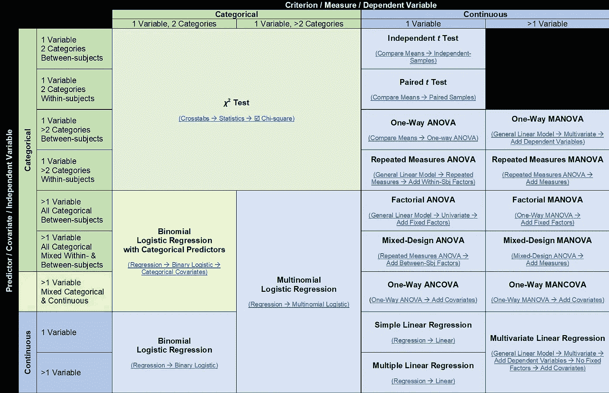

# 揭开统计分析 1 的神秘面纱:一份方便的备忘单

> 原文：<https://towardsdatascience.com/demystifying-statistical-analysis-1-a-handy-cheat-sheet-b6229bf992cf?source=collection_archive---------8----------------------->

选择使用的统计分析主要取决于数据集中的变量类型、需要进行分析的变量数量以及变量中的级别/类别数量。只要我们对正在处理的数据有很好的理解，选择使用的统计分析就不应该太令人生畏。

我一直想知道，为什么大多数统计教科书没有一个表格，汇总所有不同的统计分析，它们如何相互关联，以及何时使用它们。在互联网上快速搜索发现了许多类似的小抄，但没有一个以直观的方式呈现信息。

在我创建的备忘单中，行代表不同类型的自变量(也称为预测值或协变量)，而列代表不同类型的因变量(也称为标准或测量值)。然后，行和列的交叉点指示要使用的适当分析，每个分析下面的小文本显示了在 SPSS 中执行分析的快速步骤。

这篇文章是揭开统计分析神秘面纱系列文章的第一篇，我希望通过描绘不同统计分析之间的联系以及解释它们之间的差异，帮助简化对统计分析的理解。

***后续帖子已经在*** 媒体发布

 [## 揭秘统计分析 2:用线性回归表示的独立 t 检验

### 组比较分析，如独立 t 检验和方差分析可能看起来与线性回归很不一样，但…

medium.com](https://medium.com/@wyess/demystifying-statistical-analysis-2-the-independent-t-test-expressed-in-linear-regression-434a3b302289)  [## 揭秘统计分析 3:用线性回归表示的单因素方差分析

### 在本系列的前一部分中，我们研究了如何在线性回归中表达独立 t 检验…

medium.com](https://medium.com/@wyess/demystifying-statistical-analysis-3-the-one-way-anova-expressed-in-linear-regression-99269e84edd9)  [## 揭秘统计分析 4:用线性回归表示的因子方差分析

### 本系列的前一部分介绍了单向 ANOVA，我解释了如何进行分析…

medium.com](https://medium.com/@wyess/demystifying-statistical-analysis-4-the-factorial-anova-expressed-in-linear-regression-2e1920893ff0)  [## 揭秘统计分析 5:以线性回归表示的协方差

### 本系列的前一部分展示了当超过……时，如何在线性回归中表达阶乘方差分析

medium.com](https://medium.com/@wyess/demystifying-statistical-analysis-5-the-ancova-expressed-in-linear-regression-2996073f9f79) 

*原发布于:*[*https://learn curily . WordPress . com/2018/08/23/statistical-analysis-cheat-sheet*](https://learncuriously.wordpress.com/2018/08/23/statistical-analysis-cheat-sheet/)