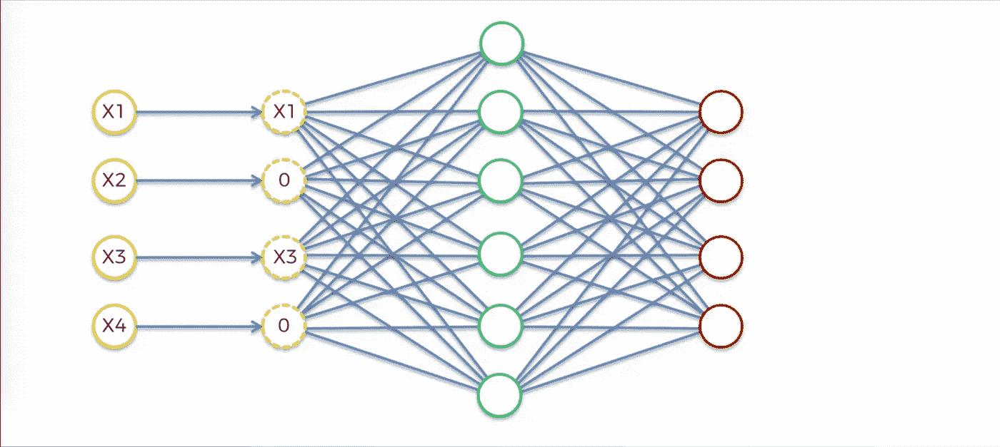

# 降噪自动编码器解释

> 原文：<https://towardsdatascience.com/denoising-autoencoders-explained-dbb82467fc2?source=collection_archive---------2----------------------->

上个月，我写了关于[变型自动编码器](https://medium.com/@dmonn/what-are-variational-autoencoders-a-simple-explanation-ea7dccafb0e3)和它们的一些用例。这次，我将看看另一种类型的自动编码器:去噪自动编码器，它能够重建损坏的数据。

自动编码器是通常用于特征选择和提取的神经网络。然而，当隐藏层中的节点多于输入时，网络冒着学习所谓的“恒等函数”(也称为“空函数”)的风险，这意味着输出等于输入，标志着自动编码器无用。

去噪自动编码器通过随机将一些输入值归零来故意破坏数据，从而解决了这个问题。通常，被设置为零的输入节点的百分比约为 50%。其他资料显示，这个数字可能更低，比如 30%。这取决于您拥有的数据量和输入节点。

Architecture of a DAE. Copyright by Kirill Eremenko ([Deep Learning A-Z™: Hands-On Artificial Neural Networks](https://www.udemy.com/deeplearning))

计算损失函数时，重要的是将输出值与原始输入进行比较，而不是与损坏的输入进行比较。这样，就消除了学习身份函数而不是提取特征的风险。

opendeep.org[发布了一个很棒的实现，他们使用 Theano 构建了一个非常基本的去噪自动编码器，并在 MNIST 数据集上训练它。OpenDeep 文章非常基础，是为初学者编写的。因此，即使您没有太多关于神经网络的经验，这篇文章也绝对值得一读！](http://www.opendeep.org/v0.0.5/docs/tutorial-your-first-model)

Original input, corrupted data and reconstructed data. Copyright by [opendeep.org](http://www.opendeep.org/v0.0.5/docs/tutorial-your-first-model).

去噪自动编码器是特征选择和提取的重要和关键工具，现在你知道它是什么了吧！享受并感谢阅读！