# 用带交互代码的神经网络去噪 CT 扫描第 3 部分，卷积残差神经网络[带 TF 的手动反推]

> 原文：<https://towardsdatascience.com/denosing-lung-ct-scans-using-neural-networks-with-interactive-code-part-3-convolutional-residual-6dbb36b28be?source=collection_archive---------9----------------------->

Image from [Pixel Bay](https://pixabay.com/en/woman-person-desktop-work-aerial-3187087/)

因此，由于我将使用大量的图像数据，我将转移到 Tensorflow 来利用 GPU 的力量。不过，不用担心，我们将实现所有的反向传播。(也将最终结果与自动微分进行比较)。由于期中考试，我不能做太多，所以我想到了简单的卷积残差神经网络。

最后，为了好玩，让我们使用不同类型的反向传播来比较什么给我们最好的结果。我们将要使用的不同类型的反向传播是…

a.[扩张反向传播](https://hackernoon.com/only-numpy-dilated-back-propagation-and-google-brains-gradient-noise-with-interactive-code-3a527fc8003c)

***注:所有的 DICOM 图像均来自*** [***癌症影像存档网***](http://www.cancerimagingarchive.net/) ***，如果您打算使用这些数据，请查阅他们的数据使用年龄政策。具体来说，我将使用来自*** [***的 DICOM 图像和【FDA】***](http://dx.doi.org/10.7937/K9/TCIA.2015.ORBJKMUX)***数据集。***

**残留块**

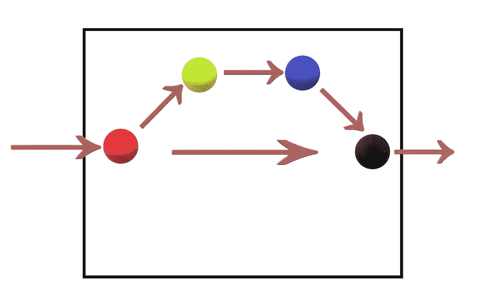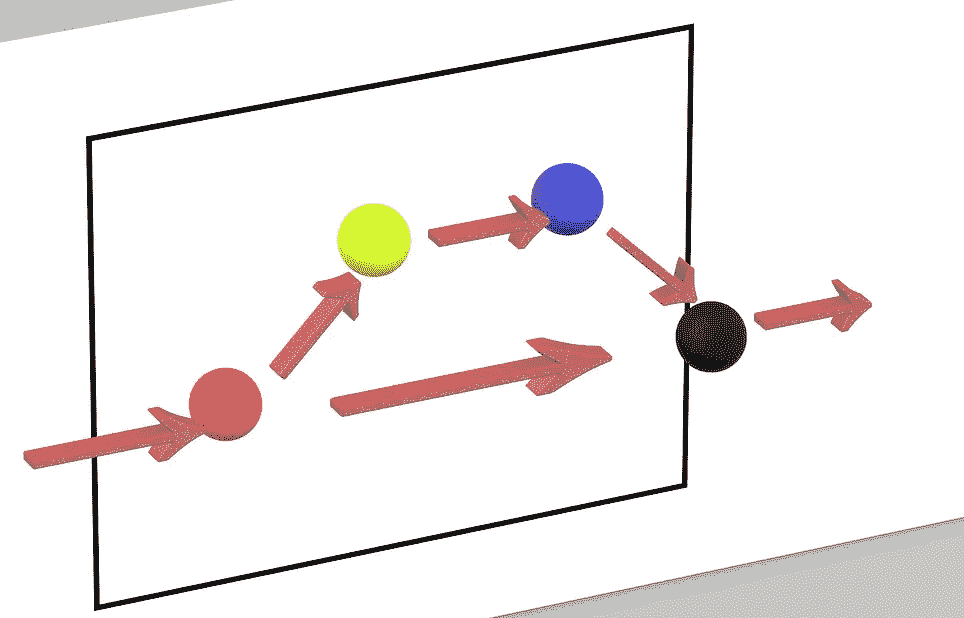

Front and Side View of Residual Block

**红圈** →输入到残差块
**绿圈** →输入上的卷积运算
**蓝圈** →卷积运算后应用的激活函数
**黑圈** →激活层 后应用 ***残差函数并将值传递给下一个块。(这在输入值和计算值之间建立了直接联系。)***

在深入研究网络架构之前，我将先解释一下我们网络的剩余块。我们的网络将会有剩余的块，在这些层里面将会看起来像上面一样。还有一件非常重要的事情我想在这里说明一下。

***残差函数可以是 1。乘法 2。附加 3。两者的混合物。***

记住这一点，让我们看看代码，下面是一个剩余块的屏幕截图，用乘法作为剩余函数。

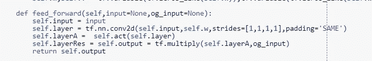

**网络架构/前馈操作**

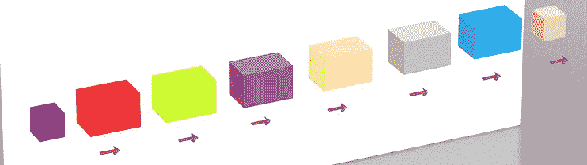

**黑色方块** →带噪声的 CT 肺部扫描输入图像
**粉色方块** →去噪后的 CT 肺部扫描输出图像
**其他块** →不同通道数的剩余块

因此前馈操作非常简单易懂，没有什么特别之处。

**剩余函数 1 2**

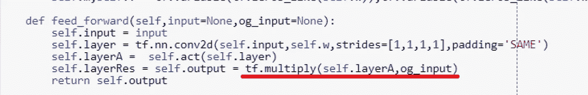

Feed Forward Operation with Residual Function 1

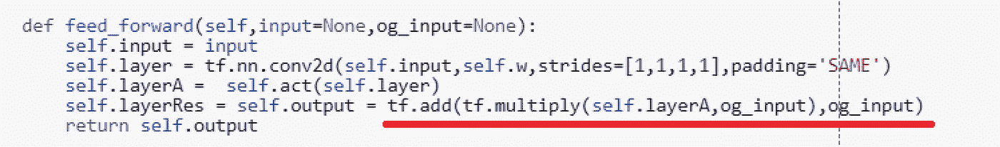

Feed Forward Operation with Residual Function 2

如上所述，(也正如我提到的)我们可以使用乘法或加法或两者的结合。在这个实验中，我要么用乘法，要么用加法加乘法。

**标准/扩张反向传播**

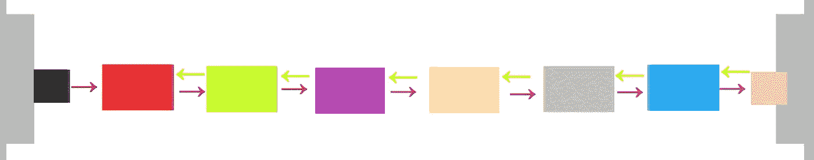

Standard Back Propagation

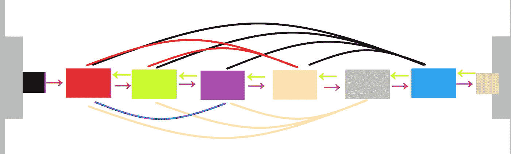

Densely Connected Dilated Back Propagation

**黄色箭头** →标准梯度流
**隔色箭头** →扩张梯度流

这里我们将使用扩张反向传播，看看它如何影响整体去噪操作。并与自动微分反向传播算法进行了比较。

**案例 1:手动 ADAM 反向传播残差函数 1**

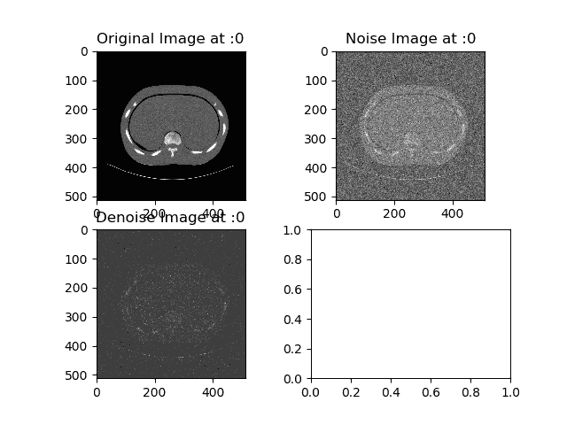

在这里，我使用了残差函数 1 和带有 ADAM 优化器的标准手动反向传播。网络似乎过滤掉了噪声，但是整体图像丢失了太多信息。

另外，请注意每张 GIF 都有不同数量的通道或激活功能，请点击这里进入我的 Github 页面。

**情况 2:手动 ADAM 反向传播残差函数 2**

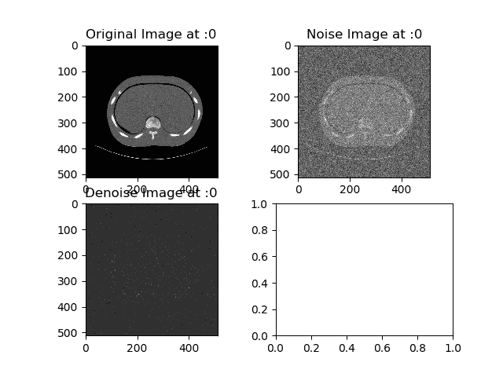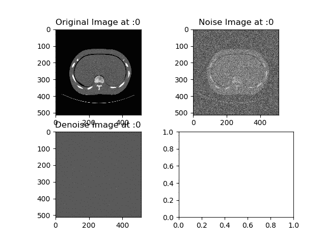

在这里，我使用了残差函数 2 和 ADAM optimizer 的标准手动反向传播。我认为这是一个彻底的失败，因为图像的“去噪”版本只是一片漆黑。

另外，请注意每张 GIF 都有不同数量的通道或激活功能，请点击这里查看我的 Github 页面。

**情况 3:手动扩张 ADAM 反向传播的残差函数 2**

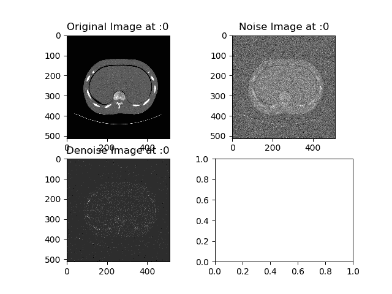

这里我使用了具有密集连接的扩张反向传播的剩余函数 2。现在最下面的 GIF 看起来效果还算不错。唯一的问题是，图像丢失了太多有用的信息。

另外，请注意每张 GIF 都有不同数量的通道或激活功能，请点击这里查看我的 Github 页面。

**情况 4:具有自动差分反向传播的残差函数 2**

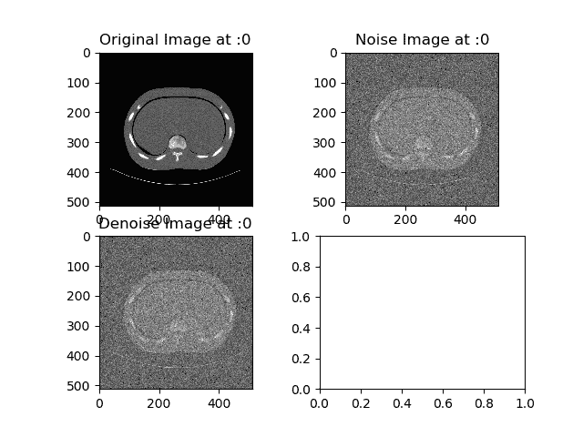

奇怪的是，当让 Tensorflow 为我们做反向传播时。似乎这个模型什么也没做。相当奇怪的行为，或者我做错了什么。(如果你在我的代码中发现错误，请在下面评论。)

另外，请注意每张 GIF 都有不同数量的通道或激活功能，请点击这里查看我的 Github 页面。

**互动码**

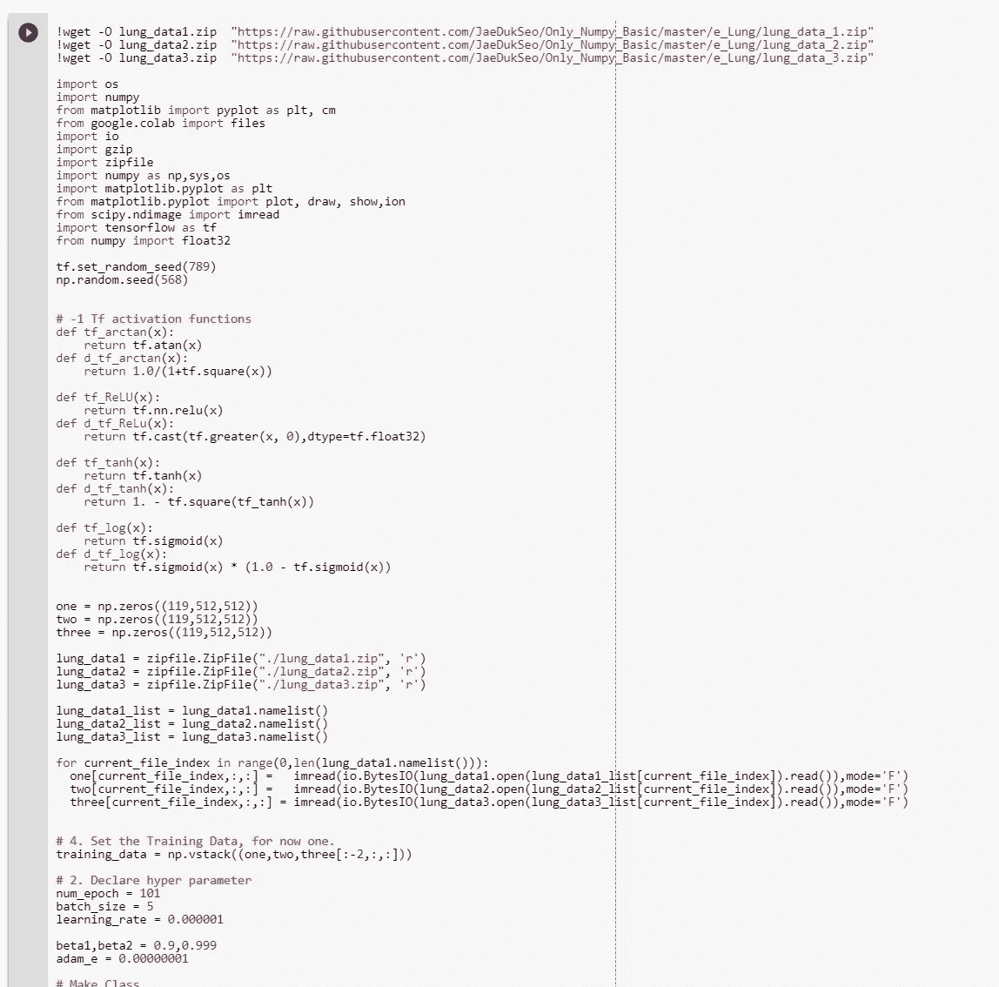

*我搬到了谷歌 Colab 寻找交互代码！所以你需要一个谷歌帐户来查看代码，你也不能在谷歌实验室运行只读脚本，所以在你的操场上做一个副本。最后，我永远不会请求允许访问你在 Google Drive 上的文件，仅供参考。编码快乐！*

要访问案例 1 的[代码，请点击此处](https://colab.research.google.com/drive/1gSaT-IqSmjU9NgjY3e-uAiJXYaly6DTL)。
要访问案例 2 的[代码，请点击此处](https://colab.research.google.com/drive/1fb3XL31JffBqqMwnY_tdbirNVFr95yQw)。(注意，我无法在 Google Colab 上分配足够的内存，所以我无法在线训练。)
要访问案例 3 的[代码，请点击此处](https://colab.research.google.com/drive/1rWmC96gicWouQwlsPe5eDyxeIWgnowxz)。(注意，我无法在 Google Colab 上分配足够的内存，所以我无法在线训练。)
要访问案例 4 的[代码，请点击此处](https://colab.research.google.com/drive/1mCpzK35hbh2scvQkDuHtq8tQkcqfTCIy)。(注意，我无法在 Google Colab 上分配足够的内存，所以我无法进行在线训练。)

*更新:3 月 1 日→所以忘了归一化最终输出 LOL 抱歉这是个如此业余的错误。这就是为什么图像看起来这么黑。我的主管建议查一下这个。通过适当的标准化，我能够获得扩张反向传播的结果。*

**最后的话**

在此之前，我实际上尝试了不同的模型，如香草甘，自动编码器甘和所有卷积甘，但他们实际上没有一个好结果。但我会用剩余的积木试一下。

如果发现任何错误，请发电子邮件到 jae.duk.seo@gmail.com 给我，如果你希望看到我所有写作的列表，请[在这里查看我的网站](https://jaedukseo.me/)。

同时，在我的 twitter 上关注我[这里](https://twitter.com/JaeDukSeo)，访问[我的网站](https://jaedukseo.me/)，或者我的 [Youtube 频道](https://www.youtube.com/c/JaeDukSeo)了解更多内容。如果你感兴趣的话，我还做了解耦神经网络[的比较。](https://becominghuman.ai/only-numpy-implementing-and-comparing-combination-of-google-brains-decoupled-neural-interfaces-6712e758c1af)

**参考**

1.  tf.nn.conv2d 在 tensorflow 中做什么？(未注明)。检索于 2018 年 2 月 26 日，来自[https://stack overflow . com/questions/34619177/what-does-TF-nn-conv2d-do-in-tensor flow](https://stackoverflow.com/questions/34619177/what-does-tf-nn-conv2d-do-in-tensorflow)
2.  在 TensorFlow / if 中编写分段函数，然后在 TensorFlow 中编写。(未注明)。检索于 2018 年 2 月 26 日，来自[https://stack overflow . com/questions/37980543/writing-piece-wise-functions-in-tensor flow-if-then-in-tensor flow](https://stackoverflow.com/questions/37980543/writing-piece-wise-functions-in-tensorflow-if-then-in-tensorflow)
3.  《tf.cast | TensorFlow》， *TensorFlow* ，2018。【在线】。可用:[https://www.tensorflow.org/api_docs/python/tf/cast.](https://www.tensorflow.org/api_docs/python/tf/cast.)【访问时间:2018 年 2 月 26 日】。
4.  tensor flow type 错误:传递给参数输入的值的数据类型 uint8 不在允许值列表中:float16，float32。(未注明)。检索于 2018 年 2 月 26 日，来自[https://stack overflow . com/questions/44822999/tensor flow-type error-value-passed-to-parameter-input-has-datatype-uint 8-not-in](https://stackoverflow.com/questions/44822999/tensorflow-typeerror-value-passed-to-parameter-input-has-datatype-uint8-not-in)
5.  Pylab_examples 示例代码:subplots_demo.py。(未注明)。检索于 2018 年 2 月 28 日，来自[https://matplotlib . org/examples/pylab _ examples/subplots _ demo . html](https://matplotlib.org/examples/pylab_examples/subplots_demo.html)
6.  [3]" TF . nn . conv 2d _ back prop _ filter | tensor flow "， *TensorFlow* ，2018。【在线】。可用:[https://www . tensor flow . org/API _ docs/python/TF/nn/conv 2d _ back prop _ filter。](https://www.tensorflow.org/api_docs/python/tf/nn/conv2d_backprop_filter.)【访问日期:2018 年 2 月 28 日】。
7.  " TF . nn . conv 2d _ back prop _ input(input _ sizes，filter，out_backprop，strides，padding，use_cudnn_on_gpu=None，data_format=None，name=None) | TensorFlow "， *TensorFlow* ，2018。【在线】。可用:[https://www . tensor flow . org/versions/r 1.0/API _ docs/python/TF/nn/conv2d _ back prop _ input。](https://www.tensorflow.org/versions/r1.0/api_docs/python/tf/nn/conv2d_backprop_input.)【访问时间:2018 年 2 月 28 日】。
8.  如何在 tensorflow 中置换 tranposition？(未注明)。检索于 2018 年 2 月 28 日，来自[https://stack overflow . com/questions/38517533/how-to-permutate-transposition-in-tensor flow](https://stackoverflow.com/questions/38517533/how-to-permutate-tranposition-in-tensorflow)