# 使用交互式代码的神经网络对肺部 CT 扫描进行去噪—第 4 部分，卷积 ResNet

> 原文：<https://towardsdatascience.com/denosing-lung-ct-scans-using-neural-networks-with-interactive-code-part-4-convolutional-resnet-74335714a4ae?source=collection_archive---------7----------------------->

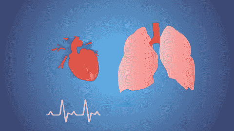

Gif from [here](https://giphy.com/gifs/heart-lungs-harvard-medical-school-r3hzLrZgiiqGs/download)

对肺部 CT 扫描进行降噪的另一种尝试，这次我们将使用更复杂的卷积 ResNet 架构。具体来说，我们将使用本文提出的架构，“[*深度残差学习进行图像识别*](https://arxiv.org/pdf/1512.03385.pdf) ”。同样，像往常一样，让我们做[手动反向传播](https://hackernoon.com/only-numpy-dilated-back-propagation-and-google-brains-gradient-noise-with-interactive-code-3a527fc8003c)来比较我们的结果。

**网络架构(图像形式)**

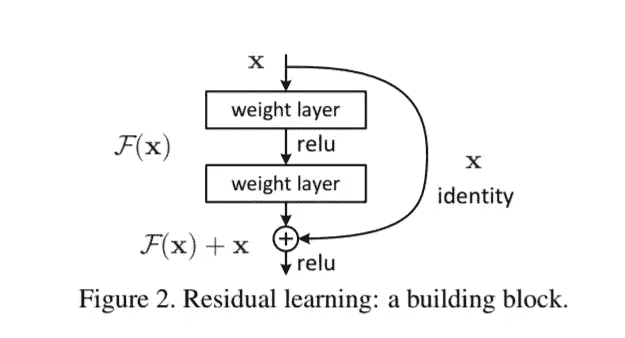

Image from this [paper](https://arxiv.org/pdf/1512.03385.pdf)

我不会详细讨论这个，因为这个建筑本身已经很有名了。但作为一个高层次的概述，我们将对每一层进行两次卷积运算，并将输入与输出相加。

然而，一个不同之处是，我们将添加第三个卷积操作来创建一个 ***瓶颈层*** 。下面我来解释一下。

**前馈操作/瓶颈层**

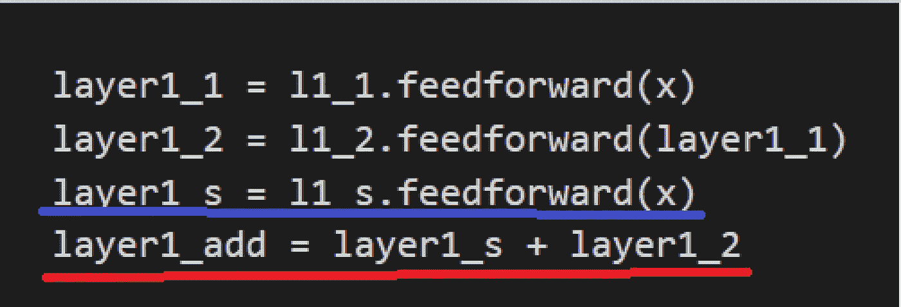

**蓝线→** 快捷层的前馈操作
**红线→** 添加过程输入(layer1_2)和快捷层(layer1_s)

这是原始建筑和我们的建筑的唯一区别。完整的网络架构请见下文。我们只有 3 个休息区。

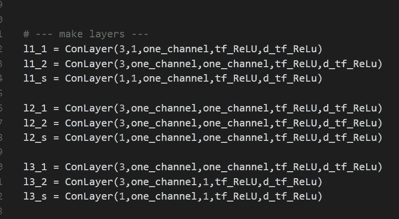

**实验设置**

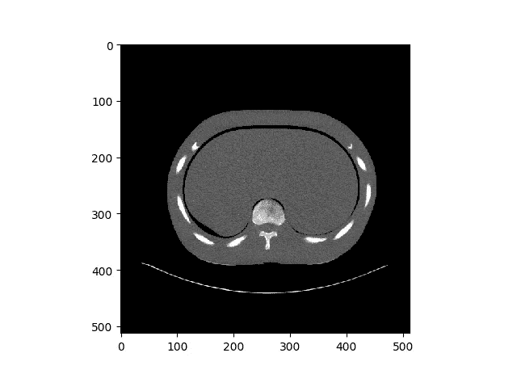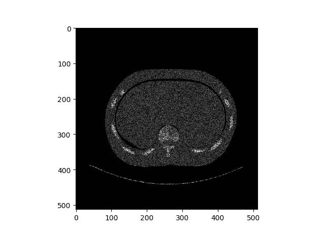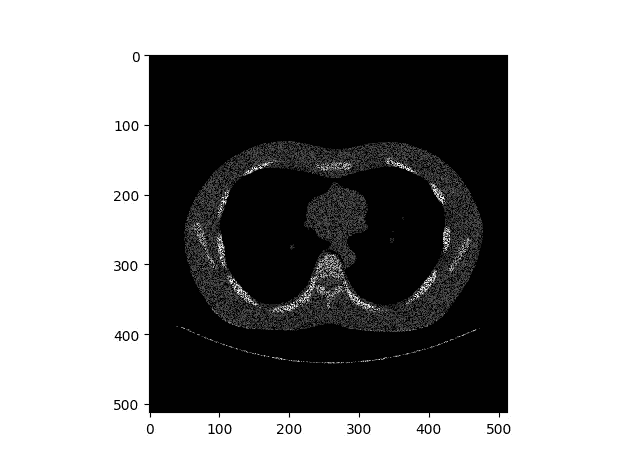

同样，实验设置非常简单，左边是原始图像，右边是被污染的图像。更具体地说，我添加了均匀分布噪声，我们可以通过下面的代码做到这一点。

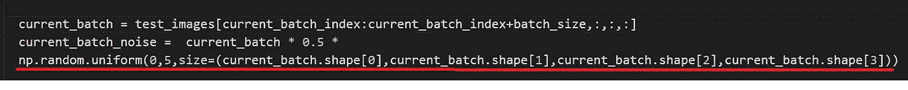

**红线** →创建一个我们将要添加到图像中的均匀噪声。

**结果(自动微分)**

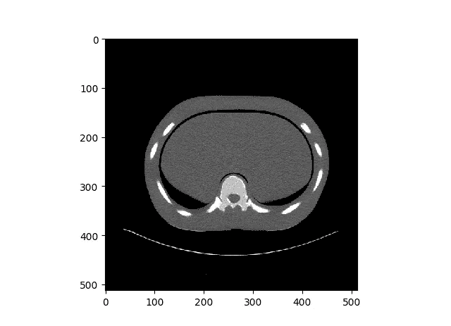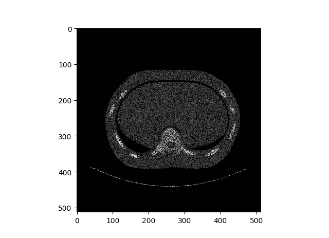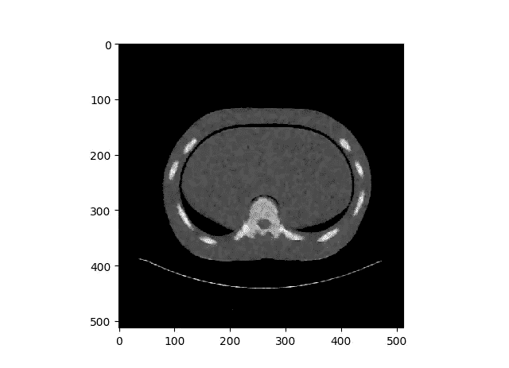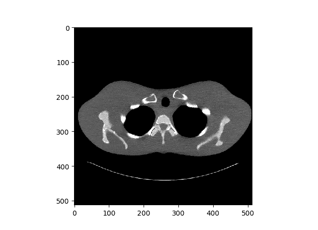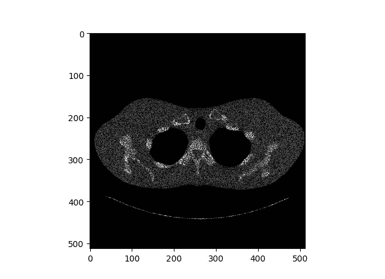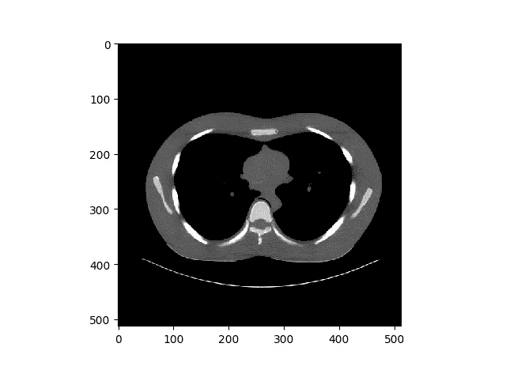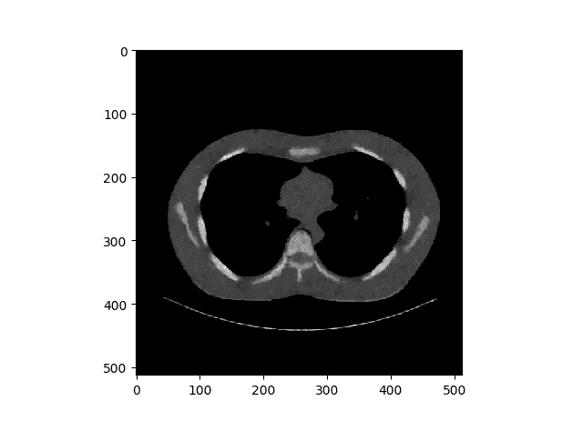

**左侧** →原始肺部 CT 扫描图像
**中间** →噪声分布均匀的污染图像
**右侧** →去噪图像

总的来说，网络似乎正确地对图像进行了去噪，但是产生的图像具有一些尖锐部分，使得图像位合成。

**结果(扩张反向传播)**

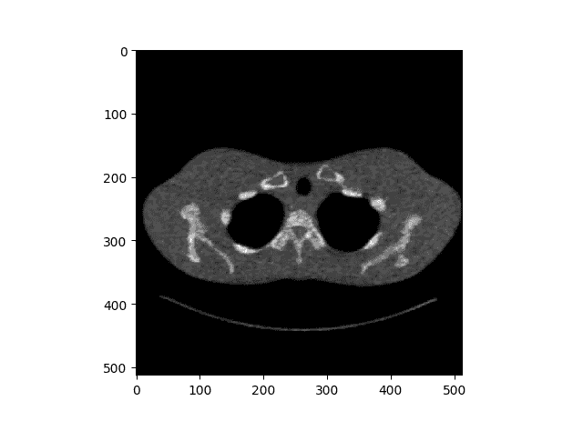

**左侧** →原始肺部 CT 扫描图像
**中间** →噪声分布均匀的污染图像
**右侧** →去噪图像

对于手动反向传播，图像没有填充空间。

**近看**

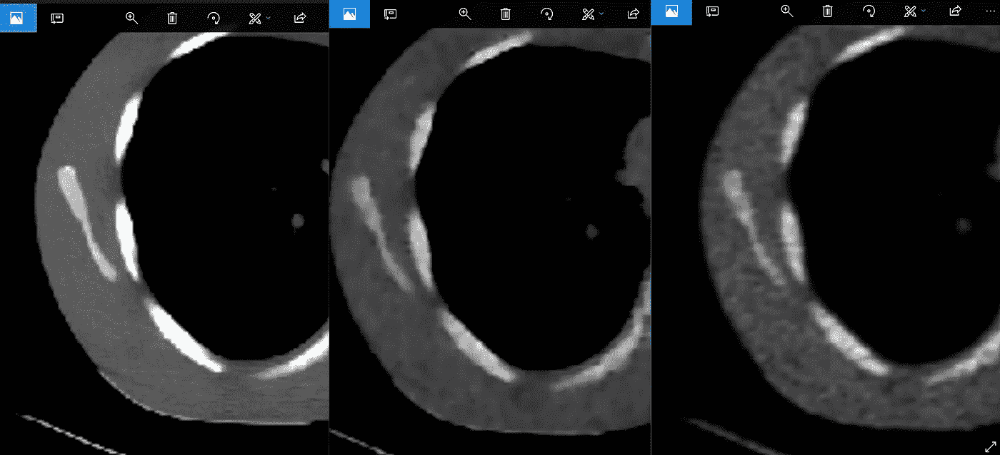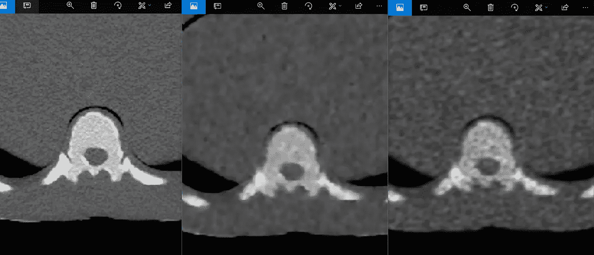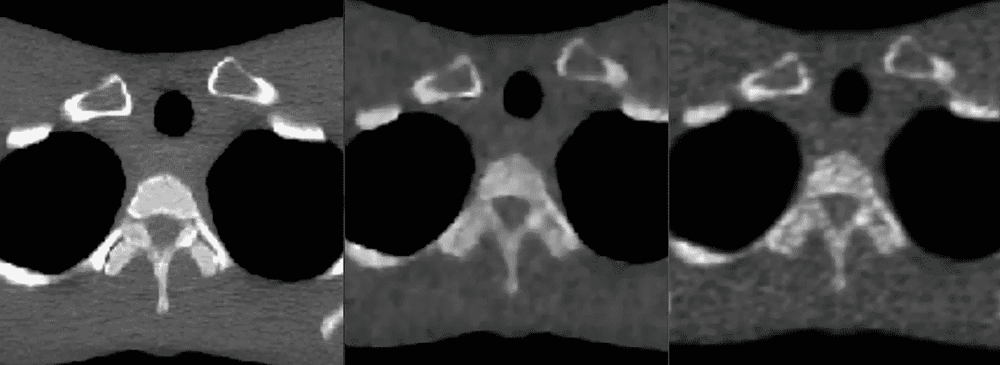

**左→** 原始图像
中→ 自动微分的结果图像
右→ 扩张反向传播的结果图像

当我们看到每张照片的特写时，我们可以清楚地看到大部分清晰的边缘细节都消失了。因此，传奇仍在继续……

**交互代码**

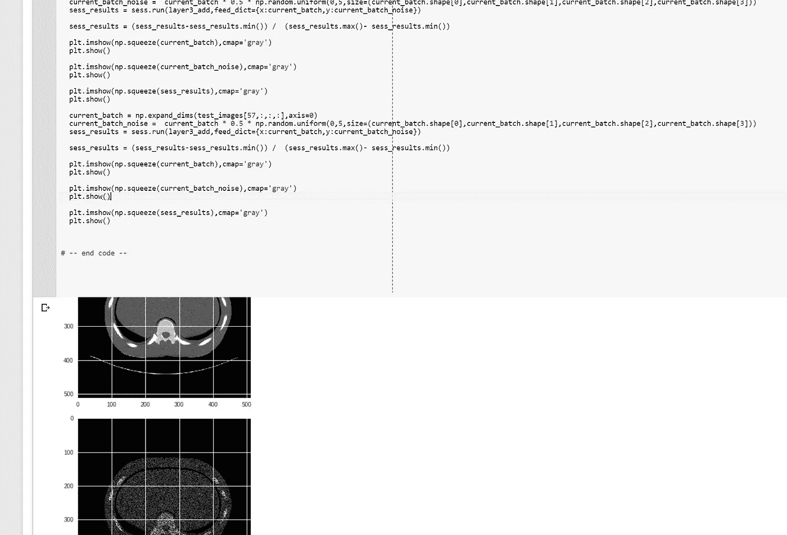

*对于 Google Colab，你需要一个 Google 帐户来查看代码，而且你不能在 Google Colab 中运行只读脚本，所以在你的游戏场上复制一份。最后，我永远不会请求允许访问你在 Google Drive 上的文件，仅供参考。编码快乐！*

要访问自动差异化模型[，请点击此处](https://colab.research.google.com/drive/1quTWUZBvqjgvLfF2Bddda3Ly4-48L1f-)。
要访问扩张后支柱型号[，请点击此处](https://colab.research.google.com/drive/1wSTQftOpX14uSdU0udCfQIbZgQEQHY7e)。

**遗言**

说实话，只要我能把这个帖子做成 LOL，我就想让这个传奇继续下去。我对新模型有一些想法

如果发现任何错误，请发电子邮件到 jae.duk.seo@gmail.com 给我，如果你想看我所有写作的列表，请在这里查看我的网站。

同时，在我的推特[这里](https://twitter.com/JaeDukSeo)关注我，访问[我的网站](https://jaedukseo.me/)，或者我的 [Youtube 频道](https://www.youtube.com/c/JaeDukSeo)了解更多内容。如果你感兴趣的话，我还做了解耦神经网络[的比较。](https://becominghuman.ai/only-numpy-implementing-and-comparing-combination-of-google-brains-decoupled-neural-interfaces-6712e758c1af)

**参考**

1.  只有 Numpy:扩张的反向传播和谷歌大脑的梯度噪声与交互代码。(2018).黑客正午。检索于 2018 年 3 月 30 日，来自[https://hacker noon . com/only-numpy-expanded-back-propagation-and-Google-brains-gradient-noise-with-interactive-code-3a 527 fc 8003 c](https://hackernoon.com/only-numpy-dilated-back-propagation-and-google-brains-gradient-noise-with-interactive-code-3a527fc8003c)
2.  贺，张，谢，任，孙，(2016)。用于图像识别的深度残差学习。IEEE 计算机视觉和模式识别会议论文集*(第 770–778 页)。*