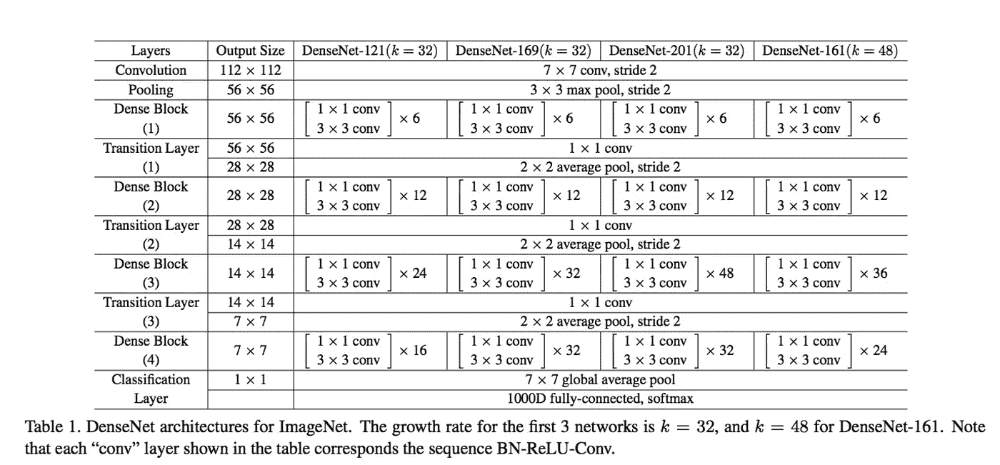
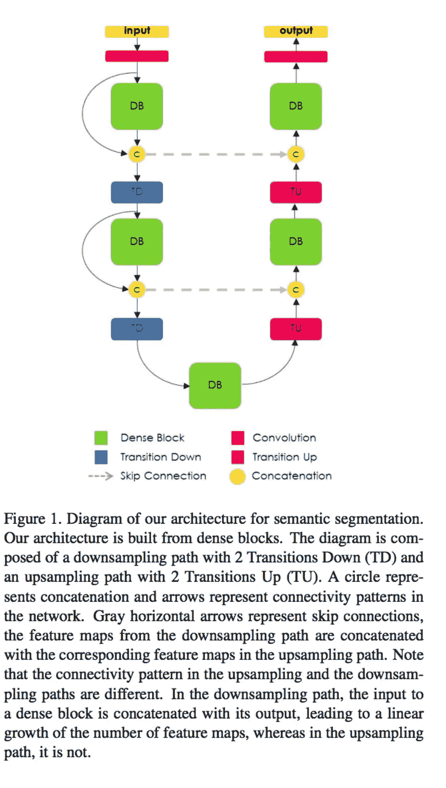
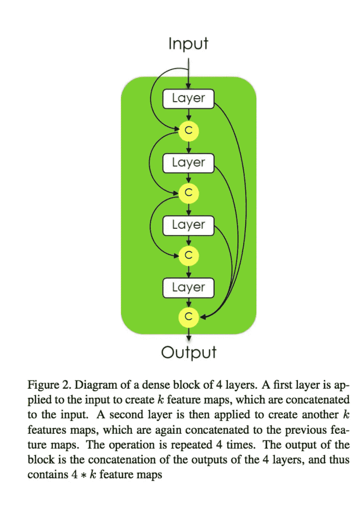
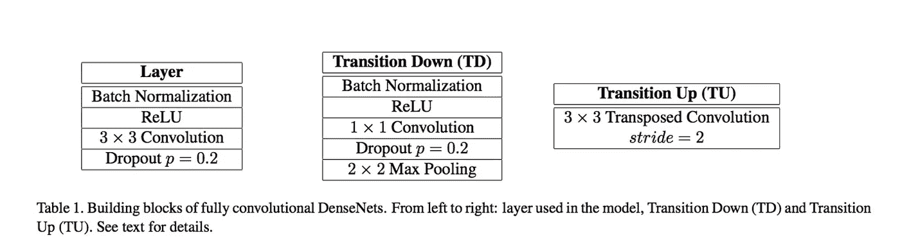
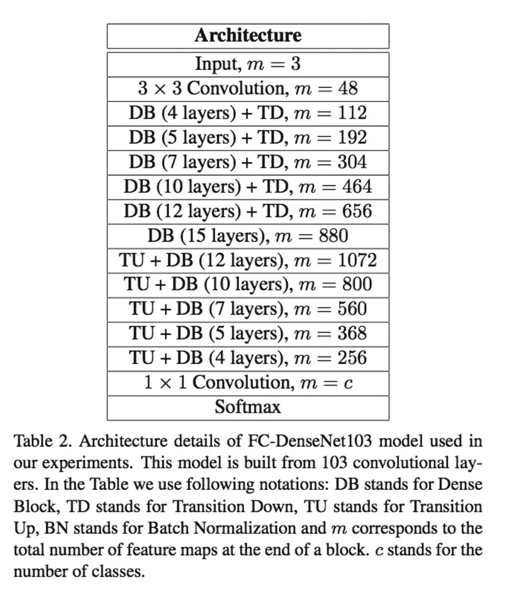

# DenseNet

> 原文：<https://towardsdatascience.com/densenet-2810936aeebb?source=collection_archive---------1----------------------->

许多论文:

DenseNet 原纸:[https://arxiv.org/pdf/1608.06993v3.pdf](https://arxiv.org/pdf/1608.06993v3.pdf)

DenseNet 语义分割:【https://arxiv.org/pdf/1611.09326v2.pdf 

光流 DenseNet:【https://arxiv.org/pdf/1707.06316v1.pdf 

DenseNet 架构是新的，它是 ResNet 的逻辑扩展。

ResNet 体系结构有一个基本的构建块(标识),您可以将以前的层合并(添加)到未来的层中。这里的推理是，通过添加加法合并，我们迫使网络学习残差(误差，即一些先前层和当前层之间的差异)。相比之下，DenseNet 论文提出连接来自先前层的输出，而不是使用求和。

## **DenseNet:**

最近的工作表明，如果卷积网络在靠近输入的层和靠近输出的层之间包含较短的连接，则卷积网络可以训练得更深入、更准确和有效。在本文中，我们接受这种观察，并介绍了密集卷积网络(DenseNet)，它以前馈方式将每一层与每一层连接起来。传统的 L 层卷积网络有 L 个连接——每层与其后续层之间有一个连接——而我们的网络有 L(L+1)/ 2 个直接连接。对于每一层，所有在前层的特征图被用作输入，并且它自己的特征图被用作所有后续层的输入。DenseNets 有几个引人注目的优点:它们缓解了消失梯度问题，加强了特征传播，鼓励特征重用，并大大减少了参数的数量。

这种密集连接模式的反直觉效果是，它比传统的卷积网络需要更少的参数，因为不需要重新学习冗余的特征映射。传统的前馈架构可以被视为具有状态的算法，该算法从一层传递到另一层。每一层从其前一层读取状态，并写入后续层。它改变了状态，但也传递了需要保存的信息。ResNets [11]通过附加的身份变换使这种信息保持显式化。ResNets [13]最近的变化表明，许多层贡献很小，实际上在训练期间可以随机丢弃。这使得 resnet 的状态类似于(展开的)递归神经网络[21]，但是 resnet 的参数数量要大得多，因为每层都有自己的权重。我们提出的 DenseNet 架构明确区分了添加到网络中的信息和保留的信息。DenseNet 层非常窄(例如，每层 12 个特征图)，仅将一小组特征图添加到网络的“集体知识”中，并保持其余的特征图不变，并且最终的分类器基于网络中的所有特征图做出决定。

除了更好的参数效率之外，DenseNets 的一大优势是改善了整个网络的信息流和梯度，这使得它们易于训练。每一层都可以直接访问损失函数和原始输入信号的梯度，从而实现隐含的深度监控[20]。这有助于训练更深层次的网络架构。此外，我们还观察到密集连接具有正则化效应，这减少了对较小训练集大小的任务的过度拟合。

连接由不同层学习的特征图增加了后续层输入的变化并提高了效率。这是 DenseNets 和 ResNets 的主要区别。与也连接来自不同层的特征的初始网络[35，36]相比，DenseNets 更简单和更有效。

每一层将它自己的 k 个特征地图添加到该状态。增长率决定了每一层对全局状态贡献多少新信息。全局状态一旦写入，就可以从网络内的任何地方访问，并且与传统的网络体系结构不同，不需要从一层复制到另一层

**瓶颈层**。虽然每个图层仅生成 k 个输出要素地图，但通常会有更多的输入。在[36，11]中已经指出，可以在每个 3×3 卷积之前引入 1×1 卷积作为瓶颈层，以减少输入特征图的数量，从而提高计算效率。我们发现这种设计对 DenseNet 特别有效，我们将具有这种瓶颈层的网络称为 DenseNet-B，即 h’的 BN-ReLU-conv(1× 1)-BN-ReLU-conv(3×3)版本。除非另有说明，否则在所有实验中，每个 1×1 卷积将输入减少到 4k 特征图。

**压缩**。为了进一步提高模型的紧凑性，我们可以减少过渡层的特征映射的数量。如果密集块包含 m 个特征映射，我们让下面的过渡层生成 bθmc 输出特征映射，其中 0 < θ ≤1 被称为压缩因子。当θ = 1 时，过渡层上的特征映射数保持不变。我们将θ <为 1 的 DenseNet 称为 DenseNet-C，我们在实验中设置θ = 0.5。当使用θ < 1 的瓶颈层和过渡层时，我们将我们的模型称为 DenseNet-BC。

从表面上看，DenseNets 与 resnet:Eq 非常相似。(2)不同于等式。(1)仅仅在于 h `()的输入被连接而不是求和。然而，这个看似很小的修改会导致两种网络体系结构的本质上不同的行为。

模型紧凑性。作为输入连接的直接结果，由任何 DenseNet 层学习的特征映射可以被所有后续层访问。这鼓励了整个网络中的特征重用，并导致更紧凑的模型。

隐性深度监管。对密集卷积网络精度提高的一种解释可能是，单个层通过较短的连接从损失函数接收额外的监督。人们可以将 DenseNets 解释为执行一种“深度监督”。深度监督的好处之前已经在深度监督网络(DSN[20])，其具有附加到每个隐藏层的分类器，加强中间层以学习区别特征。DenseNets 以隐含的方式执行类似的深度监督:网络顶部的单个分类器通过最多两到三个过渡层向所有层提供直接监督。然而，DenseNets 的损失函数和梯度基本上不太复杂，因为所有层之间共享相同的损失函数。

## DenseNet 语义分段:

这篇论文有趣的标题是:一百层提拉米苏

语义图像分割的最新方法建立在卷积神经网络(CNN)的基础上。典型的分割架构包括(a)负责提取粗略语义特征的下采样路径，随后是(b)被训练以在模型的输出端恢复输入图像分辨率的上采样路径，以及可选的后处理模块(例如，条件随机场)以改进模型预测。最近，一种新的 CNN 架构，密集连接卷积网络(DenseNets)，在图像分类任务上表现出了优异的结果。DenseNets 的想法是基于这样的观察，即如果每一层都以前馈方式直接连接到其他每一层，那么网络将更精确，更容易训练。在本文中，我们扩展 DenseNets 来处理语义分割问题

最近，在[12]中引入了一种新的 CNN 架构，称为 DenseNet。DenseNets 由密集块和池操作构建而成，其中每个密集块都是先前特征映射的迭代串联。这种架构可以看作是 ResNets [10]的扩展，它对以前的特征图进行迭代求和。然而，这个小的修改有一些有趣的含义:(1)参数效率，DenseNets 在参数使用上更有效；(2)隐式深度监督，DenseNets 由于到架构中所有特征地图的短路径而执行深度监督(类似于深度监督网络[17])；以及(3)特征重用，所有层可以容易地访问它们的前一层，使得重用来自先前计算的特征地图的信息变得容易。DenseNets 的特性使它们非常适合语义分割，因为它们自然地导致跳过连接和多尺度监督

在本文中，我们通过添加上采样路径来恢复完整的输入分辨率，从而将 DenseNets 扩展为 fcn。天真地构建上采样路径将导致在 softmax 层之前具有非常高分辨率的大量计算上难以处理的特征地图。这是因为人们会将高分辨率特征图与大量输入过滤器(来自下面的所有层)相乘，导致非常大的计算量和参数数量。为了减轻这种影响，我们仅对由前面的密集块创建的特征地图进行上采样。这样做允许在上采样路径的每个分辨率下具有多个密集块，而与汇集层的数量无关。此外，在给定网络架构的情况下，上采样的密集块组合了相同分辨率的其他密集块中包含的信息。借助于下采样和上采样路径之间的标准跳跃连接来传递更高分辨率的信息。

因此，本文的贡献可以概括如下:

1.  我们小心地将 DenseNet 架构[12]扩展到全卷积网络进行语义分割，同时减轻了特征图爆炸。
2.  我们强调，从密集块构建的建议上采样路径比具有更多标准操作的上采样路径执行得更好，例如[26]中的操作。
3.  我们表明，这种网络可以在不使用预训练参数或任何进一步后处理的情况下，在城市场景理解的标准基准上胜过当前最先进的结果

fcn 由下采样路径、上采样路径和跳过连接构成。通过重用要素地图，跳过连接有助于上采样路径从下采样路径恢复空间详细信息。我们模型的目标是通过扩展更复杂的 DenseNet 架构来进一步利用特征重用，同时避免网络上采样路径的特征爆炸

**全卷积密度网络**

fcn 由下采样路径、上采样路径和跳过连接构成。通过重用要素地图，跳过连接有助于上采样路径从下采样路径恢复空间详细信息。我们的模型的目标是通过扩展更复杂的 DenseNet 架构来进一步利用功能重用，同时避免网络的上采样路径中的功能爆炸。

在我们的全卷积 DenseNet (FC-DenseNet)的下采样路径中。合并操作后，每个要素地图空间分辨率的降低会补偿要素数量的线性增长。下采样路径的最后一层被称为瓶颈。

为了恢复输入空间分辨率，FCNs 引入了由卷积、上采样操作(转置卷积或非卷积操作)和跳过连接组成的上采样路径。在 FC-DenseNets 中，我们用密集块和称为向上过渡的向上采样操作来代替卷积操作。向上过渡模块由转置卷积组成，该卷积对先前的特征图进行向上采样。然后，上采样的特征映射被连接到来自跳过连接的特征映射，以形成新的密集块的输入。由于上采样路径提高了特征地图的空间分辨率，因此特征数量的线性增长会对内存要求过高，尤其是对于 softmax 之前图层中的全分辨率特征。为了克服这个限制，密集块的输入不与其输出连接。因此，转置卷积仅应用于由最后一个密集块获得的特征图，而不是到目前为止连接的所有特征图。最后一个密集块以相同的分辨率总结了所有先前密集块中包含的信息。请注意，在向下转换时，由于池化操作，来自早期密集块的一些信息会丢失。然而，该信息在网络的下采样路径中是可用的，并且可以通过跳跃连接来传递。因此，使用给定分辨率下的所有可用特征图来计算上采样路径的密集块

**语义分割架构**

首先，在表 1 中，我们定义了该架构的密集块层、向下转换和向上转换。密集块层由 BN 组成，后面是 ReLU，一个 3 × 3 相同的卷积(无分辨率损失)和概率 p = 0.2 的 dropout。该层的生长率被设置为 k = 16。Transition down 由 BN、ReLU(1×1 卷积)、p = 0.2 的 dropout 和大小为 2 × 2 的非重叠最大池组成。向上转换由步长为 2 的 3 × 3 转置卷积组成，以补偿合并操作。

其次，在表 2 中，我们总结了所有 Dense103 层。这种架构由 103 个卷积层构成:第一层在输入端，38 层在下采样路径中，15 层在瓶颈处，38 层在上采样路径中。我们使用 5 个向下转换(TD ),每个包含一个额外卷积，以及 5 个向上转换(TU ),每个包含一个转置卷积。网络的最后一层是 1 × 1 卷积，之后是 softmax 非线性，以提供每个像素的每类分布。值得注意的是，如第 3.2 小节所述，所提出的上采样路径适当地缓解了 DenseNet 特征地图爆炸，导致合理的前 softmax 特征地图数量为 256。**最后，通过最小化逐像素交叉熵损失来训练模型。**

在本文中，我们扩展了 DenseNets 并使其完全卷积，以解决语义图像分割问题。DenseNets 背后的主要思想是在执行特征映射的迭代连接的密集块中捕获的。我们设计了一个上采样路径来缓解 DenseNets 的简单扩展中出现的特征图的线性增长。最终的网络非常深(从 56 层到 103 层),参数非常少，大约是最先进模型的 10 倍。此外，它提高了具有挑战性的城市场景理解数据集(CamVid 和 Gatech)的最新性能，既没有额外的后处理、预训练，也没有包括时态信息。

## 用于光流的 DenseNet:

FlowNetS 是一种传统的 CNN 架构，由收缩部分和扩展部分组成。给定相邻帧作为输入，收缩部分使用一系列卷积层来提取高级语义特征，而扩展部分试图通过连续的去卷积来预测原始图像分辨率下的光流。在这两者之间，它使用跳过连接[8]来提供来自较低层特征地图的精细图像细节。这种通用的管道、收缩、扩展、跳过连接被广泛用于每像素预测问题，例如语义分割[9]、深度估计[10]、视频着色[11]等。

然而，跳过连接是组合粗糙语义特征和精细图像细节的简单策略；他们不参与学习过程。我们所期望的是保持高频图像细节直到网络的末端，以便提供隐含的深度监督。简而言之，我们希望确保网络中各层之间的最大信息流。

DenseNet [12]是最近提出的 CNN 架构，它有一个有趣的连接模式:在一个密集的块中，每一层都与所有其他层相连。在这种情况下，所有图层都可以从其之前的图层访问要素地图，这有助于大量的要素重用。直接的结果是，模型更加紧凑，不容易过度拟合。此外，每个单独的层通过捷径路径接收来自损失函数的直接监督，这提供了隐含的深度监督。所有这些良好的特性使得 DenseNet 非常适合每像素预测问题。有一项并行工作使用 DenseNet 进行语义分割[9]，它无需预训练或额外的后处理即可实现最先进的性能。然而，估计光流不同于语义分割。我们将在第 3 节说明不同之处。在本文中，我们提出使用 DenseNet 进行光流预测。我们的贡献是双重的。首先，我们将当前的 DenseNet 扩展到完全卷积网络。我们的模型是完全无监督的，并且实现了接近监督方法的性能。第二，我们根据经验表明，在扩展部分用密集块替换卷积会产生更好的性能。

**无监督运动估计:**监督方法采用 CNN 的合成数据集来学习光流预测。然而，合成的运动/场景与真实世界的运动/场景非常不同，因此限制了学习模型的可推广性。此外，即使构建合成数据集也需要大量的人工工作[3]。因此，无监督学习是自然病态运动估计问题的理想选择。回想一下，无监督方法[6]将光流估计视为图像重建问题。直觉是，如果我们可以使用预测的流量和下一帧来重建前一帧，我们的网络正在学习关于潜在运动的有用表示。具体来说，我们将重构的前一帧表示为 I 0 1。

目标是最小化前一帧 I1 和反向扭曲的下一帧 I 0 1 之间的光度误差: