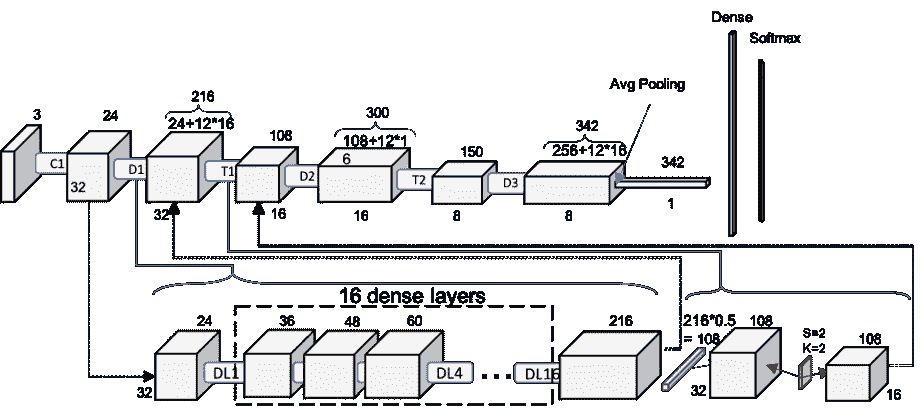
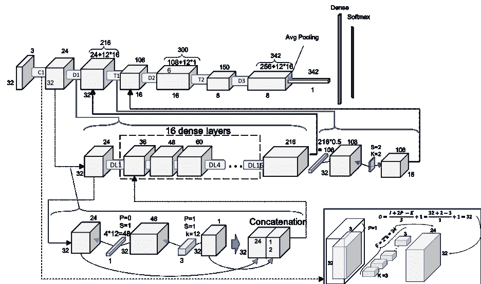
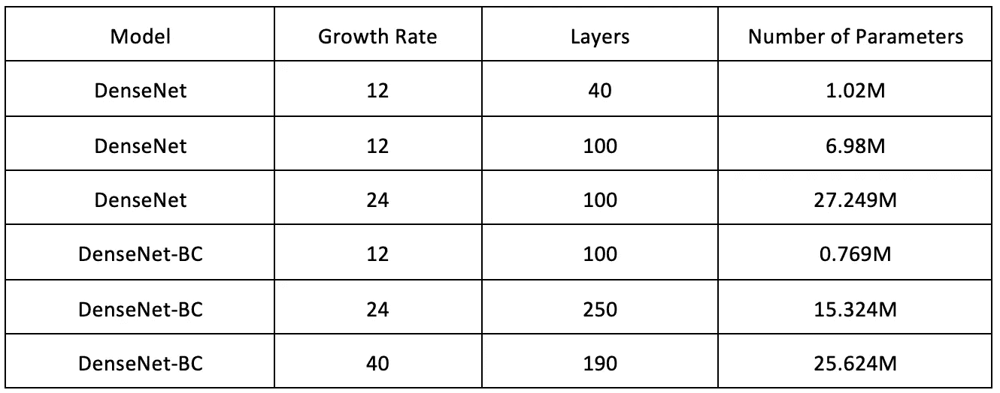

# CIFAR10 上的 DenseNet

> 原文：<https://towardsdatascience.com/densenet-on-cifar10-d5651294a1a8?source=collection_archive---------11----------------------->

这篇文章可以在 PDF [这里](http://www.pabloruizruiz10.com/resources/CNNs/DenseNets.pdf)下载。

这是关于 CNN 架构的[系列教程的一部分](https://medium.com/@pabloruizruiz/deep-convolutional-neural-networks-ccf96f830178)。

主要目的是在应用于 CIFAR-10 数据集时提供理解 DenseNets 的洞察力。

*   对于 DenseNets 应用于 ImageNet，这是一个更深入的教程，有另一个教程[在这里](https://medium.com/@pabloruizruiz/understanding-and-visualizing-densenets-7f688092391a)。
*   在这里找到[构建这些架构的代码:](https://github.com/PabloRR100/Convolutional-Neural-Networks/blob/master/3_DenseNets/densenets_Paper.py)

**索引**

*   介绍
*   结构
*   卷积 1
*   密集块
*   过渡块
*   致密层
*   摘要

# 介绍

这项工作是[之前教程](https://medium.com/@pabloruizruiz/understanding-and-visualizing-densenets-7f688092391a)的延续，在那里我们在[原始论文](https://arxiv.org/pdf/1608.06993.pdf)之后揭开了 DenseNet 的神秘面纱。但是，这种结构是为了在 ImageNet 数据集上运行良好而构建的。

ImageNet 数据集由属于 1000 个不同类别的一组大小(224x224)的图像(作者使用了 128 万幅训练图像、5 万幅验证图像和 10 万幅测试图像)组成。但是，CIFAR10 由一组不同的映像(45k 训练映像、5k 验证映像和 10k 测试映像)组成，这些映像分布在 10 个不同的类别中。

因为输入体积(图像)的大小完全不同，所以很容易认为相同的结构不适合在该数据集上训练。我们无法在没有维度不匹配的情况下对数据集执行相同的缩减。

我们将遵循作者给出的解决方案(让 DenseNets 在 CIFAR10 上进行训练，以构建具有 100 个层和 12 的增长因子的 DenseNet-BC)，这也像 ImageNet 数据集一样难以遵循。在论文[1]的第 ***3 节 DenseNet—实现细节*** 中，提供了为 CIFAR10 构建 dense net 的配置。

让我们按照他们给出的字面解释来构造 DenseNets。最重要的是，**对于 CIFAR10 实施，有 3 个 DenseBlock**，而不是 4 个，**，每个 dense block 中的 DenseLayers 数量相等。**因为作者给出的参数是网络的总层数 *L* ，所以我们计算每个密集块中需要包含多少个密集层才能达到该配置。被压缩系数为*θ*:

移除 4 层的原因是因为我们只需要考虑那些属于密集块的层。此外，压缩在过渡层引入了一种新的操作(第一个 1x1 卷积，如我们在原始作品中看到的)

因此，对于 100 层 DenseNet-BC，每个 DenseBlock 将由 16 个密集层组成。由于我们将在“DenseNet-Layers-GrowthRate”之后调用 DenseNet，因此本文中涉及的 DenseNet 对应于 dense net-100–12。

# 结构

遵循之前关于 DenseNets 工作的相同方法，让我们先看一下整体情况，然后再一层一层地深入细节。

Figure 1\. Scheme DenseNet-100–12 on CIFAR10

揭开 ResNet-121 的神秘面纱后，图 1 看起来已经很熟悉了。我们可以观察到相同的模式，第一个单卷积层，然后是两对密集块—过渡块对，第三个密集块，然后是全局平均池，以将其减少到 1x1x342 矢量，从而提供给密集层。

# 卷积 1

在进入第一个密集块之前，DenseNet 的第一步是一个 3×3 卷积和一个批处理归一化操作。步幅为 1，填充为 1，以使输出大小与输入大小相匹配。请注意，我们与 DenseNet for ImageNet 的第一个重大区别是，我们没有在第一个块中包括 max pooling 操作，以减少输入卷的维数。

Figure 2\. Conv1

我们可以从图 2 中看出，Conv1 的输出音量确实是 32x32x24。下一步是将这个新卷作为输入引入下面的密集数据块 1 (D1)。

# 密集块

致密块(DB)由 16 个致密层组成，如之前对 dense net-BC-100–12 的计算。

Figure 3\. One level deeper look at Dense-100–12\. Dense Block and Transition Block. DLx: Dense Layer x

图 3 表示了一个简化的版本，因为 16 个块在一个图像中压缩太多了，但是我们可以看到特征图的数量是如何以增长率增加的，每次 12 个(24、36、48……)。因为有 16 层，DB1 的最终体积将是 216。

# 过渡块

两个 db 之间的过渡块(TB)充当下采样，通过合并步幅= 2、核大小= 2 和填充= 1，将特征图的数量减少一半(θ= 0.5)，并且还将特征图的大小减少一半。

# 致密层

我们只需要看看数据库中发生了什么，以确认为什么特征地图的大小增加了*(增长率*密集图层的数量)/ 2* —查看 D1 是如何从 24 增加到 216 的—而特征地图的大小保持不变。

Figure 4\. 2nd level deep. Full schematic representation of DenseNet-BC-100–12

可以检查每个密集层(DL)如何以 4 *过滤器数量的增长率执行 1x1 卷积。数字 4 是作者在论文中给出的，大多数知识库称之为 bn_size(瓶颈层数的乘法因子)。这个 1x1 卷积在 3x3 卷积之前应用线性变换，滤波器的数量是增长率。

查看第二个卷积如何唯一负责连接的过滤器贴图的数量，因此它在连接它们之后完美地匹配增长率配置。每个 DL 都向它们的输入卷添加 k 个新的特征地图。这再次证实了为什么致密块体增加了*增长率*致密层数*。

# 摘要

通过改变图 1 中 *n* 的值，遵循作者建立的解释规则的结果产生以下结构:

Table 1\. DenseNets architectures for CIFAR-10

请注意，直观地说，这些架构与在 ImageNet 的[工作结束时展示的 ImageNet 架构并不匹配。](https://medium.com/@pabloruizruiz/understanding-and-visualizing-densenets-7f688092391a)

在这里找到[构建这些架构的代码](https://github.com/PabloRR100/Convolutional-Neural-Networks/blob/master/3_DenseNets/densenets_Paper.py):