# 一种基于密度的离群点检测算法

> 原文：<https://towardsdatascience.com/density-based-algorithm-for-outlier-detection-8f278d2f7983?source=collection_archive---------2----------------------->

离群点检测(也称为异常检测)是发现行为与预期非常不同的数据对象的过程。这种对象被称为异常值或异常值。最有趣的物体是那些明显偏离正常物体的物体。离群值不是由与其余数据相同的机制生成的。
异常值检测在许多应用中非常重要，例如:

*   通信网络中的入侵
*   财务数据中的欺诈
*   假新闻和错误信息
*   医疗保健分析
*   工业损伤检测
*   安全和监控
*   等等

离群点检测和聚类分析是两个高度相关的任务。聚类发现数据集中的大多数模式，并相应地组织数据，而异常值检测试图捕获那些与大多数模式有很大差异的异常情况。

在本文中，我将介绍离群点检测的基本方法，并重点介绍一类基于邻近度的方法。此外，我将提供一个 LOF 算法的代码实现。

Nassim taleb is an inventor of [Black Swan theory](https://en.wikipedia.org/wiki/Black_Swan_theory) — extreme impact of rare and unpredictable [outlier](https://en.wikipedia.org/wiki/Outlier) event and the human tendency to find simplistic explanations for these events, retrospectively.

## 离群值和噪声数据

首先，你需要从嘈杂的数据中分辨出离群值。

在应用异常值检测时，应该去除噪声。它可能会扭曲正常对象，模糊正常对象和异常值之间的区别。这可能有助于隐藏异常值并降低异常值检测的有效性。例如，如果用户考虑购买比他以前通常购买的更贵的午餐，这种行为应该被视为“噪声交易”，如“随机误差”或“方差”。

# 异常值的类型

一般来说，离群值可以分为三类，即全局离群值、上下文(或条件)离群值和集体离群值。

*   全局异常值-对象明显偏离数据集的其余部分
*   上下文异常值—对象根据选定的上下文显著偏离。例如，28⁰C 是莫斯科冬天的异常值，但在另一种情况下不是异常值，28⁰C 不是莫斯科夏天的异常值。
*   集体离群值—数据对象的子集集体显著偏离整个数据集，即使单个数据对象可能不是离群值。例如，一个小团体在短时间内大量交易同一只股票，可以被认为是操纵市场的证据。

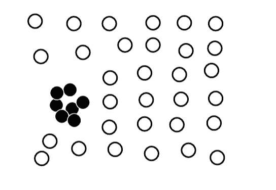

Collective outlier.

通常，一个数据集可能包含不同类型的异常值，同时可能属于不止一种异常值。

# 离群点检测方法

在文献中有许多离群点检测方法，并在实践中使用。首先，离群点检测方法根据用于分析的数据样本是否具有领域专家提供的标签而不同，这些标签可用于建立离群点检测模型。第二，方法可以根据它们对正常对象和异常值的假设分成不同的组。

如果可以获得正常和/或异常对象的专家标记的示例，则它们可以用于建立异常检测模型。使用的方法可分为监督方法、半监督方法和非监督方法。

## 监督方法

我们将异常检测建模为一个分类问题。领域专家检查的样本用于培训和测试。

挑战:

*   阶级不平衡。也就是说，异常值的总体通常比正常对象的总体小得多。可以使用处理不平衡类的方法，例如过采样。
*   捕捉尽可能多的异常值，即召回比准确性更重要(即不要将正常对象误标为异常值)

## 无监督方法

在某些应用场景中，标记为“正常”或“异常值”的对象不可用。因此，必须使用无监督的学习方法。无监督的离群点检测方法做出了一个隐含的假设:正常对象在某种程度上是“聚集的”换句话说，无监督离群点检测方法期望正常对象比离群点更频繁地遵循一种模式。

挑战:

*   正常对象可能不共享任何强模式，但是集体离群值可能在小区域中共享高相似性
*   如果正常活动是多样的并且不属于高质量的聚类，则无监督的方法可能具有高的假阳性率，并且可能让许多实际的异常值未被检测到。

最新的非监督方法开发了智能思想，直接处理离群值，而无需显式检测聚类。

## 半监督方法

在许多应用中，虽然获得一些标记的例子是可行的，但是这种标记的例子的数量通常很少。如果一些带标签的正常对象可用:

*   使用已标记的示例和最接近的未标记对象来训练正常对象的模型
*   不符合正常对象模型的那些被检测为异常值

如果只有一些标记异常值可用，少量的标记异常值可能无法很好地覆盖可能的异常值。

# 统计方法

统计方法(也称为基于模型的方法)假设正态数据遵循某种统计模型(随机模型)。其思想是学习适合给定数据集的生成模型，然后将模型的低概率区域中的对象识别为异常值。

## 参数方法

参数方法假设正态数据对象是由具有参数𝜃.的参数分布生成的参数分布 *f(x，* 𝜃 *)* 的概率密度函数给出了对象 *x* 由该分布生成的概率。该值越小， *x* 越有可能是异常值。

对于随机模型，正常对象出现在高概率区域，低概率区域的对象是异常值。

统计方法的有效性高度依赖于对分布的假设。

例如，考虑具有正态分布的单变量数据。我们将使用最大似然法检测异常值。

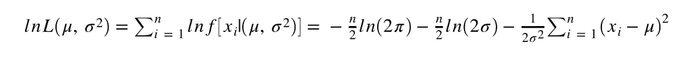

Maximum likelihood methods to estimate the parameter 𝜇 and 𝜎

对𝜇和𝜎求导，并求解一阶条件的结果系统，得到以下最大似然估计

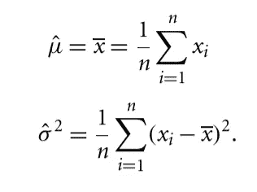

Maximum likelihood estimates of 𝜇 and 𝜎²

偏离值最大的是 24⁰，偏离平均值 4.61。我们知道𝜇 +/- 3𝜎地区包含了正态分布假设下的 97%的数据。因为 4.61/1.54 > 3，我们认为 24⁰是一个异常值。

此外，我们可以使用另一种统计方法，称为格拉布斯检验，并计算 z 分数。

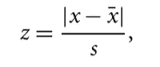

s — standart deviation

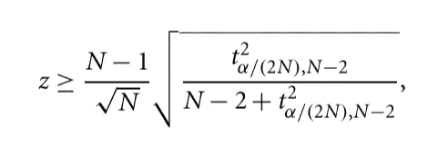

但是我们很少处理只有一个属性的数据。涉及两个或多个属性的数据称为多元数据。这些方法的中心思想是将多元数据转化为单变量异常检测问题。
一种流行的方法是𝜒 - *统计法。*

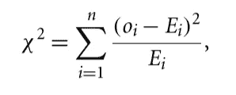

Oi — the value of O in i-th dimension. Ei — the mean of the i-th dimension among all objects, n — dimensionality.

如果𝜒 -大，该对象是一个离群值。

参数模型的主要缺点是，在许多情况下，数据分布可能是未知的。

例如，如果我们有两个大的集群，关于正态分布的假设就不适用。

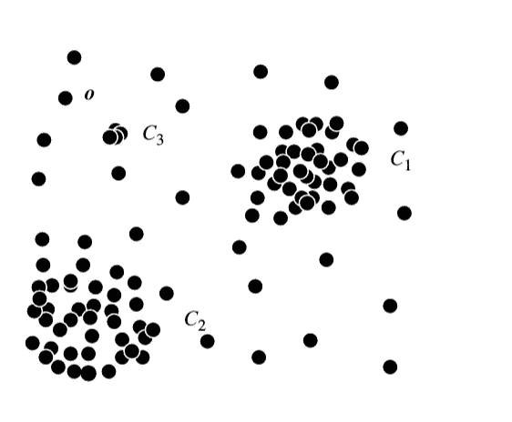

相反，我们假设正态数据对象由多个正态分布𝛩 (𝜇1，𝜎1)和𝛩 (𝜇2，𝜎2)生成，并且对于数据集中的每个对象 **o** ，我们计算由混合分布生成的概率。

*pr(****o****|𝛩1，𝛩2)= f𝛩1(****o****)+f𝛩2(****o****)*

其中*f𝛩1(****o****)——分别为* 𝛩1 和𝛩2 的概率密度函数。为了学习参数𝜇和𝜎，我们可以使用 EM 算法。EM 算法的一个例子可以在[这里](https://github.com/zkid18/Machine-Learning-Algorithms/blob/master/EM-algorithm.ipynb)找到。

## 非参数方法

在用于异常值检测的非参数方法中，从输入数据中学习“正常数据”的模型，而不是先验地假设一个模型。非参数方法通常对数据做较少的假设，因此可以适用于更多的情况。例如，我们可以使用直方图。

在最简单的方法中，如果对象在直方图仓之一中失败，则认为它是正常的。缺点是很难选择箱子的大小。

# 基于邻近的算法

给定特征空间中的一组对象，可以使用距离度量来量化对象之间的相似性。直观上，距离他人较远的对象可以视为离群值。基于邻近度的方法假设离群对象与其最近邻居的邻近度明显偏离该对象与数据集中大多数其他对象的邻近度。

基于邻近度的算法可以分为基于距离的方法(如果一个对象的邻域没有足够的点，则该对象是异常值)和基于密度的方法(如果一个对象的密度比其邻域的密度相对低得多，则该对象是异常值)

## 基于密度

基于距离的离群点检测方法参考由给定半径定义的对象的邻域。如果一个对象的邻域没有足够多的其他点，则该对象被认为是异常值。

距离阈值可以被定义为对象的合理邻域。对于每个对象，我们可以找到一个对象的合理数量的邻居。

形式上，设 *r(r > 0)* 为距离阈值，𝜋 *(0 < 𝜋 < 1)* 为分数阈值。的一个对象 **o 是 *DB(r，* 𝜋 *)***

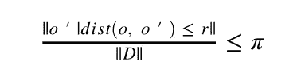

*距离* —距离测量。

简单的方法需要 O(n)时间。

挖掘基于距离的异常值的算法；

*   基于索引的算法
*   嵌套循环算法
*   基于单元的算法

## 基于密度的方法

基于密度的离群点检测方法研究对象及其邻居的密度。这里，如果一个对象的密度比其邻居的密度相对低得多，则该对象被识别为异常值。

许多真实世界的数据集展示了更复杂的结构，其中对象可以被认为是关于它们的局部邻域的离群值，而不是关于全局数据分布的离群值。

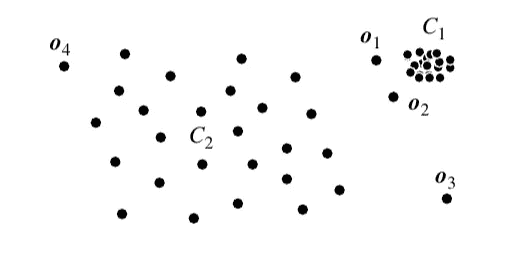

考虑上面的例子，基于距离的方法能够检测到 o3，但是对于 o1 和 o2 就不那么明显了。

基于密度的思想是，我们需要将对象周围的密度与其局部邻居周围的密度进行比较。基于密度的异常检测方法的基本假设是，非异常对象周围的密度与其邻居周围的密度相似，而异常对象周围的密度与其邻居周围的密度显著不同。

*dist _ k(o)*-是对象 **o** 和 k 个最近邻之间的距离。o**的 k 距离邻域包含所有到**o**的距离不大于*dist _ k(o)*o**o**的第 k 个距离的物体**

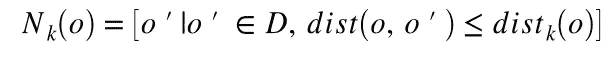

我们可以用 Nk(o)中的物体到 o**的平均距离作为 **o** 局部密度的度量。如果 **o** 具有非常接近的邻居**o’**使得 *dist(o，o’)*非常小，则距离测量的统计波动可能会不期望地高。为了克服这个问题，我们可以通过添加平滑效果来切换到下面的可达性距离度量。**

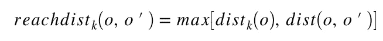

*k* 是用户指定的参数，控制平滑效果。本质上， *k* 指定了要检查的最小邻域，以确定对象的局部密度。可达性距离是不对称的。

一个对象 **o** 的局部可达性密度为

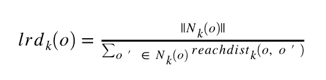

我们计算一个对象的局部可达性密度，并将其与其邻居的可达性密度进行比较，以量化该对象被视为离群值的程度。

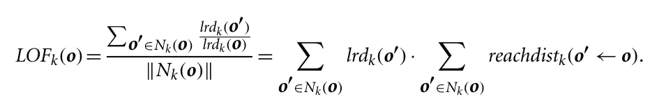

局部离群因子是 **o** 的局部可达性密度与 **o 的** k 个最近邻的局部可达性密度之比的平均值。 **o** 的局部可达性密度越低，o 的 *k* 最近邻的局部可达性密度越高，则 LOF 值越高。这准确地捕获了局部离群值，其局部密度与其 k 个最近邻居的局部密度相比相对较低。

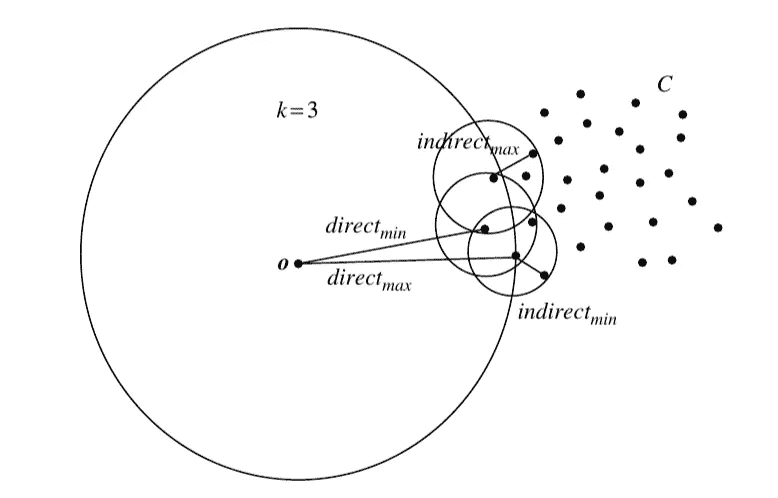

LOF 算法

基于 data.csv 中的点击流事件频率模式，我们将应用 LOF 算法计算每个点的 LOF，初始设置如下:

1.  k = 2 并使用曼哈顿距离。
2.  k = 3 并使用欧几里德距离。

结果，我们将找到 5 个异常值和它们的 *LOF_k(o)*

数据可以从 github [库](https://github.com/zkid18/Machine-Learning-Algorithms)下载

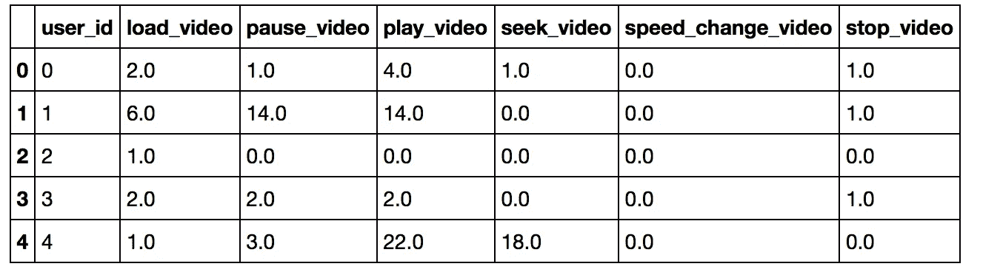

**参考文献**

*   [http://www . kdnugges . com/2017/01/3-methods-deal-outliers . html](http://www.kdnuggets.com/2017/01/3-methods-deal-outliers.html)
*   [https://www . analyticsvidhya . com/blog/2016/01/guide-data-exploration/](https://www.analyticsvidhya.com/blog/2016/01/guide-data-exploration/)
*   韩佳玮，Micheline Kamber，JianPei 数据挖掘概念和技术-第 3 版-摩根-考夫曼-2011 [【亚马逊】](https://www.amazon.com/Data-Mining-Concepts-Techniques-Management/dp/0123814790)
*   [https://towards data science . com/a-brief-overview-of-outlier-detection-techniques-1e 0 b 2c 19 e 561](/a-brief-overview-of-outlier-detection-techniques-1e0b2c19e561)

MSBD 5002 HKUST 讲稿