# 将 Nodejs 微服务部署到 Docker Swarm 集群[Docker 从零到英雄]

> 原文：<https://towardsdatascience.com/deploy-a-nodejs-microservices-to-a-docker-swarm-cluster-docker-from-zero-to-hero-464fa1369ea0?source=collection_archive---------0----------------------->

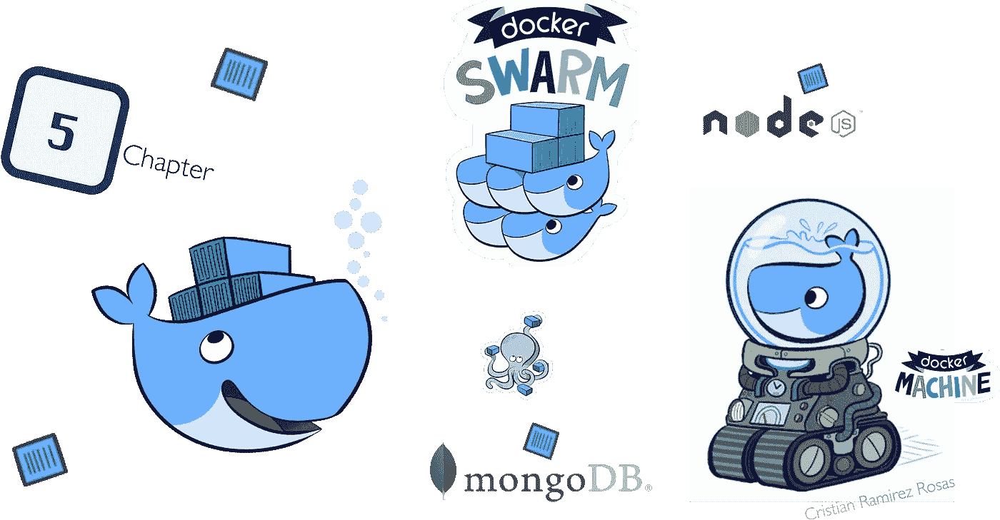

> 这是🖐🏽“构建 NodeJS 影院微服务”系列的第五篇文章。这一系列文章演示了如何使用 ES6，ES7 …8，用 expressjs***设计、构建和部署微服务*** *？，连接到 MongoDB 副本集，并将其部署到 docker 容器中，以模拟云环境的强大功能。*

## ##快速回顾一下我们之前的章节

第一篇文章介绍了**微服务架构模式**，并讨论了使用微服务的**好处**和**缺点**。在第二篇文章中，我们讨论了使用 **HTTP/2 协议**的**微服务安全性**，并了解了如何实现它**。**本系列的第三篇文章我们描述了**微服务**架构内**通信**的**不同方面，我们解释了关于**设计模式**的 **NodeJS** 像**依赖注入、反转控制**和**坚实的原理。**在第四篇文章中，我们谈到了什么是 **API 网关，**我们看到了什么是**网络代理**和 **ES6 代理对象。我们已经开发了 5 个服务，我们已经将它们归档，我们也做了很多类型的测试，因为我们是好奇的好开发者。****

如果你没有读过前面的章节，你会错过一些很棒的东西👍🏽，所以我会把链接放在下面，这样你就可以看看了👀。

[](https://medium.com/@cramirez92/build-a-nodejs-cinema-microservice-and-deploying-it-with-docker-part-1-7e28e25bfa8b) [## 构建 NodeJS 影院微服务并使用 docker 部署它—第 1 部分

### 这是“构建节点影院微服务”系列的第一章，该系列是关于构建节点影院微服务的

medium.com](https://medium.com/@cramirez92/build-a-nodejs-cinema-microservice-and-deploying-it-with-docker-part-1-7e28e25bfa8b) [](https://medium.com/@cramirez92/build-a-nodejs-cinema-microservice-and-deploying-it-with-docker-part-2-e05cc7b126e0) [## 构建 NodeJS 影院微服务并使用 docker 部署它(第 2 部分)

### 这是✌️“构建 NodeJS 影院微服务”系列的第二篇文章。

medium.com](https://medium.com/@cramirez92/build-a-nodejs-cinema-microservice-and-deploying-it-with-docker-part-2-e05cc7b126e0) [](https://medium.com/@cramirez92/build-a-nodejs-cinema-booking-microservice-and-deploying-it-with-docker-part-3-9c384e21fbe0) [## 构建 NodeJS 影院预订微服务并使用 docker 部署它(第 3 部分)

### 你好社区这是🏰“构建 NodeJS 影院微服务”系列的第三篇文章。这一系列的…

medium.com](https://medium.com/@cramirez92/build-a-nodejs-cinema-booking-microservice-and-deploying-it-with-docker-part-3-9c384e21fbe0) [](https://medium.com/@cramirez92/build-a-nodejs-cinema-api-gateway-and-deploying-it-to-docker-part-4-703c2b0dd269) [## 构建 NodeJS cinema API 网关并将其部署到 Docker(第 4 部分)

### 这是🏛“构建 NodeJS 影院微服务”系列的第四篇文章。这一系列文章…

medium.com](https://medium.com/@cramirez92/build-a-nodejs-cinema-api-gateway-and-deploying-it-to-docker-part-4-703c2b0dd269) 

我们一直在开发，编码，编程，👩🏻‍💻👨🏻‍💻在最后几集中，我们对如何创建 nodejs 微服务非常兴奋，我们还没有时间谈论我们系统的架构，我们还没有谈论从第 1 章开始就一直在使用的东西，那就是 ***Docker* 。**

现在是人们见识力量的时候了💪🏽集装箱化的🗄.如果你想得到你的手🙌🏽肮脏和学习所有关于 [Docker](https://docker.com/) 的大惊小怪，然后抓住你的座位，系上你的安全带，因为我们的旅程将变得有趣。

## ##当前影院微服务架构

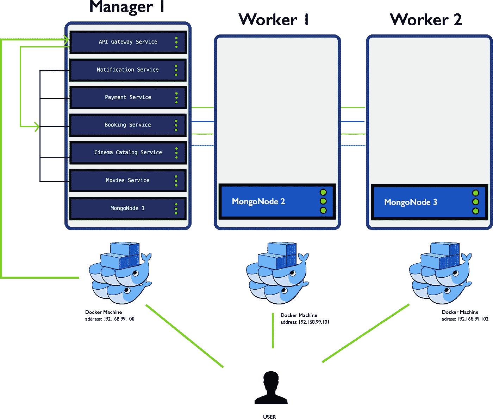

直到我们知道我们已经创建了 3 个`**docker-machines**` **，**我们创建了一个`**mongo database replica set cluster**`，在那里我们在每个 docker-machine 中放置了一个副本，然后我们创建了我们的微服务，但是我们一直只在`**manager1**` docker-machine 中手动创建和部署它，所以我们一直在浪费其他两个 docker-machine 中的计算资源，但是我们不再这样做了，因为我们将开始配置 ***Docker*** ，

*我们将在本文中使用:*

*   *NodeJS 版本 7.5.0(针对我们的微服务)*
*   *MongoDB 3.4.2(针对我们的数据库)*
*   *Mac 版 docker 1 . 13 . 0 或同等版本(已安装，版本 1.13.1 与 dockerode 不兼容)*

*跟进文章的先决条件:*

*   *bash 脚本的基础知识。*
*   *我已经完成了上一章的例子。*

*如果你还没有，我已经上传了一个 github 库，所以你可以在分支机构**步骤 5 的[回购链接](https://github.com/Crizstian/cinema-microservice/tree/step-4)处获得最新信息。***

# *# Docker 是什么？*

> *Docker 是一个开源项目，可以将任何应用程序作为一个轻量级容器来打包、运输和运行。*
> 
> *Docker 容器既与硬件无关，也与平台无关。这意味着它们可以在任何地方运行，从您的笔记本电脑到最大的云计算实例以及二者之间的任何东西，并且它们不需要您使用特定的语言、框架或打包系统。这使得它们成为部署和扩展 web 应用程序、数据库和后端服务的绝佳构建块，而无需依赖特定的堆栈或提供商。— @Docker*

*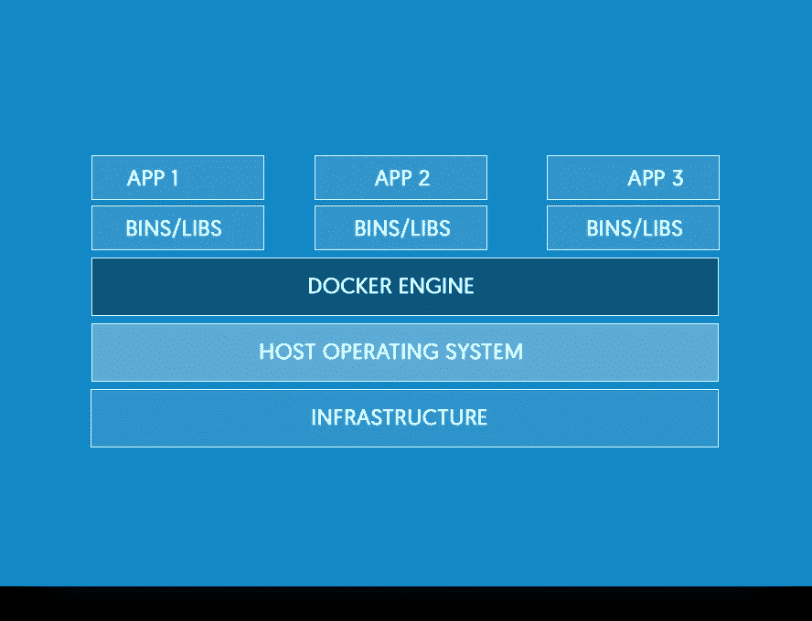*

*Docker structure*

## *换句话说 docker 到底是什么？*

*换句话说，docker 让我们构建模板(*如果我们可以称之为模板，这个模板是 docker 映像*)来创建容纳虚拟机的容器(*如果我们可以称之为虚拟机，因为它们不是*)，我们可以在其中包含我们的应用程序，安装它的所有依赖项，并作为一个独立的进程运行它，与主机操作系统或任何 IaaS 平台中的其他容器共享内核。*

*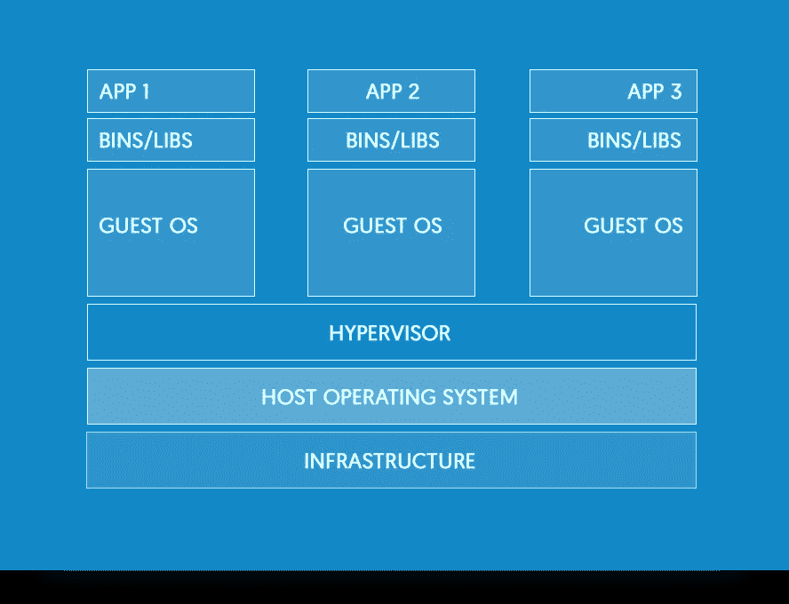*

*Virtual machine structure*

## *和虚拟机有什么区别？*

> *虚拟机包括应用程序、必要的二进制文件、库和整个客户操作系统，其容量可达数十 GB — @Docker*

# *#什么是 Docker-Machine？*

> *Docker Machine 让我们可以在自己的计算机、云提供商和数据中心内部创建 Docker 主机。它创建服务器，在服务器上安装 Docker，然后配置 Docker 客户机与服务器对话。— @Docker*

*Docker Machine 是一个让我们在虚拟主机上安装 Docker 引擎，并使用`docker-machine`命令管理主机的工具。您可以使用 Machine 在本地 Mac 或 Windows box、公司网络、数据中心或 AWS 或 Digital Ocean 等云提供商上创建 Docker 主机。Docker 引擎在 Linux 系统上本地运行。如果你有一个 Linux 系统作为你的主系统，并且想要运行`docker`命令，你需要做的就是下载并安装 Docker 引擎。*

## *但是为什么我们甚至在 Linux 上也需要 Docker-Machine 呢？*

****如果我们想要高效地管理我们的 Docker 主机*** ***在网络上、在云中甚至在本地，我们需要它，因为如果我们在本地进行测试，Docker-Machine 可以帮助我们模拟云环境。****

# *#什么是 Docker Swarm？*

*Docker Swarm 是 Docker 的本地集群。它使用 API 代理系统将一个 Docker 主机池变成一个单独的虚拟主机。*

## *让我们先理解集群是什么意思。*

> **集群是一组紧密耦合的计算机，像单台机器一样运行。称为节点的单个机器通过非常快速的网络相互通信，并且它们在物理上非常接近，可能在同一个机柜中。通常他们有相同或几乎相同的硬件和软件。所有节点都可以处理相同类型的请求。有时，一个节点接受请求并将其分派给其他节点。—* [*菲尔·多尔蒂*](https://blog.containership.io/author/phil-dougherty)*

*好了，现在让我们看看创建 Docker Swarm 集群可以实现什么:*

*   *多主机网络*
*   *结垢*
*   *负载平衡*
*   *默认安全性*
*   *集群管理*

*等等，现在我们已经获得了一些关于 Docker 生态系统的词汇和知识，是时候看看我们如何创建我们的架构并将我们的 ***cinema 微服务部署到 Docker Swarm 集群*** ，该集群可以处理数百、数千或数百万的用户请求，如预订🎟，逛🕹，看🎥、或用户的任何动作👥在我们的电影系统中。*

> *当不使用 swarm 模式运行 Docker 时，执行容器命令。当您在集群模式下运行 Docker 时，您编排了服务。您可以在同一个 Docker 实例上运行 swarm 服务和独立容器。— @Docker*

# *#构建架构*

## *步骤 1:创建并初始化 docker swarm 集群*

*我们将从零开始构建我们的影院微服务架构，所以让我们先来谈谈如何创建我们的`**docker machines**` 以及如何初始化一个`**docker swarm cluster.**`*

*首先，在开始创建和修改文件之前，我们需要在 cinemas 项目的根目录下创建一个名为`**_docker_setup**`的新文件夹，因此我们的项目需要如下所示:*

```
*. 
|*--* ***_docker_setup*** 
|   `*-- ... here we are going to put our bash files* 
|*--* ***api-gateway***|   `*-- ... more files* |*--* ***booking-service***|   `*-- ... more files* |*--* ***cinema-catalog-service***|   `*-- ... more files* |*--* ***movies-service***|   `*-- ... more files* |*--* ***notification-service***|   `*-- ... more files* |*--* ***payment-service***|   `*-- ... more files**
```

*因此，让我们在我们的`**_docker_setup folder**`中创建一个 bash 文件，名为`**setup-swarm.sh**`，这将创建并设置我们的`**docker swarm cluster.**`为什么是 bash 文件，因为一个好的开发人员可以自动完成很多这样的事情:*

*好吧，这是一个有点长的脚本，但我想把它全部写下来，因为它让我们更好地了解正在发生的事情，以及我们如何才能完成 docker swarm 集群设置自动化。*

*所以让我们分开剧本，谈谈那里发生了什么。*

```
***# So first the basics, how do we create a docker-machine.**$ docker-machine create -d $DRIVER $ADDITIONAL_PARAMS $MACHINE_NAME*
```

*这就是我们创建机器的基本方法，不管它们是管理节点还是工作节点，对两者来说都是相同的命令。驱动程序可能是 *virtualbox、parallels、digital-ocean、AWS 等。**

*一旦我们创建了我们的机器，它的时间 ***初始化蜂群*，**如下:*

```
*$ docker-machine ssh manager1 docker swarm init --advertise-addr $(getIP manager1)*
```

*它的一个 ***简单的 docker 命令*** ，就这么简单，***docker swarm init***，初始化 swarm manager 配置。我们可以用两种方式来做这件事，像下面的`eval `docker-machine env manager1``一样 ***设置我们的环境*** 并执行`docker swarm init`命令或者 ***我们可以 ssh 到机器*** 像下面的`docker-machine ssh manager1 {and here we pass the docker commands}`一样，初始化 swarm 我们需要`docker-machine ip`ip 可能会因驱动程序提供者而异，所以为了获取 ip，我做了一个 bash 函数，它将检索给定 docker-machine 的 IP。*

*一旦群管理器被启动，我们就准备添加工人节点，为此我们调用函数`join_node_manager`，它执行以下操作:*

```
*$ docker-machine ssh {name of worker} docker swarm join --token $(get_worker_token) $(getIP manager1):2377*
```

*我们将在脚本中使用给定数量的 workers 变量再次循环该命令，该命令首先调用函数`get_worker_token`，这将从管理器节点获取令牌，这是将 worker 节点注册到群集群所需的令牌，接下来它将再次调用检索给定 docker-machine 的 ip 的函数，并将 ***完成 docker 群集群配置*** ，我们准备好部署我们的 ***cinema 微服务。****

> *为了利用 swarm 模式的容错特性，Docker 建议您根据组织的高可用性要求实现奇数个节点。— @Docker*

## *步骤 2:创建 docker 图像*

> *容器是将 Node.js 应用程序部署到生产环境的最佳方式。容器提供了各种各样的好处，从在生产和开发中拥有相同的环境到为了速度和大小而简化部署。— [*蒂尔尼·赛丽*](https://nodesource.com/blog/author/bitandbang)*

*目前我们有 5 个微服务和 1 个 api-gateway 服务，我们可以在 dev box 上运行，只要它安装了 Node.js 的兼容版本。我们想要做的是创建一个 ***Docker 服务(*** 我们将在后面的章节 ***)*** 中看到这是什么，但是为此我们需要为我们拥有的每个微服务创建一个 ***Docker 映像*** 。*

*一旦创建了 ***Docker 映像*** ，我们就能够在任何支持 Docker 的地方部署我们的服务。*

*我们创建一个 ***Docker 图像*** 的方法是先创建一个***Docker file(****模板* ***)*** )。Docker 文件是一个告诉 Docker 引擎如何构建我们的图像的配方。*

*由于我们只开发了 ***nodejs*** 应用程序，我们可以在项目中的所有微服务中使用相同的 Dockerfile 规范， ***但是我们是否尽了一切努力使这个过程尽可能可靠和有活力呢？****

*这是我们要查看的下一个文件，我们也将对其应用良好的实践。*

*现在我们可以用这个规范修改我们之前创建的所有微服务***docker files****，*。*

*让我们谈一点这是怎么回事，如果这个过程是可靠的。*

*默认情况下，Docker 容器中的应用程序进程作为根用户*运行。这在生产运行时会造成 ***潜在的严重安全风险*** 。这个问题的一个简单的 ***解决方案*** 是在 Docker 映像的 中 ***创建一个新用户，并使用该用户来执行我们的应用程序。***Docker 容器内的第一个进程*** 将是 ***PID 1*** 。Linux 内核给予 PID 1 特殊的待遇，许多应用程序并不是为处理 PID 1 带来的额外责任而设计的。当以 PID 1 的身份运行 Node.js 时，进程无法处理那些责任会有几种表现，其中最痛苦的是进程忽略了`SIGTERM`命令。dumb-init 被设计成一个超级简单的进程，无论它被告知启动哪个进程，它都负责作为 PID 1 运行。*****

## *步骤 3:构建并运行我们的 docker 映像*

*要构建我们的 ***Docker 图像*** ，我们需要运行以下命令:*

```
***# This command will create a new docker image**$ docker build -t movies-service .*
```

*让我们看看 build 命令。*

1.  *`docker build`告诉引擎我们想要创建一个新的图像。*
2.  *`-t flag`用标签`movies-service`给这个图像加标签。从现在开始我们可以通过标签来引用这张图片。*
3.  *`.`使用当前目录找到`Dockerfile`。*

*现在我们已经准备好使用新的 docker 映像运行容器，为此我们需要以下命令:*

```
*$ docker run --name movies-service -l=apiRoute='/movies' -p 3000:3000 -d movies-service*
```

*让我们来看看 run 命令。*

1.  *`docker run`告诉引擎我们要启动一个新的容器。*
2.  *`--name` flag 为容器设置一个名称。从现在开始我们可以用这个名字来称呼这个容器。*
3.  *`-l`标志为容器设置元数据。*
4.  *`-p` flag 设置来自{host}:{container}的端口绑定*
5.  *`-d`标志在分离模式下运行容器，这保持了容器在后台运行。*

*所以现在让我们在我们的`**_docker_setup**` foleder 中创建一个 bash 文件，名为`**create-images.sh**`，来自动创建我们所有的微服务 docker 映像。*

*在执行这个脚本之前，我们需要修改每个微服务上的`**start-service.sh**` ，并将其重命名为`**create-image.sh**`，如下所示:*

```
*#!/usr/bin/env bashdocker rm -f {name of the service}docker rmi {name of the service}docker image prunedocker volume prune**# the previous commands are for removing existing containers, 
# and image, then we clean our environment and finally 
# we creat or re-build our image**docker build -t {name of the service} .*
```

## *步骤 4:将我们的 docker 映像发布到 docker hub 存储库*

*发布我们的 docker 图像🤔？，Docker 维护着一个巨大的图像库，称为[***Docker Hub***](https://hub.docker.com/)，您可以使用它作为起点或免费存储我们自己的图像。这是我们将`**node:7.5.0-alpine**`映像用于创建微服务映像的地方。 ***但是为什么我们需要发布我们的图片呢？****

*因为在本章的后面，我们将创建 ***Docker 服务*** ，这些服务将在我们的 Docker Swarm 集群上部署和复制，为了启动我们的服务，集群节点需要服务的映像来启动容器，如果映像不在本地，它将在 docker hub 中搜索它，然后将它拉至主机，以便在本地拥有映像并能够统计我们的服务。*

*但是首先我们需要在 [***Docker Hub 网站***](https://hub.docker.com/) ***，*** 创建一个帐户，然后我们需要在我们的 shell 中登录，执行以下命令:*

```
*$ docker login          
  Username: *****     
  Password: *****     
  Login Succeeded*
```

*接下来，我们需要标记我们的图像，以便能够通过名称引用它们，并将它们推送到 docker hub。*

*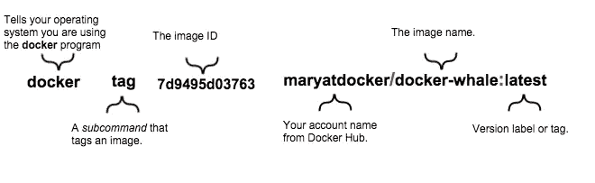*

*docker tagging images structure*

*既然我们已经登录，我们现在知道了如何标记 docker 图像的结构，现在是修改我们的`**create-images.sh**`的时候了，所以它可以**创建**我们的图像，**标记**我们的图像，**将**我们的图像推送到 **docker hub** ，所有这些都是自动完成的，我们的 bash 文件需要看起来如下。*

## *步骤 5:设置我们的 mongodb 副本集集群*

*这是 docker 步骤的一个小主题，但我们需要一个数据库来保存我们的微服务使用的数据，在这一步中，我不会花时间来描述如何做到这一点，我已经写了一篇关于如何将 mongodb 副本集集群部署到 docker 的文章，我强烈建议您，如果您还没有，可以看看我的文章。*

*[](https://medium.com/@cramirez92/how-to-deploy-a-mongodb-replica-set-using-docker-6d0b9ac00e49) [## 如何使用 Docker 部署 MongoDB 副本集

### 本文将介绍如何使用 docker 设置带身份验证的 MongoDB 副本集。

medium.com](https://medium.com/@cramirez92/how-to-deploy-a-mongodb-replica-set-using-docker-6d0b9ac00e49) 

或者跳过这一步，等到阅读完第 7 步。
(又搞点暴徒生活😎)

## 步骤 6:在我们的 docker 集群中创建 docker 服务

做第 5 步是非常重要的，因为如果我们没有我们的数据库和运行我们的 docker 服务将无法正确启动。

现在让我们在我们的`**_docker_setup**` 文件夹中创建另一个名为`**start-services.sh**` 的文件。这个 bash 脚本将启动我们所有类型为 ***Docker 服务*** 的微服务，这样这些服务就可以根据需要扩大或缩小规模。

既然我们的服务规模将会扩大和缩小，我们在调用这些服务时会遇到麻烦，但亲爱的读者们，没有什么可害怕的，因为，我之前说过，创建*Docker swarm 集群的好处之一是，它在幕后为我们设置了一个*负载平衡器，Docker 负责在请求时处理要调用的服务。让我们回顾下一个文件。**

**正如你所看到的，这个文件与我们的`**create-images.sh**` 非常相似，但是这次我们从每个服务中调用`**start-service.sh**` ，现在让我们看看`**start-service.sh**`文件是如何组成的。**

```
**#!/usr/bin/env bashdocker service create --replicas 3 --name {service name} -l=apiRoute='{our api route}' -p {port binding} --env-file env {microservice image}**
```

**让我们看一下服务命令:**

*   **`docker service create`命令创建服务。**
*   **`--name`标志为服务命名，例如`movies-service`。**
*   **`--replicas`标志指定了 3 个运行实例的期望状态。**
*   **我们可以附加元数据的`-l`标志物种，例如`apiRoute="/movies"`。**
*   **`-p`标志指定主机和容器上的端口绑定。**
*   **`-e`标志指定了服务环境变量的 can 设置。**

## **步骤 7:在一个命令中执行所有自动化文件**

**好啦好啦，是施展魔法的时候了🔮✨的人们。**

**为了执行我们已经创建的所有自动化文件，让我们创建最终的脚本来为我们做所有的事情，*因为开发人员很懒*🤓。**

**所以我们需要在 ***影院微服务*** 项目的根目录下创建这个文件，我们将把它命名为`**kraken.sh**` **🦑**只是为了好玩，因为很强大😎。**

**它内部没有复杂的编程，但是它所做的，是为我们调用所有的自动化脚本并完成我们的工作。**

**最后让我们像下面这样执行它。**

```
**$ bash < kraken.sh**
```

**就这么简单，我们已经做了这么多模块化来简化创建 ***Docker 群集群*** 的过程，并自动启动我们的 ***Docker 服务。*****

> **“简单可能比复杂更难:你必须努力让自己的思维变得清晰，才能变得简单。但最终还是值得的，因为一旦你到了那里，你就可以移山。”—史蒂夫·乔布斯**

**我上传了一个视频演示，看看当我们执行`**kraken.sh**` 时会发生什么。我稍微加快了视频的速度，但 kraken 过程可能需要 10 分钟左右才能完成，这取决于主机的功率。**

**最后，我们可以检查 docker 环境执行以下命令的状态，如下图所示。**

**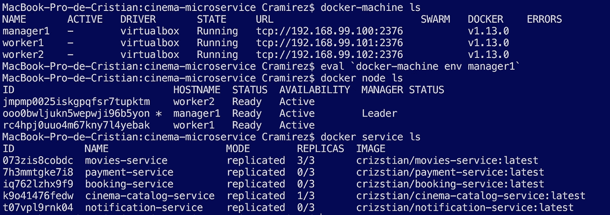**

**docker — bash output**

**正如所示，您可以看到我们的集群中已经复制了一些服务，其他的甚至还没有启动，这是因为机器正在获取我们的映像来启动我们的服务，一旦我们的映像被下载并且我们的服务被启动，我们应该会看到类似下图的内容。**

**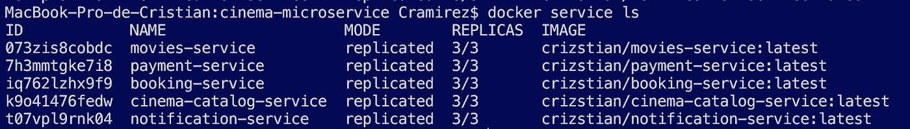**

**docker service ls — bash output**

**现在我们的架构看起来如下图所示，其中我们所有的微服务都是动态创建的，通过所有集群复制，并且可以根据需要进行扩展，唯一手动创建的服务是我们的 ***mongo 容器和 api-gateways*** *，*为什么因为它们与我们的主机服务器的规范相关，所以 mongo 需要持久存储，我们的 api 需要发现主机 docker 服务。**

**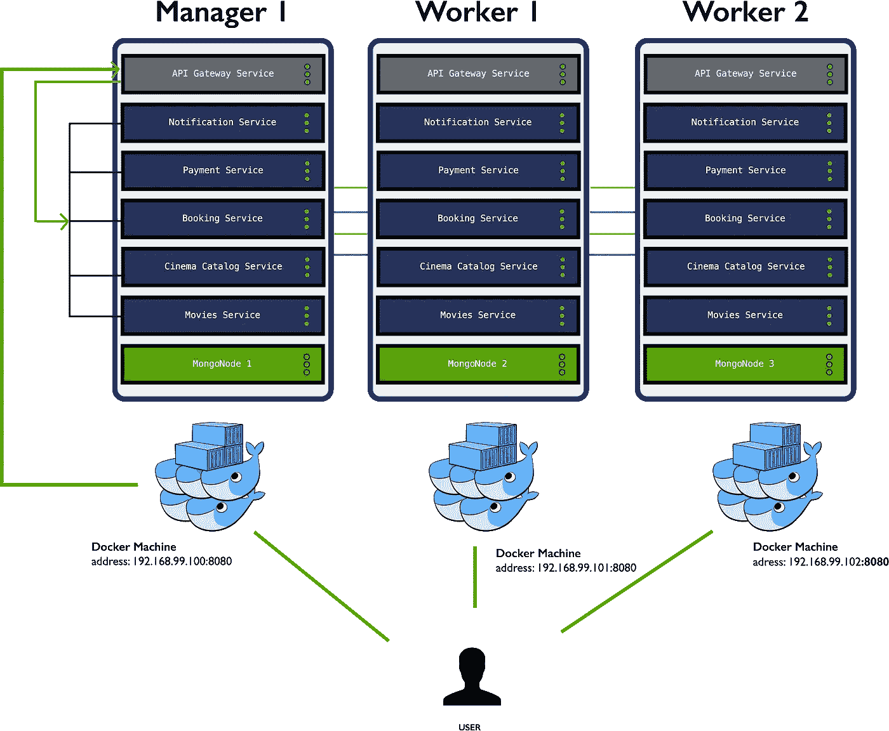**

**现在，让我们验证我们的服务当前已经启动并正在运行，因此我们需要执行如下图所示的命令。**

**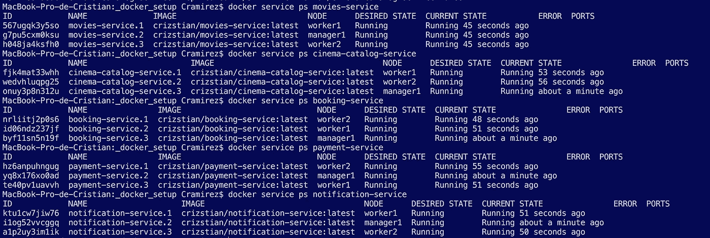**

**docker service ps {service} — bash output**

**如果我们运行 github 上的 ***Docker Swarm visualizer、*** [，我们可以看到我们的服务(容器)是如何分布在我们的 ***Docker swarm 集群*** 上的，如下图所示。](https://github.com/ManoMarks/docker-swarm-visualizer)**

**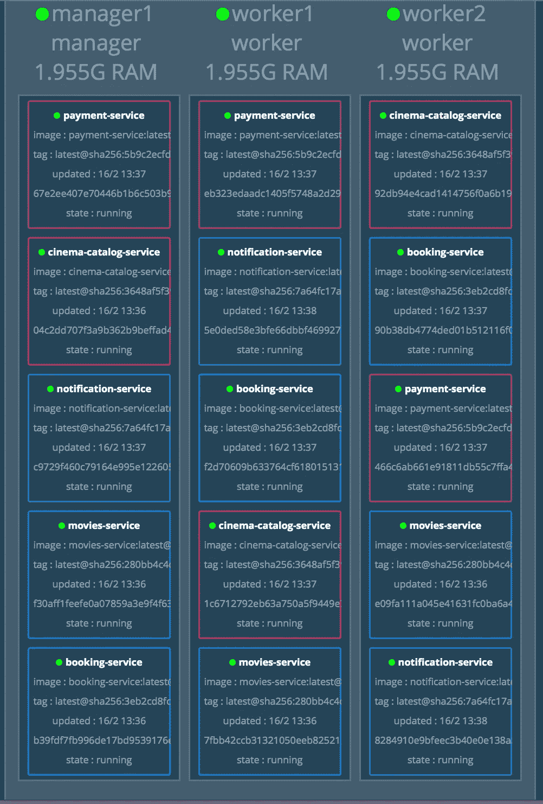**

**Docker swarm visualizer**

**如果我们缩小一些服务，例如`docker-machine ssh manager1 docker service scale movies-service=1`，我们可以看到我们的服务是如何在我们的*集群上重新分布的，如下图所示。***

***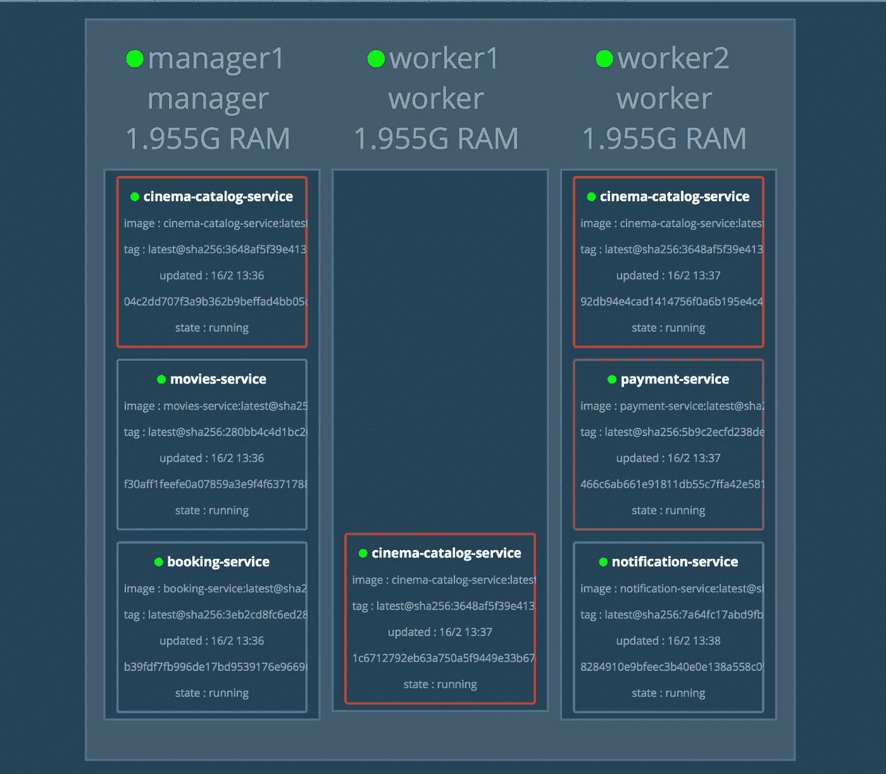***

***Docker swarm visualizer***

***我们几乎完成了 **cinemas 微服务配置、**以及 **cinemas 微服务系统。*****

## ***步骤 8:额外配置***

***这是一篇非常大的文章，但是我们已经学到了很多关于 docker 如何适应我们的开发，以及 docker 如何补充我们的系统使之更加健壮。***

***我们还需要做一些事情，正确设置并准备运行我们的**影院微服务:*****

*   ***我们需要更新 **api-gateway，**，以便现在可以发现正在运行的 docker 服务，从而能够进行代理。***
*   ***我们需要填充我们的数据库，为此你可以去查看这里的 [github 仓库自述文件中的命令。](https://github.com/Crizstian/cinema-microservice/tree/master/cinema-catalog-service)***

***在我们的 **API 网关**中，我们只需要修改我们的`**docker.js**` 中的几行代码，而不是调用`listContainers()`函数，我们会调用`listServices()`函数并用提供的服务设置我们的路线。***

***为了不使这篇文章变得更长，欢迎您在 github 仓库检查对 **API 网关**的完整代码更改，如果您有任何问题，一如既往地欢迎您给我发推文或在下面发表评论😃📝。***

## ***步骤 9:测试我们的设置***

***因为如果不对我们的系统进行一些测试，我们的文章是不完整的。测试从根本上来说是重要的，因为我们可以从不同的角度，用不同的视角来看待系统，并以不同的期望来测试它。软件测试的最终目的不是找到 bug，而是使产品定性。作为一名优秀的测试人员，我们正在为产品质量的提高做出贡献。***

```
*****# we need to locate at the api-gateway folder and execute the test** $ npm run int-test***
```

***我们将得到如下输出。***

******

***这里我们调用我们的 **api 网关服务**，正如你所看到的，我们调用不同的`docker-machine` ip，我们的 api 网关代理我们的请求到我们的 ***Docker 服务*** *，*，最后我们的测试正确通过😎。***

**我还对部署在 docker swarm 集群中的 cinema 微服务系统进行了 jmeter 压力测试，因此您可以看到预期的结果。**

# **#是时候回顾一下了**

**我们所做的…**

**我们见过很多码头工人🐋。我们讨论了 whale、 ***Docker、Docker-Machine、Docker-Swarm、Docker-Images、Docker-Hub、Docker-Services*** 是什么，以及如何进行适当的配置，如何设置自动化流程，以及如何与我们的 **cinemas 系统相适应。****

**借助 docker，我们使我们的影院微服务和系统更具动态性、容错性、可扩展性和安全性。 但是 docker 还有太多有趣的东西可以看，比如 ***Docker 网络、Docker 撰写、Docker 插件等等……***Docker 是一个不断扩展的 devops 世界。**

**我们已经看到了使用 **NodeJS** 的微服务的大量开发，并且我们已经看到了如何使用 **Docker 生态系统**来实现这种微服务，但是我们还可以做和学习更多的东西，这只是更高级的 Docker 平台的一个小高峰。我希望这已经展示了一些有趣和有用的东西，您可以在您的工作流中使用这些东西。**

# **#还有一件事…**

**我知道这篇文章变得很长，但我认为值得再看一步，这将向我们展示如何监控我们的 docker swarm 集群。**

## **步骤 9:监控 docker 集群**

**因此，要开始监控我们的集群，我们需要在我们的`**manager1 docker-machine**`中执行以下命令**

```
**$ docker-machine ssh manager1 docker run --name rancher --restart=unless-stopped -p 9000:8080 -d rancher/server**
```

**然后，当容器准备好了，我们需要在浏览器中访问下面的 url `[http://192.168.99.100:9000](http://192.168.99.100:9000i)`。**

**然后，rancher gui 将向您介绍整个设置过程，最后我们将能够监视我们的群集。**

**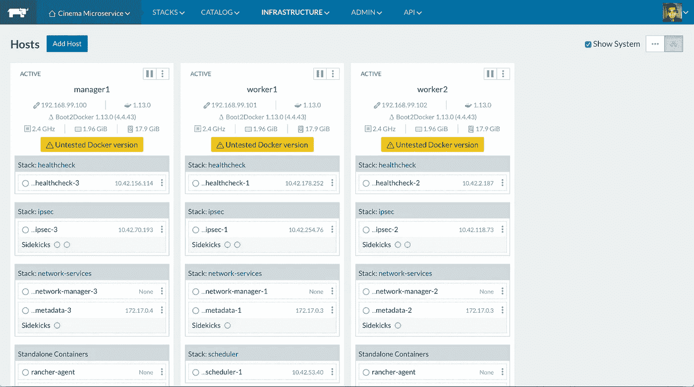**

**Rancher UI of our cluster**

**如果我们单击其中一个主机，我们可以看到如下内容。**

**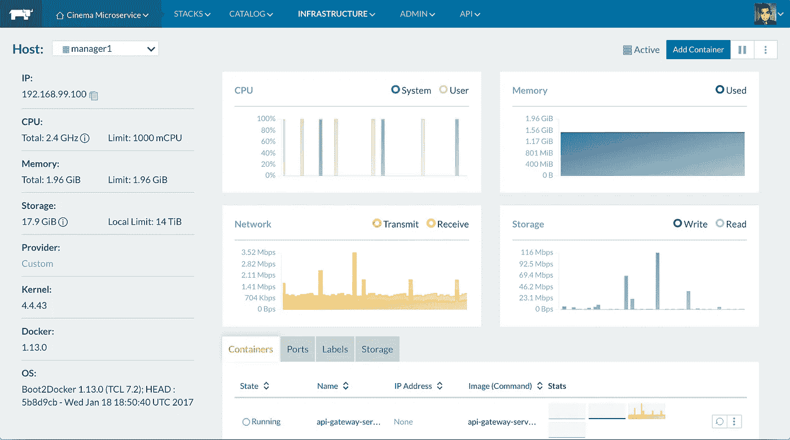**

**Rancher — Manager 1 logs**

**最后，我们录制了 super duper 压力集成测试，这样您就可以在视频中看到所有这些配置的结果，以及我们如何通过图形界面或控制台日志来监控我们的群集😎*控制台日志晃动*🤘🏽。**

**所以我们已经看到了超能力💪🏽蓝鲸🐋提供给我们的。**

## **##最终意见**

**好了，我们的**影院微服务系统**已经接近完成，但还缺少一些东西，如果我们不开发出缺少的主要部分，我们的影院微服务系统就没有用了，我的朋友们，这是我们的最终用户将与我们的系统交互的前端服务😎，而 web 用户界面是我们系统中缺少的部分。**

# **#感谢阅读**

**感谢阅读！希望你在文章中找到价值！如果你看过，按下*推荐键*，推荐给朋友，分享或者再读一遍。**

**如果你对这个系列的任何方面有疑问，或者需要我的帮助来理解某些东西，请随时给我发推特或者在下面留下评论。**

**让我记住你，这篇文章是“ ***搭建 NodeJS 影院微服务*** ”系列的一部分，所以，下周我会再发表一章。**

**与此同时，请继续关注，保持对✌的好奇🏼👨🏻‍💻👩🏻‍💻**

**再见了！😁**

**你可以在 Twitter @ crami rez _ 92
[https://twitter.com/cramirez_92](https://twitter.com/cramirez_92)关注我*** 

# **# Github 的完整代码**

**您可以在下面的链接中查看文章的完整代码。**

**[](https://github.com/Crizstian/cinema-microservice) [## GitHub-Crizstian/cinema-微服务:影院微服务示例

### 电影院微服务-电影院微服务示例

github.com](https://github.com/Crizstian/cinema-microservice) 

# #进一步阅读||阅读互补

*   [docker 服务如何工作](https://docs.docker.com/engine/swarm/how-swarm-mode-works/services/)
*   [码头工人群体概述](https://docs.docker.com/engine/swarm/)** 

# **参考数量**

*   **[Docker GitHub](https://github.com/docker/docker)**
*   **[来自开发者的定义:什么是集群？](https://blog.containership.io/definitions-from-a-developer-what-is-a-cluster)**
*   **[8 个 Protips 在 Dockerizing Node.js 时开始杀死它](https://nodesource.com/blog/8-protips-to-start-killing-it-when-dockerizing-node-js/?utm_source=nodeweekly&utm_medium=email#protip1createanonrootuser)**