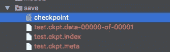
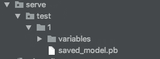
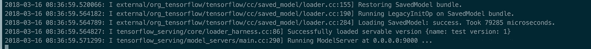
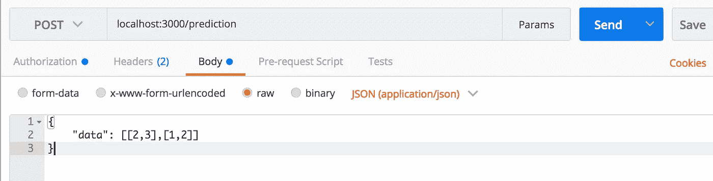
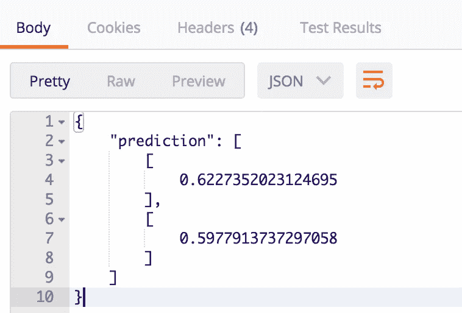

# 部署张量流模型

> 原文：<https://towardsdatascience.com/deploy-tensorflow-models-9813b5a705d5?source=collection_archive---------2----------------------->


Photo by [SpaceX](https://unsplash.com/photos/OHOU-5UVIYQ?utm_source=unsplash&utm_medium=referral&utm_content=creditCopyText) on [Unsplash](https://unsplash.com/search/photos/falcon-heavy?utm_source=unsplash&utm_medium=referral&utm_content=creditCopyText)

*了解如何将您的模型部署到生产中*

*更新至 tensorflow 1.7*

好，你有一个模型，你想让它可以从网上访问。有几种方法可以做到这一点，但最快和最强大的是 TensorFlow 服务。

它是如何工作的？基本上 TensorFlow 服务创建了一个 [gRPC](https://en.wikipedia.org/wiki/GRPC) 服务器，您可以在其中发送和接收来自模型的响应。你并不真正了解成为巫师背后的魔力。

这些是我们要做的步骤:

*   做一个笨模型做例子，训练存储
*   从存储的模型中获取您需要的变量
*   从它们中建立张量信息
*   创建模型签名
*   创建并保存模型构建器
*   下载已经编译了 TensorFlow 服务的 Docker 映像
*   使用正确的配置运行 docker 映像
*   创建客户端以发送 gRPC 请求
*   制作一个 API
*   测试一下

代码可以在这里找到[。](https://github.com/FrancescoSaverioZuppichini/TensorFlow-Serving-Example)

# 制作一个愚蠢的模型作为例子，训练和存储它

我们只需要一个模型来玩。下面是一个非常基本的模型，它以两个随机数组作为输入和目标。

```
*import* tensorflow *as* tf
*import* numpy *as* np
*import* os, sys

DATA_SIZE = 100
SAVE_PATH = './save'
EPOCHS = 1000
LEARNING_RATE = 0.01
MODEL_NAME = 'test'

*if not* os.path.exists(SAVE_PATH):
    os.mkdir(SAVE_PATH)

data = (np.random.rand(DATA_SIZE, 2), np.random.rand(DATA_SIZE, 1))
test = (np.random.rand(DATA_SIZE // 8, 2), np.random.rand(DATA_SIZE // 8, 1))

tf.reset_default_graph()

x = tf.placeholder(tf.float32, shape=[*None*, 2], name='inputs')
y = tf.placeholder(tf.float32, shape=[*None*, 1], name='targets')

net = tf.layers.dense(x, 16, activation=tf.nn.relu)
net = tf.layers.dense(net, 16, activation=tf.nn.relu)
pred = tf.layers.dense(net, 1, activation=tf.nn.sigmoid, name='prediction')

loss = tf.reduce_mean(tf.squared_difference(y, pred), name='loss')
train_step = tf.train.AdamOptimizer(LEARNING_RATE).minimize(loss)

checkpoint = tf.train.latest_checkpoint(SAVE_PATH)
should_train = checkpoint == *None

with* tf.Session() *as* sess:
    sess.run(tf.global_variables_initializer())
    *if* should_train:
        print("Training")
        saver = tf.train.Saver()
        *for* epoch *in* range(EPOCHS):
            _, curr_loss = sess.run([train_step, loss], feed_dict={x: data[0], y: data[1]})
            print('EPOCH = {}, LOSS = {:0.4f}'.format(epoch, curr_loss))
        path = saver.save(sess, SAVE_PATH + '/' + MODEL_NAME + '.ckpt')
        print("saved at {}".format(path))
    *else*:
        print("Restoring")
        graph = tf.get_default_graph()
        saver = tf.train.import_meta_graph(checkpoint + '.meta')
        saver.restore(sess, checkpoint)

        loss = graph.get_tensor_by_name('loss:0')

        test_loss = sess.run(loss, feed_dict={'inputs:0': test[0], 'targets:0': test[1]})
        print(sess.run(pred, feed_dict={'inputs:0': np.random.rand(10,2)}))
        print("TEST LOSS = {:0.4f}".format(test_loss))
```

*记住:如果你使用 tf.layers.dense，实际的输出是用你提供的名字+* 函数名(lol)来调用的

```
x = tf.placeholder(tf.float32, shape=[*None*, 2], name='inputs')...
pred = tf.layers.dense(net, 1, activation=tf.nn.sigmoid, name='prediction') 
```

如果您运行代码，它将创建`./save`文件夹(如果它不存在),或者如果已经有一个存储的实例，它将只评估测试集上的模型。

```
# training the model
...
EPOCH = 997, LOSS = 0.0493
EPOCH = 998, LOSS = 0.0495
EPOCH = 999, LOSS = 0.0497
saved at ./save/test.ckpt
```

如果我们再次运行脚本，我们会看到

```
Restoring
TEST LOSS = 0.0710
```

完美！现在我们有了保存的模型



# 从存储的模型中获取您需要的变量

让我们创建一个名为`serve.py`的文件，它将处理服务于我们的 TF 模型背后的逻辑。首先要做的是从存储的图中获取我们需要的变量。

```
*import* tensorflow *as* tf
*import* os

SAVE_PATH = './save'
MODEL_NAME = 'test'
VERSION = 1
SERVE_PATH = './serve/{}/{}'.format(MODEL_NAME, VERSION)

checkpoint = tf.train.latest_checkpoint(SAVE_PATH)

tf.reset_default_graph()

*with* tf.Session() *as* sess:
    # import the saved graph
    saver = tf.train.import_meta_graph(checkpoint + '.meta')
    # get the graph for this session
    graph = tf.get_default_graph()
    sess.run(tf.global_variables_initializer())
    # get the tensors that we need
    inputs = graph.get_tensor_by_name('inputs:0')
    predictions = graph.get_tensor_by_name('prediction/Sigmoid:0')
```

# 从它们中建立张量信息

现在我们有了我们的变量`inputs`和`predictions`。我们需要从它们中构建张量信息，该信息将用于创建将被传递给 **SavedModelBuilder** 实例的**签名定义**。非常容易

```
# create tensors info
model_input = tf.saved_model.utils.build_tensor_info(inputs)
model_output = tf.saved_model.utils.build_tensor_info(predictions)
```

# **创建模型签名**

现在，我们终于可以创建**模型签名**了，它标识了服务对客户端的期望。在我们的情况下

```
# build signature definition
signature_definition = tf.saved_model.signature_def_utils.build_signature_def(
    inputs={'inputs': model_input},
    outputs={'outputs': model_output},
    method_name= tf.saved_model.signature_constants.PREDICT_METHOD_NAME)
```

这里我们从 TF 中调用一个 utils 函数，它接受`inputs`、`outputs`和`method_name`。最后一个只是一个常量，表示将要做什么，在我们想要预测的情况下，它们被定义为:


# 创建并保存模型构建器

创建一个 **SavedModelBuilder** 实例，并传递我们需要的所有信息。

```
builder = tf.saved_model.builder.SavedModelBuilder(SERVE_PATH)

builder.add_meta_graph_and_variables(
    sess, [tf.saved_model.tag_constants.SERVING],
    signature_def_map={
        tf.saved_model.signature_constants.DEFAULT_SERVING_SIGNATURE_DEF_KEY:
            signature_definition
    })
# Save the model so we can serve it with a model server :)
builder.save()
```

在`add_meta_graph_and_variables`中，我们通过当前会话，一个我不知道为什么需要它们的`tags`数组，`SERVING`常量和`signature_def_map`。同样，对于最后一个，我不知道我们为什么需要它，但是基本上我们传递一个字典，在那里我们告诉`DEFAULT_SERVING_SIGNATURE_DEF_KEY`我们有那个签名定义(在前面的“创建模型签名”一节中定义的那个)。

完整剧本[这里](https://github.com/FrancescoSaverioZuppichini/TensorFlow-Serving-Example/blob/master/serve.py)。

运行脚本，它会创建`serve`目录:



# 下载已经编译了 TensorFlow 服务的 Docker 映像

首先安装 [docker](https://www.docker.com/) 。

不要遵循 TensorFlow 文档，因为它们解释了如何设置 docker 映像和编译 TF serving，这需要花费很长时间。

**现在单据坏了，查看这里:**

[**https://github.com/tensorflow/tensorflow/issues/19006**](https://github.com/tensorflow/tensorflow/issues/19006)

有人制作了一个 [docker 图像，上面已经编译了所有东西](https://hub.docker.com/r/epigramai/model-server/)，所以我们将使用这个图像。图像链接:

[https://hub.docker.com/r/epigramai/model-server/](https://hub.docker.com/r/epigramai/model-server/)

使用正确的参数运行该命令

`docker run -it -p <PORT>:<PORT> — name <CONTAINER_NAME> -v <ABSOLUTE_PATH_TO_SERVE_DIR>:<SERVE_DIR> epigramai/model-server:light-universal-1.7 — port=<PORT> — model_name=<MODEL_NAME> — model_base_path=<MODEL_DIR>`

在我们的情况下

```
docker run -it -p 9000:9000 --name tf-serve -v $(pwd)/serve/:/serve/ epigramai/model-server:light-universal-1.7 --port=9000 --model_name=test --model_base_path=/serve/test
```

如果一切正常，您应该会看到类似这样的内容:



# 创建客户端以发送 gRPC 请求

怎么做呢？好吧，再说一次，医生真的不太好。所以我们将使用一个[库](https://github.com/epigramai/tfserving-python-predict-client)，这将使事情变得更容易。

使用`pip`运行这个命令来安装它，在我的例子中，我使用的是 python3

```
pip3 install git+ssh://[git@github.com](mailto:git@github.com)/epigramai/tfserving-python-predict-client.git
```

让我们创建一个名为`client.py`的新文件

```
*import* numpy *as* np
*from* predict_client.prod_client *import* ProdClient

HOST = '0.0.0.0:9000'
# a good idea is to place this global variables in a shared file
MODEL_NAME = 'test'
MODEL_VERSION = 1

client = ProdClient(HOST, MODEL_NAME, MODEL_VERSION)

req_data = [{'in_tensor_name': 'inputs', 'in_tensor_dtype': 'DT_FLOAT', 'data': np.random.rand(1,2)}]

prediction = client.predict(req_data, request_timeout=10)

print(prediction)
```

在运行它之前，确保您已经启动了 docker 容器。午饭后你应该会看到这样的脚本:

```
{'outputs': array([[ 0.53334153]])}
```

以`outputs`为关键字、以正确预测为值的字典

# 创建 API 端点

是时候最终让我们的模型可以从网上访问了。我们将使用 [Flask](http://flask.pocoo.org/) 来创建 HTTP 服务器。让我们重构我们的`client.py`

客户端必须接受 HTTP 调用，将响应数据转换为 numpy 数组，调用模型并返回包含预测的 JSON。下面是[的最终代码](https://github.com/FrancescoSaverioZuppichini/TensorFlow-Serving-Example/blob/master/client.py)。

```
*import* numpy *as* np
*from* predict_client.prod_client *import* ProdClient
*from* flask *import* Flask
*from* flask *import* request
*from* flask *import* jsonify

HOST = 'localhost:9000'
MODEL_NAME = 'test'
MODEL_VERSION = 1

app = Flask(__name__)
client = ProdClient(HOST, MODEL_NAME, MODEL_VERSION)

*def* convert_data(*raw_data*):
    *return* np.array(*raw_data*, dtype=np.float32)

*def* get_prediction_from_model(*data*):
    req_data = [{'in_tensor_name': 'inputs', 'in_tensor_dtype': 'DT_FLOAT', 'data': *data*}]

    prediction = client.predict(req_data, request_timeout=10)

    *return* prediction

@app.route("/prediction", methods=['POST'])
*def* get_prediction():
    req_data = request.get_json()
    raw_data = req_data['data']

    data = convert_data(raw_data)
    prediction = get_prediction_from_model(data)

    # ndarray cannot be converted to JSON
    *return* jsonify({ 'predictions': prediction['outputs'].tolist() })

*if* __name__ == '__main__':
    app.run(host='localhost',port=3000)
```

# 测试一下

终于！我成功了！是时候尝试一下了，打开您最喜欢的 HTTP 客户端，在我的例子中是 [postman](https://www.getpostman.com/) ，尝试使用`POST`请求向`localhost:3000/prediction`发送一个以`data`为键、以矢量为值的 JSON



发送后，我们有了回应



完美！它工作了。

最终代码可以在[这里](https://github.com/FrancescoSaverioZuppichini/TensorFlow-Serving-Example)找到

# 结论

我们已经看到了服务 TensorFlow 模型并使用 Flask 通过 HTTP 请求访问它的最佳方式。

也许你还可以找到值得一读的我的其他文章:

[https://towards data science . com/reinforcement-learning-cheat-sheet-2f 9453 df 7651](/reinforcement-learning-cheat-sheet-2f9453df7651)

[https://towards data science . com/how-to-use-dataset-in-tensor flow-c 758 ef 9 e 4428](/how-to-use-dataset-in-tensorflow-c758ef9e4428)

感谢您的阅读，

弗朗西斯科·萨维里奥