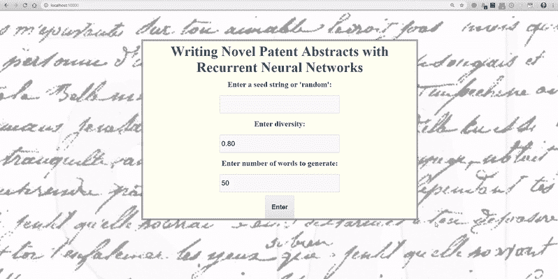
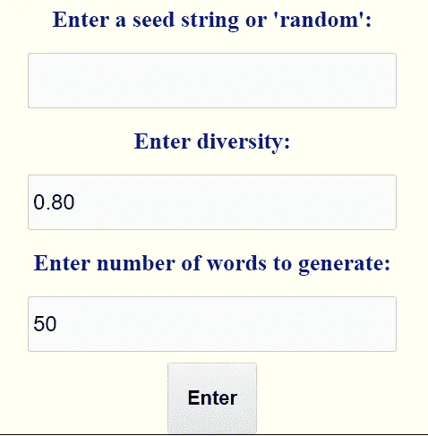
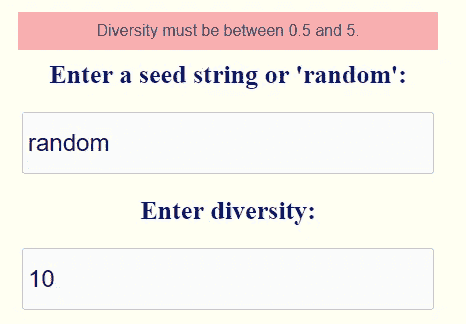
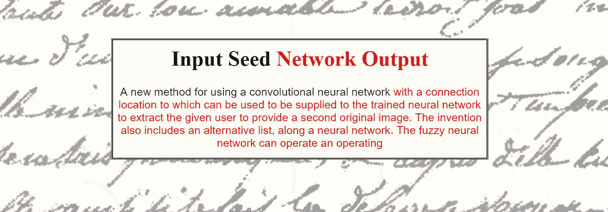
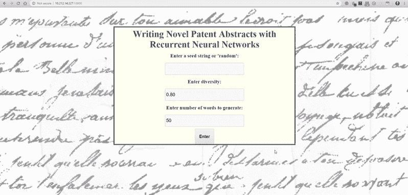

# 在 Python 中将 Keras 深度学习模型部署为 Web 应用程序

> 原文：<https://towardsdatascience.com/deploying-a-keras-deep-learning-model-as-a-web-application-in-p-fc0f2354a7ff?source=collection_archive---------1----------------------->


([Source](https://www.pexels.com/photo/sky-landmark-clouds-space-88214/))

## 深度学习、web 应用、Flask、HTML 和 CSS 在一个项目中

建立一个很酷的机器学习项目是一回事，但归根结底，你希望其他人能够看到你的努力。当然，你可以把整个项目放在 GitHub 上，但是你的祖父母怎么知道呢？不，我们想要的是将我们的深度学习模型部署为世界上任何人都可以访问的 web 应用程序。

在本文中，我们将看到如何编写一个 web 应用程序，它采用一个经过训练的 Keras 递归神经网络，并允许用户生成新的专利摘要。这个项目建立在[示例递归神经网络](https://medium.com/p/ffd204f99470?source=user_profile---------6------------------)文章的基础上，但是知道如何创建 RNN 并不是必需的。我们现在只是把它当作一个黑盒:我们放入一个开始序列，它输出一个全新的专利摘要，我们可以在浏览器中显示它！

传统上，数据科学家开发模型，前端工程师向世界展示它们。在这个项目中，我们将不得不扮演这两个角色，并投入到 web 开发中(尽管几乎都是用 Python)。

该项目需要将众多主题结合在一起:

*   [Flask:](http://flask.pocoo.org/) 用 Python 创建基本的 web 应用程序
*   [Keras:](http://keras.io) 部署训练好的递归神经网络
*   使用 [Jinja](http://jinja.pocoo.org/) 模板库进行模板化
*   [HTML](https://www.w3schools.com/html/) 和 [CSS](https://www.w3schools.com/html/html_css.asp) 用于编写网页

最终的结果是一个 web 应用程序，它允许用户使用经过训练的递归神经网络生成全新的专利摘要:



这个项目的完整代码可以在 GitHub 上找到[。](https://github.com/WillKoehrsen/recurrent-neural-networks)

## 方法

目标是让 web 应用程序尽快启动并运行。为此，我选择了 Flask，它允许我们用 Python 编写应用程序。我不喜欢弄乱样式(这很明显)，所以几乎所有的 CSS 都是复制和粘贴的。[Keras 团队的这篇文章](https://blog.keras.io/building-a-simple-keras-deep-learning-rest-api.html)对基础知识很有帮助[这篇文章](/deploying-keras-deep-learning-models-with-flask-5da4181436a2)也是一个有用的指南。

> 总的来说，这个项目坚持我的设计原则:快速建立并运行一个原型——根据需要尽可能多地复制和粘贴——然后迭代开发出更好的产品。

## 带有 Flask 的基本 Web 应用程序

用 Python 构建 web 应用程序的最快方法是使用 [Flask](http://flask.pocoo.org) 。要制作我们自己的应用程序，我们可以使用以下代码:

```
from flask import Flask
app = Flask(__name__)

@app.route("/")
def hello():
    return "<h1>Not Much Going On Here</h1>"app.run(host='0.0.0.0', port=50000)
```

如果您复制并粘贴这段代码并运行它，您将能够在 localhost:50000 上查看您自己的 web 应用程序。当然，我们想做的不止这些，所以我们将使用一个稍微复杂一点的函数，它基本上做同样的事情:处理来自浏览器的请求，并以 HTML 的形式提供一些内容。对于我们的主页，我们希望为用户提供一个表单来输入一些细节。

## 用户输入表单

当我们的用户到达应用程序的主页时，我们将向他们显示一个表单，其中有三个参数可供选择:

1.  输入 RNN 的开始序列或随机选择
2.  选择 RNN 预测的多样性
3.  选择 RNN 输出的字数

为了用 Python 构建一个表单，我们将使用`[wtforms](https://wtforms.readthedocs.io/)`。制作表单的代码是:

这将创建一个如下所示的表单(样式来自`main.css`):



代码中的`validator`确保用户输入正确的信息。例如，我们检查所有的框都被填满，并且`diversity`在 0.5 和 5 之间。必须满足这些条件，表单才能被接受。



Validation error

在`Flask`中，我们实际上提供表单的方式是使用模板。

## 模板

模板是一个具有基本框架的文档，我们需要在其中填入细节。对于 Flask web 应用程序，我们可以使用 [Jinja 模板库](http://jinja.pocoo.org/)将 Python 代码传递给 HTML 文档。例如，在我们的 main 函数中，我们将把表单的内容发送给一个名为`index.html`的模板。

当用户到达主页时，我们的应用程序将提供来自`form`的详细信息`index.html`。该模板是一个简单的 html 脚手架，其中我们使用`{{variable}}` 语法引用 python 变量。

对于表单中的每个错误(那些不能被验证的条目),一个错误将`flash.`除此之外，这个文件将显示如上的表单。

当用户输入信息并点击`submit`(一个`POST`请求)时，如果信息是正确的，我们希望将输入转移到适当的函数，用训练过的 RNN 进行预测。这意味着修改`home()`。

现在，当用户点击`submit`并且信息正确时，根据输入，输入被发送到`generate_random_start`或`generate_from_seed`。这些函数使用经过训练的 Keras 模型来生成一个由用户指定了`diversity`和`num_words`的新专利。这些函数的输出依次被发送到模板`random.html`或`seeded.html`中的任一个，以作为网页。

# 使用预先训练的 Keras 模型进行预测

`model`参数是经过训练的 Keras 模型，加载如下:

(`tf.get_default_graph()`是基于此要点的变通方法[。](https://gist.github.com/eyesonlyhack/2f0b20f1e73aaf5e9b83f49415f3601a)

我不会展示这两个`util`函数的全部内容(这里的[是代码)，您需要理解的是，它们使用经过训练的 Keras 模型和参数，并对新的专利摘要进行预测。](https://github.com/WillKoehrsen/recurrent-neural-networks/blob/master/deployment/utils.py)

这两个函数都返回带有格式化 HTML 的 Python 字符串。该字符串被发送到另一个模板以呈现为网页。例如，`generate_random_start`返回进入`random.html`的格式化 html:

这里我们再次使用`Jinja`模板引擎来显示格式化的 HTML。由于 Python 字符串已经被格式化为 HTML，我们所要做的就是使用`{{input|safe}}`(其中`input`是 Python 变量)来显示它。然后，我们可以像处理其他 html 模板一样，在`main.css`中处理这个页面。

## 输出

函数`generate_random_start`选择一个随机的专利摘要作为开始序列，并根据它进行预测。然后，它显示启动序列、RNN 生成的输出和实际输出:


Random starting sequence output.

函数`generate_from_seed`采用用户提供的启动序列，然后使用训练好的 RNN 在此基础上构建。输出如下所示:



Output from starting seed sequence

虽然结果并不总是完全正确，但它们确实表明递归神经网络已经学会了英语的基础知识。它被训练来从前面的 50 个单词中预测下一个单词，并且学会了如何写一份稍微令人信服的专利摘要！根据预测的`diversity`,输出可能看起来完全随机或循环。

## 运行应用程序

要自己运行这个应用程序，你需要做的就是下载存储库，导航到`deployment`目录并输入`python run_keras_server.py`。这将立即使 web 应用程序在 localhost:10000 上可用。

根据您的家庭 WiFi 配置，您应该能够使用您的 IP 地址从网络上的任何计算机访问该应用程序。

## 后续步骤

在你的个人电脑上运行的网络应用程序非常适合与朋友和家人分享。不过，我绝对不建议向你家庭网络上的所有人开放这个！为此，我们希望在 AWS EC2 实例上设置[应用程序，并向全世界提供服务(稍后推出)。](/deploying-keras-deep-learning-models-with-flask-5da4181436a2)

为了改进应用程序，我们可以改变风格(通过`[main.css](https://github.com/WillKoehrsen/recurrent-neural-networks/blob/master/deployment/static/css/main.css)`)并可能增加更多的选项，例如选择[预训练网络](https://github.com/WillKoehrsen/recurrent-neural-networks/tree/master/models)的能力。个人项目的伟大之处在于，你可以随心所欲地进行。如果你想玩这个应用，下载[代码](https://github.com/WillKoehrsen/recurrent-neural-networks)并开始使用。



# 结论

在本文中，我们看到了如何将经过训练的 Keras 深度学习模型部署为 web 应用程序。这需要将许多不同的技术结合在一起，包括递归神经网络、web 应用程序、模板、HTML、CSS，当然还有 Python。

虽然这只是一个基本的应用程序，但它表明您可以通过相对较少的努力使用深度学习开始构建 web 应用程序。没有多少人可以说他们已经将深度学习模型部署为 web 应用程序，但是如果您阅读了这篇文章，请将自己算作其中一员！

一如既往，我欢迎反馈和建设性的批评。可以通过推特 [@koehrsen_will](http://twitter.com/@koehrsen_will) 或者通过我的个人网站[willk . online](https://willk.online)找到我

```
submit = SubmitField("Enter")
```

在训练模型中加载