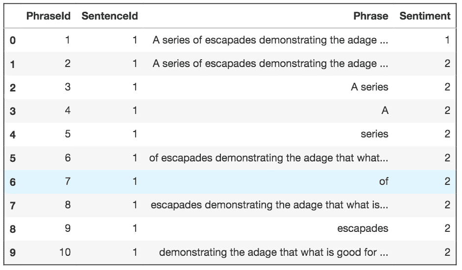
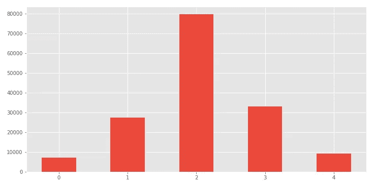
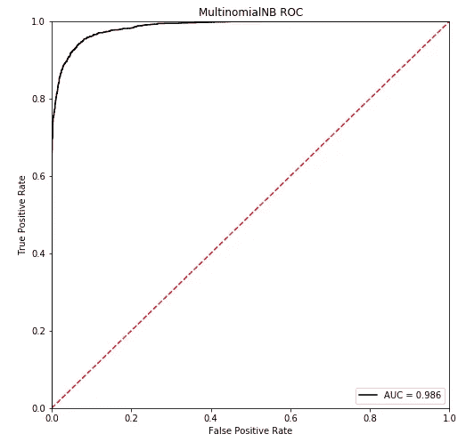

# 将机器学习模型部署为 REST API

> 原文：<https://towardsdatascience.com/deploying-a-machine-learning-model-as-a-rest-api-4a03b865c166?source=collection_archive---------0----------------------->


Artwork by [Igor Kozak](https://dribbble.com/igorkozak)

作为一名 Python 开发人员和数据科学家，我渴望构建 web 应用程序来展示我的工作。尽管我喜欢设计前端，但同时学习机器学习和应用程序开发变得非常困难。因此，我必须找到一种解决方案，能够轻松地将我的机器学习模型与其他开发人员集成，这些开发人员能够比我更好地构建一个健壮的 web 应用程序。

通过为我的模型构建 REST API，我可以将我的代码与其他开发人员分开。这里有明确的分工，这有利于定义责任，并防止我直接阻止不参与项目机器学习方面的队友。另一个优点是，我的模型可以被在不同平台上工作的多个开发人员使用，比如 web 或 mobile。

在本文中，我将构建一个简单的 Scikit-Learn 模型，并使用 [Flask RESTful](https://flask-restful.readthedocs.io/en/latest/) 将其部署为 REST API。本文特别面向没有广泛计算机科学背景的数据科学家。

# 关于模型

对于这个例子，我组装了一个简单的[朴素贝叶斯分类器](http://scikit-learn.org/stable/modules/generated/sklearn.naive_bayes.MultinomialNB.html)来预测电影评论中短语的情感。

数据来自 Kaggle 竞赛，[影评情感分析](https://www.kaggle.com/c/sentiment-analysis-on-movie-reviews/data)。评论被分成单独的句子，句子被进一步分成单独的短语。所有的短语都有一个情感分数，这样就可以训练一个模型，根据这个模型，哪些词可以给一个句子带来积极的、中性的或消极的情感。



Distribution of ratings from the Kaggle dataset

大多数短语的评级都是中性的。首先，我尝试使用多项式朴素贝叶斯分类器来预测 5 个可能类别中的一个。但是，因为大多数数据的等级为 2，所以该模型的表现不是很好。我决定保持简单，因为这个练习的要点主要是关于作为 REST API 进行部署。因此，我将数据限制在极端类别，并训练模型仅预测消极或积极的情绪。



结果证明，多项式朴素贝叶斯模型在预测积极和消极情绪方面非常有效。你可以在这个 [Jupyter 笔记本演练](https://nbviewer.jupyter.org/github/mnguyenngo/flask-rest-setup/blob/master/notebooks/sentiment_clf.ipynb)中找到模型训练过程的快速概述。在 Jupyter 笔记本中训练完模型后，我将代码转移到 Python 脚本中，并为 NLP 模型创建了一个类对象。你可以在这个[链接](https://github.com/mnguyenngo/flask-rest-setup/tree/master/sentiment-clf)找到我的 Github repo 中的代码。您还需要 [pickle](https://docs.python.org/3/library/pickle.html) 或保存您的模型，以便您可以快速地将训练好的模型加载到您的 API 脚本中。

现在我们有了模型，让我们将它部署为一个 REST API。

# REST API 指南

为 API 的 Flask 应用程序启动一个新的 Python 脚本。

## 导入库并加载 Pickles

下面的代码块包含许多 Flask 样板文件和加载分类器和矢量器 pickles 的代码。

```
from flask import Flask
from flask_restful import reqparse, abort, Api, Resource
import pickle
import numpy as np
from model import NLPModelapp = Flask(__name__)
api = Api(app)# create new model object
model = NLPModel()# load trained classifier
clf_path = 'lib/models/SentimentClassifier.pkl'
with open(clf_path, 'rb') as f:
    model.clf = pickle.load(f)# load trained vectorizer
vec_path = 'lib/models/TFIDFVectorizer.pkl'
with open(vec_path, 'rb') as f:
    model.vectorizer = pickle.load(f)
```

## 创建参数解析器

解析器将检查用户发送给 API 的参数。参数将位于 Python 字典或 JSON 对象中。对于这个例子，我们将特别寻找一个名为`query`的键。查询将是一个短语，用户将希望我们的模型预测该短语是积极的还是消极的。

```
# argument parsing
parser = reqparse.RequestParser()
parser.add_argument('query')
```

## 资源类对象

资源是 Flask RESTful APIs 的主要构件。每个类都可以有对应于 HTTP 方法的方法，比如:`GET`、`PUT`、`POST`和`DELETE`。`GET`将是主要方法，因为我们的目标是服务于预测。在下面的`get`方法中，我们提供了如何处理用户查询以及如何打包将返回给用户的 JSON 对象的指导。

```
class PredictSentiment(Resource):
    def get(self):
        # use parser and find the user's query
        args = parser.parse_args()
        user_query = args['query'] # vectorize the user's query and make a prediction
        uq_vectorized = model.vectorizer_transform(
            np.array([user_query]))
        prediction = model.predict(uq_vectorized)
        pred_proba = model.predict_proba(uq_vectorized) # Output 'Negative' or 'Positive' along with the score
        if prediction == 0:
            pred_text = 'Negative'
        else:
            pred_text = 'Positive'

        # round the predict proba value and set to new variable
        confidence = round(pred_proba[0], 3) # create JSON object
        output = {'prediction': pred_text, 'confidence': confidence}

        return output
```

有一个很棒的教程是由 [Flask-RESTful](https://flask-restful.readthedocs.io/en/latest/quickstart.html#resourceful-routing) 提供的，他们在其中构建了一个待办事项应用程序，并演示了如何使用`PUT`、`POST`和`DELETE`方法。

## 端点

以下代码将设置情绪预测器资源的基本 url。您可以想象您可能有多个端点，每个端点都指向一个不同的模型，该模型将做出不同的预测。一个例子可以是端点`'/ratings'`，它将用户引导到另一个模型，该模型可以预测给定类型、预算和制作成员的电影评级。您需要为第二个模型创建另一个资源对象。这些可以一个接一个地添加，如下所示。

```
api.add_resource(PredictSentiment, '/')

# example of another endpoint
api.add_resource(PredictRatings, '/ratings')
```

## Name ==主块

这里不多说了。如果要将此 API 部署到生产环境中，请将 debug 设置为 False。

```
if __name__ == '__main__':
    app.run(debug=True)
```

## 用户请求

下面是一些用户如何访问你的 API 的例子，这样他们就可以得到预测。

Jupyter 笔记本中的请求模块:

```
url = '[http://127.0.0.1:5000/'](http://127.0.0.1:5000/')
params ={'query': 'that movie was boring'}
response = requests.get(url, params)
response.json()Output: {'confidence': 0.128, 'prediction': 'Negative'}
```

在终端中使用 curl:

```
$ curl -X GET [http://127.0.0.1:5000/](http://127.0.0.1:5000/) -d query='that movie was boring'
{
    "prediction": "Negative",
    "confidence": 0.128
}
```

在终端中使用 HTTPie:

```
$ http [http://127.0.0.1:5000/](http://127.0.0.1:5000/) query=='that movie was boring'HTTP/1.0 200 OK
Content-Length: 58
Content-Type: application/json
Date: Fri, 31 Aug 2018 18:49:25 GMT
Server: Werkzeug/0.14.1 Python/3.6.3{
    "confidence": 0.128,
    "prediction": "Negative"
}
```

现在，我的队友只需向这个 API 发出请求，就可以将情绪预测添加到他们的应用程序中，而无需将 Python 和 JavaScript 混合在一起。

## 完整的`app.py`代码

有时在一个地方看到所有代码会很有帮助。

## 文件结构

我想包括的最后一件事是这个简单 API 的文件结构的概述。

```
sentiment-clf/
├── README.md
├── app.py  **# Flask REST API script**
├── build_model.py  **# script to build and pickle the classifier**
├── model.py  **# script for the classifier class object**
├── util.py  **# helper functions**
├── requirements.txt
└── lib/
    ├── data/  **# data from Kaggle**
    │   ├── sampleSubmission.csv
    │   ├── test.tsv
    │   └── train.tsv
    └── models/  **# pickled models for import into API script**
        ├── SentimentClassifier.pkl
        └── TFIDFVectorizer.pkl
```

## 部署

一旦你建立了你的模型和 REST API，并完成了本地测试，你就可以像部署 Flask 应用程序一样部署你的 API 到网络上的许多主机服务上。通过部署在 web 上，任何地方的用户都可以向您的 URL 发出请求以获得预测。[部署指南](http://flask.pocoo.org/docs/1.0/deploying/)包含在烧瓶文档中。

# 关闭

这只是为情感分类器构建 Flask REST API 的一个非常简单的例子。同样的过程可以应用于其他机器学习或深度学习模型，只要你训练并保存了它们。

除了将模型部署为 REST API 之外，我还使用 REST API 来管理我从 web 上收集的数据的数据库查询。这让我可以与全栈开发人员合作，而不必管理他们的 React 应用程序的代码。如果一个移动开发者想要开发一个应用，那么他们只需要熟悉 API 端点。

如果你有任何反馈或批评，请随时与我分享。如果本演练对您有所帮助，请喜欢👏文章。干杯！🍻