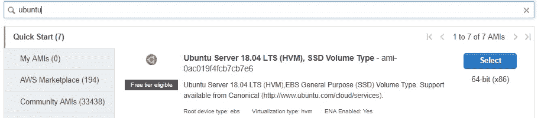
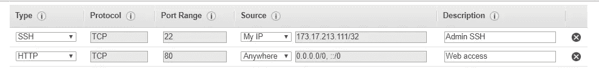
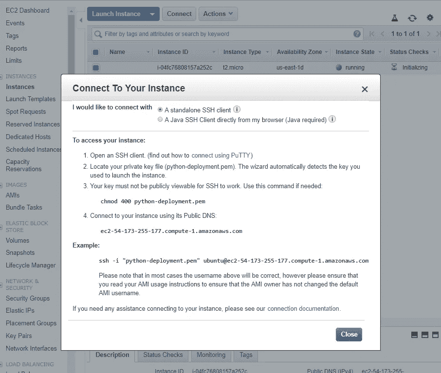
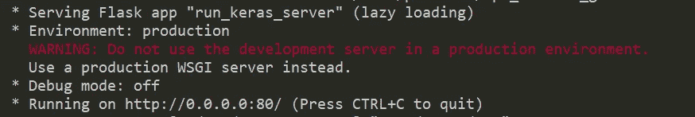
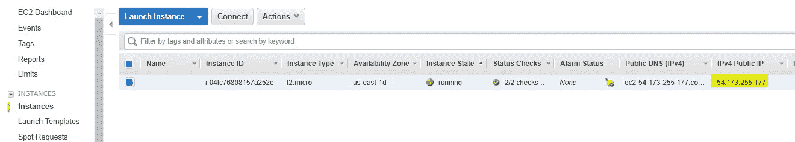
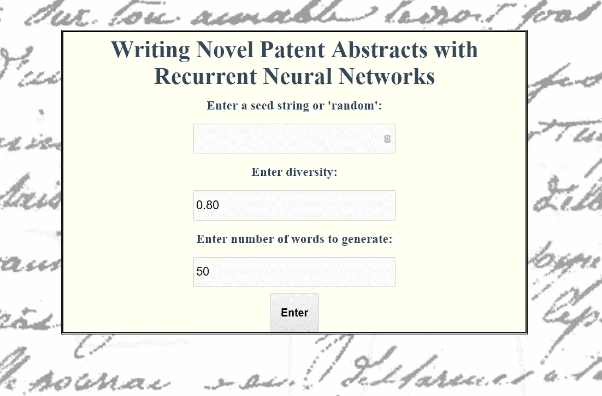
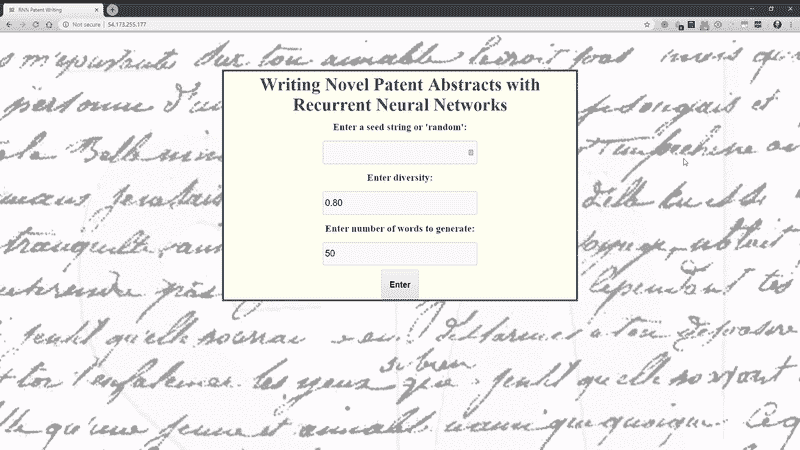

# 在 AWS 上部署 Python Web 应用程序

> 原文：<https://towardsdatascience.com/deploying-a-python-web-app-on-aws-57ed772b2319?source=collection_archive---------0----------------------->


([Source](https://www.pexels.com/photo/trees-surrounded-by-green-grass-field-during-daytime-164025/))

## 如何与世界分享您的 Python 项目

虽然我喜欢做数据科学和编程项目，因为我个人喜欢构建自己的东西，但与世界上的任何人在线分享您的项目也是一种快乐。幸运的是，多亏了亚马逊网络服务(AWS ),在几分钟内，我们就可以向全世界免费部署一个 Python 网络应用程序。

在本文中，我们将了解如何在免费的 EC2 实例上将深度学习 web 应用部署到 AWS。本文将使用内置于[的应用程序，部署一个 Keras 深度学习模型作为 Python](/deploying-a-keras-deep-learning-model-as-a-web-application-in-p-fc0f2354a7ff) 中的 Web 应用程序，通过 Python 中的示例使用在[递归神经网络中开发的模型。这两个都不是必需的，只需知道我们的应用程序使用 RNN 生成新颖的专利摘要。项目的所有代码都可以在 GitHub](/recurrent-neural-networks-by-example-in-python-ffd204f99470) 上找到[。](https://github.com/WillKoehrsen/recurrent-neural-networks)

## 亚马逊网络服务 EC2

[亚马逊网络服务](https://aws.amazon.com/)是亚马逊云计算产品系列的总称。我们将使用亚马逊弹性计算云(EC2) ，这是一项服务，我们在云中租用虚拟计算机来运行应用程序。AWS EC2 提供了一个免费层,因此我们可以不花一分钱进行部署。

首先，创建一个 AWS 账户，然后前往位于[https://console.aws.amazon.com/ec2](https://console.aws.amazon.com/ec2)的 EC2 控制台。点击 Launch Instance 按钮，选择一个[Amazon Machine Instance(AMI)](https://docs.aws.amazon.com/AWSEC2/latest/UserGuide/AMIs.html)“包含启动实例所需的软件配置(操作系统)的模板”你可以使用任何你熟悉的操作系统(尽管有些不符合免费层的条件)，但我将使用 Ubuntu Server 18.04:



AMI type (Ubuntu 18.04)

点击 Select，然后在下一页选择符合条件的 t2.micro 实例(实例是我们 AMI 的硬件)。这只有 1 个 CPU 和 1 GB 的 RAM，但实际上足以运行我们预先训练的递归神经网络应用程序！如果你期望更多的流量或者运行一个 cpu 密集型的应用程序，你可能不得不付钱。

## 安全组

选择所需的实例类型，然后转到选项卡 6。在页面顶部配置安全组。[安全组](https://cloudacademy.com/blog/aws-security-groups-instance-level-security/)过滤进出我们实例的流量——基本上，谁可以访问我们的虚拟计算机。

您(只有您)需要通过`ssh`访问实例，所以添加一个规则，允许 SSH 使用`Source`“My IP”。我们希望 *others* 能够在网络浏览器中访问我们的应用程序，所以添加一个规则来允许所有来源的 HTTP 访问。最终的安全配置是:



Security group rules

接下来，点击查看和启动，然后启动。这将显示使用[密钥对](https://www.comodo.com/resources/small-business/digital-certificates2.php)的选项。你需要这个来通过`ssh`访问服务器，所以请确保创建一个新的密钥对，并将私钥保存在你记得的地方。如果丢失，您将无法再次访问您的实例！

最后，点击 Launch Instances，Amazon 将启动您自己的虚拟机，该虚拟机实际位于… [某处](https://aws.amazon.com/about-aws/global-infrastructure/)。等待几分钟，让实例启动，然后进入下一步:连接到实例。

# 通过 SSH 连接到服务器

一旦实例启动并运行，在 EC2 [实例仪表板](https://console.aws.amazon.com/ec2/v2/home?region=us-east-1)上选择它(服务> EC2 >运行实例)并点击 Connect。这将为我们提供连接到实例的确切命令。



Connect dialog from EC2 running instances dashboard.

复制示例代码，并将其粘贴到 Bash 中，或者粘贴到在带有您的私钥的文件夹中运行的命令提示符中(在启动您的实例时生成)。假设一切顺利，您将登录到您的实例并看到一个熟悉的终端命令提示符。

## 安装要求

这个 AMI 配备了 [Python 3.6](https://www.python.org/downloads/release/python-360/) ，所以我们只需要克隆存储库并安装应用依赖项。首先，获取存储库:

```
git clone [https://github.com/WillKoehrsen/recurrent-neural-networks.git](https://github.com/WillKoehrsen/recurrent-neural-networks.git)
```

然后安装`pip`，移入资源库，安装需求。

```
sudo apt-get update
sudo apt-get install python3-pip
cd recurrent-neural-networks
pip3 install --user -r requirements.txt
```

## 运行和访问 Web 应用程序

运行应用程序很简单(第二个命令可能需要`sudo`):

```
cd deployment
python3 run_keras_server.py
```

(如果你想了解 web 应用程序中发生了什么，看看[以前的文章](/deploying-a-keras-deep-learning-model-as-a-web-application-in-p-fc0f2354a7ff)中的开发过程)。

您应该在终端中看到以下输出:



虽然看起来这个应用运行在 localhost:80/上，但那是在*虚拟机*上。为了访问 web 应用程序，我们必须使用实例的[公共 DNS IPv4](https://en.wikipedia.org/wiki/IPv4) ，它可以在正在运行的实例仪表板上找到。



Public DNS for running instance.

将地址复制并粘贴到您的浏览器中，您将看到该应用程序！



Homepage of the web application.

请随意使用递归神经网络应用程序。它所做的是用一个递归神经网络生成新的专利摘要，这个神经网络用关键词“神经网络”训练成千上万的摘要，你可以输入`random`作为随机的开始序列，或者你自己的序列。(要看发展，查看[这篇文章](/recurrent-neural-networks-by-example-in-python-ffd204f99470)或者[这个笔记本](https://github.com/WillKoehrsen/recurrent-neural-networks/blob/master/notebooks/Deep%20Dive%20into%20Recurrent%20Neural%20Networks.ipynb))。



Keras recurrent neural network application.

现在，世界上任何人都可以通过 IPv4 访问您的应用程序。如果您想让应用程序在您注销实例后继续运行，请在[屏幕会话](https://www.gnu.org/software/screen/manual/screen.html)中运行它。( [Screen 是一个方便的程序](https://www.gnu.org/software/screen/)，它可以让你使用虚拟控制台从一个终端窗口运行终端会话。)

```
# From within recurrent-neural-networks/deployment
screen -R deploy
python3 run_keras_server.py
```

我的(如果我没有关闭它或遇到错误)应用程序应该在[http://54.173.255.177/](http://54.173.255.177/)运行。因为我使用的是 t2.micro 实例，所以永久运行这个 web 应用程序的成本正好是$0.00！如果你想要一个域名，你可以从[域名注册商](https://en.wikipedia.org/wiki/Domain_name_registrar)比如[哈弗](https://www.hover.com/)那里拿一个。

## 后续步骤

尽管这是一个快速部署个人项目的不错的解决方案，但这不是一个[生产就绪的部署](http://guides.beanstalkapp.com/deployments/best-practices.html)！为此，你要确保使用[适当的安全措施(HTTPS 和认证证书)](https://blog.miguelgrinberg.com/post/running-your-flask-application-over-https)。您还需要确保您的[应用程序能够处理预期的流量。](https://github.com/locustio/locust)仅将此特定解决方案用于没有敏感数据的小型项目。

# 结论

我们确实生活在一个不可思议的时代:使用 Flask，我们可以在几分钟内开发一个 Python web 应用程序，然后我们可以使用 AWS 将其免费部署到世界各地。我们遵循的一般流程是:开发一个 web 应用程序(最好用 Python)，从云提供商那里租用商用硬件，然后向全世界部署一个 web 应用程序。

如果您能够遵循所有教程，从递归神经网络的[实现](/recurrent-neural-networks-by-example-in-python-ffd204f99470)到[开发本地 web 应用](/deploying-a-keras-deep-learning-model-as-a-web-application-in-p-fc0f2354a7ff)到在 AWS 上部署，那么您将完成一个令人印象深刻的项目！从一个空白文件到一个正在运行的 web 应用程序的整个过程可能令人望而生畏，但是像大多数技术问题一样，如果你把它分解，每一步都不是压倒性的，有许多开源工具可以使这个过程变得容易。如果你是一个厌倦了在 Jupyter 笔记本上做独立分析的数据科学家，那就主动做一个可以作为应用程序部署的项目。扩展到其他学科是很好的，构建和部署 web 应用程序是学习一些新技能的好机会。

一如既往，我欢迎反馈和建设性的批评。可以通过 Twitter [@koehrsen_will](http://twitter.com/@koehrsen_will) 或者通过我的个人网站 [willk.online](https://willk.online) 找到我。