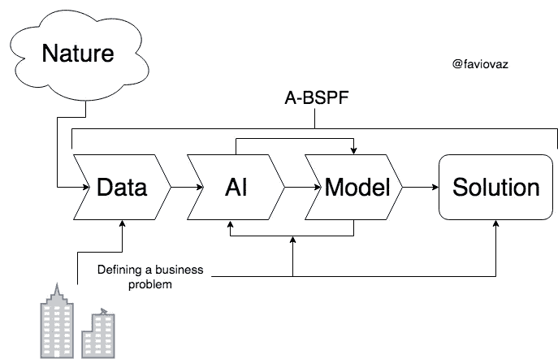
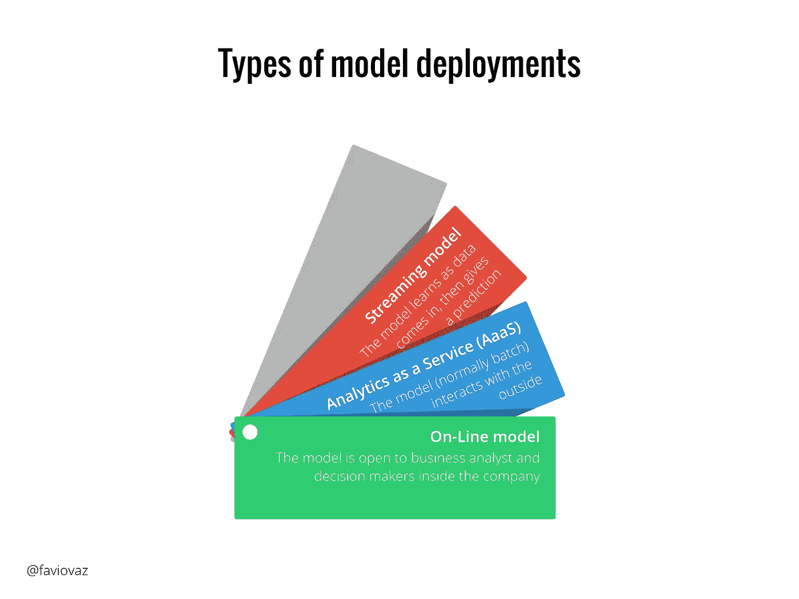
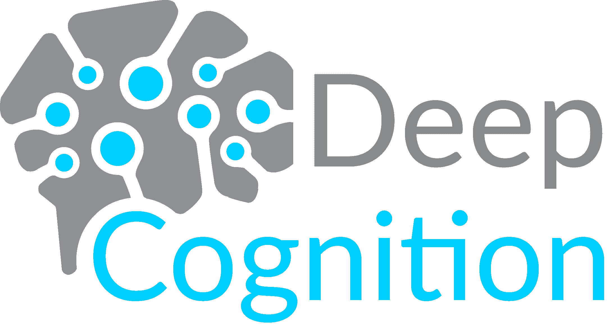

# 部署深度学习模型

> 原文：<https://towardsdatascience.com/deploying-deep-learning-models-e9e4d7dda3ff?source=collection_archive---------10----------------------->

## 创建模型是一回事，但是部署模型来解决业务问题是另一回事。看看部署深度学习模型的最佳选择之一。

# 什么是模型？

[https://towardsdatascience.com/creating-intelligence-with-data-science-2fb9f697fc79](/creating-intelligence-with-data-science-2fb9f697fc79)

我们人类**模拟**这个世界，用我们的智慧去理解事物的运作方式，并用这种理解和知识去解决困难和复杂的问题。建模是理解“现实”，我们周围的世界，但创建一个更高层次的原型来描述我们看到的，听到的和感觉到的东西的过程，但它是一个代表性的东西，而不是“实际”或“真实”的东西。

在[过去的一篇文章](/ai-for-business-9cf9ec23ea1d)中，我谈到了用人工智能和数据科学解决商业问题的过程，

这里的模型是由像深度学习(DL)算法这样的人工智能创建的。如果您想了解更多关于 DL 的信息，您可以阅读以下内容:

 [## 深度学习的“怪异”介绍

### 有关于深度学习的惊人介绍、课程和博文。但这是一种不同的介绍…

towardsdatascience.com](/a-weird-introduction-to-deep-learning-7828803693b0)  [## 关于深度学习的对话

### 有人无意中听到两个人谈论深度学习，让我知道每一个小细节。其中一个完全…

towardsdatascience.com](/a-conversation-about-deep-learning-9a915983107) 

好了，你刚刚创建了一个模型(比如说一个 DL 模型)来解决一个业务问题，现在你想把它投入生产。

# 什么是生产？

投入生产对你们每个人来说都有不同的意义。

对一些人来说，将模型投入生产意味着任何人都可以使用模型来计算、测量或观察某些东西。例如，这里一个闪亮的仪表板后面有一个简单的模型，业务分析师可以访问它，它可以是一个“生产化”的模型。

对其他人来说意味着让模型做一些事情或者与客户互动。就像在你的移动应用程序中让一个模型预测当人们向你借钱时你是否应该借钱给他们。

我创建了这个简单的图表来指定部署模型的不同方式:

在这里，我将教你如何通过深度认知将深度学习在线模型或 AaaS 模型部署到生产服务中。

# 部署您的 DL 模型

deepcognition.ai

如果你想了解更多关于深度认知和他们的深度学习工作室(DLS ),看看这个:

 [## 深度认知让深度学习变得简单

### 在过去的一个月里，我有幸见到了 DeepCognition.ai 的创始人

becominghuman.ai](https://becominghuman.ai/deep-learning-made-easy-with-deep-cognition-403fbe445351)  [## 深度认知的视频漫游

### 大家好！在本文中，我将与您分享几个视频，带您浏览深度认知的平台…

towardsdatascience.com](/a-video-walkthrough-of-deep-cognition-fd0ca59d2f76) 

一旦模型构建完成，DLS 允许将模型部署为 REST API。除了部署 REST API 之外，还生成并部署了一个简单的基于表单的 Web 应用程序，用于快速测试和共享。

这些 REST API 或 Web app 可以用作在线模型或 AaaS。要部署您的模型，您有两种选择:

*   上传您的 DL 代码(如 keras 或 TF)，系统会识别它，您可以用 DLS 和您的数据训练它，然后您必须单击部署部分。
*   从头开始用 DLS 创建你的模型，然后训练和部署它。

这里有一个视频来自过去的帖子，您可以从中了解如何部署它:

基本上这些是步骤:

*   点击**部署**选项卡。
*   选择**训练跑步。**
*   输入服务名称。
*   选择是否要在您的实例(可以是 web 或本地，如您的公司集群)或远程实例(如 AWS、GCP、Azure 等)中部署它。)
*   点击**部署**按钮。

就是这样！如果你能以一种非常简单的方式免费完成，你就不必花几个小时去想如何去做。我使用这种方法的经验非常成功。

**部分推荐:**

*   如果您想要高可用性，就有一个专用的实例来部署您的模型。
*   确保您使用了良好的培训结果，并且在投入生产之前已经验证了您的参数。
*   读读这个:

 [## 操作机器学习:成功 MLOps 的七个考虑因素

### 机器学习无处不在。从广告到物联网到医疗保健等等，几乎所有行业都…

www.kdnuggets.com](https://www.kdnuggets.com/2018/04/operational-machine-learning-successful-mlops.html)  [## 将机器学习模型转化为实际产品和服务的经验教训

### 人工智能仍处于初级阶段。今天，只有 15%的企业在使用机器学习，但是两倍…

www.oreilly.com](https://www.oreilly.com/ideas/lessons-learned-turning-machine-learning-models-into-real-products-and-services) 

如果您有任何问题，请在 Twitter 上关注我:

 [## 法维奥·巴斯克斯(@法维奥·巴斯克斯)|推特

### Favio Vázquez 的最新推文(@FavioVaz)。数据科学家。物理学家和计算工程师。我有一个…

twitter.com](https://twitter.com/faviovaz) 

和 LinkedIn:

 [## favio vázquez——science ia y Datos | LinkedIn 创始人

### 查看 Favio Vázquez 在世界上最大的职业社区 LinkedIn 上的个人资料。Favio 有 16 个工作列在他们的…

www.linkedin.com](https://www.linkedin.com/in/faviovazquez/) 

那里见:)