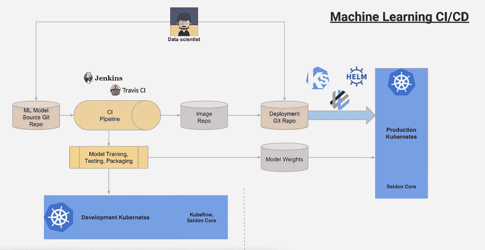

# 部署深度学习模型:第 1 部分概述

> 原文：<https://towardsdatascience.com/deploying-deep-learning-models-part-1-an-overview-77b4d01dd6f7?source=collection_archive---------1----------------------->

Diagram overviewing the CI/CD deployment process with Kubernetes. [Taken from Kubecon slideshow](https://schd.ws/hosted_files/kccnceu18/1a/SeldonKubeconEurope2018.pdf)

最近，学术界和行业研究人员在深度学习领域进行了大量令人兴奋和开创性的研究。他们开发了许多功能强大得令人难以置信的新型号。然而，这种研究的大部分(少数科技巨头之外)仍然只是研究，而不是生产应用的一部分。尽管新论文不断涌现，但在生产中实际利用这些模型仍然非常困难(即使论文提供了代码)。部署机器学习模型仍然是一个重大挑战。在这篇文章中，我将概述“生产化”机器学习模型的各种方法，并权衡它们各自的利弊，而不会涉及太多细节。在后续文章中，我将通过实际代码和示例来探索这些方法。

## **挑战**

我们将假设我们已经自己训练了模型，或者已经从互联网上获得了训练的权重。为了在应用程序中使用您的模型，您必须:

1.  用模型的权重加载模型
2.  预处理您的数据
3.  执行实际预测
4.  处理预测响应数据

听起来够简单吧？实际上，这个过程可能非常复杂。

像许多事情一样，关于将机器学习模型部署到生产环境的最佳方式，没有一个明确的答案。你应该问自己的问题是:

1.  我的要求是什么？(例如，您预计每秒有多少请求，需要多长时间的延迟等等)
2.  我将如何评估模型在生产中的表现？(我将如何收集和存储来自交互的额外数据)
3.  我计划多长时间重新培训一次我的模型？
4.  有哪些数据预处理需求？
5.  生产输入数据的格式是否会与模型训练数据大相径庭？它会分批来还是一股一股来？
6.  模型需要能够离线运行吗？

这些是您在尝试部署您的模型之前应该问的基本问题。

## **将模型直接加载到应用程序中**

这个选项本质上将模型视为整个应用程序的一部分，因此将它加载到应用程序中。这种方法在某些情况下比其他情况更容易。

例如，如果核心应用程序本身是用 Python 编写的，这个过程可能会很顺利。总之，它通常需要在设置/配置文件中添加依赖项，并修改您的预测函数，以便通过适当的用户交互来调用。模型是作为应用程序的一部分加载的，所有依赖项都必须包含在应用程序中。

如果您的应用程序不是用 Python 编写的，这个过程会变得更加困难。例如，没有好的方法将 PyTorch 或 Caffe 加载到 Java 程序中。即使是有 Java 库的 Tensorflow，也需要编写大量额外的代码才能完全集成到应用程序中。最后，这并没有明确解决可伸缩性的问题。

然而，如前所述，当您想要快速部署用 Python 编写的应用程序时，这种方法仍然是有益的。它也是没有互联网连接的设备的较好选择之一。

## **调用 API**

第二个选项包括创建一个 API 并从您的应用程序中调用该 API。这可以通过多种不同的方式来实现。我在这里详细介绍了最常见的方式。

**Kubernetes**

在许多方面，Docker 似乎是部署机器学习模型的自然选择。一个模型及其所有的依赖项可以整齐地打包在一个容器中。此外，服务器可以在需要时通过添加更多 Docker 容器来自动扩展。Kubernetes 是管理 Docker 容器的最佳方式之一，因此有利于机器学习。

最近，Kubernetes [发布了 Kubeflow](https://techcrunch.com/2018/05/04/google-kubeflow-machine-learning-for-kubernetes-begins-to-take-shape/) ，旨在将机器学习引入 Kubernetes 框架。Kubeflow 试图使训练、测试和部署您的模型以及收集评估指标变得容易。我计划在以后的博客中介绍 Kubeflow，因为它可能非常复杂。现在只需要理解它是一个完整的软件包，旨在使大规模开发和部署机器学习微服务变得容易。

**用 Flask/Django 定制 REST-API**

另一个选择是根据您对制作 API 的熟悉程度，从头开始创建自己的 REST-API(这个选项也可以与 Docker 结合使用)。这可以使用烧瓶[相对容易地完成](https://blog.hyperiondev.com/index.php/2018/02/01/deploy-machine-learning-model-flask-api/)。我不会详细讨论如何做到这一点，因为已经有很多教程详细介绍了这个主题。根据请求的数量，您通常可以轻松扩展 Flask。

然而，由于 ML 框架、加载时间和特定的模型预处理需求的差异，即使这样也会变得相当混乱。目前，我正在开发一个用于 Flask/Django 的[模型不可知实例化](https://github.com/isaacmg/model_agnostic_prediction)类，以便更容易使用模型，并提供一个使用模型的标准化模板。因此，你可以调用`model.preprocess()`和`model.predict()`而不用考虑后端，而不必记住并实现不同模型的不同函数(另一篇文章中也有更多相关内容)。

**AWS Lambda/无服务器**

AWS Lambda 是另一条可能的路线。你可以阅读 AWS 的文档来了解如何设置。在“机器学习”中有一篇关于使用 AWS lambda 和 Caffe2 的好文章

## 其他方法

**Apache Beam** —我不太了解这种方法，但该方法似乎涉及到使用 Beam 做模型预处理，然后 Tensorflow(目前只支持框架)做实际预测。查看这些幻灯片了解更多信息。

**火花/火花**

Spark 和 Flink 等几个主要的数据处理框架正在开发软件包，以帮助部署机器学习模型。Flink 有 [Flink Tensorflow](https://github.com/FlinkML/flink-tensorflow) 旨在将 TF 模型集成到 Flink 流管道中。对于 Spark，有许多不同的包和集成深度学习的尝试。此外，雅虎最近发布了自己的 [*库*](https://github.com/yahoo/TensorFlowOnSpark) ，允许分布式训练和模型服务。

## 结论

在未来的文章中，我将更详细地介绍如何用 Kubeflow 构建一个 API 来服务模型，并讨论如何将深度学习模型加载到 Java 程序和 Flink 管道中。