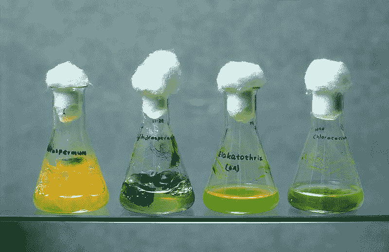
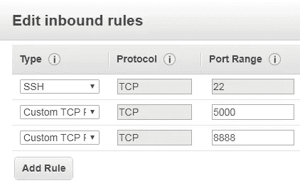

# 使用 Flask 部署 Keras 深度学习模型

> 原文：<https://towardsdatascience.com/deploying-keras-deep-learning-models-with-flask-5da4181436a2?source=collection_archive---------2----------------------->



Source: Wikimedia Commons

这篇文章演示了如何使用用 [Keras](https://keras.io/) 构建的深度学习模型来设置端点以服务于预测。它首先介绍了一个使用 [Flask](http://flask.pocoo.org/) 来设置 Python 端点的例子，然后展示了在使用 Flask 为预测构建 Keras 端点时需要解决的一些问题。

将深度学习模型产品化具有挑战性，或者至少在过去对我来说是如此，原因有很多:

*   **模型序列化:**序列化模型的标准方法，比如 PMML，只有有限的支持。例如 [keras2pmml](https://github.com/vaclavcadek/keras2pmml) 缺少 relu 激活，这意味着我在[模型生产](/data-science-for-startups-model-production-b14a29b2f920)帖子中提出的数据流+ PMML 方法是不可行的。
*   **大型库:**在我过去的[帖子](/data-science-for-startups-model-services-2facf2dde81d)中，我展示了如何使用 AWS lambda 函数来托管 [scikit-learn](http://scikit-learn.org/) 模型。这种方法对于 Keras 是有问题的，因为未压缩的 Keras 和 Tensorflow 库超过了 AWS lambda 的 256MB 文件上传限制。
*   **运行时间:**批处理和实时预测都很难伸缩，因为我的大部分模型预测经验都是用 Java 编写的。我之前在[的博客](/data-science-for-startups-model-production-b14a29b2f920)中提到使用 Jetty 提供实时评估，使用 Google 的数据流提供批量评估。这篇文章展示了当你需要使用 Python 库进行估算时，如何使用 Flask 来代替 Jetty。

这篇文章的目的是展示如何使用 AWS 在 EC2 实例上设置一个 Keras 模型作为端点。我从探索下面的例子开始:

[](https://blog.keras.io/building-a-simple-keras-deep-learning-rest-api.html) [## 构建一个简单的 Keras +深度学习 REST API

### 这篇文章中的例子将作为构建你自己的深度学习 API 的模板/起点…

blog.keras.io](https://blog.keras.io/building-a-simple-keras-deep-learning-rest-api.html) 

我将讨论的一些问题包括在 Keras 中使用模型持久性时处理自定义指标，在 Keras 与 Flask 结合使用时处理多线程问题，以及让它在 EC2 实例上运行。这篇文章的完整代码清单可以在 [GitHub](https://github.com/bgweber/StartupDataScience/blob/master/DeepLearning/Flask_Keras.ipynb) 上找到。

这篇文章介绍了如何设置一个简单的 Flask 应用程序，然后展示了如何使用 Flask 来设置一个带有 Keras 模型的端点。它假设读者熟悉用 jupyter 设置 EC2 实例，这将在[这里](/data-science-for-startups-r-python-2ca2cd149c5c)讨论。

## 带烧瓶的 Hello World

Flask 是一个 Python 库，它使得设置可以通过 web 调用的 Python 函数变得很容易。它使用注释来提供关于在哪些端点设置哪些功能的元数据。要使用 Flask，您首先需要安装模块:

```
pip3 install --user Flask
```

为了熟悉 Flask，我们将设置一个简单的函数来回显传入的参数。下面的代码片段首先实例化一个 Flask 应用程序，定义函数，然后启动应用程序。使用 Flask， *app.route* 注释用于指定在 web 上的何处使函数可用，以及允许哪些方法。使用下面的代码，该功能将在`*location:5000/predict*`可用。该函数检查`request.json`和`request.args`对象的输入参数，这些参数的使用基于函数的调用方式(例如*浏览器 get vs curl post* )。如果一个*消息*参数已经被传递给该函数，当它被回显到该函数返回的 JSON 响应时。

```
**# load Flask** import flask
app = flask.Flask(__name__)**# define a predict function as an endpoint** [@app](http://twitter.com/app).route("/predict", methods=["GET","POST"])
def predict():
    data = {"success": False} **# get the request parameters**    params = flask.request.json
    if (params == None):
        params = flask.request.args **# if parameters are found, echo the msg parameter** 
    if (params != None):
        data["response"] = params.get("msg")
        data["success"] = True **# return a response in json format**    return flask.jsonify(data)**# start the flask app*, allow remote connections*** app.run(host='0.0.0.0')
```

当您运行`python3 [Flask_Echo.py](https://github.com/bgweber/StartupDataScience/blob/master/DeepLearning/Flask_Echo.py)`时，您将得到以下结果:

```
* Running on [http://127.0.0.1:5000/](http://127.0.0.1:5000/) (Press CTRL+C to quit)
```

我们现在可以连接到函数来测试它。为了支持远程连接，我加入了`host='0.0.0.0'`，因为 Flask 应用程序运行在 EC2 实例上。如果您使用 EC2，您需要修改安全组以允许在端口 5000 上访问 Flask，类似于在 8888 上允许 Jupyter 访问。



Inbound rules for the EC2 instance.

可以使用 web 浏览器或 curl 调用该函数。我用的是 Windows 环境下的 curl，不然你可以用`-d '{"msg":"Hello World"}'`。两种方法的结果是一样的，来自客户端的 JSON 响应重复了传入的 *msg* 参数。

```
**# Browser** 
[http://](http://localhost:5000/predict?msg=HelloWorld1)[54.227.110.43](http://54.227.110.43:5000/predict?g1=1&g2=0&g3=0&g4=0&g5=0&g6=0&g7=0&g8=0&g9=0&g10=0)[:5000/predict?msg=HelloWorld](http://localhost:5000/predict?msg=HelloWorld1)**# Curl** >curl -X POST -H "Content-Type: application/json" -d "{ \"msg\":
\"Hello World\" }" [http://](http://localhost:5000/predict)[54.227.110.43](http://54.227.110.43:5000/predict?g1=1&g2=0&g3=0&g4=0&g5=0&g6=0&g7=0&g8=0&g9=0&g10=0)[:5000/predict](http://localhost:5000/predict)**# Response** {
  "response": "Hello World",
  "success": true
}
```

我们现在有能力将 Python 函数设置为 web 端点，下一步是让函数调用一个经过训练的深度网络。

## 弗拉斯克&克拉斯

要使用 Keras 进行深度学习，我们需要首先用 Keras 和 Tensorflow 库设置环境，然后训练一个模型，我们将通过 Flask 在 web 上公开该模型。

```
**# Deep Learning setup** pip3 install --user tensorflow
pip3 install --user keras
pip3 install --user  pandas
```

因为我使用了一个没有附加 GPU 的 EC2 实例，所以在 CPU 模式下运行 Keras 不需要额外的配置。

**模型训练** 我用一个简单的网络结构创建了一个二元分类器。模型的输入是描述用户以前玩过哪些游戏的特征数组，输出是玩家将来玩特定游戏的可能性。关于训练模型的更多细节可以在我过去关于深度学习的[帖子](/data-science-for-startups-deep-learning-40d4d8af8009)中找到。

```
**# import panda, keras and tensorflow** import pandas as pd
import tensorflow as tf
import keras
from keras import models, layers**# Load the sample data set and split into x and y data frames** df = pd.read_csv("https://github.com/bgweber/Twitch/raw/
                      master/Recommendations/games-expand.csv")
x = df.drop(['label'], axis=1)
y = df['label']**# Define the keras model** model = models.Sequential()
model.add(layers.Dense(64, activation='relu', input_shape=(10,)))
model.add(layers.Dropout(0.1))
model.add(layers.Dense(64, activation='relu'))
model.add(layers.Dropout(0.1))
model.add(layers.Dense(64, activation='relu'))
model.add(layers.Dense(1, activation='sigmoid'))

**# Use a custom metricfunction** def auc(y_true, y_pred):
    auc = tf.metrics.auc(y_true, y_pred)[1]
   keras.backend.get_session().run(tf.local_variables_initializer())
    return auc **# Compile and fit the model** model.compile(optimizer='rmsprop',loss='binary_crossentropy',
              metrics=[auc])
history = model.fit(x, y, epochs=100, batch_size=100,
                    validation_split = .2, verbose=0) **# Save the model in h5 format** model.save("games.h5")
```

代码片段定义了一个自定义指标函数，用于训练模型以优化 ROC AUC 指标。这段代码的主要附加部分是最后一步，它将模型序列化为 h5 格式。我们可以稍后将这个模型加载到 Flask 应用程序中，以服务于模型预测。可以通过运行生成`games.h5`的`python3 [Flask_Train.py](https://github.com/bgweber/StartupDataScience/blob/master/DeepLearning/Flask_Train.py)`来训练模型。

**模型部署
用于模型预测的完整代码清单如下所示。代码的整体结构与我们前面的例子相同，但是主要的区别是在定义预测函数之前加载模型，并在预测函数中使用模型。为了重新加载模型，我们需要使用 *custom_objects* 参数将自定义度量函数作为输入参数传递给 *load_model* 。**

```
**# Load libraries** import flask
import pandas as pd
import tensorflow as tf
import keras
from keras.models import load_model

***# instantiate flask*** app = flask.Flask(__name__)

***# we need to redefine our metric function in order 
# to use it when loading the model*** def auc(y_true, y_pred):
    auc = tf.metrics.auc(y_true, y_pred)[1]
   keras.backend.get_session().run(tf.local_variables_initializer())
    return auc

***# load the model, and pass in the custom metric function*** global graph
graph = tf.get_default_graph()
model = load_model('games.h5', custom_objects={'auc': auc})

***# define a predict function as an endpoint*** @app.route("/predict", methods=["GET","POST"])
def predict():
    data = {"success": False}

    params = flask.request.json
    if (params == None):
        params = flask.request.args

 ***# if parameters are found, return a prediction***    if (params != None):
        x=pd.DataFrame.from_dict(params, orient='index').transpose()
        with graph.as_default():
            data["prediction"] = str(model.predict(x)[0][0])
            data["success"] = True

 ***# return a response in json format***    return flask.jsonify(data)    

*#* ***start the flask app, allow remote connections*** app.run(host='0.0.0.0')
```

使用`tf.get_default_graph()`建立对张量流图的引用也是必要的。如果省略此步骤，预测步骤期间可能会发生异常。条件`with graph.as_default()`用于在进行预测时获取对图的线程安全引用。在预测函数中，请求参数被转换为数据帧，然后传递给 Keras 模型进行预测。关于使用传入参数的更多细节在我的[模型即服务](/data-science-for-startups-model-services-2facf2dde81d)帖子中有所介绍。

可以通过运行`python3 [Flask_Deploy.py](https://github.com/bgweber/StartupDataScience/blob/master/DeepLearning/Flask_Deploy.py)`来部署 Flask app。你可以像以前一样连接到应用程序，但是你需要指定属性 *G1* 到 *G10* 的值。我使用浏览器测试端点，结果如下:

```
**# Browser** [http://54.227.110.43:5000/predict?g1=1&g2=0&g3=0&g4=0&g5=0&g6=0&g7=0&g8=0&g9=0&g10=0](http://54.227.110.43:5000/predict?g1=1&g2=0&g3=0&g4=0&g5=0&g6=0&g7=0&g8=0&g9=0&g10=0)**# Response** {
 "prediction":"0.04930059",
 "success":true}
}
```

您现在有了一个 EC2 实例，可以在 web 上提供 Keras 预测服务！

# 结论

部署深度学习模型并不简单，因为您需要使用支持 tensorflow 运行时的环境。为了以服务的形式提供 Keras 模型，我展示了如何使用 Flask 来为预先训练好的模型提供预测服务。这种方法不如我在上一种方法中讨论的 AWS lambda 方法可伸缩，但可能更适合您的用例。在原型制作时，Flash 对于设置本地服务也很有用。

理想情况下，我希望能够将 Flask 中的注释与 AWS lambda 的可伸缩性结合起来，而不需要将库安装到目录中并上传结果的中间步骤。AWS SageMaker 有助于实现这一目标，我将在未来几周内更详细地探索这一工具。

本·韦伯是 Zynga 的首席数据科学家。我们正在[招聘](https://www.zynga.com/careers/positions/categories/data-analytics-user-research)！