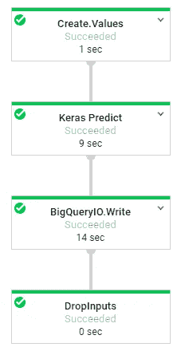
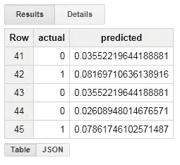

# 用 Java 部署 Keras 深度学习模型

> 原文：<https://towardsdatascience.com/deploying-keras-deep-learning-models-with-java-62d80464f34a?source=collection_archive---------2----------------------->


Source: Wikipedia

Keras 库为深度学习提供了一个可接近的接口，使神经网络可以为广大受众所用。然而，我所面临的挑战之一是从在 Keras 中探索模型过渡到产品化模型。Keras 是用 Python 编写的，直到最近，在这些语言之外还只有有限的支持。虽然 Flask、PySpark 和 Cloud ML 等工具使得直接用 Python 将这些模型产品化成为可能，但我通常更喜欢用 Java 来部署模型。

像 [ONNX](https://github.com/onnx/onnx) 这样的项目正在走向深度学习的标准化，但支持这些格式的运行时仍然有限。一种常用的方法是将 Keras 模型转换成张量流图，然后在其他支持张量流的运行程序中使用这些图。我最近发现了 Deeplearning4J (DL4J)项目，该项目原生支持 Keras 模型，使得用 Java 进行深度学习变得很容易。

[](https://deeplearning4j.org/docs/latest/keras-import-overview) [## Keras 导入概述| Deeplearning4j

### Keras 模型导入提供了导入最初使用 Keras 配置和训练的神经网络模型的例程…

deeplearning4j.org](https://deeplearning4j.org/docs/latest/keras-import-overview) 

我一直在探索的深度学习的一个用例是使用 Keras 在 Python 中训练模型，然后使用 Java 将模型产品化。这对于需要直接在客户端进行深度学习的情况很有用，比如 Android 设备应用模型，以及想要利用现有的用 Java 编写的生产系统的情况。关于使用 Keras 的 DL4J 介绍可以在[这里](https://deeplearning4j.org/docs/latest/keras-import-overview)找到。

这篇文章概述了用 Python 训练 Keras 模型，并用 Java 部署它。我使用 Jetty 提供实时预测，使用 Google 的数据流构建批量预测系统。GitHub 上提供了运行这些示例所需的全部代码和数据。

[](https://github.com/bgweber/DeployKeras/tree/master) [## bgweber/DeployKeras

### GitHub 是人们构建软件的地方。超过 2800 万人使用 GitHub 来发现、分享和贡献超过…

github.com](https://github.com/bgweber/DeployKeras/tree/master) 

## 模特培训

第一步是使用 Python 中的 Keras 库训练一个模型。一旦有了准备部署的模型，就可以将其保存为 h5 格式，并在 Python 和 Java 应用程序中使用它。在本教程中，我们将使用我在 Flask 上的博客文章中训练的预测哪些玩家可能会购买新游戏的相同模型。

[](/deploying-keras-deep-learning-models-with-flask-5da4181436a2) [## 使用 Flask 部署 Keras 深度学习模型

### 这篇文章演示了如何使用 Keras 构建的深度学习模型来设置端点以服务于预测。它…

towardsdatascience.com](/deploying-keras-deep-learning-models-with-flask-5da4181436a2) 

模型的输入是描述玩家已经购买的游戏的十个二元特征( *G1，G2，…，G10* ),标签是描述用户是否购买了不包括在输入中的游戏的单个变量。培训过程中涉及的主要步骤如下所示:

```
import keras
from keras import models, layers**# Define the model structure** model = models.Sequential()
model.add(layers.Dense(64, activation='relu', input_shape=(10,)))
...
model.add(layers.Dense(1, activation='sigmoid'))**# Compile and fit the model** model.compile(optimizer='rmsprop',loss='binary_crossentropy',
              metrics=[auc])
history = model.fit(x, y, epochs=100, batch_size=100,
                    validation_split = .2, verbose=0)**# Save the model in h5 format** model.save("games.h5")
```

这个过程的输出是一个 h5 文件，它表示我们可以在 Python 和 Java 应用程序中部署的经过训练的模型。在我过去的帖子中，我展示了如何使用 Flask 在 Python 中提供实时模型预测。在这篇文章中，我将展示如何用 Java 构建批处理和实时预测。

## Java 设置

为了用 Java 部署 Keras 模型，我们将使用 Deeplearing4j 库。它为 Java 中的深度学习提供了功能，并可以加载和利用用 Keras 训练的模型。我们还将使用数据流进行批量预测，使用 Jetty 进行实时预测。以下是我在这个项目中使用的库:

*   [**deep learning 4j**](https://deeplearning4j.org/)**:**为 Java 提供深度神经网络功能。
*   [**ND4J**](https://nd4j.org/)**:**为 Java 提供张量运算。
*   [**Jetty**](https://www.eclipse.org/jetty/)**:**用于设置 web 端点。
*   [**云数据流:**](https://cloud.google.com/dataflow/) 为 GCP 上的批量预测提供自动缩放。

我使用下面显示的 [pom.xml](https://github.com/bgweber/DeployKeras/blob/master/pom.xml) 将它们导入到我的项目中。对于 DL4J，使用 Keras 时需要核心库和模型导入库。

```
<dependencies>
  <dependency>      
    <groupId>org.deeplearning4j</groupId>      
    <artifactId>deeplearning4j-core</artifactId>
    <version>1.0.0-beta2</version>    
  </dependency>         
  <dependency>      
    <groupId>org.deeplearning4j</groupId>      
    <artifactId>deeplearning4j-modelimport</artifactId>      
    <version>1.0.0-beta2</version>    
  </dependency>                       
  <dependency>      
    <groupId>org.nd4j</groupId>      
    <artifactId>nd4j-native-platform</artifactId>
    <version>1.0.0-beta2</version>    
  </dependency>
  <dependency>      
    <groupId>org.eclipse.jetty</groupId>      
    <artifactId>jetty-server</artifactId>      
    <version>9.4.9.v20180320</version>   
  </dependency>  <dependency>      
    <groupId>com.google.cloud.dataflow</groupId>      
    <artifactId>google-cloud-dataflow-java-sdk-all</artifactId>  
    <version>2.2.0</version>     
  </dependency>
</dependencies>
```

我在 Eclipse 中设置了我的项目，一旦我正确配置了 pom 文件，就不需要额外的设置就可以开始了。

## 使用 DL4J 的 Keras 预测

现在我们已经建立了库，我们可以开始使用 Keras 模型进行预测。我编写了下面的脚本来测试加载 Keras 模型并对样本数据集进行预测。第一步是从 h5 文件中加载模型。接下来，我定义一个长度为 10 的 1D 张量，并生成随机的二进制值。最后一步是对模型调用 output 方法来生成预测。因为我的模型只有一个输出节点，所以我使用 *getDouble(0)* 来返回模型的输出。

```
**// imports** import org.deeplearning4j.nn.modelimport.keras.KerasModelImport;
import org.deeplearning4j.nn.multilayer.MultiLayerNetwork;
import org.nd4j.linalg.api.ndarray.INDArray;
import org.nd4j.linalg.factory.Nd4j;
import org.nd4j.linalg.io.ClassPathResource;**// load the model** String simpleMlp = new ClassPathResource(
                          "games.h5").getFile().getPath();
MultiLayerNetwork model = KerasModelImport.
                    importKerasSequentialModelAndWeights(simpleMlp);**// make a random sample** int inputs = 10;
INDArray features = Nd4j.zeros(inputs);
for (int i=0; i<inputs; i++) 
    features.putScalar(new int[] {i}, Math.random() < 0.5 ? 0 : 1);**// get the prediction** double prediction = model.output(features).getDouble(0);
```

使用 DL4J 时需要熟悉的一个关键概念是张量。Java 没有高效张量选项的内置库，这就是为什么 NDJ4 是先决条件。它提供了用 Java 实现深度学习后端的 N 维数组。要在张量对象中设置一个值，需要传递一个整数数组，该数组为张量提供一个 n 维索引，并提供要设置的值。因为我用的是 1D 张量，所以数组的长度是 1。

模型对象提供了*预测*和*输出*方法。predict 方法返回一个类预测(0 或 1)，而 output 方法返回一个连续的标签，类似于 scikit-learn 中的 *predict_proba* 。

## 实时预测

现在我们已经有了一个用 Java 运行的 Keras 模型，我们可以开始为模型预测服务了。我们将采用的第一种方法是使用 Jetty 在 web 上设置一个端点来提供模型预测。我之前在关于[跟踪数据](/data-science-for-startups-tracking-data-4087b66952a1)和[模型生产](/data-science-for-startups-model-production-b14a29b2f920)的帖子中提到过 Jetty 的设置。模型端点的完整代码可在[这里](https://github.com/bgweber/DeployKeras/blob/master/JettyDL4J.java)获得。

模型端点被实现为加载 Keras 模型并提供预测的单个类。它实现 Jetty 的 *AbstractHandler* 接口来提供模型结果。下面的代码展示了如何设置 Jetty 服务在端口 8080 上运行，并实例化 JettyDL4J 类，该类在构造函数中加载 Keras 模型。

```
**// Setting up the web endpoint** Server server = new Server(8080);
server.setHandler(new JettyDL4J());
server.start();
server.join();**// Load the Keras model** public JettyDL4J() throws Exception {  
    String p=new ClassPathResource("games.h5").getFile().getPath(); 
    model=KerasModelImport.importKerasSequentialModelAndWeights(p); 
}
```

管理 web 请求的处理程序如下面的代码片段所示。传入的参数( *G1，G2，…，G10* )被转换成 1D 张量对象，并传递给 Keras 模型的输出方法。然后，请求被标记为已处理，预测作为字符串返回。

```
**// Entry point for the model prediction request** public void handle(String target,Request baseRequest, 
    HttpServletRequest request, HttpServletResponse response) 
    throws IOException, ServletException { **// create a dataset from the input parameters** INDArray features = Nd4j.zeros(inputs);
  for (int i=0; i<inputs; i++) 
      features.putScalar(new int[] {i},  Double.parseDouble(
                          baseRequest.getParameter("G" + (i + 1)))); **// output the estimate** double prediction = model.output(features).getDouble(0);
  response.setStatus(HttpServletResponse.SC_OK);
  response.getWriter().println("Prediction: " + prediction);
  baseRequest.setHandled(true);
}
```

当您运行该类时，它会在端口 8080 上设置一个端点。您可以通过将浏览器指向以下 URL 来调用模型服务:

```
**// Request**[http://localhost:8080/?G1=1&G2=0&G3=1&G4=1&G5=0&G6=1&G7=0&G8=1&G9=1&G10=1](http://localhost:8080/?G1=1&G2=0&G3=1&G4=1&G5=0&G6=1&G7=0&G8=1&G9=1&G10=1)**// Result** Prediction: 0.735433042049408
```

结果是一个 Keras 模型，你现在可以实时调用它来从你的深度学习模型中获得预测。对于生产系统，您可能希望在 Jetty 端点前设置一个服务，而不是直接在 web 上公开端点。

## 批量预测

Keras 模型的另一个用例是批量预测，在这种情况下，您可能需要对数百万条记录应用估计量。您可以使用 Keras 模型在 Python 中直接实现这一点，但是这种方法的可伸缩性有限。我将展示如何使用 Google 的数据流，通过完全管理的管道将预测应用于海量数据集。我之前在关于[模型制作](/data-science-for-startups-model-production-b14a29b2f920)和[游戏模拟](/scaling-game-simulations-with-dataflow-172926612d50)的帖子中提到过设置数据流。

使用数据流，您可以指定要在数据集上执行的操作的图形，其中源和目标数据集可以是关系数据库、消息服务、应用程序数据库和其他服务。这些图形可以作为批处理操作执行，其中基础架构启动以处理大型数据集，然后关闭；或者以流模式执行，其中维护基础架构并在请求到达时进行处理。在这两种情况下，服务将自动伸缩以满足需求。它经过全面管理，非常适合可以独立执行的大型计算。



DataFlow DAG for Batch Deep Learning

我的数据流流程中的 DAG 操作如上所示。第一步是为要评分的模型创建数据集。在本例中，我从示例 CSV 加载值，而实际上我通常使用 BigQuery 作为模型预测的源和同步。下一步是转换，将*表行*对象作为输入，将行转换为 1D 张量，将模型应用于每个张量，并使用预测值创建新的输出*表行*。DAG 的完整代码可在[这里](https://github.com/bgweber/DeployKeras/blob/master/DataFlowDL4J.java)获得。

这个管道中的关键步骤是 *Keras Predict* 转换，如下面的代码片段所示。转换对对象集合进行操作，并返回对象集合。在转换器中，您可以定义诸如 Keras 模型之类的对象，这些对象在转换器中定义的每个流程元素步骤之间共享。结果是，模型为每个转换器加载一次，而不是为需要预测的每个记录加载一次。

```
**// Apply the transform to the pipeline** .apply("Keras Predict", new PTransform<PCollection<TableRow>, 
                                       PCollection<TableRow>>() {        **// Load the model in the transformer**  public PCollection<TableRow> expand(PCollection<TableRow> input) {                            final int inputs = 10;
    final MultiLayerNetwork model;       
    try {        
     String p= newClassPathResource("games.h5").getFile().getPath();
     model=KerasModelImport.importKerasSequentialModelAndWeights(p);
  }             
  catch (Exception e) {
     throw new RuntimeException(e);
  } **// create a DoFn for applying the Keras model to instances**  return input.apply("Pred",ParDo.of(new DoFn<TableRow,TableRow>(){
    @ProcessElement
    public void processElement(ProcessContext c) throws Exception {
 **...  // Apply the Keras model**    }}));         
}})
```

process element 方法的代码如下所示。它读取输入记录，从表行创建张量，应用模型，然后保存记录。输出行包含预测值和实际值。

```
 **// get the record to score** TableRow row = c.element(); **// create the feature vector** INDArray features = Nd4j.zeros(inputs);                 
  for (int i=0; i<inputs; i++)                   
    features.putScalar(new int[] {i}, 
          Double.parseDouble(row.get("G" + (i+1)).toString()));                                               **// get the prediction** double estimate = model.output(features).getDouble(0);               **// save the result** TableRow prediction = new TableRow();                    
  prediction.set("actual", row.get("actual"));                  
  prediction.set("predicted", estimate);                        
  c.output(prediction);
```

我在本文中排除了 CSV 加载和 BigQuery 编写代码块，因为您可能使用不同的端点。如果你想试着运行 DAG，可以在 GitHub 上找到代码和 CSV。要将结果保存到 BigQuery，您需要如下设置 *tempLocation* 程序参数:

```
--tempLocation=gs://your-gs-bucket/temp-dataflow-location
```

运行 DAG 后，将在 BigQuery 中创建一个新表，其中包含数据集的实际值和预测值。下图显示了我应用 Keras 模型的样本数据点。



Prediction results in BigQuery

将数据流与 DL4J 结合使用的结果是，您可以使用批量预测的自动缩放基础设施对数百万条记录进行评分。

## 结论

随着深度学习越来越受欢迎，越来越多的语言和环境支持这些模型。随着库开始标准化模型格式，使用不同的语言进行模型训练和模型部署变得可能。这篇文章展示了使用 Python 中的 Keras 库训练的神经网络如何使用 Java 中的 DL4J 库进行批量和实时预测。我第一次能够建立一个批处理过程，将深度学习应用于数百万个数据点。

[本·韦伯](https://www.linkedin.com/in/ben-weber-3b87482/)是 Zynga 的首席数据科学家。我们正在[招聘](https://www.zynga.com/careers/positions/categories/data-analytics-user-research)！