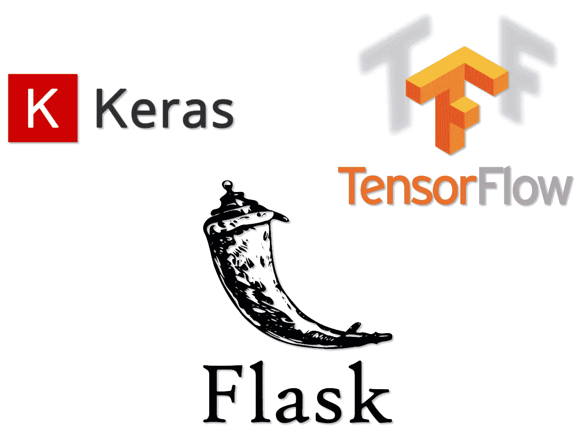
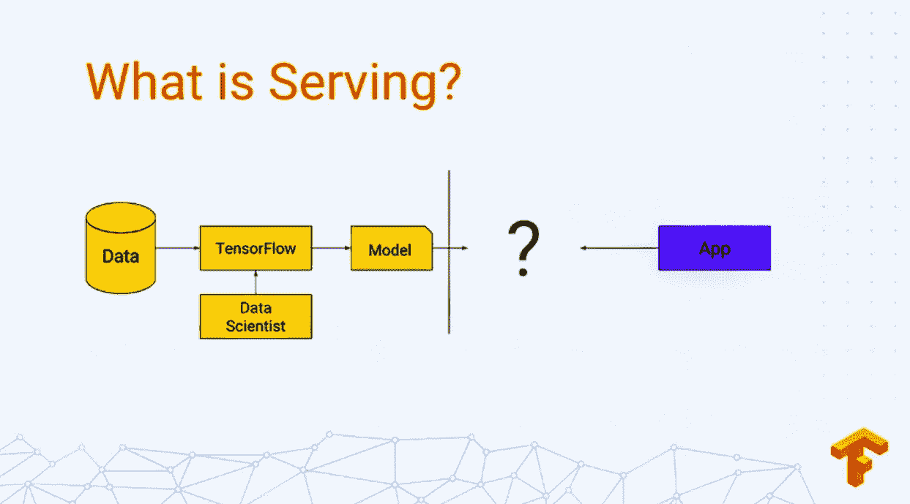
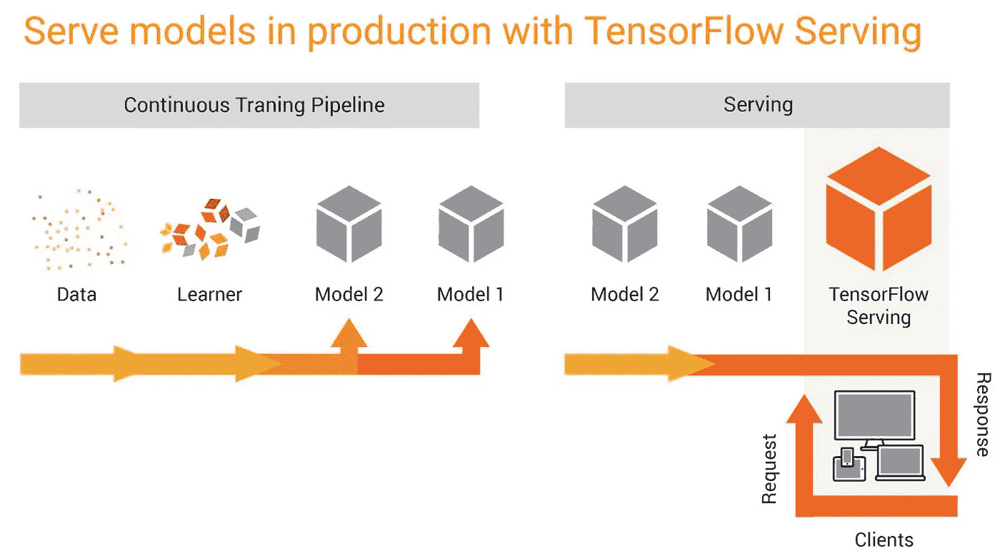
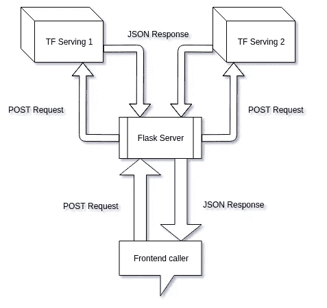

# 使用 TensorFlow 服务和 Flask 部署 Keras 模型

> 原文：<https://towardsdatascience.com/deploying-keras-models-using-tensorflow-serving-and-flask-508ba00f1037?source=collection_archive---------2----------------------->



通常需要抽象出机器学习模型的细节，并将其部署或集成到易于使用的 API 端点中。例如，我们可以提供一个 URL 端点，任何人都可以使用它来发出 POST 请求，他们将获得模型推断的 JSON 响应，而不必担心它的技术细节。

在本教程中，我们将创建一个 TensorFlow 服务服务器来部署我们在 Keras 中构建的`InceptionV3`图像分类卷积神经网络(CNN)。然后，我们将创建一个简单的 Flask 服务器，它将接受 POST 请求并进行 Tensorflow 服务服务器所需的一些图像预处理，然后返回一个 JSON 响应。

## TensorFlow 提供的是什么？

服务就是你在训练完机器学习模型后如何应用它。



Know more about TensorFlow Serving [here](https://www.youtube.com/watch?v=q_IkJcPyNl0)

TensorFlow 服务使模型投入生产的过程变得更加简单快捷。它允许您安全地部署新模型和运行实验，同时保持相同的服务器架构和 API。开箱即用，它提供了与 TensorFlow 的集成，但它可以扩展为服务于其他类型的模型。

## 安装 TensorFlow 服务

*先决条件*:请创建一个 python 虚拟环境，并在其中安装带有 TensorFlow 后端的 Keras。点击阅读更多[。](https://keras.io/#installation)

*注意:*所有命令都已经在 Ubuntu 18.04.1 LTS 上的 python 虚拟环境中执行。

现在，在同一个虚拟环境中运行以下命令(使用`sudo`获得 root 权限):

```
$ apt install curl$ echo "deb [arch=amd64] [http://storage.googleapis.com/tensorflow-serving-apt](http://storage.googleapis.com/tensorflow-serving-apt) stable tensorflow-model-server tensorflow-model-server-universal" | sudo tee /etc/apt/sources.list.d/tensorflow-serving.list && curl [https://storage.googleapis.com/tensorflow-serving-apt/tensorflow-serving.release.pub.gpg](https://storage.googleapis.com/tensorflow-serving-apt/tensorflow-serving.release.pub.gpg) | sudo apt-key add -$ apt-get update$ apt-get install tensorflow-model-server$ tensorflow_model_server --version
TensorFlow ModelServer: 1.10.0-dev
TensorFlow Library: 1.11.0$ python  --version
Python 3.6.6
```

您可以通过以下方式升级到`tensorflow-model-server`的新版本:

```
$ apt-get upgrade tensorflow-model-server
```

## 我们将要构建的目录概述

在我们开始之前，理解目录结构将有助于我们清楚地了解每一步的进展情况。

```
(tensorflow) ubuntu@Himanshu:~/Desktop/Medium/keras-and-tensorflow-serving$ tree -c
└── keras-and-tensorflow-serving
    ├── README.md
    ├── my_image_classifier
    │   └── 1
    │       ├── saved_model.pb
    │       └── variables
    │           ├── variables.data-00000-of-00001
    │           └── variables.index
    ├── test_images
    │   ├── car.jpg
    │   └── car.png
    ├── flask_server
    │   ├── app.py
    │   ├── flask_sample_request.py
    └── scripts
        ├── download_inceptionv3_model.py
        ├── inception.h5
        ├── auto_cmd.py
        ├── export_saved_model.py
        ├── imagenet_class_index.json
        └── serving_sample_request.py6 directories, 15 files
```

您可以从我的 GitHub 存储库中获得所有这些文件:

[](https://github.com/himanshurawlani/keras-and-tensorflow-serving) [## himanshurawlani/keras-和-tensor flow-服务

### 使用 TensorFlow 服务和 Flask 部署 Keras 模型-himanshurawlani/Keras-and-tensor flow-Serving

github.com](https://github.com/himanshurawlani/keras-and-tensorflow-serving) 

## 导出张量流服务的 Keras 模型

对于本教程，我们将下载和保存`InceptionV3` CNN，使用`download_inceptionv3_model.py`在 Keras 中使用 Imagenet 权重。您可以下载`keras.applications`库中的任何其他可用模型(此处为)，或者如果您已经在 Keras 中构建了自己的模型，则可以跳过这一步。

执行上述脚本后，您应该得到以下输出:

```
$ python download_inceptionv3_model.py
Using TensorFlow backend.
Downloading data from [https://github.com/fchollet/deep-learning-models/releases/download/v0.5/inception_v3_weights_tf_dim_ordering_tf_kernels.h5](https://github.com/fchollet/deep-learning-models/releases/download/v0.5/inception_v3_weights_tf_dim_ordering_tf_kernels.h5)
96116736/96112376 [==============================] - 161s 2us/step
```

现在我们有了以 Keras 格式保存的 CNN ( `inception.h5`)。我们希望以 TensorFlow 服务器可以处理的格式导出我们的模型。我们通过执行`export_saved_model.py`脚本来做到这一点。

TensorFlow 提供了`SavedModel`格式作为导出模型的通用格式。在幕后，我们的 Keras 模型完全是根据 TensorFlow 对象指定的，因此我们可以使用 Tensorflow 方法很好地导出它。TensorFlow 提供了一个便利的函数`tf.saved_model.simple_save()`，它抽象出了一些细节，对于大多数用例来说都很好。

输出:

```
$ python export_saved_model.py
WARNING:tensorflow:No training configuration found in save file: the model was *not* compiled. Compile it manually.
```

我们得到这个警告是因为我们下载了一个预先训练好的模型。我们可以按原样使用这个模型进行推理，但是如果我们想进一步训练它，我们需要在加载它之后运行`compile()`函数。现在可以安全地忽略这个警告。执行该脚本后，以下文件保存在`my_image_classifier`目录中:

```
├── my_image_classifier
   └── 1
       ├── saved_model.pb
       └── variables
           ├── variables.data-00000-of-00001
           └── variables.index2 directories, 3 files
```

假设我们希望在未来更新我们的模型(可能是因为我们收集了更多的训练数据，并在更新的数据集上训练了模型)，我们可以通过，

1.  在新的 keras 模型上运行相同的脚本
2.  将`export_saved_model.py`中的`export_path = ‘../my_image_classifier/1’`更新为`export_path = ‘../my_image_classifier/2’`

TensorFlow Serving 会在`my_image_classifier`目录下自动检测模型的新版本，并在服务器中进行更新。

## 启动 TensorFlow 服务服务器

要在本地计算机上启动 TensorFlow 服务服务器，请运行以下命令:

```
$ tensorflow_model_server --model_base_path=/home/ubuntu/Desktop/Medium/keras-and-tensorflow-serving/my_image_classifier --rest_api_port=9000 --model_name=ImageClassifier
```

*   `--model_base_path`:这必须是一个绝对路径，否则你会得到一个错误消息:

```
Failed to start server. Error: Invalid argument: Expected model ImageClassifier to have an absolute path or URI; got base_path()=./my_image_classifier
```

*   `--rest_api_port` : Tensorflow 服务将在端口 8500 上启动 gRPC ModelServer，REST API 将在端口 9000 上可用。
*   `--model_name`:这将是您用来发送 POST 请求的服务器的名称。您可以在此键入任何名称。

## 测试我们的 TensorFlow 服务器



From raw data to production models ([Source](https://twitter.com/tensorflow/status/832008382408126464))

`serving_sample_request.py`脚本向 TensorFlow 服务服务器发出 POST 请求。输入图像通过命令行参数传递。

输出:

```
$ python serving_sample_request.py -i ../test_images/car.png
Using TensorFlow backend.
[["n04285008", "sports_car", 0.998414], ["n04037443", "racer", 0.00140099], ["n03459775", "grille", 0.000160794], ["n02974003", "car_wheel", 9.57862e-06], ["n03100240", "convertible", 6.01581e-06]]
```

与后续调用相比，TensorFlow 服务服务器响应第一个请求的时间稍长。

## 为什么我们需要 Flask 服务器？

正如我们所看到的，我们已经在`serving_sample_request.py`(前端调用程序)中执行了一些图像预处理步骤。以下是在 TensorFlow 服务器上创建 Flask 服务器的原因:

*   当我们向前端团队提供 API 端点时，我们需要确保我们不会用预处理技术淹没他们。
*   我们可能并不总是有 Python 后端服务器(例如 Node.js 服务器),所以使用 numpy 和 keras 库进行预处理可能会很痛苦。
*   如果我们计划服务多个模型，那么我们将不得不创建多个 TensorFlow 服务服务器，并将不得不添加新的 URL 到我们的前端代码。但是我们的 Flask 服务器会保持域名 URL 不变，我们只需要添加一个新的路由(一个函数)。
*   提供基于订阅的访问，异常处理和其他任务可以在 Flask app 中进行。

我们正在努力消除 TensorFlow 服务服务器和我们前端之间的紧密耦合。



Multiple TensorFlow Serving servers hidden behind a Flask server

在本教程中，我们将在与 TensorFlow 服务器相同的计算机和虚拟环境中创建一个 Flask 服务器，并使用已安装的库。理想情况下，两者都应该在不同的机器上运行，因为大量的请求会导致 Flask 服务器由于正在执行图像预处理而变慢。此外，如果请求数量非常多，单个 Flask 服务器可能不够用。如果我们有多个前端调用者，我们可能还需要一个排队系统。尽管如此，我们可以使用这种方法来开发一个令人满意的概念证明。

## 创建 Flask 服务器

*先决条件*:从[这里](http://flask.pocoo.org/docs/1.0/installation/)在 python 虚拟环境中安装 Flask。

我们只需要一个`app.py`文件来创建我们的 Flask 服务器。

转到保存`app.py`文件的目录，使用以下命令启动 Flask 服务器:

```
$ export FLASK_ENV=development && flask run --host=0.0.0.0
```

*   `FLASK_ENV=development`:这启用了调试模式，基本上给你完整的错误日志。不要在生产环境中使用它。
*   `flask run`命令自动执行当前目录下的`app.py`文件。
*   `--host=0.0.0.0`:这使您能够从任何其他机器向 Flask 服务器发出请求。要从不同的机器发出请求，您必须指定运行 Flask 服务器的机器的 **IP 地址**来代替`localhost`。

输出:

```
* Running on [http://0.0.0.0:5000/](http://0.0.0.0:5000/) (Press CTRL+C to quit)
* Restarting with stat
* Debugger is active!
* Debugger PIN: 1xx-xxx-xx4
Using TensorFlow backend.
```

使用前面相同的命令启动 TensorFlow 服务器:

```
$ tensorflow_model_server --model_base_path=/home/ubuntu/Desktop/Medium/keras-and-tensorflow-serving/my_image_classifier --rest_api_port=9000 --model_name=ImageClassifier
```

这里有一个脚本(`auto_cmd.py`)来自动启动和停止两个服务器(TensorFlow Serving 和 Flask)。您也可以为两台以上的服务器修改该脚本。

记得在`auto_cmd.py`的**行第 10** 处更改路径，使其指向您的`app.py`目录。你可能还需要修改第 6 行**以使它指向你的虚拟环境的 bin。然后，通过在终端中执行以下命令，您可以从任何目录执行上述脚本:**

```
$ python auto_cmd.py
```

## 测试我们的 Flask 服务器和 TensorFlow 服务器

我们使用`flask_sample_request.py`脚本制作一个示例请求。该脚本基本上模拟了来自前端的请求:

1.  我们获取一个输入图像，将其编码为 base64 格式，并使用 POST 请求将其发送到我们的 Flask 服务器。
2.  Flask server 对这个 base64 图像进行解码，并为我们的 TensorFlow 服务器进行预处理。
3.  然后，Flask server 向我们的 TensorFlow 服务服务器发出 POST 请求，并对响应进行解码。
4.  解码后的响应被格式化并发送回前端。

输出:

```
$ python flask_sample_request.py -i ../test_images/car.png
[
  [
    "n04285008", 
    "sports_car", 
    0.998414
  ], 
  [
    "n04037443", 
    "racer", 
    0.00140099
  ], 
  [
    "n03459775", 
    "grille", 
    0.000160794
  ], 
  [
    "n02974003", 
    "car_wheel", 
    9.57862e-06
  ], 
  [
    "n03100240", 
    "convertible", 
    6.01581e-06
  ]
]
```

我们的 flask 服务器目前只有一条路由用于我们的单个 Tensorflow 服务服务器。我们可以通过在不同或相同的机器上创建多个 Tensorflow 服务服务器来服务多个模型。为此，我们只需向我们的`app.py`文件中添加更多的路线(功能),并在其中执行所需的特定于模型的预处理。我们可以将这些路线交给我们的前端团队，以便根据需要调用模型。

## 处理跨源 HTTP 请求

考虑这样一个场景，我们使用 Angular 发出一个 POST 请求，我们的 Flask 服务器收到 OPTIONS header 而不是 POST，因为，

*   当 web 应用程序请求来源(域、协议和端口)不同于其自身来源的资源时，它会发出跨来源 HTTP 请求。
*   CORS(跨源资源共享)是一种机制，它使用额外的 HTTP 报头来告诉浏览器，让在一个源(域)上运行的 web 应用程序有权访问来自不同源的服务器的选定资源。在这里阅读更多关于 CORS 的信息。

因此，Angular 没有从 Flask 服务器得到任何响应。为了解决这个问题，我们必须在我们的`app.py`中启用弗拉斯克-CORS。了解更多[这里](https://flask-cors.readthedocs.io/en/latest/index.html)。

## 结论

这就是我们服务于机器学习模型所需要的一切。TensorFlow 服务使得将机器学习集成到网站和其他应用程序中变得非常容易。keras 中有大量预构建的模型可用([此处](https://github.com/keras-team/keras-applications))，有可能用最少的机器学习和深度学习算法知识开发出超级有用的应用。

如果你觉得这个教程有帮助，请分享给你的朋友，并留下掌声:-)。如果你有任何疑问、反馈或建议，请在评论中告诉我。另外，你可以在推特和 T2【LinkedIn】和我联系。有太多的东西要与你们分享，而我才刚刚开始。敬请关注更多内容！