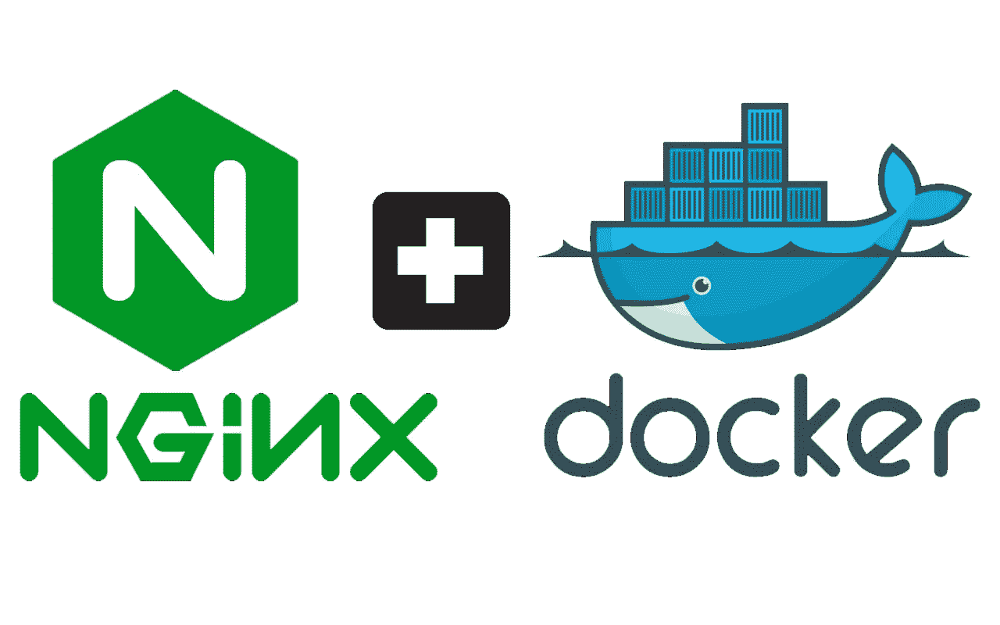

# 用 Docker 部署机器学习模型

> 原文：<https://towardsdatascience.com/deploying-machine-learning-models-with-docker-5d22a4dacb5?source=collection_archive---------2----------------------->



有很多文章解释了如何将 Flask 包装在你的机器学习模型中，作为一个 RESTful API。本文通过解释如何生产您的 Flask API 并使用 Docker 为部署做好准备，扩展了这一点。

# 动机

为什么我们需要对 Flask API 做进一步的工作以使其可部署？

*   [Flask 内置服务器不适合生产](http://flask.pocoo.org/docs/1.0/deploying/#deployment)
*   与尝试在标准虚拟机上运行 Flask 相比，Docker 允许更平滑的部署和更高的可靠性。

在我看来，这是为什么需要进一步努力的两个最大的动机。

在这种方法中，我们将使用 [nginx](https://www.nginx.com/) 、 [gunicorn](https://gunicorn.org/) 和 Docker Compose 来创建一个可扩展、可重复的模板，以一次又一次地部署您的机器学习模型。

让我们来看看我们建议的文件夹结构:

```
.
├── README.md
├── nginx/
|   ├── Dockerfile
|   └── nginx.conf
├── api/
|   ├── Dockerfile
|   ├── app.py
|   ├── __init__.py 
|   └── models/
├── docker-compose.yml
└── run_docker.sh
```

由此，我们最初的 Flask 应用程序位于`api/`文件夹中，有一个单独的文件夹`nginx/`存放我们的 nginx Docker 容器和配置。

nginx、gunicorn 协同工作如下:

1.  客户端导航到您的网址，example.com
2.  nginx 处理这个 http 请求，并将请求传递给 gunicorn
3.  gunicorn 从 nginx 接收这个请求，并提供相关的内容(gunicorn 运行您的 Flask 应用程序，并处理对它的请求)。

如你所见，这有点复杂，但是比 Flask 的标准服务器更可靠和可伸缩。

让我们开始吧。

# 烧瓶+ Gunicorn + Docker

最合理的起点是我们现有的 Flask 应用程序。本节的目标是支持 gunicorn，并为我们的应用程序创建一个 Docker 容器。

我们需要做的唯一针对 Flask 的更改是确保当我们启动 Flask 时，我们指定一个主机 0.0.0.0，并且我们有`debug=False`。

`debug=False`很重要，如果用户遇到错误，我们不希望显示回溯。主机只是帮助我们稍后配置 nginx。

在我们创建 Dockerfile 之前，我们首先需要通过在您的终端中运行`pip install gunicorn`来安装 gunicorn。gunicorn 本身将在我们创建 Docker 合成文件时进行配置。

现在也是确保 requirements.txt 文件是最新的好时机——通过在终端中运行`pip freeze > requirements.txt`来实现。

嘣！现在我们继续创建 Docker 容器。要创建 Docker 容器，我们需要创建一个名为`Dockerfile`的文件。这个文件充当我们运行应用程序所需的一切的“配方”。要了解 Docker 本身的更多信息，请查看 Docker 网站上的[入门页面。](https://docs.docker.com/get-started/)

下面的文档相对简单。我们利用已经安装了 Python 3.6.2 的现有基础映像，然后创建应用程序文件夹并将其复制到容器中。

您可能会注意到，我们没有在 docker 文件中指定`flask run`或任何等效的命令。这是因为我们想使用 gunicorn 来启动我们的 Flask 应用程序。我们还想让它和我们的 nginx 容器一起启动。因此，我们将在稍后配置 Docker Compose 时这样做。

# nginx

在我们的例子中，nginx 取代了默认的 Flask web 服务器，并且比 Flask 的内置服务器更具可伸缩性和可靠性。

我们可以通过在项目根目录下创建一个新目录来设置 nginx，并使用以下内容创建一个 docker 文件:

这将下拉 [nginx Docker 映像](https://hub.docker.com/_/nginx/)并将`nginx.conf`复制到 Docker 容器中。

`nginx.conf`是我们可以配置 nginx 服务器的文件，如下所示:

其中的主要部分是，我们以秒为单位设置 keepalive_time out，并告诉我们的代理监听端口 80 (http)并返回端口为 8000 的 localhost。

# 将它整合在一起

我们现在有了一个非常好的 Flask API/网站的材料。真的只有最后一件事要做了。

因为我们有多个 Docker 容器，所以我们需要一种方法来运行它们，并指定它们如何相互交互。这就是 [Docker Compose](https://docs.docker.com/compose/) 的用武之地。

> Compose 是一个定义和运行多容器 Docker 应用程序的工具。

从 Docker 的网站上我们可以看到，使用 Docker Compose 有三个步骤:

1.  用一个`Dockerfile`来定义你的应用环境，这样它可以在任何地方被复制。
2.  在`docker-compose.yml`中定义组成您的应用的服务，以便它们可以在一个隔离的环境中一起运行。
3.  运行`docker-compose up`，Compose 开始运行你的整个应用。

我们已经完成了第一步，所以现在我们可以安全地进入第二步。

我们的`docker-compose.yml`文件看起来像这样:

关于这个文件有一些事情需要注意。

**服务:**这是我们指定个人 Docker 容器的地方，首先是我们的 API，然后是我们的 nginx。

*build:* 指 Dockerfile 相对于 docker-compose.yml 文件的位置。

*命令:*允许您指定运行该服务所需的命令。对于我们的 API，我们没有在 docker 文件中运行 Flask 应用程序，所以我们在这里使用 gunicorn 来运行它。

值得注意的是，我们将端口绑定到 8000，因此它与`nginx.conf.`中指定的位置相匹配

我强烈建议你在这里阅读更多关于 Docker 和 Docker Compose 的内容。

我们找到了。我们现在已经配置了 nginx，对接了我们的 Flask 应用程序，并使用 Docker Compose 将其整合在一起。

您现在应该能够简单地输入`docker-compose up`并且您的服务器应该启动了。