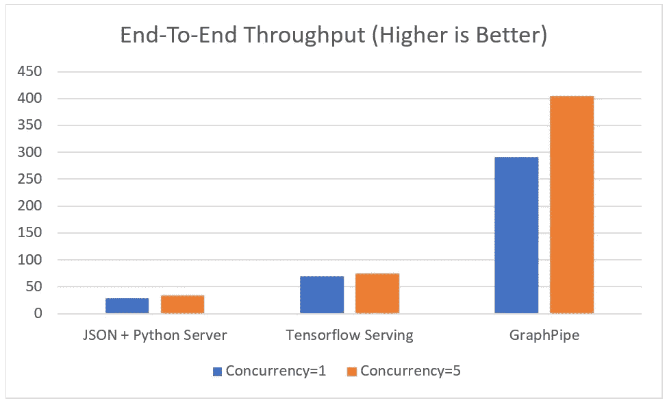

# 用 GraphPipe 部署机器学习模型(系列的第 2 部分)

> 原文：<https://towardsdatascience.com/deploying-machine-learning-models-with-graphpipe-part-2-of-series-5104e3a79f3c?source=collection_archive---------19----------------------->



Image from [https://blogs.oracle.com/developers/introducing-graphpipe](https://blogs.oracle.com/developers/introducing-graphpipe)

我原本打算写我的 Kubeflow 系列的第二篇文章。然而，我陷入了大量的工作，在此期间，Oracle 推出了一个新的模型部署框架，名为 GraphPipe。我仍然计划在某个时候看看 Kubeflow，因为它有许多不错的功能(如 AB 测试/多臂 bandit 更新以重定向流量)，但我发现 GraphPipe 更容易使用，至少根据[网站](https://blogs.oracle.com/developers/introducing-graphpipe)的说法，它比 JSON 类型的 API(如 Kubeflow)快得多。

在本文中，我将介绍一个使用 GraphPipe 和我自己的模型不可知(MA)库(现在包括对 GraphPipe 的支持)部署一个经过训练的 PyTorch 模型的例子。对于这个例子，我选择了 ChexNet(来自 Rajpurkar 等人的)和 arroweng(即 weng 等人的)的实现，它们可以在 [GitHub](https://github.com/arnoweng/CheXNet) 上公开获得。

## **1。重构代码以支持“单一示例”处理(或者您生产所需的任何模式)。**

这第一步在几乎所有情况下都是一样的。这通常也是最费时费力的。这通常需要非常仔细地阅读实现代码。我的 model_agnostic 类旨在使这一过程变得更加容易(不幸的是，尽管它仍然很糟糕)。

**1(a)加载模型重量**

在我们尝试重构之前，我们需要确保我们可以加载模型权重(令人惊讶的是，这会导致比你想象的更多的问题)。为此，我们从 MA 子类化 PytorchModel。现在我们不用担心预处理和 process_result 步骤。相反，我们将只关注加载模型权重。

MA generally has three methods to implement __init__ (which is usually just a call to super), create_model, and preprocessing. Depending on your model and setup you may also want to implement process_result.

加载 PyTorch 模型有多种方式，MA 支持这两种方式。第一种方式是，如果你最初用`torch.save(the_model, some_path).`保存了完整的模型，实际上这是很少见的，相反，大多数时候你只保存 state_dict，而不是整个模型(即`torch.save(the_model.state_dict(), path))`)。这里 arroweng 提供了保存的 state_dict，所以我们必须实现 create_model。ChexNet 本质上只是针对 14 种条件修改的 DenseNet121。因此，我们在 create_model 中需要做的就是返回一个 [DenseNet121 类](https://github.com/isaacmg/s2i_pytorch_chex/blob/master/densenet/dense_ne.py)。剩下的 MA 在 PytorchModel 中处理，比如将 state_dict 转换成 CPU 可用的格式(反之亦然)。最后，我们将训练模式设置为 false，因为我们只希望进行正向传播。

**1(b)实现预处理和 process_result**

为了测试这个设置是否有效，我们需要在一些数据上运行创建的模型。这些相同的功能也将在稍后我们部署模型时使用。所以现在是让他们尽可能瘦下来的时候了。这通常是比较耗时的步骤之一，因为代码经常成批地评估模型。此外，当我们需要使用一个单独的例子来运行时，模型通常有一个数据加载器。因此，这一过程会因您的具体型号/用例而有很大不同。有趣的是，对于这个特定的模型，arroweng 甚至在测试期间也使用 TenCrop 进行数据扩充。因此，在我的预处理方法中，我决定增加一个用户可以标记为真或假的参数。

Code for the preprocessing part of the algorithm. [View on GitHub](https://gist.github.com/isaacmg/767f069e8d25a22dbf2d88abda288ad3/)

## **2。将 PyTorch 模型转换为 Caffe2**

这一部分相对简单，在 PyTorch 网站上有很好的记录。基本上，它涉及到 Caffe2 跟踪模型的 PyTorch 执行。

This is code I took straight from the [official tutorial](https://pytorch.org/tutorials/advanced/super_resolution_with_caffe2.html) on the PyTorch website.

为了测试这个模型是否成功地转换成了 Caffe2，我使用了下面的代码。

You can use the NumPY testing framework to make certain that the PyTorch executed result is roughly equal to the Caffe2 executed result (to what ever number of decimal places you desire).

如果一切正常，下面的代码应该运行无误。

## **3。用 GraphPipe** 上菜

**3(a)运行 GraphPipe docker 容器**

现在获取您保存的 Caffe ONNX 文件(在本例中为 chexnet-py.onnx ),并将其保存在云中或本地目录中。然后运行以下命令

```
docker run -it — rm -e https_proxy=${https_proxy} -p 9000:9000 sleepsonthefloor/graphpipe-onnx:cpu — value-inputs=https://raw.githubusercontent.com/isaacmg/s2i_pytorch_chex/master/value_inputs2.json — model=http://url_to_model.onnx — listen=0.0.0.0:9000`
```

这个命令的作用是将 GraphPipe ONNX CPU docker 映像、您的模型和其他信息拉过来运行容器。“价值输入”是你的输入值的维度。

```
{"0": [1, [1, 3, 224, 224]]}
```

因此，在本例中(如果您计划不使用裁剪放大)，输入将是一批大小，三个通道(即 RGB)和一个 224x224 图像大小。如果一切正常，你应该在你的终端中看到类似“INFO[0005]监听 0.0.0.0:9000”的内容。

**3(b)定义 GraphPipe 服务类**

Overview of the deployment class. Sorry about the lines being cut off no matter much I broke up long lines Medium still seemed to cut it off at a point due to indentation. Please [view the gist on GitHub for full view.](https://gist.github.com/isaacmg/554be1338025bc4529d2bb7cffda9d49)

因此，您的预处理函数将保持不变，如果您还没有定义 process_result 函数，您将需要定义它。MA 将处理 GraphPipe docker 容器的所有后台调用。现在要使用它，你只需要做以下事情

To create the ChexNet GraphPipe object all you need is pass in the url of your container. Then simply run the standard Model Agnostic commands.

现在，您可以将这个类包装在任何 Django 或 Flask API 中来完成部署。

## 结论

现在你可能想知道为什么这比简单地在 Flask/Django REST API 中运行 PyTorch 要好。答案是(1)这种方法通常更快，因为 GraphPipe 优化了模型预测阶段(2)这种方法是高度可伸缩的，以及(3)这种 API 可以由任何语言的任何应用程序调用(假设您可以执行等效的预处理)。在我看来最大的好处是(2)。因为如果预测的延迟成为应用程序的瓶颈，现在很容易产生新的 Docker 容器。

成品在我的 GitHub 上[可用(我很快会添加所有的导出脚本)。此外，几天后我应该可以在 Heroku 上运行模型演示了。我已经为我的模型部署系列计划了几篇文章，包括 Kubeflow、Tensorflow 模型的 GraphPipe 部署，以及在 Java 生产应用程序中部署模型(特别强调用 Flink 进行实时流预测)。我不确定我会按什么顺序出版它们，但我确实计划最终会着手去做。最后，在某个时候，我计划做一个基准测试，看看哪些方法在预测速度方面是真正最快的。](https://github.com/isaacmg/ml_serving_flask)

**更多资源**

【GraphPipe 官方网站

[GraphPipe 发布文章](https://blogs.oracle.com/developers/introducing-graphpipe)

[杂乱的模型加载代码](https://github.com/isaacmg/s2i_pytorch_chex)