# 在 Google 计算引擎上部署 PySpark ML 模型作为 REST API

> 原文：<https://towardsdatascience.com/deploying-pyspark-ml-model-on-google-compute-engine-as-a-rest-api-d69e126b30b1?source=collection_archive---------20----------------------->

## 循序渐进的教程


Photo by [Sigmund](https://unsplash.com/@sigmund?utm_source=medium&utm_medium=referral) on [Unsplash](https://unsplash.com?utm_source=medium&utm_medium=referral)

这篇文章和我之前的文章有松散的联系。

[分步教程:Google Dataproc 上的 PySpark 情感分析](/step-by-step-tutorial-pyspark-sentiment-analysis-on-google-dataproc-fef9bef46468)

在我之前的帖子中，我在 Google Dataproc 上训练了一个 PySpark 情绪分析模型，并将该模型保存到 Google 云存储中。在本文中，我将向您展示如何在 Google Compute Engine 上部署 PySpark 模型作为 REST API。我将使用我在上一篇文章中训练的模型，但是我确信您可以对我将与您自己的 PySpark ML 模型共享和使用的代码进行一些小的更改。

我将整个管道保存为 pipelineModel，现在我想将该模型用于 REST API，以便它可以通过简单的 REST API 调用来提供实时预测。

我首先查看了 [Google Cloud ML Engine](https://cloud.google.com/ml-engine/) ，看看这是否是这个特定用例的有效选项。通过通读简介，您不仅可以训练机器学习模型，还可以为您的模型提供预测服务。但遗憾的是，云 ML 引擎似乎不支持 Spark ML 模型。我找到的下一个谷歌服务是[谷歌应用引擎](https://cloud.google.com/appengine/)。这项服务让任何人都可以轻松部署网络应用。但是经过几次尝试后，我意识到在通过 Google App Engine 创建的 VM 实例上设置 Java 开发包(运行 PySpark 所需的)并不容易。这也许是可能的，但至少对我来说，选择这条路不够直截了当。

经过一些考虑和尝试，以下是我发现的工作方式。我将首先一步一步地介绍这个过程，然后我还将告诉您使用 Spark ML 模型进行在线实时预测的缺点。

在本教程中，我不会再重复基本的设置过程，例如设置免费帐户，为您想要使用的服务启用 API，安装 Google Cloud SDK，但如果这是您第一次尝试 Google Cloud Platform，我建议您查看[我以前的帖子](/step-by-step-tutorial-pyspark-sentiment-analysis-on-google-dataproc-fef9bef46468)，并完成设置步骤(在 GCP 上创建免费试用帐户，启用 API，安装 Google Cloud SDK)。在您继续下面的步骤之前，您必须准备好启用 Google 计算引擎 API。

# 克隆 Git 仓库

现在，通过在终端中运行下面的命令来克隆这个项目的 git 存储库。

```
git clone [https://github.com/tthustla/flask_sparkml](https://github.com/tthustla/flask_sparkml)
```

一旦您克隆了存储库，它将创建一个名为 flask_sparkml 的文件夹。进入文件夹，检查有什么文件。

```
cd flask_sparkml/
ls
```

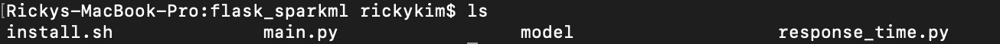

您将看到三个文件和一个子文件夹。

*   install.sh(创建计算引擎实例时的启动脚本)
*   main.py (Flask web 应用程序，将预测作为 REST API)
*   模型(存储经过训练的 PySpark 管道模型的文件夹)
*   response_time.py(测量 API 响应时间的简单 Python 脚本)

# 正在创建 Google 计算引擎虚拟机实例

您可以通过 web 控制台或使用 Google Cloud SDK 从您的终端创建一个实例。在创建实例之前，让我们快速看一下启动脚本 install.sh，看看它做了什么。

上面的代码将是虚拟机的启动脚本。

## Web 控制台

通过访问[https://console.cloud.google.com/](https://console.cloud.google.com/)进入您的控制台。进入控制台后，从左侧菜单中单击“计算引擎”和“虚拟机实例”。点击“创建”。

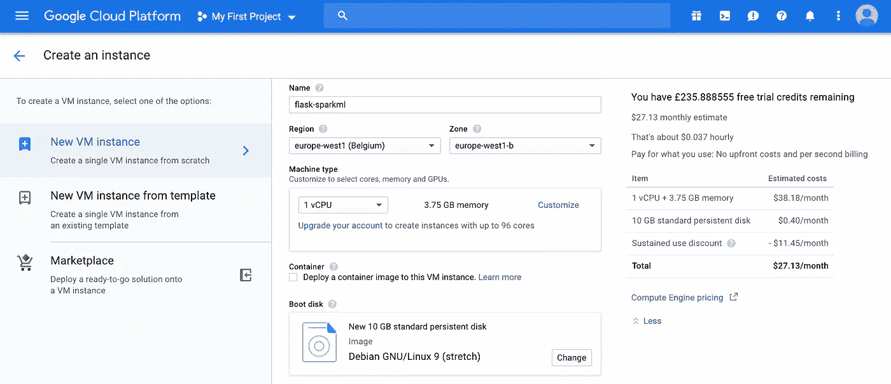

键入虚拟机实例的名称，并选择要创建虚拟机的地区和区域。对于本教程，我们不会使用任何其他 GCP 服务，因此您可以选择任何您喜欢的地区/区域，但最好考虑一旦 API 上线，大多数流量将来自哪里。

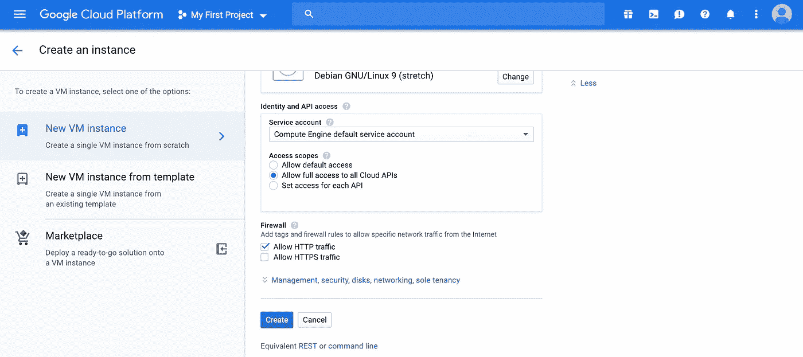

向下滚动并在身份和 API 访问部分选择“允许对所有云 API 的完全访问”,并在防火墙中勾选“允许 HTTP 流量”,以便可以从您的虚拟机外部访问它。最后，让我们添加启动脚本，以便 VM 在启动时安装所需的包。

在防火墙部分下方的屏幕上，您会看到蓝色文本“管理、安全、磁盘、网络、单独租赁”。点击展开，找到“启动脚本”下的文本框。复制并粘贴整个 install.sh 代码。

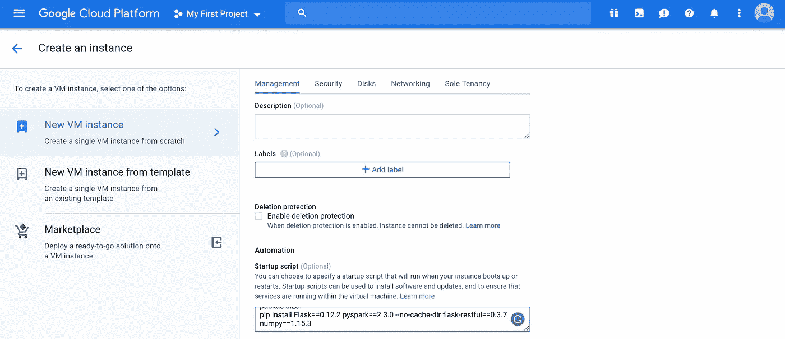

点击底部的“创建”。

## 谷歌云 SDK

为了能够从您的终端与 GCP 互动，您应该登录到您的帐户，并且它应该被设置为您打算进行的项目(我假设您已经在您的终端上安装了谷歌云 SDK，如果不是这样，请按照 https://cloud.google.com/sdk/[上的说明进行操作)](https://cloud.google.com/sdk/)

为了检查您是否登录，请在您的终端中复制并粘贴以下命令，它会显示哪个帐户是活动的。

```
gcloud auth list
```

如果您想要检查 Google Cloud SDK 当前是否设置为您想要处理的项目，您可以从终端使用下面的命令。

```
gcloud config list
```

如果一切正常，从终端运行下面的命令，该命令位于从 Git 克隆的 flask_sparkml 文件夹中。

```
gcloud compute instances create flask-sparkml \
--zone=europe-west1-b \
--scopes=[https://www.googleapis.com/auth/cloud-platform](https://www.googleapis.com/auth/cloud-platform) \
--metadata-from-file startup-script=install.sh --tags http-server
```

这将创建一个包含以下内容的虚拟机实例

*   实例名设置为 flask-sparkml
*   区域设置为欧洲-西方 1-b
*   允许完全访问所有云 API
*   使用本地文件 install.sh 作为虚拟机的启动脚本
*   允许 HTTP 流量

# 创建防火墙规则

为了允许从外部访问端口 8080 上的应用程序，我们需要创建一个打开端口 8080 的入站防火墙规则。同样，您可以选择在 web 控制台上或从终端执行此操作。

## Web 控制台

从控制台左侧菜单的“网络”部分找到“VPC 网络”。点击进入“防火墙规则”并点击顶部的“创建防火墙规则”按钮。这将把你带到如下所示的屏幕。

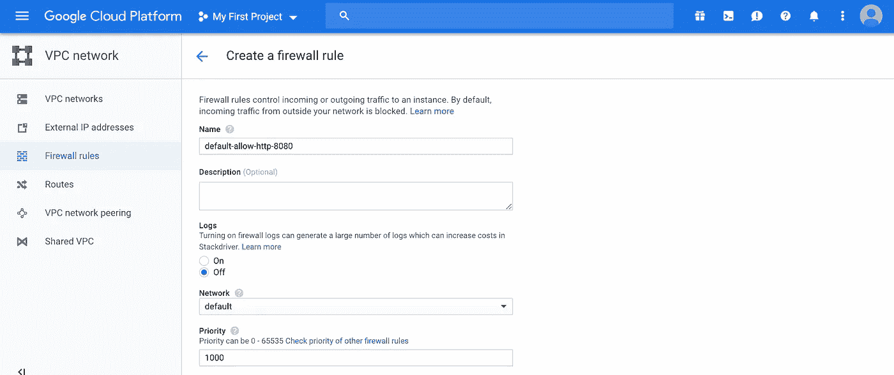

首先，给它一个描述性的名字。我将其命名为“default-allow-http-8080”。向下滚动，您会看到“流量方向”的默认设置已经设置为“入口”，并且“匹配时的操作”也设置为“允许”。由于某些原因，如果它们没有设置，请确保它们设置正确。

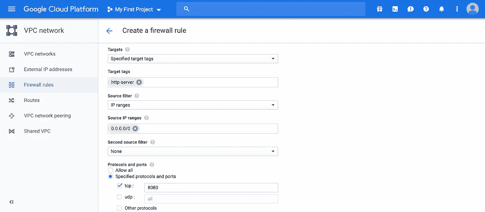

向下滚动到“目标标签”，给它一个标签“http-server”。这些标签说明了 GCP 如何将网络规则应用于虚拟机实例或实例模板。当我们在控制台中创建虚拟机时，我们选中了“允许 HTTP 流量”复选框。通过这样做，我们将任何带有标签“http-server”的防火墙规则附加到 VM 实例上。因此，通过创建一个新的防火墙规则与相同的标签将自动适用于您的虚拟机。接下来，为“源 IP 范围”键入“0.0.0.0/0”。这将允许从任何 IP 地址访问我们的 API。如果您想指定一些有限的 IP 范围，那么您可以在这里这样做。最后，在“协议和端口”下，在“tcp”旁边键入“8080”，然后单击底部的“创建”按钮。

## 谷歌云 SDK

如果您想从本地终端创建防火墙规则，您可以从终端运行以下命令。

```
gcloud compute firewall-rules create default-allow-http-8080 \
  --allow tcp:8080 \
  --source-ranges 0.0.0.0/0 \
  --target-tags http-server
```

您还可以检查此防火墙规则是否创建正确。

```
gcloud compute firewall-rules list
```

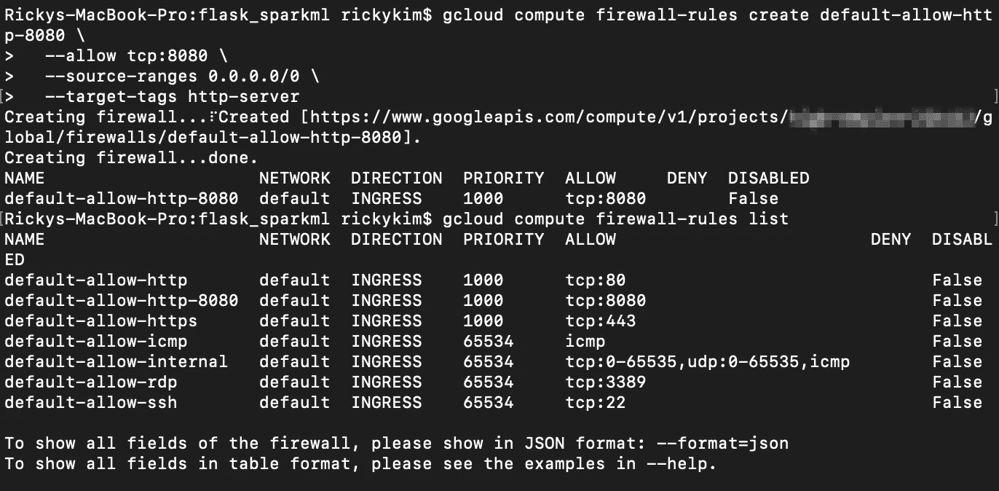

# 正在连接到创建的虚拟机实例

现在，可以通过 web 控制台或从终端创建计算引擎虚拟机。为了检查启动脚本是否被正确触发，让我们连接到虚拟机。同样，您可以通过 web 控制台或终端来完成此操作。

## Web 控制台

从左侧菜单转到“计算引擎”和“虚拟机实例”。您将看到一个实例从列表中运行。点击“连接”下的“SSH”。

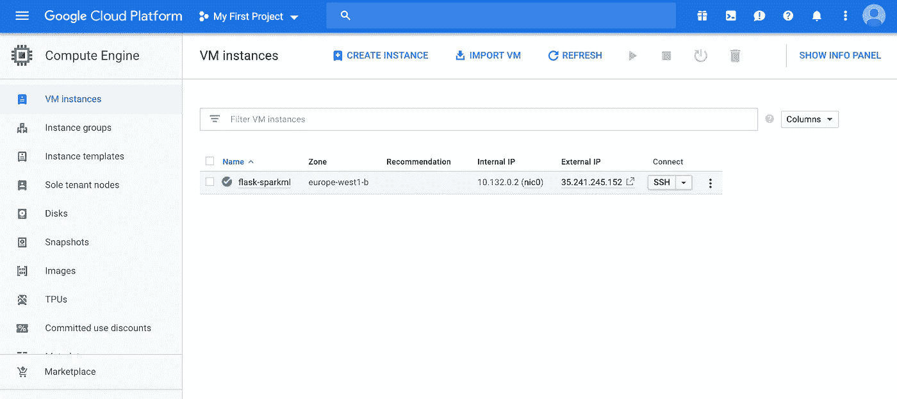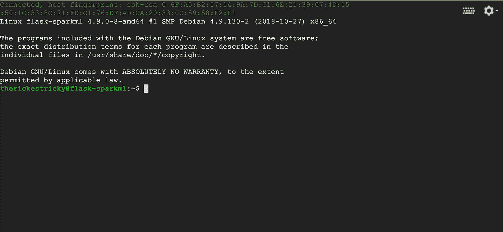

## 谷歌云 SDK

如果您的默认区域被设置为创建虚拟机的区域，并且项目被设置为您正在处理的当前项目(您可以通过从终端运行“gcloud config list”来查看属性)，那么您可以简单地键入以下命令来 SSH 到您的虚拟机。

```
gcloud compute ssh [your_Google_user_name]@flask-sparkml
```

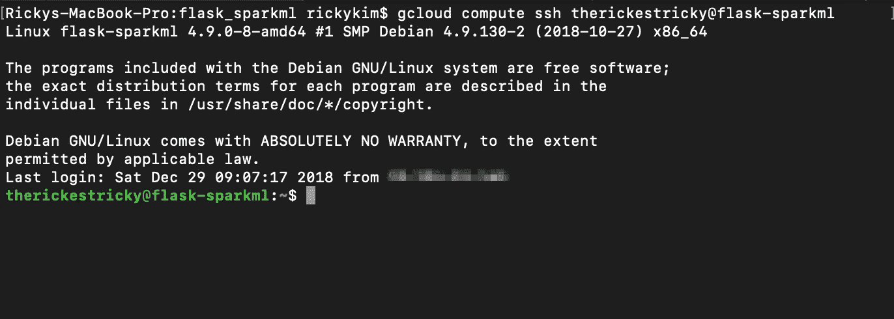

# 检查虚拟机上已安装的软件包

现在，既然我们在我们的虚拟机上，让我们检查一些东西。我们之前提供给 VM 的启动脚本包括 Java JDK8 install 和一些 Python 包，包括 PySpark。我们可以检查它们是否安装正确。(请注意，您需要等待一两分钟，以便虚拟机有足够的时间在后台完成安装。)

```
java -version
```

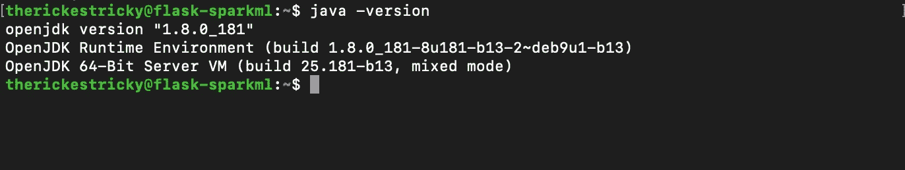

Java 好像是装的。Python 包呢？

```
pip list
```

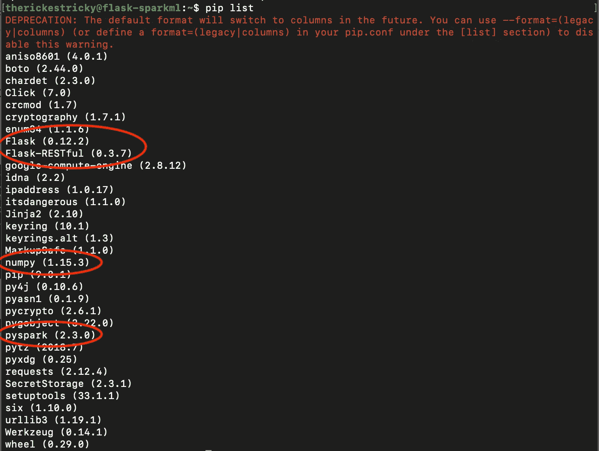

我们可以看到我们在启动脚本中指定的四个 Python 包安装在 VM 上。先不要关闭 VM 终端，因为我们稍后将需要回到这一点。

# 将本地文件复制到虚拟机

下一步是将 main.py 和 model 从本地机器上传到 VM。转到您的本地终端，将 CD 放入 flaks_sparkml(从 Git 克隆的文件夹)文件夹。运行以下命令，将文件安全地复制到虚拟机。

```
gcloud compute scp --recurse . [your_Google_user_name][@flask](http://twitter.com/flask)-sparkml:~/flask_sparkml
```

返回虚拟机终端，检查文件是否已上传。

```
cd /home/[your_Google_user_name]/flask_sparkml
ls -l
```


最后，我们准备运行实际的 Flask 应用程序。


# 运行烧瓶休息 API

在运行实际代码之前，让我们快速浏览一下代码，看看它做了什么。这方面的原始代码来自一篇中型帖子[由](/deploying-a-machine-learning-model-as-a-rest-api-4a03b865c166) [Nguyen Ngo](https://medium.com/u/f4795e0805e9?source=post_page-----d69e126b30b1--------------------------------) 将机器学习模型部署为 REST API ，我做了一些小的修改以适应我的特定用例。感谢伟大的教程[阮 Ngo](https://medium.com/u/f4795e0805e9?source=post_page-----d69e126b30b1--------------------------------) ！我已经在代码中添加了注释，所以我不会一行一行地解释。

是时候运行应用程序并对应用程序进行 REST API 调用，以从您自己的文本中获得情绪预测了！在您的虚拟机终端(在上面的“连接到创建的虚拟机实例”步骤中保持打开状态)上，从/home/[your _ Google _ user _ name]/flask _ spark ml 目录运行以下命令(使用“nohup”命令防止虚拟机在退出虚拟机终端后关闭)。

```
nohup python main.py
```

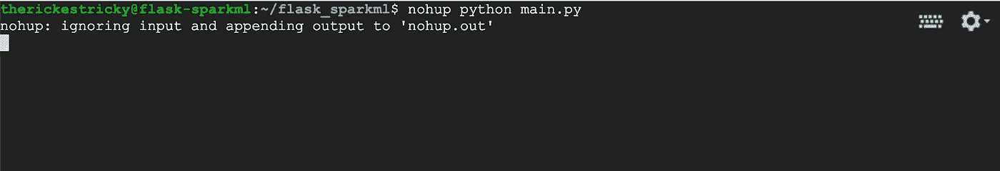

您将看不到 main.py 文件的日志输出，因为它会将日志写入文件“nohup.out”。让我们关闭 VM 终端，仔细检查“nohup”是否正常工作，并通过 API 调用获得实时情绪预测。为了做到这一点，我们首先需要知道我们的应用程序部署的外部 IP 地址。您可以查看 web 控制台的“计算引擎”->“虚拟机实例”

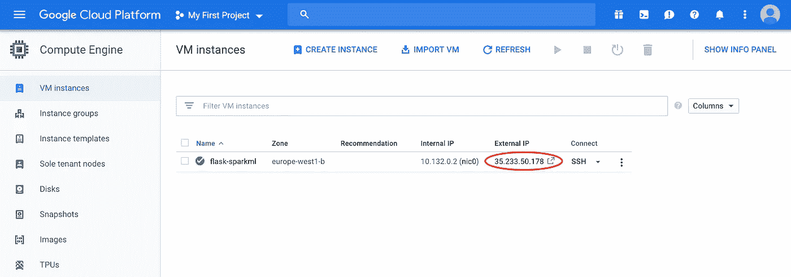

或者通过运行以下命令从本地终端进行检查。

```
gcloud compute instances list
```

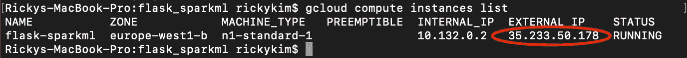

# 对部署的应用程序进行 API 调用

要么从本地终端启动 Python，要么打开 Jupyter 笔记本，复制并粘贴下面的代码块，然后运行以查看结果。

我期望看到模型预测上述文本为负。


“Listen Morty, I hate to break it to you, but what people call ‘love’ is just a chemical reaction that compels animals to breed.”

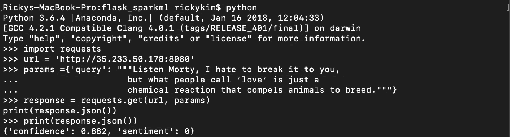

万岁！从我们的模型预测说，它是负面的，有相当高的信心。

# 测量 API 响应时间

你可能已经注意到，文件夹里还有一个文件我还没有提到。在完成这个项目的过程中，我脑海中一直有一个很大的问号。我知道 Spark 可以处理大数据，这在模型训练阶段可能是有益的。但是 Spark ML 部署在对单个条目进行实时预测时，性能如何？当我在上面进行 API 调用时，感觉并不是很快。所以我在完成的 API 中添加了一个最终实验。这是一个简单的 Python 程序，设计用于对 API 进行 100 次查询并记录 API 响应时间。最后，它会显示记录的响应时间的平均值、中值、最小值和最大值。

转到您的本地终端，在 flask_sparkml 文件夹中，运行程序并检查输出。

```
python response_time.py http://[external_IP_address_of_your_app]:8080
```

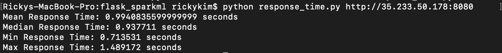

这是快还是慢？没有基准，我们无从得知。所以我很努力地谷歌了一些其他人的机器学习 API 响应时间。而我终于找到了这篇中帖[Falcon vs . Flask——选择哪一个由](https://medium.com/idealo-tech-blog/falcon-vs-flask-which-one-to-pick-to-create-a-scalable-deep-learning-rest-api-adef647ebdec) [Dat Tran](https://medium.com/u/4ff6d2f67626?source=post_page-----d69e126b30b1--------------------------------) 创建可扩展的深度学习 REST API 。谢谢你的信息贴，[达特兰](https://medium.com/u/4ff6d2f67626?source=post_page-----d69e126b30b1--------------------------------)！

从 [Dat Tran](https://medium.com/u/4ff6d2f67626?source=post_page-----d69e126b30b1--------------------------------) 的帖子来看，Keras CNN 模型在 MNIST 数据集上的平均响应时间为 60ms。我们可以看到 Spark ML 的平均响应时间是 0.99 秒，也就是 990ms。那听起来一点也不好。

当我在寻找这个问题的答案时，我看到了一张幻灯片[展示了 Nick Pentreath](https://www.slideshare.net/Hadoop_Summit/productionizing-spark-ml-pipelines-with-the-portable-format-for-analytics) 用便携式分析格式生产 Spark ML 管道。感谢您带来的精彩幻灯片， [Nick Pentreath](https://medium.com/u/dce78f08f6fe?source=post_page-----d69e126b30b1--------------------------------) ！PFA (Portable Format for Analytics)是 Spark ML 模型的 JSON 表示，可以跨不同的语言、平台进行传输。即使我没有将我的模型导出为 PFA，我仍然提到这一点的原因是，他在生产中经历了 Spark ML 模型的一些限制。

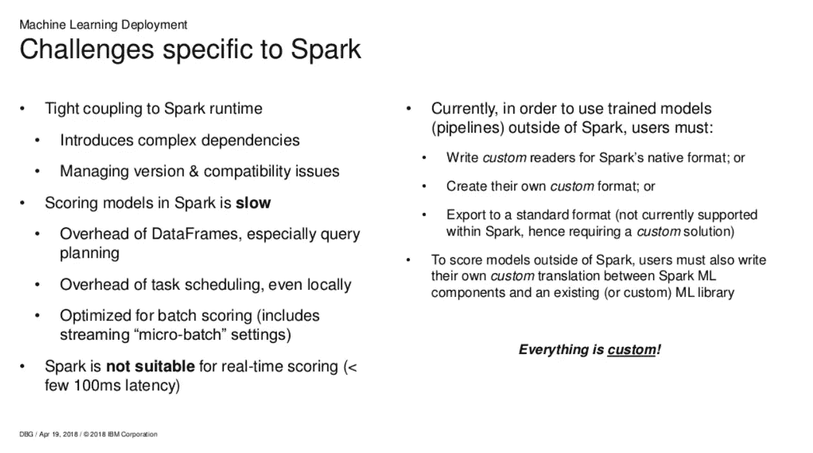

Image courtesy of [Nick Pentreath](https://www.slideshare.net/Hadoop_Summit/productionizing-spark-ml-pipelines-with-the-portable-format-for-analytics) at slideshare.net

根据幻灯片(第 9 页:Spark 特有的挑战)，由于 Spark 数据帧和任务调度的开销，Spark 中的评分模型很慢，并且由于其延迟，不是用于实时评分的最佳框架。

# 进一步考虑

尽管我们部署了一个工作 REST API，但这似乎不是实时服务于机器学习预测的理想解决方案。我可以进一步探索将模型导出为 PFA 并比较性能。或者我也可以尝试使用 Keras 或 Tensorflow 从头构建一个新模型，并部署它来与 Spark ML 进行性能比较。目前，我更倾向于尝试后者，因为这将让我有机会探索其他 GCP 服务，如谷歌云 ML 引擎。不管怎样，我会试着在这里分享我的下一段旅程。

# 清洁

为了避免在你的 GCP 账户上产生不必要的费用，清理是很重要的。您可以简单地删除您创建的 VM 实例，但是如果您想知道如何终止我们用 main.py 文件启动的 nohup 进程，我将通过简单的步骤来终止在后台运行的进程。使用“glcoud compute ssh”命令从 web 控制台或本地终端转到您的虚拟机终端。进入 VM 终端后，运行下面的命令来检查在后台运行的 main.py 的进程 ID。

```
ps aux | grep python | grep main.py
```

一旦你有了当前正在运行的进程的 id，使用下面的命令杀死它们，用你的进程 id 替换[]部分。

```
sudo kill [PID1] [PID2]
```

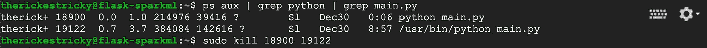

实际删除实例部分可以在 web 控制台或终端上完成。

## Web 控制台


## 谷歌云 SDK

```
gcloud compute instances delete flask-sparkml
```

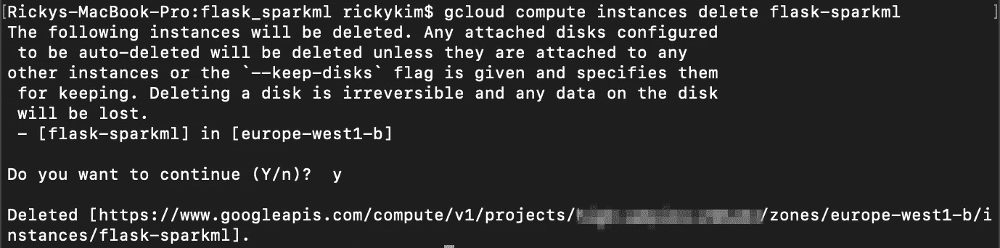

感谢您的阅读。您可以从下面的链接中找到 Git 脚本库。

[https://github.com/tthustla/flask_sparkml](https://github.com/tthustla/flask_sparkml)