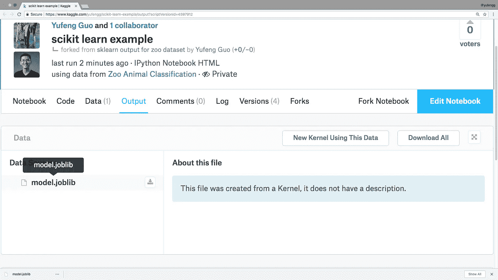
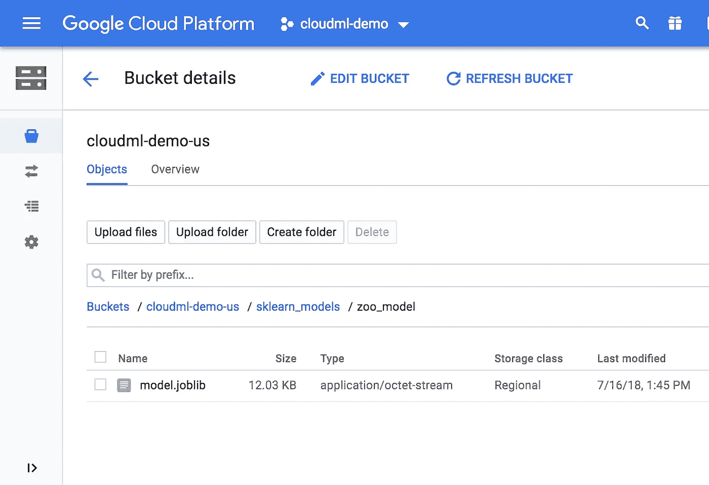
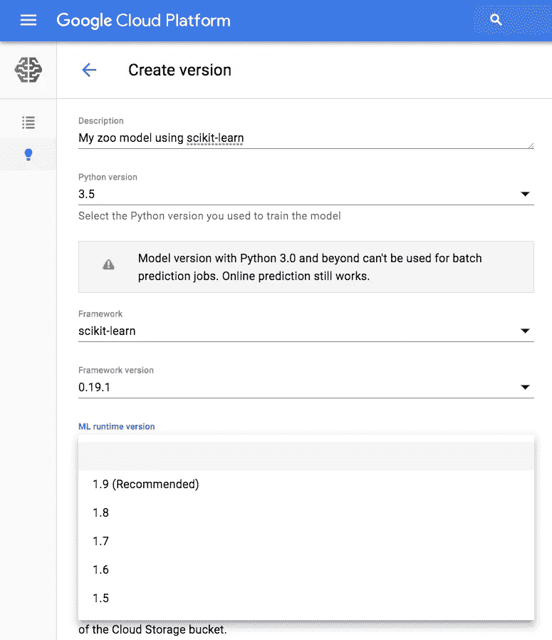
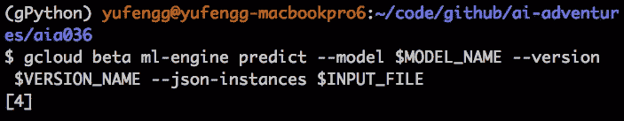

# 大规模部署 scikit-learn 模型

> 原文：<https://towardsdatascience.com/deploying-scikit-learn-models-at-scale-f632f86477b8?source=collection_archive---------4----------------------->


The bridges of Prague at sunrise, as seen from the Prague Metronome

Scikit-learn 非常适合组装一个快速模型来测试数据集。但是，如果您想对传入的实时数据运行它，该怎么办呢？了解如何在自动扩展的无服务器环境中为您的 scikit-learn 模型提供服务！

Cloud AI Adventures: explore the art, science, and tools of machine learning.

今天，我们将采用一个经过培训的 scikit-learn 模型，并将其部署在 Cloud ML Engine 上。使用这篇文章来建立您自己的部署管道，您将再也不需要担心如何部署和扩展您的模型了！

[](/get-going-with-scikit-learn-on-kaggle-32045d238eee) [## 开始使用 sci kit-了解 Kaggle

### Scikit-learn 一直是机器学习入门的流行库。然而，并不是每个人都有过…

towardsdatascience.com](/get-going-with-scikit-learn-on-kaggle-32045d238eee) 

# 假设你有一个动物园…

假设您有一个使用 scikit-learn 模型训练的[模型，现在您想设置一个预测服务器。让我们看看如何根据我们在关于动物园动物的](https://www.kaggle.com/yufengg/scikit-learn-example)[前一集](/get-going-with-scikit-learn-on-kaggle-32045d238eee)中的代码来做这件事。

为了导出模型，我们将使用来自`sklearn.externals`的`joblib`库。

```
from sklearn.externals import joblib
joblib.dump(clf, 'model.joblib')
```

我们可以使用`joblib.dump()`将模型导出到一个文件中。我们称我们的为`model.joblib`。

一旦我们提交并运行这个内核，我们将能够从内核中检索输出:



model.joblib — ready for download

手里拿着我们训练过的 scikit-learn 模型，我们准备前往 [Google Cloud ML Engine](https://cloud.google.com/ml-engine/docs) 加载模型以服务于预测。

没错，我们不仅可以为 TensorFlow，还可以为 scikit-learn ( *和* XGBoost)获得所有的自动伸缩、安全 REST API 优点！这使您能够轻松地在 scikit-learn 和 TensorFlow 之间来回转换。

# 提供一些馅饼…和预测

将我们的模型放到云中的第一步是将`model.joblib`文件上传到 Google 云存储中。



Notice my model.joblib file is wrapped in a folder called zoo_model

> *组织提示*:要求文件的名称必须是字面上的“model.joblib”，所以你可能想把文件放在一个文件夹里，用一个你会记住的名称。否则，以后当您创建更多的模型时，它们都将与`model.joblib`同名！

让我们创建我们的模型和版本，指定我们正在加载一个 scikit-learn 模型，并选择 Cloud ML engine 的运行时版本，以及我们用于导出该模型的 Python 版本。因为我们在 Kaggle 上运行我们的培训，那是 Python 3。



给它一点时间来设置…基本上就是这样了！我们现在有一个在云中服务的 scikit-learn 模型！

# 你要给谁打电话？云 ML 预测！

当然，如果不能调用这些预测，一个可扩展的模型是没有用的。让我们来看看这有多简单。我已经从我们的数据中提取了一个样本行，它的答案应该是类别“4”。我们将把数据作为一个简单的数组呈现给 Cloud ML Engine，编码为一个 json 文件。

`print(list(X_test.iloc[10:11].values))`

在这里，我获取测试特性数据帧，并从中提取第 10 行，然后调用。值来获取基础 numpy 数组。不幸的是，numpy 数组输出的值之间没有逗号，我们真的需要逗号，所以我把 numpy 数组转换成 Python 列表并打印出来。(是的，你可以，而且可能真的应该使用`json`库并对其进行适当编码，而不是依赖于`print`行为！)

我已经将数组保存到一个输入文件中，现在我们可以为我们的 scikit-learn 模型调用 prediction REST API。`gcloud`有一个内置的实用程序来完成这项工作。我们期待的响应是 4，这确实是我们得到的结果！万岁。



# 现在怎么办？

您可以按照本视频中的步骤将您的 scikit-learn 模型部署到生产环境中，或者通过将它转换为自动化管道来加快部署，这样每次您制作新模型时，它都会被部署出来，以便您可以对其进行测试！前往 Cloud ML Engine 并上传您的 scikit-learn 模型，轻松获得自动缩放预测！

关于这个主题的更详细的处理，文档中有一些很好的指南:【https://cloud.google.com/ml-engine/docs/scikit/quickstart】T4

感谢阅读本集[云 AI 冒险](http://yt.be/AIAdventures)。如果你喜欢这个系列，请为这篇文章鼓掌让我知道。如果你想要更多的机器学习动作，一定要关注 Medium 上的[me](https://medium.com/@yufengg)或[订阅 YouTube 频道](http://yt.be/AIAdventures)以捕捉未来的剧集。更多剧集即将推出！