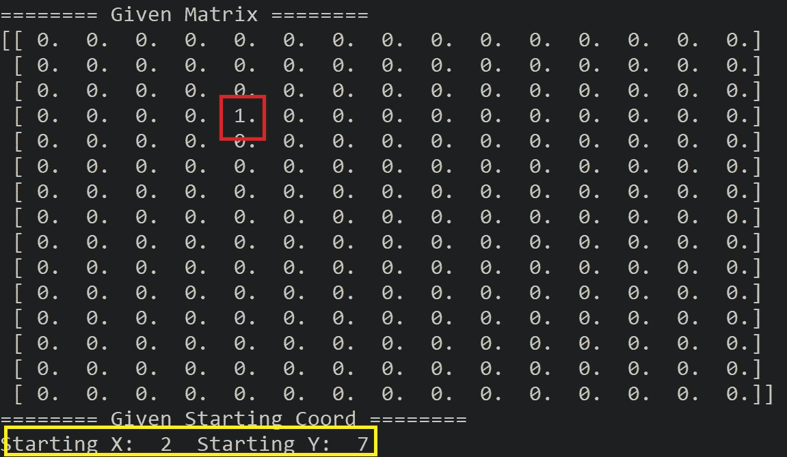
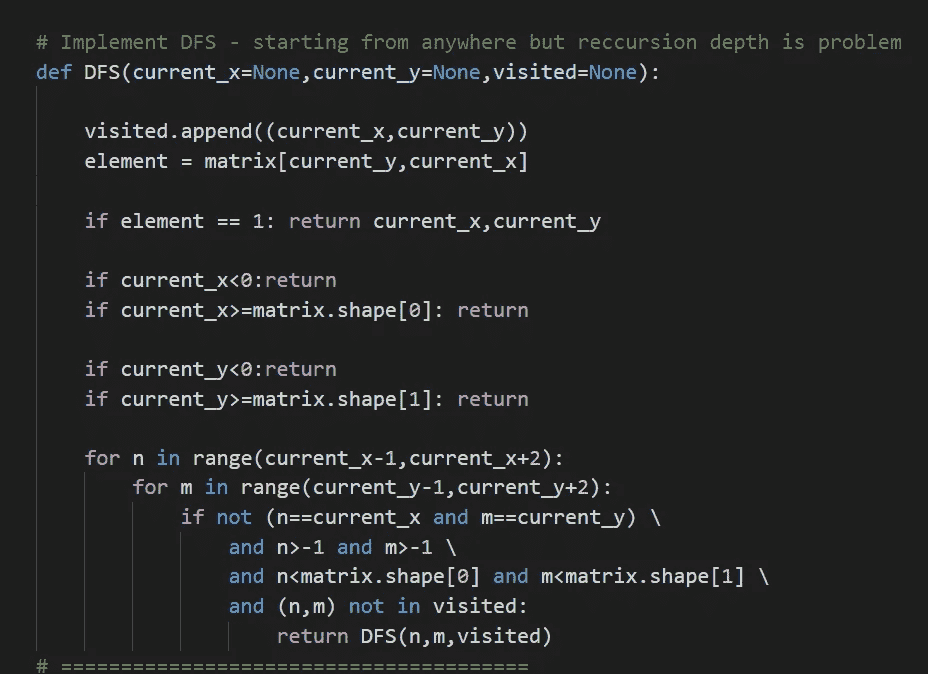
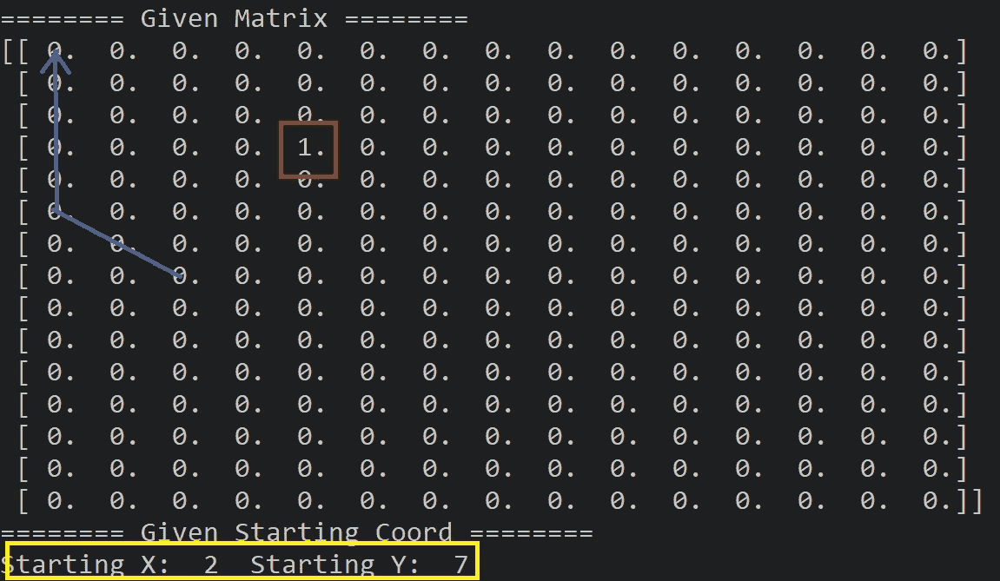
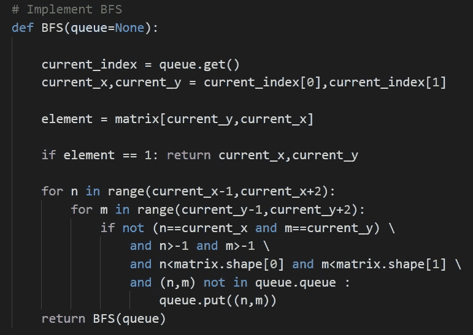
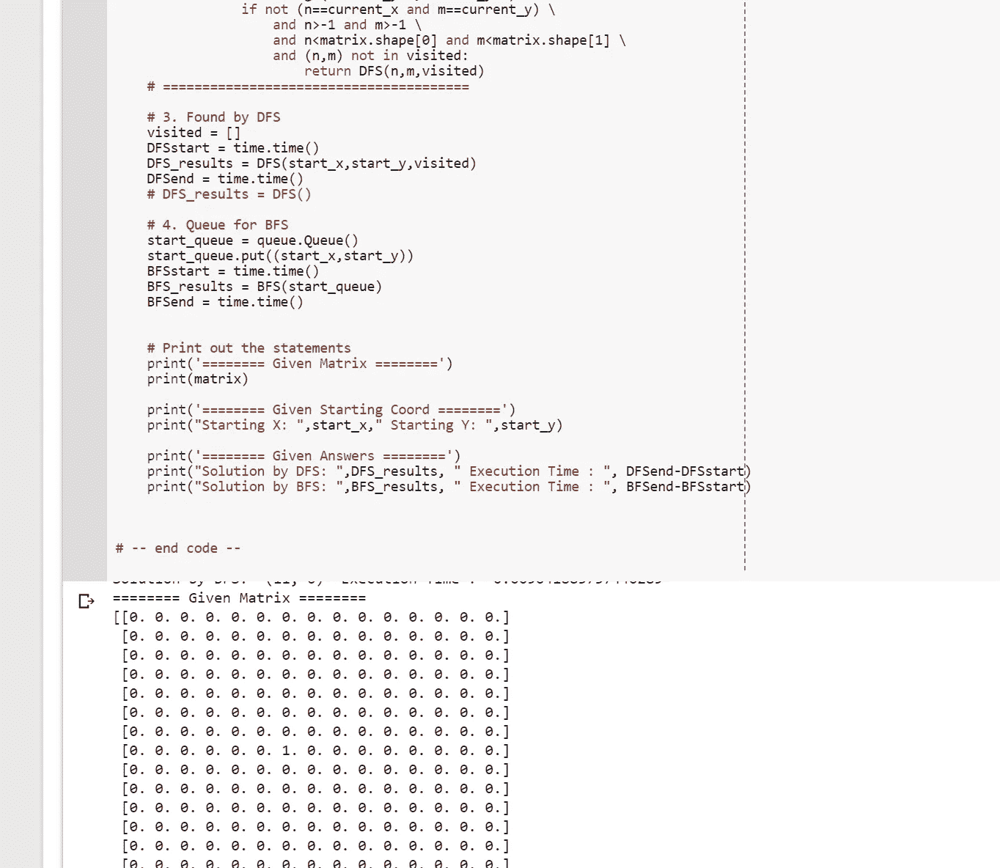

# 使用交互式代码在 Python 中进行深度/呼吸优先搜索矩阵遍历[回到基础知识]

> 原文：<https://towardsdatascience.com/depth-breath-first-search-matrix-traversal-in-python-with-interactive-code-back-to-basics-31f1eca46f55?source=collection_archive---------1----------------------->

Image from [Pixabay](https://pixabay.com/en/fibonacci-spiral-science-board-3210943/)

当你想了解更多关于算法和人工智能的知识时，搜索算法是一个完美的起点。所以让我们从基本的[呼吸优先搜索](https://en.wikipedia.org/wiki/Breadth-first_search)和[深度优先搜索](https://en.wikipedia.org/wiki/Depth-first_search)开始遍历一个矩阵。

请注意，代码没有在任何其他方法优化。这是暴力实现。所以要小心。

**给定矩阵/问题**

**红框** →我们的 1 所在的位置(我们要找的东西)
**黄框→** 我们开始搜索的位置

这个问题很简单，给定矩阵的 n*n 个网格，将会有一个称为“1”的元素，我们想要找到这个值，换句话说，我们想要知道元素 1 的坐标。

**深度优先搜索方法**

上面是递归的 DFS 实现，我们有一个名为 visited 的变量(这是一个列表)来跟踪我们访问过的所有坐标。而如果我们接下来要访问的坐标不在这个列表中，我们就要访问那个位置。为了形象化这个搜索算法的开始序列，请见下文。

**呼吸优先搜索算法**

BFS 算法也非常类似于 DFS。但是这次我们有一个队列变量来跟踪我们将要执行的下一个搜索坐标。另外，请注意，我们只是传递队列，而不是直接传递 x 和 y 坐标。再次想象这个算法的开始。

**交互代码**

*为了交互代码，我搬到了 Google Colab！所以你需要一个谷歌帐户来查看代码，你也不能在谷歌实验室运行只读脚本，所以在你的操场上做一个副本。最后，我永远不会请求允许访问你在 Google Drive 上的文件，仅供参考。编码快乐！*

要访问代码[，请点击此处。](https://colab.research.google.com/drive/1EhoK9zsBJUv_Id6lUeWjrHTXutsNg8bZ)

**最后的话**

我很喜欢实现这些算法，下次我会尝试做恒星搜索。

如果发现任何错误，请发电子邮件到 jae.duk.seo@gmail.com 给我，如果你想看我所有的写作清单，请在这里查看我的网站。

同时，在我的 twitter 上关注我[这里](https://twitter.com/JaeDukSeo)，访问[我的网站](https://jaedukseo.me/)，或者我的 [Youtube 频道](https://www.youtube.com/c/JaeDukSeo)了解更多内容。如果你感兴趣的话，我还做了解耦神经网络[的比较。](https://becominghuman.ai/only-numpy-implementing-and-comparing-combination-of-google-brains-decoupled-neural-interfaces-6712e758c1af)

**参考**

1.  python？，C. (2018)。为 python 选择除特定数字以外的随机整数？。Stackoverflow.com。检索于 2018 年 3 月 11 日，来自[https://stack overflow . com/questions/17907213/choosing-random-integers-except-for-a-special-number-for-python](https://stackoverflow.com/questions/17907213/choosing-random-integers-except-for-a-particular-number-for-python)
2.  Python？，M. (2018)。在 Python 中测量经过的时间？。Stackoverflow.com。检索于 2018 年 3 月 11 日，来自[https://stack overflow . com/questions/7370801/measure-time-elapsed-in-python](https://stackoverflow.com/questions/7370801/measure-time-elapsed-in-python)
3.  8.10.队列—同步队列类— Python 2.7.14 文档。(2018).Docs.python.org。检索于 2018 年 3 月 11 日，来自[https://docs.python.org/2/library/queue.html](https://docs.python.org/2/library/queue.html)
4.  [复本]，H. (2018)。如何在推送新对象之前检查队列中是否存在对象？Stackoverflow.com。检索于 2018 年 3 月 11 日，来自[https://stack overflow . com/questions/27024881/how-to-check-if-object-exists-in-queue-before-pushing-new-object/27025015](https://stackoverflow.com/questions/27024881/how-to-check-if-object-exists-in-queue-before-pushing-new-object/27025015)
5.  修复错误-已达到最大递归深度。(2013).Python 技巧。检索于 2018 年 3 月 11 日，来自[https://python tips . com/2013/08/31/fixing-error-maximum-recursion-depth-reached/](https://pythontips.com/2013/08/31/fixing-error-maximum-recursion-depth-reached/)
6.  p . j .(2013 年)。sys.setrecursionlimit @说真的，不要用这个代码！。Seriously.dontusethiscode.com。检索于 2018 年 3 月 11 日，来自[http://serious . dontusethiscode . com/2013/04/14/setrecursionlimit . html](http://seriously.dontusethiscode.com/2013/04/14/setrecursionlimit.html)
7.  A*搜索算法。(2018).En.wikipedia.org。检索于 2018 年 3 月 11 日，来自[https://en.wikipedia.org/wiki/A*_search_algorithm](https://en.wikipedia.org/wiki/A*_search_algorithm)
8.  广度优先搜索。(2018).En.wikipedia.org。检索于 2018 年 3 月 11 日，来自 https://en.wikipedia.org/wiki/Breadth-first_search
9.  深度优先搜索。(2018).En.wikipedia.org。检索于 2018 年 3 月 11 日，来自 https://en.wikipedia.org/wiki/Depth-first_search