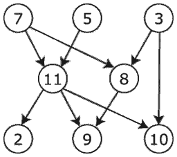

# 无向图中的深度优先搜索

> 原文：<https://towardsdatascience.com/depth-first-search-in-undirected-graphs-8d563ef4004e?source=collection_archive---------2----------------------->



S. Dasgupta、C. H. Papadimitriou 和 U. V. Vazirani 所著的《算法》一书的第 3 章和第 4 章主要关注图。一个图被指定为一组顶点`V`(或节点)和所选顶点对之间的边`E`。使用图表的一个很大的优点是，当解决问题时，图表提供了清晰性，因为它们没有杂乱的无关信息，只有数学对象。

# 图表示

具有`n=|V|`顶点`v1,...,vn`的图可以表示为一个矩阵(`n x n`的数组)，其`(i, j)th`条目为:

*   1 如果从`vi`到`vj`有边沿
*   否则为 0

在图的矩阵表示中，可以在恒定时间内检查特定边的存在，但是它需要`O(n^2)`存储空间，如果图没有很多边，这可能是浪费。图的另一种表示是邻接表。它由`|V|`链表组成(每个顶点一个)。然后，顶点`u`的链表保存`u`具有的顶点的名称和输出边。与矩阵表示相反，验证特定边的存在现在是线性的(通过运行相应的链表)，但是存储图形所需的内存是`O(|E|)`。

一个图可以根据它的边数分类如下:

*   稠密图:边的数量接近于图所能拥有的最大边数
*   稀疏图:边的数量接近于图所能拥有的最小边数

这一点很重要，因为在处理图形时，它在选择合适的数据结构和算法时起着很大的作用。例如，为了将万维网存储为图(一个网页是一个顶点，并且它具有到它具有超级链接的所有其他网页的边)，使用邻接表更方便，因为万维网图非常稀疏(在数十亿种可能性中，平均一个网页仅具有到大约六个其他网页的超级链接)。

# 无向图中的深度优先搜索

作者在第三章中考察的第一个算法是无向图中的深度优先搜索。在无向图中，连接在一起的顶点有双向边。

深度优先搜索是一种线性时间算法，它基本上回答了以下问题:

*   从给定的顶点可以到达图的哪些部分？

深度优先搜索算法的以下实现使用邻接表并返回从指定顶点可达的图的所有顶点。

# 深度优先搜索算法

## [伪代码:](https://en.wikipedia.org/wiki/Depth-first_search)

```
procedure DFS(G,v):
  label v as discovered
  for all edges from v to w in G.adjacentEdges(v) do
    if vertex w is not labeled as discovered then
      recursively call DFS(G,w)
```

## 实施:

## 测试:

# 结论

深度优先搜索是一个有趣的算法，正如你可能怀疑的那样，它特别适合于检查一个图是否连通；如果深度优先搜索返回的树包含图中的所有顶点，则它是连通的，否则不是。