# Sigmoid 函数的导数

> 原文：<https://towardsdatascience.com/derivative-of-the-sigmoid-function-536880cf918e?source=collection_archive---------0----------------------->

Sigmoid and Dino

在本文中，我们将看到在人工智能应用中使用的 Sigmoid 函数的完整推导。

首先，让我们来看看 sigmoid 函数

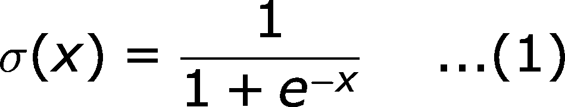

Sigmoid function

好吧，看起来不错！
我们读作，*x 的 sigmoid 是 1/1 加上负 x 的指数* 这就是方程 **(1)** 。

让我们看看 sigmoid 函数的图形，

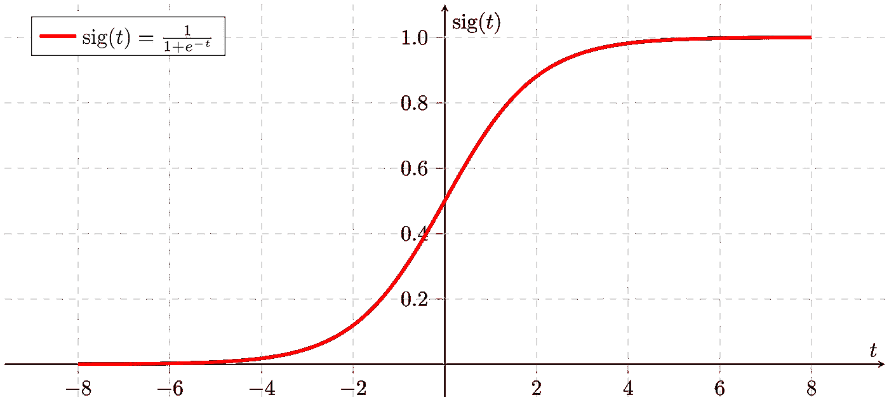

[Graph of the Sigmoid Function](https://upload.wikimedia.org/wikipedia/commons/thumb/5/53/Sigmoid-function-2.svg/2000px-Sigmoid-function-2.svg.png)

查看该图，我们可以看到给定一个数字`n`，sigmoid 函数将在 **0** 和 **1** 之间映射该数字。
随着`n`的值变大，sigmoid 函数值越来越接近 **1** ，随着`n`变小，sigmoid 函数值越来越接近 **0** 。

好，让我们开始推导 sigmoid 函数！
所以，我们要的价值是

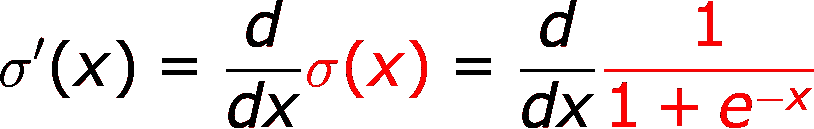

Step 1

在上面的步骤中，我只是从 **(1)** 展开了 sigmoid 函数的取值公式

接下来，我们简单的用 [*负指数*](https://www.khanacademy.org/math/pre-algebra/pre-algebra-exponents-radicals/pre-algebra-negative-exponents/v/negative-exponents) 来表示上面的方程，

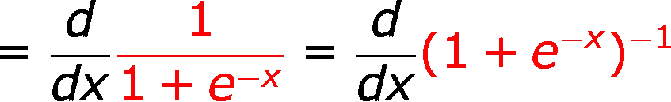

Step 2

接下来，我们将应用 [*倒易法则*](https://www.youtube.com/watch?v=jFJ1kgzDuWY) ，它简单地说

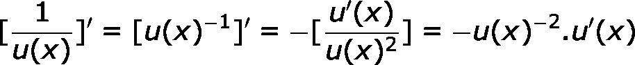

Reciprocal Rule

运用互易法则，我们进入下一步

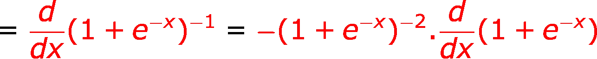

Step 3

为了清楚地看到上一步中发生了什么，用`(1 + e^(-x))`替换互易规则中的`u(x)`。

接下来，我们需要应用线性的 [*法则*](https://en.wikipedia.org/wiki/Linearity_of_differentiation) ，它简单地说

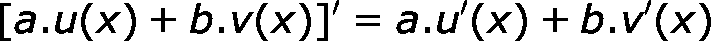

Rule of Linearity

应用线性法则，我们得到

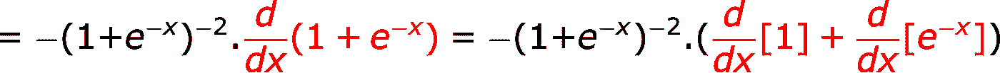

Step 4

好的，这很简单，现在让我们一个一个地推导它们。
现在，*常数的导数是 0* ，所以我们可以把下一步写成

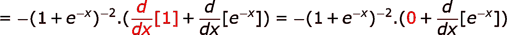

Step 5

把 0 加到某个东西上不会有什么影响，所以我们将在下一步中去掉 0，然后进行下一个推导，为此我们将需要 [*指数法则*](https://www.khanacademy.org/math/ap-calculus-ab/ab-differentiation-2-new/ab-3-1b/v/exponential-functions-differentiation) ，它简单地说

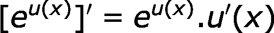

Exponential Rule

运用我们得到的指数法则，

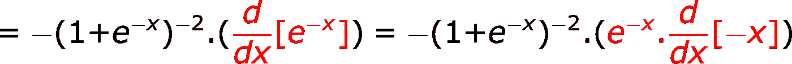

Step 6

同样，为了更好地理解，您可以简单地将指数规则中的`e^u(x)`替换为`e^(-x)`

接下来，由[的*线性规律我们可以写出*的](https://en.wikipedia.org/wiki/Linearity_of_differentiation)

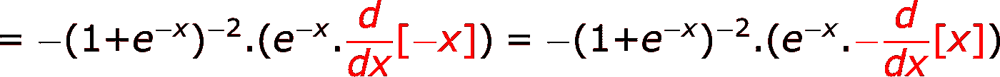

Step 7

[*微分变量的导数是 1*](https://www.khanacademy.org/math/calculus-home/taking-derivatives-calc/basic-differentiation-rules-calc/v/constant-derivative-rule) ，应用它我们得到

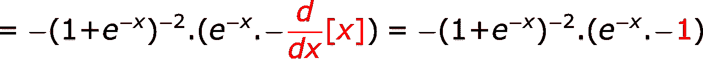

Step 8

现在，我们可以简单地打开第二对括号，应用我们得到的基本规则`-1 * -1 = +1`

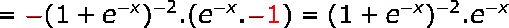

Step 9

可以写成

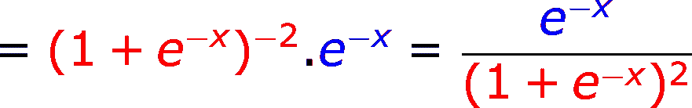

Step 10

好了，我们完成了求导！！

但是但是，我们仍然需要把它简化一点，以达到机器学习中使用的形式。好了，我们走吧！

首先，让我们重写如下

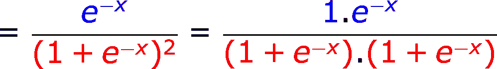

Step 11

然后重写为

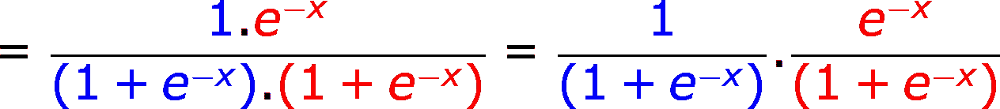

Step 12

因为`+1 — 1 = 0`我们可以做到这一点

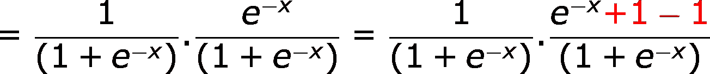

Step 13

现在让我们把分数分开，重写为

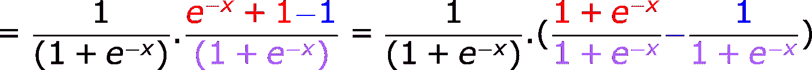

Step 14

让我们消去分子和分母

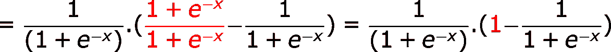

Step 15

现在，如果我们看一看本文的第一个等式 **(1)** ，那么我们可以改写如下

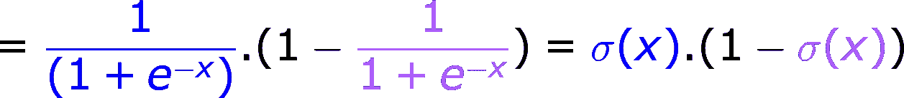

Step 16

这样简化就完成了！

所以，sigmoid 函数的导数是

Derivative of the Sigmoid Function

sigmoid 函数的导数的图形看起来像

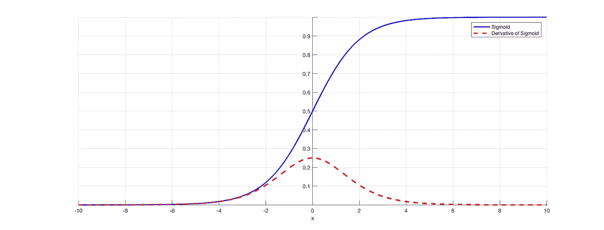

[Graph of Sigmoid and the derivative of the Sigmoid function](https://isaacchanghau.github.io/img/deeplearning/activationfunction/sigmoid.png)

感谢您阅读文章！想和我交流吗？
以下是我的 Linkedin 个人资料和 YouTube 频道的链接，

 [## 阿鲁纳瓦查克拉博蒂| LinkedIn

### 查看 Arunava Chakraborty 在 LinkedIn 上的职业简介。LinkedIn 是世界上最大的商业网络，帮助…

www.linkedin.com](https://www.linkedin.com/in/iarunava/)  [## 阿鲁纳瓦(@amArunava) |推特

### 阿鲁纳瓦(@amArunava)的最新推文:“发表了一篇关于@ Sigmoid 函数的中等导数的文章我的第一…

twitter.com](https://twitter.com/amArunava)  [## 阿鲁纳瓦

### 订阅深入了解 Python 里的所有东西。

www.youtube.com](https://www.youtube.com/channel/UC2ZFGaNzZt-sUy2qZT6L7Zw) 

给我发消息！我们连线吧！