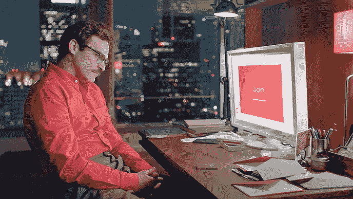
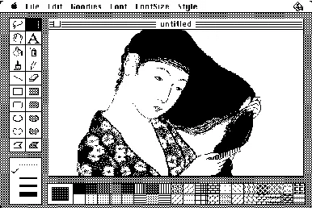
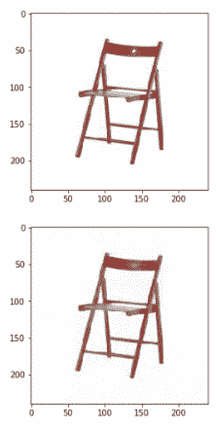
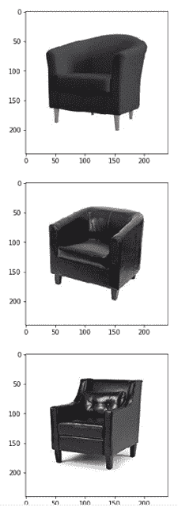
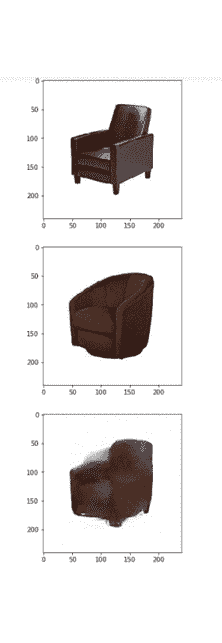
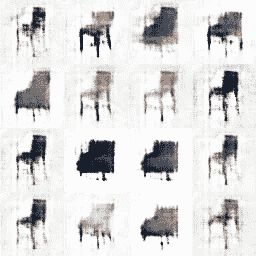
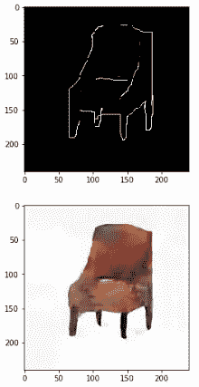
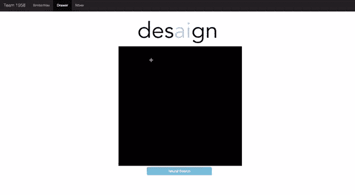
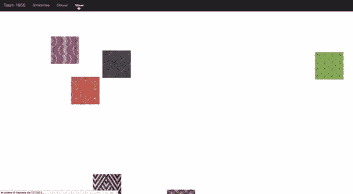

# des . ai . gn——用人工智能增强人类创造力

> 原文：<https://towardsdatascience.com/des-ai-gn-augmenting-human-creativity-with-artificial-intelligence-bb6ff611fa2c?source=collection_archive---------6----------------------->

## 用神经网络混合、创造和搜索美学上连贯的设计。

人工智能和计算机科学中讨论最多的一个方面是机器****是否有创造力**。这个讨论和第一台计算机一样古老，但是最近来自生成性对抗网络和类似架构的惊人结果确实使这个讨论变得更大。作为一名创意者和技术专家，我最近关注了一个相似但本质上不同的话题:**人工智能*能增强*人类的创造力**？设计师可以使用机器智能增强灵感吗？**

**一开始有*画*。如果不是第一个，也是第一个帮助创意人员发挥创造力的软件工具之一。然后，人们开始看到计算机在处理图形方面是多么酷。现在，我们有了 Adobe 软件，比如 Photoshop，这些软件极大地增强了人类创作艺术品和编辑图片的能力，这在以前是不可想象的。下一步是什么？人工智能。为了分析这个新领域，我关注了两个不同的设计领域:**室内设计**和**时装设计**。**

****

**众所周知，灵感是一种 T21 缪斯。真是*不可预测*。伟大的想法可以从任何地方冒出来，即使一个人专注了几个星期也找不到。所以我在能够影响灵感的不同方面下了功夫:**研究**和**创作**。**

*   ****研究**意味着寻找过去的设计，寻找与我们想法相似的东西来*获得灵感。***
*   ****创造**意味着在尽可能短的时间内从零开始*到完成设计*，从而创造出允许快速创造性实验的工具。**

**所以，目标很简单:彻底改变设计师使用人工智能的方式。**

**作为第一步，我从互联网上创建了一个椅子和沙发的小型数据集(大约 500 个样本)。我一直喜欢简单的室内设计，将 AI 与室内设计融合的想法真的让我很感兴趣。我需要实现一个神经网络架构，它可以从这些未标记的数据中提取视觉特征，并且基本上能够理解椅子的样子。因此，我实现了一个**卷积自动编码器，**，它学习如何将原始图像压缩到更小的尺寸(在我的例子中，从 240x240 到 15x15)，然后如何尽可能地重建原始图像。**

****

**Convolutional auto encoder structure.**

**瓶颈结构迫使网络学习重要的视觉特征，这些特征在 15×15 维的潜在空间中用数字表示。这是我开发的应用程序背后的核心模型，我将在本文后面讨论。**

****

**Reconstruction of chair designs with convolutional autoencoders.**

**创建和训练自动编码器结构有什么好处？核心在于潜在的空间表现。这个小矩阵以一种通常不可预测的方式包含了网络已经学会识别的数据集的显著视觉特征，在这个空间中进行计算会更好，例如，计算距离，甚至进行代数求和。**

**这些工具如何让设计师能够*轻松*和*直观*地在椅子设计或纺织品/服装设计的数据集中进行搜索？将所有数据集投影到这个潜在空间中，可以让我们轻松计算样本之间的**距离**，从而进行**反向图像搜索**。虽然有许多方法可以实现这一点，但我很好奇，想检查一下“*神经*”反向图像搜索的性能，在我的例子中，使用的是椅子。下面显示了一些结果:你可以选择一个图像作为查询；网络(特别是编码器)提取潜在的表示，然后你可以计算距离(欧几里德，余弦等。)在查询和数据集图像之间。这使得*寻找* *灵感*的过程变得更加容易。**

****

**Neural Inverse Image Search. The first chair (top) is the query, will the other two are two random samples that are similar enough. (latent space distance under a threshold)**

**另一个有趣的应用是**混合来自数据集的不同样本**以**生成新的样本**，这些样本共享来自两者的视觉特征。特别是，可以混合不同椅子的设计，以获得一个新的美学上连贯的椅子，并与两把椅子共享设计细节。这再次允许设计师通过混合有趣的设计立即试验新的想法，直到一些结果激发他/她的创造力。通过平均不同椅子设计的潜在空间表现，这是可能的。一个*加权*平均值甚至可以给出大量的细微差别，即创造一个更接近一个或另一个“母体”的新设计。看看下面一些有趣的结果。**

****

**Mixing different chair designs to generate a new one.**

**我还训练了一个**深度卷积生成对抗网络**来从头开始创建新的椅子设计，但小数据集不允许获得真正好的结果，同时通常会过度拟合一些数据集样本。此外，这种方法不允许直接混合不同的现有设计。**

****

**A DCGAN dreaming of chairs.**

**受 **pix2pix** 方法的启发，我训练了相同的架构，以椅子的图纸作为输入，这基本上是数据集中自动计算的图像边缘，并根据它们重建原始图片。这样，网络可以被训练**从简单的图纸**开始生成设计，在平板电脑上甚至用鼠标。由于我的数据集非常小(通常采用的数据集有大约 10k 个样本，而我的有大约 500 个样本)，结果并不突出，但它们很有希望:从 Gimp 上用触控板制作的简单草图，网络可以生成类似椅子设计的东西。有趣的是，它是如何自动地**修改**、**修正**、**填充**图纸的某个部分，这是基于它对椅子应该是什么样子的经验。**

****

**An example of generating a chair from a drawing. Notice how the network modifies and corrects some parts of the sketch.**

**我在**时装设计**上应用了同样的技术，特别是**纺织品设计**，结果相似。我和我的几个朋友进一步发展了这个项目的这个分支，我们创建了一个神经逆向图像搜索，它可以在一个网络应用程序上用简单的图画工作。在演示中，用户可以简单地画出他/她想在纺织品图案数据库中找到的图案。神经网络从绘图中提取视觉特征，并将它们与数据库图像中的视觉特征进行比较。经过一些计算后，它返回看起来最匹配的那些。**

****

**Neural reverse image search directly from drawings.**

**这是在模式数据库中搜索的一种非常简单和直观的方式，可以为任何设计师节省大量的时间。**

**我们从网上提取的纺织品图案数据库也是一个有趣的游乐场，可以测试设计的混合，以创建一个新的设计。在几秒钟内，设计师可以通过组合现有的图案来创建新的图案，并收集大量的想法和灵感。**

****

**Neural pattern mixing. In a couple of seconds, a neural network creates new pattern starting from existing ones.**

**将人工智能和设计结合起来对我来说是真正鼓舞人心的，我对这两者都充满热情。我真的相信人工智能可以创造出*增强艺术家*，实现新的搜索和创造方式。这个领域的人们似乎喜欢这个想法，因为由于这个项目，我们赢得了最近在米兰举行的**黑客马拉松**CognitiveHack。挑战在于时装设计，以及增强设计师能力和灵感的方法。这一创意被评为最佳创意，并将在未来与赞助该活动的时尚品牌和公司合作，进一步推广。**