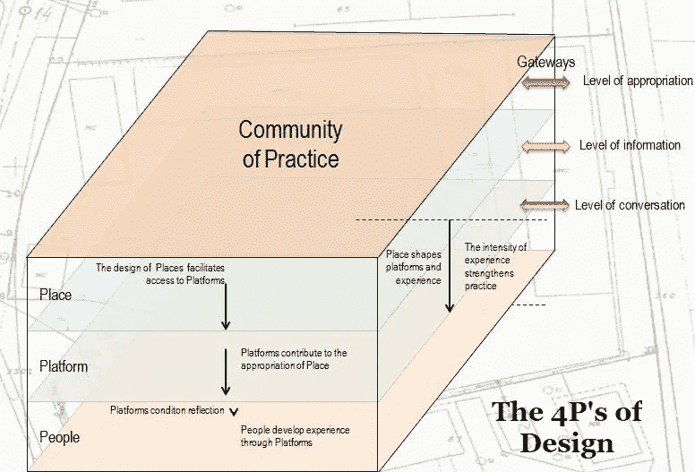
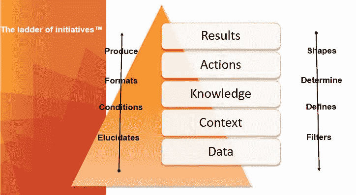

# 设计思维就是做出更好的决策

> 原文：<https://towardsdatascience.com/design-thinking-is-all-about-making-better-decisions-13e0a5bce5fb?source=collection_archive---------3----------------------->

UK EquatePlus user group

设计思维和创新有什么联系？今天在谷歌上快速搜索“设计思维学位”会出现 442 万个结果。大学和企业教育提出了 Ideo 最初愿景的一系列令人印象深刻的变体，即*移情、定义、构思、原型*和*测试*。尽管有数量惊人的项目宣扬“设计思维”，但很少有证据表明设计和创新之间有直接关系。约翰·肯尼迪断言，设计思维的主流观点往往是肤浅的和误导的。让我们指出，大多数人都忽略了一个关键点:设计思维需要一种不同的方法来看待我们试图解决的问题，我们如何使用数据，以及我们如何寻找解决方案。

设计从根本上讲是关于如何理解事物——或者像 Aaash Goel 建议的那样，“把抽象变成具体的东西”试图定义“事物”的确切含义需要仔细考虑问题的本质(服务创新？，客户参与度？，组织可持续性？)我们正在努力解决。在我们的 4P 框架中，我们建议可以通过将问题置于*地点*(公司、供应链或市场的愿景、事件、参与者和结果)*平台*(用于将产品、服务或体验的生产者和消费者聚集在一起的技术)*人员*(我们如何构建业务挑战和解决方案的思维模式)和*实践*(生产的文化、规范和程序)来分析问题。[【iv】](#_edn4)

IBMs Lara Hanlon 认为，在过去的十年里，设计已经从改变事物的外观发展到模拟事物的体验。今天，我们利用自己掌握的数据探索地方、平台、人物和活动。在我们的计划阶梯框架[【VI】](#_edn5)中，我们提出这些经验是组织战略及其数据使用之间关系的模型化愿景。在自上而下的决策过程中，远见者通常会强加一种策略，这种策略决定了策略、背景和数据收集。在自下而上的决策中，数据可以帮助领导层理解在任何给定市场中可以指导战略的背景、战术和战略。

设计思维的价值既不在于它的艺术吸引力，也不在于它的非正统性，而在于用不同的方式思考如何解决业务和组织的挑战。如果说演绎是科学管理的核心——用于“严格证明”商业法则的推理，那么归纳就是管理艺术的核心:将我们观察的前提视为市场和行业永恒真理的证据。设计思维既不依赖于演绎也不依赖于归纳，而是依赖于溯因推理，这种推理涉及在复杂环境中对更好的产品、服务和想法进行概率性押注。总之，设计思维是关于意义的:探索问题的本质，识别相关数据，并学会做出有影响力的决定。

(重新)设计我们思考价值的方式是商业分析研究所的核心。在巴约纳的[暑期学校](http://http/baisummer.com)，以及在欧洲的[大师班](http://http/Baimasterclass.com)，我们让分析为您和您的组织服务。该研究所专注于管理者数据科学的五个应用:在数字时代工作、数据驱动的决策、机器学习、社区管理和视觉通信。数据驱动的决策会对你未来的工作和职业生涯产生影响。

Lee Schlenker 是 Pau 商学院的教授，也是 http://baieurope.com 商业分析学院的负责人。 *他的领英简介可以在*[*www.linkedin.com/in/leeschlenker.*](http://www.linkedin.com/in/leeschlenker.)*查看你可以在*[【https://twitter.com/DSign4Analytics】T21](https://twitter.com/DSign4Analytics)关注我们的推特

_______________

[【I】](#_ednref1)Kolko，J. (2007)，[设计与创新的微妙关系](http://www.jonkolko.com/writingDesignInnovation.php)。Routledge 的*工件*，第 1 卷，2007 年第 3 期

[【ii】](#_ednref2)j . Kennedy，(2016)，[设计思维绝不能成为管理时尚](https://www.fjordnet.com/conversations/design-thinking-must-not-become-a-management-fad/)，Fjordnet

[【iii】](#_ednref3)Goel，a .(2016)，[你想成为什么样的设计师？](https://medium.com/@ashpodel/the-portrait-of-a-designer-6268987955ed)

[【iv】](#_ednref4)sch lenker，L. (2016)，DSIgn4Change —改进管理教育的 4Ps，载于 J. M. Spector 等著《数字时代教、学与教育领导的能力、挑战与变革》，施普林格。

[【v】](#_ednref4)(2016)j . Kennedy，[一场为生活而设计的革命正在席卷 IBM](https://www.siliconrepublic.com/innovation/ibm-design-revolution-lara-hanlon) ，硅共和国

[【VI】](#_ednref5)sch lenker，L. (2017) [在一个人人都更喜欢发帖而不是倾听的经济中，领导力只是一种幻觉吗？](https://www.linkedin.com/pulse/leadership-just-illusion-economy-which-everyone-lee-schlenker)