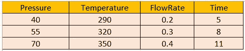
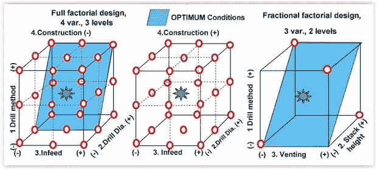
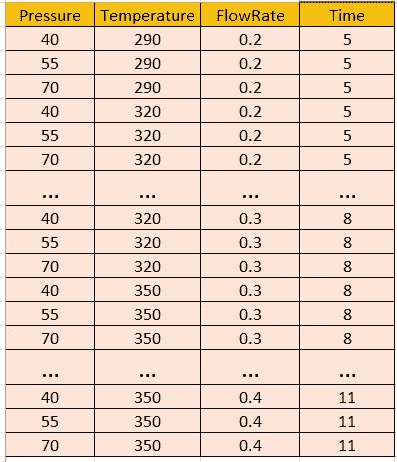
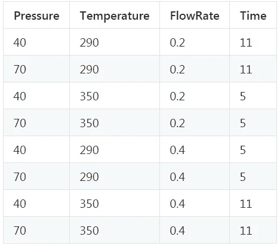
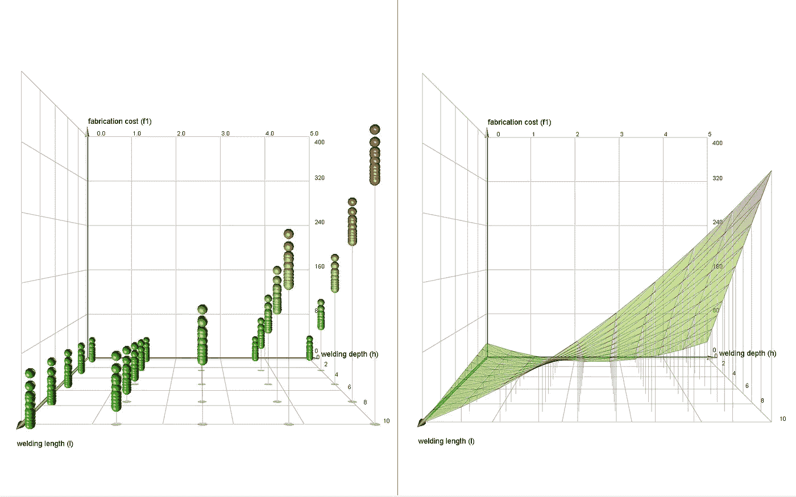
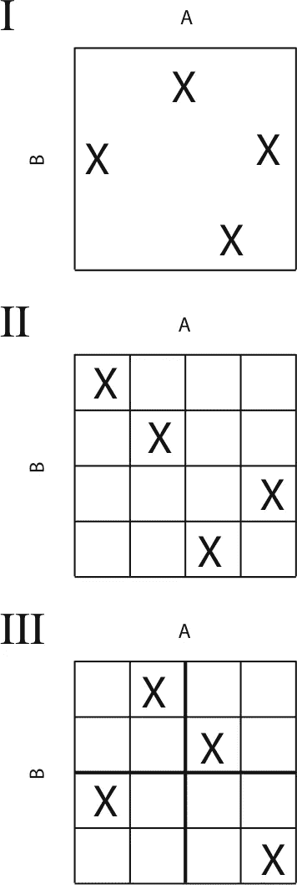
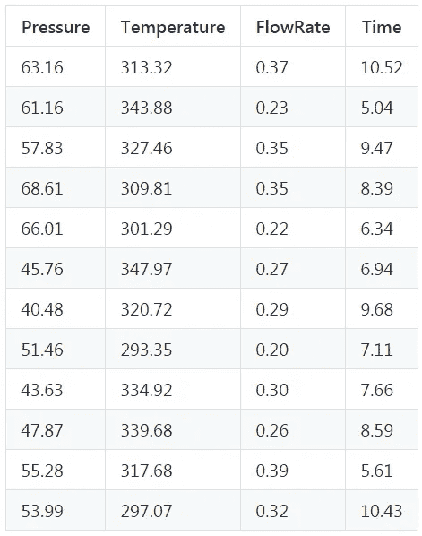

# 用一个简单的 Python 命令创建您的实验设计

> 原文：<https://towardsdatascience.com/design-your-engineering-experiment-plan-with-a-simple-python-command-35a6ba52fa35?source=collection_archive---------0----------------------->


**更新(2019 年 7 月)**:这组代码现在以标准 Python 库的形式提供— `**doepy**`。你所要做的就是在你的终端中运行`pip install doepy` 。然后使用这个库按照这里的文档生成设计表。

[**阅读 Python 库 doepy 的文档。**](https://doepy.readthedocs.io/en/latest/)

[](https://doepy.readthedocs.io/en/latest/) [## DOEPY (pip 安装 doepy) - doepy 0.0.1 文档

doepy.readthedocs.io](https://doepy.readthedocs.io/en/latest/) 

# 介绍

实验设计对于任何计划进行实验分析的科学家、工程师或统计学家来说，都是一项重要的活动。在这个数据科学和相关的统计建模和机器学习领域迅速扩展的时代，这项工作变得非常重要。一个计划良好的 DOE 可以给研究人员提供有意义的数据集，让他们根据最佳数量的实验采取行动，保留关键资源。

毕竟，数据科学的基本目标是用真实世界的数据进行最高质量的科学调查和建模。为了用数据做好科学研究，需要通过深思熟虑的实验来收集数据，以涵盖所有的极端情况并减少任何可能的偏差。

## 什么是科学实验？

在其最简单的形式中，科学实验旨在通过引入先决条件的变化来预测结果，这由一个或多个独立变量[表示，也称为“输入变量”或“预测变量”通常假设一个或多个自变量的变化会导致一个或多个](https://en.wikipedia.org/wiki/Dependent_and_independent_variables)[因变量](https://en.wikipedia.org/wiki/Dependent_and_independent_variables)的变化，也称为“输出变量”或“响应变量”实验设计还可以确定[控制变量](https://en.wikipedia.org/wiki/Controlling_for_a_variable)，这些变量必须保持不变，以防止外部因素影响结果。

## 什么是实验设计？

实验设计不仅包括选择合适的自变量、因变量和控制变量，还包括在给定可用资源限制的情况下，在统计最优条件下规划实验的实施。有多种方法可以确定实验中使用的一组设计点(独立变量设置的独特组合)。

实验设计的主要关注点包括建立[效度](https://en.wikipedia.org/wiki/Validity_(statistics))、[信度](https://en.wikipedia.org/wiki/Reliability_(statistics))和[可复制性](https://en.wikipedia.org/wiki/Reproducibility)。例如，通过仔细选择自变量，降低测量误差的风险，并确保方法的文档足够详细，可以部分解决这些问题。相关问题包括实现适当水平的[统计功效](https://en.wikipedia.org/wiki/Statistical_power)和[灵敏度](https://en.wikipedia.org/wiki/Sensitivity_and_specificity)。

在所有严肃的科学、技术甚至社会科学研究领域——计算机科学、物理学、地质学、政治学、电子工程、心理学、商业营销分析、金融分析等——都需要精心设计实验

对于现实生活中的工程问题，它出现的频率比你想象的要高。工程实验预算通常是有限的，你仍然需要建立一个机器学习模型。您将如何在不超出预算的情况下最大限度地接触数据/响应的所有方面？

> …数据科学的基本目标是利用真实世界的数据进行最高质量的科学调查和建模。为了用数据做好科学研究，需要通过深思熟虑的实验来收集数据，以涵盖所有的极端情况并减少任何可能的偏差。

## Python 中开源 DOE builder 包的选项？

不幸的是，大多数最先进的 DOE 生成器都是 JMP (SAS)或 Minitab 等商业统计软件包的一部分。

然而，如果存在一个开源代码，它提供了一个直观的用户界面，用于从一个简单的输入变量列表中生成实验设计计划，那么研究人员肯定会受益。

有几个 DOE builder Python 包，但单独来说，它们没有涵盖所有必要的 DOE 方法，并且它们缺乏简化的用户 API，用户可以只输入输入变量范围的 CSV 文件，然后在另一个 CSV 文件中获取 DOE 矩阵。

> 我很高兴地宣布一个基于 Python 的 DOE 包(带有许可的 MIT 许可证)可供任何人使用和增强。你可以 [**从我的 GitHub Repo 下载代码库，这里。**](https://github.com/tirthajyoti/Design-of-experiment-Python)

# 特征

这组代码是围绕核心包(如下所述)的函数集合，并从任意范围的输入变量为统计学家或工程师生成**实验设计(DOE)矩阵**。

## 所用基础包的限制

这两个核心包作为这个 repo 的基础，并不完整，因为它们没有涵盖设计工程师在计划实验时可能需要的生成 DOE 表的所有必要功能。此外，它们只提供低级 API，因为它们的标准输出已经规范化了 NumPy 数组。有人认为，可能不习惯直接处理 Python 对象的用户应该能够通过简化的用户界面来利用它们的功能。

## 简化的用户界面

***用户只需提供一个简单的 CSV 文件，其中包含一个变量及其范围的表格(2 级，即最小/最大或 3 级)。*** 一些功能具有 2 级最小/最大范围，而另一些功能需要用户提供 3 级范围(低-中-高)。智能内置于代码中，用于处理范围输入不合适的情况，并根据给定输入通过简单的线性插值生成等级。代码将根据用户的选择生成 DOE，并将矩阵以 CSV 文件的形式写入磁盘。这样， ***用户接触到的唯一 API 就是输入和输出 CSV 文件。然后，这些文件可用于任何工程模拟器、软件、过程控制模块，或输入过程设备。***

## 设计选项

以下设计选项可从输入变量中生成:

*   全因子，
*   2 级部分因子，
*   普拉克特-伯曼公司，
*   苏哈列夫电网，
*   博克斯-贝肯，
*   Box-Wilson(中央复合)带面向中央选项，
*   具有中心内接选项的 Box-Wilson(中心复合),
*   具有中心外切选项的 Box-Wilson(中心复合),
*   拉丁超立方体(简单)，
*   拉丁超立方体(空间填充)，
*   随机 k 均值聚类，
*   马希民重建，
*   基于 Halton 序列，
*   均匀随机矩阵

> 工程实验预算通常是有限的，你仍然需要建立一个机器学习模型。您将如何在不超出预算的情况下最大限度地接触数据/响应的所有方面？

# 怎么用？

## 需要哪些支持包？

首先，确保您已经安装了所有必需的软件包。您可以简单地运行。bash (Unix/Linux)和。bat (Windows)文件，从命令行界面安装这些包。它们包含以下命令，

```
**pip install numpy
pip install pandas
pip install matplotlib
pip install pydoe
pip install diversipy**
```

## 使用 PyDOE 的勘误表

请注意，在安装时，PyDOE 将抛出一些与类型转换相关的错误。有两种选择

*   我已经适当地修改了 pyDOE 代码，并在 repo 中包含了一个带有重写函数的文件。这是程序在执行时调用的文件，所以您应该看不到任何错误。
*   如果您遇到任何错误，您可以尝试修改 PyDOE 代码，方法是转到复制 pyDOE 文件的文件夹，并复制随此 repo 提供的两个文件`doe_factorial.py`和`doe_box_behnken.py`。

## 生成 DOE 的一个简单命令

注意这只是一个代码库，而不是一个安装包。目前，请从 GitHub 克隆[这个 repo，将所有文件存储在本地目录中，只需输入:](https://github.com/tirthajyoti/Design-of-experiment-Python)

`**python Main.py**`

此后，一个简单的菜单将打印在屏幕上，并提示您选择数字(DOE)和输入 CSV 文件的名称(包含变量的名称和范围)。**您必须将输入参数 CSV 文件存储在运行该代码的目录**中。repo 中提供了几个示例 CSV 文件。请根据您的需要随意修改它们。您应该使用提供的通用 CSV 文件作为示例。请将因素放在列中，将水平放在行中(而不是反过来)。样本参数范围的示例如下:



## 是否有可用的安装程序/Python 库？

此时，**无**。我计划把它变成一个成熟的 Python 库，可以通过 PIP 命令从 PyPi 存储库中安装。但我不能承诺任何时间表:-) ***如果有人想合作和工作在一个安装程序，请随时这样做。***

# 例子

## 完全/部分因子设计



想象一个工厂中化学过程的一般例子，其中输入文件包含如上所示的参数范围表。如果我们由此构建一个[全因子 DOE](https://en.wikipedia.org/wiki/Factorial_experiment) ，我们将得到一个有 81 个条目的表格，因为 4 个因子在 3 个水平上排列产生了 3⁴=81 组合！



显然，全因子设计发展很快！因此，工程师和科学家经常求助于使用[半因子/部分因子设计](https://en.wikipedia.org/wiki/Fractional_factorial_design)，他们将一个或多个因子与其他因子混淆，构建一个简化的 DOE。

假设我们决定用第 4 个变量作为[混杂因子](https://en.wikipedia.org/wiki/Confounding)(即不是独立变量，而是其他变量的函数)来构建这组变量的 2 级部分因子。如果函数关系为“***【A-B-C-BC***”，即第四个参数仅随第二个和第三个参数而变化，则输出表可能如下所示:



## 中心复合设计

[Box-Wilson 中心复合设计](https://en.wikipedia.org/wiki/Response_surface_methodology)，通常称为“中心复合设计”，或*响应面方法学(RSM)* 包含一个嵌入因子或部分因子设计，其中心点增加了一组“星点”，允许估计曲率。该方法由乔治·e·p·博克斯和 k·b·威尔逊于 1951 年提出。RSM 的主要思想是使用一系列[设计的实验](https://en.wikipedia.org/wiki/Design_of_experiments)来获得最佳响应。



中心复合设计有三种类型。一个中心复合设计包括位于单位立方体的角上的立方体点，该单位立方体是区间[-1，1]的乘积，沿着立方体上或立方体外的轴的星形点，以及位于原点的中心点。这被称为外切(CCC)设计。

内接(CCI)设计如上所述，但是被缩放以使星点取值-1 和+1，并且立方体点位于立方体的内部。

面(CCF)设计在立方体的面上有星点。贴面设计每个因素有三个级别，而其他类型每个因素有五个级别。下图显示了三种因素的三种设计类型。

[阅读这篇精彩的教程](http://blog.minitab.com/blog/understanding-statistics/getting-started-with-factorial-design-of-experiments-doe)了解更多关于这种设计哲学的信息。

## 拉丁超立方体设计



有时，给定范围内的一组*随机设计点可能会吸引实验者评估过程变量对输出的影响。[蒙特卡洛模拟](https://en.wikipedia.org/wiki/Monte_Carlo_method)就是这种方法的一个很好的例子。然而，[拉丁超立方体设计](https://en.wikipedia.org/wiki/Latin_hypercube_sampling)是实验设计的更好选择，而不是建立一个完整的随机矩阵，因为它试图将样本空间细分为更小的单元，并从每个子单元中仅选择一个元素。*

在统计抽样中，当(且仅当)每行每列只有一个样本时，包含样本位置的正方形网格是拉丁正方形。**拉丁超立方体是这一概念向任意维数的推广**，其中每个样本是包含它的每个轴对齐超平面中的唯一样本。

当对 N 个*变量的函数进行采样时，每个变量的范围被分成 *M 个*等概率区间。然后放置 M 个样本点，以满足拉丁超立方体要求；这使得每个变量的除法数 *M* 相等。这种抽样方案不需要更多维度(变量)的更多样本；这种独立性是这种抽样方案的主要优点之一。这样，可以获得随机样本点*的更加*‘均匀分布’。*

用户可以选择采样点的密度。例如，如果我们选择从相同的输入文件中生成一个包含 12 个实验的拉丁超立方体，可能如下所示。当然，如果你运行这个函数，不能保证你会得到相同的矩阵，因为这些是随机抽样的，但是你得到了这个想法！

你可以在这里进一步阅读。



# 进一步扩展

目前，只能生成各种 DOE 并将输出保存在 CSV 文件中。然而，可以考虑一些有用的扩展，

*   基于**模型信息增益**的更高级的随机采样，即对超平面的那些体积进行采样，在那里可以为预期模型获得更多信息。当然，这需要了解输入/输出模型，即哪些参数更重要。
*   添加到**的统计函数从 DOE 函数生成的各种实验的输出中生成描述性统计数据**和基本可视化。
*   基本机器学习附加功能，用于分析各种实验的输出，并**识别最重要的参数**。

如果您有任何问题或想法要分享，请联系作者在[**tirthajyoti【AT】Gmail . com**](mailto:tirthajyoti@gmail.com)。此外，您可以查看作者的 [**GitHub 资源库**](https://github.com/tirthajyoti?tab=repositories) 中其他有趣的代码片段。如果你像我一样对机器学习/数据科学充满热情，请随时[在 LinkedIn 上添加我](https://www.linkedin.com/in/tirthajyoti-sarkar-2127aa7/)或[在 Twitter 上关注我。](https://twitter.com/tirthajyotiS)