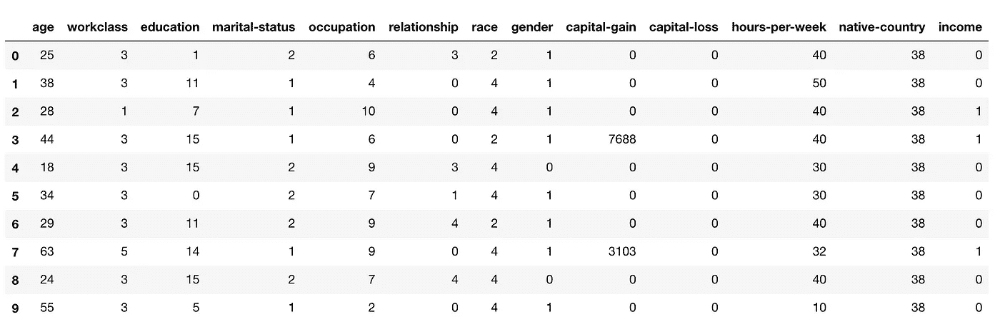
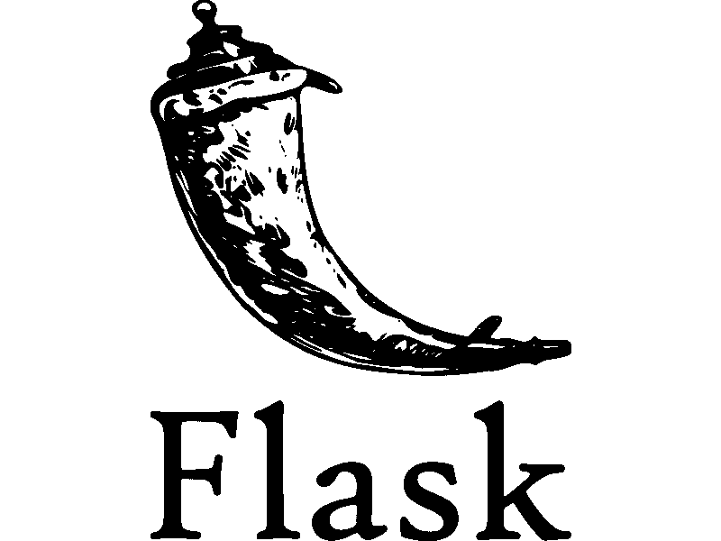
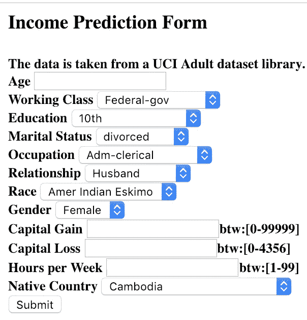
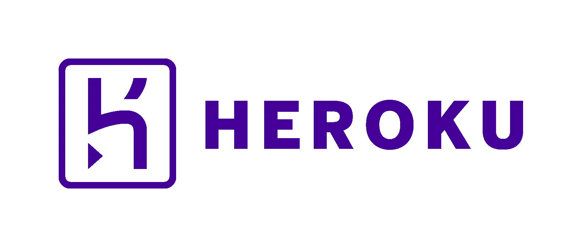

# 设计一个机器学习模型并使用 Flask 在 Heroku 上部署它

> 原文：<https://towardsdatascience.com/designing-a-machine-learning-model-and-deploying-it-using-flask-on-heroku-9558ce6bde7b?source=collection_archive---------1----------------------->

## 从创建机器学习模型到在网络上部署它——简明指南

我们使用不同的机器学习算法和分类器对历史数据建立预测模型，绘制结果并计算模型对测试数据的准确性。现在怎么办？为了使用它来预测新的数据，我们必须将它部署在互联网上，以便外部世界可以使用它。在这篇文章中，我讲述了我如何训练一个机器学习模型，如何使用 [Flask](http://flask.pocoo.org/) 在其上创建一个 web 应用程序，以及如何使用 [Heroku](https://www.heroku.com/) 部署它。

# 训练决策树


[source](https://gaps.cornell.edu/sites/gaps.cornell.edu/files/shared/images/Decision-Tree-4.gif)

决策树是一种众所周知的监督机器学习算法，因为它易于使用，弹性和灵活性。我已经在来自 UCI 机器学习知识库[的*成人数据集*上实现了该算法。在我以前的一篇文章中，我已经深入解释了数据集，并比较了我在其上训练的不同分类器。请随时查看[](https://archive.ics.uci.edu/ml/datasets/adult) [此处](/comparative-study-of-classifiers-in-predicting-the-income-range-of-a-person-from-a-census-data-96ce60ee5a10)。

## 预处理数据集

它由 14 个属性和一个类别标签组成，说明个人的年收入是低于还是高于 50K。这些属性的范围从人的年龄、工人阶级标签到关系状态和人所属的种族。关于所有属性的信息可以在[这里](https://archive.ics.uci.edu/ml/datasets/adult)找到。

首先，我们从数据中找出并删除任何丢失的值。我已经用该列中的模式值替换了缺失的值。有许多其他方法可以替换缺失值，但对于这种类型的数据集来说，这似乎是最理想的。

为了将数据拟合到预测模型中，我们需要将分类值转换为数值。在此之前，我们将评估是否有必要对分类列进行任何转换。离散化是使分类数据更加整洁和有意义的常用方法。我对婚姻状况一栏进行了离散化处理，将它们缩小到只包含已婚或未婚的值。后来，我在剩余的数据列中应用了标签编码器。还有两个多余的列{'education '，' education-num ' }，因此我删除了其中的一个。

这是数据集的样子:



## 拟合模型

在根据数据的输入方式对每个分类器的数据进行预处理之后，我们对数据进行切片，将标签和属性分开。现在，我们将数据集分成两半，一部分用于训练，一部分用于测试。这是使用 sklearn 的 train_test_split()函数实现的。

这样，我们可以达到大约 84%的精确度。现在，为了将该模型用于新的未知数据，我们需要保存该模型，以便我们可以在以后预测这些值。为此，我们利用 python 中的 [pickle](https://docs.python.org/2/library/pickle.html) ，这是一种用于序列化和反序列化 Python 对象结构的强大算法。

# 使用 Flask 创建简单的 Web 应用程序



有很多用 javascript 编写的 web 开发框架，比如 Angular.js、React.js、Node.js，还有 PHP、ASP.net 等等。但是在这里，我们已经使用 python 来训练我们的机器学习模型，为什么不使用同样的方法创建一个 web 应用程序呢？Flask 是一个基于 python 的微框架，用于开发小型网站。让我们继续吧！

## HTML 表单

为了从各种属性中预测收入，我们首先需要收集数据(新的属性值)，然后使用我们上面构建的决策树模型来预测收入是大于 50K 还是小于 50K。因此，为了收集数据，我们创建了 **html 表单**，其中包含了从每个属性中选择的所有不同选项。这里，我只用 html 创建了一个简单的表单。可以从 [**这里**](https://github.com/ritvikkhanna09/Income-Prediction-Webapp/blob/master/WebApp/flaskr/templates/index.html) 复习代码。如果你想让表单更具交互性，你也可以这样做。



Example of the form

> **重要提示:为了正确预测数据，每个标签的相应值应该与每个选定输入的值相匹配。**

例如，在属性**关系**中，有 6 个分类值。这些转换成数值就像这样 ***{ '夫':0，'非内亲':1，'他亲':2，'亲生':3，'未婚':4，'妻':5}。*** 因此我们需要把相同的值放到 html 表单中。

在上面的 gist *preprocessing.py* 中，我创建了一个字典 *mapping_dict* ，它以键和值的形式存储所有分类标签的数值。这将有助于创建 html 表单。

> 到目前为止，我们已经创建了 html 表单，现在要托管静态页面，我们需要使用 flask。

## 烧瓶脚本

在开始编码部分之前，我们需要下载 flask 和其他一些库。在这里，我们利用虚拟环境，在虚拟环境中管理所有的库，并使开发和部署工作变得更加容易。

```
**mkdir income-prediction
cd income-prediction
python3 -m venv venv**
```

创建虚拟环境后，我们激活它。

```
**source venv/bin/activate**
```

现在让我们安装烧瓶。

```
**pip install flask**
```

让我们创建文件夹**模板**。在您的应用程序中，您将使用模板来呈现将在用户浏览器中显示的 HTML。这个文件夹包含我们的 html 表单文件*index.html。*

```
**mkdir templates**
```

在项目文件夹中创建 script.py 文件，并复制以下代码。

这里我们导入库，然后使用 `app=Flask(__name__)`创建 flask 的一个实例。`@app.route('/')`用于告诉 flask 哪个 url 应该触发函数索引()，在函数索引中，我们使用`render_template('index.html')`在浏览器中显示脚本*index.html*。

让我们运行应用程序

```
**export FLASK_APP=script.py
run flask**
```

这将运行应用程序并启动一个简单的服务器。打开 [http://127.0.0.1:5000/](http://127.0.0.1:5000/) 查看 html 表单。

## 预测收入值

当有人提交表单时，网页应该显示收入的预测值。为此，我们需要之前创建的模型文件( ***model.pkl*** )，在同一个项目文件夹中。

这里表单提交后，表单值以字典的形式存储在变量 *to_predict_list* 中。我们将其转换成字典值的列表，并将其作为参数传递给 *ValuePredictor()* 函数。在这个函数中，我们加载了 *model.pkl* 文件，并预测新值并返回结果。

这个结果/预测(*收入多于或少于 50k* )然后作为一个参数传递给模板引擎，并显示 html 页面。

创建下面的*result.html*文件，并将其添加到模板文件夹中。

再次运行应用程序，它应该在提交表单后预测收入。

> 我们已经成功创建了 Webapp。现在该用 heroku 来部署了。

这是我们项目布局的样子——

```
**/income-prediction
   ├── templates
   │   └── index.html
   ├── venv/
   ├── model.pkl
   └── setup.py**
```

# 使用 Heroku 部署 Flask 应用程序



[**Heroku**](https://www.heroku.com/) 是一个平台即服务(PaaS)，使开发者能够完全在云中构建、运行和操作应用。在这个项目中，我们使用[**heroku git**](https://devcenter.heroku.com/articles/git)**进行部署。**

为此，我们需要在我们的系统上安装 git 和 heroku CLI。请参考这些链接——**[**Git**](https://git-scm.com/book/en/v2/Getting-Started-Installing-Git)**[**Heroku**](https://devcenter.heroku.com/articles/heroku-cli)**】。现在，访问 Heroku 并创建一个帐户。******

****让我们开始吧—****

## ****第一步:****

****首先我们需要将 **gunicorn** 下载到我们的虚拟环境 venv 中。我们可以用 pip 下载。****

```
****pip install gunicorn****
```

****Gunicorn 非常容易地处理请求并处理复杂的事情，如线程，当我们开发应用程序时，我们用来本地运行 Flask 的服务器不擅长处理真正的请求，因此我们使用 gunicorn。****

## ****第二步:****

****在我们的本地机器上，我们安装了很多库和其他重要文件，如 flask、gunicorn、sklearn 等。我们需要告诉 heroku，我们的项目需要所有这些库来成功运行应用程序。这是通过创建一个 **requirements.txt** 文件来完成的。****

```
****pip freeze > requirements.txt****
```

## ****第三步:****

******Procfile** 是应用根目录下的一个文本文件，用来明确声明启动应用应该执行什么命令。这是对 heroku 的基本要求。****

****这个文件告诉 heroku 我们想要使用带有命令 gunicorn 和应用程序名称的 web 进程。****

## ****第四步:****

****在我们的项目文件夹中，我们有许多隐藏的或不必要的文件，我们不想部署到 heroku。例如 venv、实例文件夹或。缓存文件。为了不包含它们，我们创建了一个. gitignore 文件。****

****这是我们项目布局的样子——****

```
****/income-prediction
   ├── templates
   │   └── index.html
   ├── venv/
   ├── Procfile
   ├── requirements.txt
   ├── .gitignore
   ├── model.pkl
   └── setup.py****
```

****现在我们的项目准备推向 heroku。****

****第五步:****

****打开终端并执行以下命令—****

```
****heroku login****
```

****这将要求你的 heroku 证书。现在，我们需要创建一个 heroku 应用程序。****

```
****heroku create****
```

****这将使用系统生成的 url 创建一个 heroku 应用程序。我们可以稍后使用一组命令手动更改 url。****

```
****git init
git add .
git commit -m 'initial commit'****
```

****这将初始化回购，添加所有代码，并提交一条消息。****

```
****git push heroku master
heroku open****
```

****这将在 heroku 上推送整个应用程序，并在浏览器中打开网址。****

******搞定！******

****就这么简单。我们创建了一个**机器学习模型**，对其进行训练，创建了一个**网络应用**来使用该模型预测新数据，并使用 **heroku** 将其部署在互联网上。而且都是用 **python** 做的！****

> ******web app 的链接—**[**https://income-predictor-from-census.herokuapp.com**](https://income-predictor-from-census.herokuapp.com)****