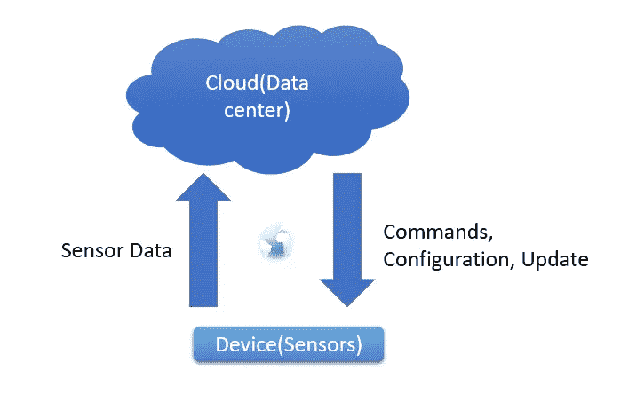
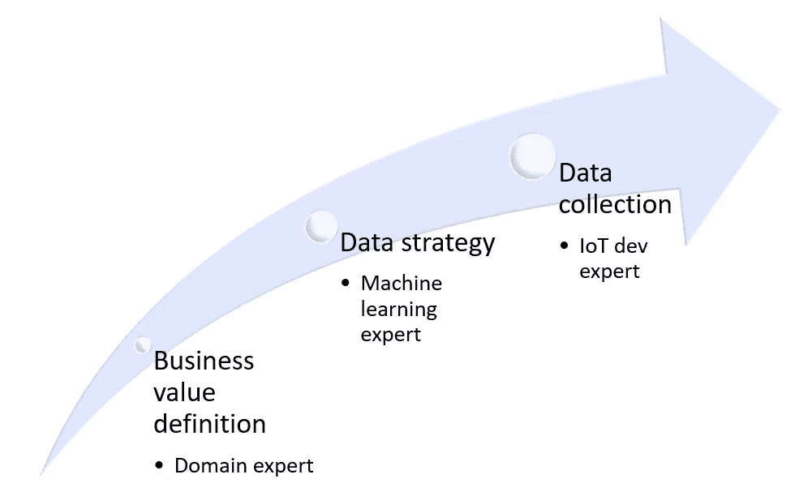
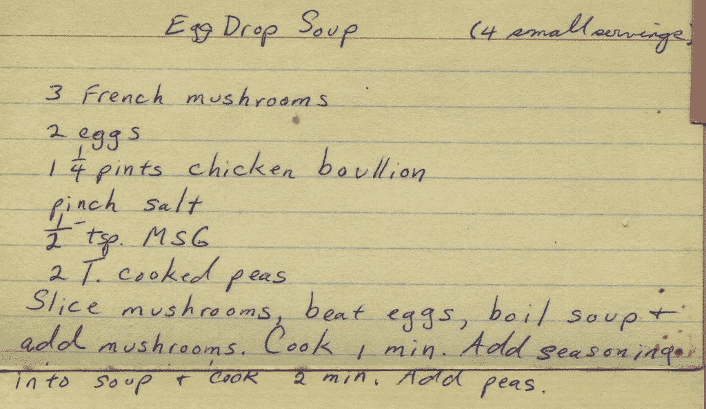
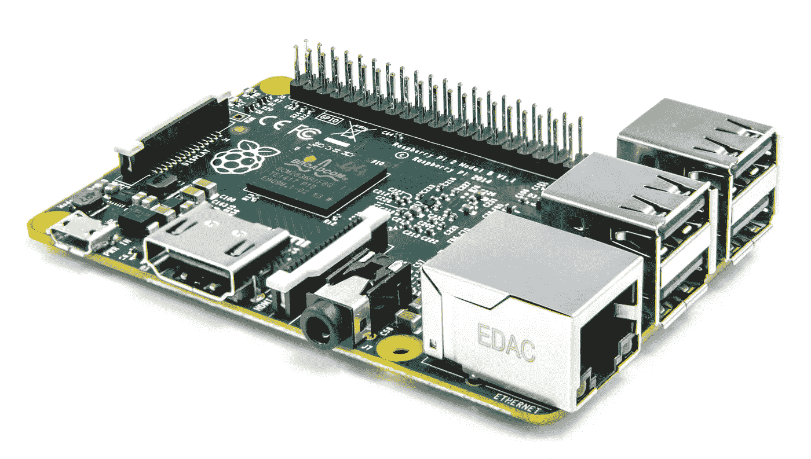
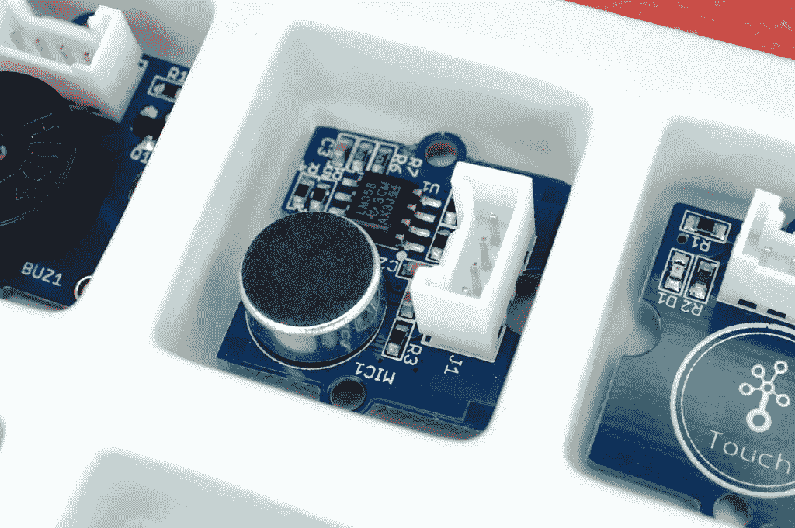

# 2018 年设计物联网解决方案

> 原文：<https://towardsdatascience.com/designing-an-iot-solution-in-2018-7fe1356e63d6?source=collection_archive---------3----------------------->

> 几天前，我接到一个朋友的电话，他们有市场领先的产品，是时候推出他们的解决方案了。"外面是一片汪洋，你建议如何开始？"这些天，我主动给他写了一封电子邮件，提供了一些关于开始物联网系统设计的指导，以下是我的邮件:)

## 2018 年更容易，2018 年更难

Going into the IoT world might feel like that in the begining

大约在 2009 年，当我们在构建 [Smartap](https://smartap-tech.com) 的时候，我们已经进入了物联网世界，当时没有人称之为物联网，实际上很多人问我们:你到底为什么想把淋浴连接到互联网？你可以节约用水，这是我们道歉的回答，2009 年美好的清洁技术时代。

我想将淋浴器连接到互联网，生活很容易— **你别无选择:)**在接下来的几年里，我发现自己成为了物联网专家，我想做的只是将淋浴器连接到互联网，但它经历了 [Zigbee](https://en.wikipedia.org/wiki/Zigbee) 、[LAN](https://en.wikipedia.org/wiki/Local_area_network)、wifi 许多协议和开发套件，早期采用者付出了大量的尝试和错误。微控制器生态系统是如此之早，以至于你实际上只能使用 http，并使用 c 语言通过 ASCII 代码来处理消息。

在物联网市场诞生后的几年里，直到 2013 年左右，我对大多数协议和设备都非常熟悉——在这里，决策非常容易(事实上它是连接的)—只需在你的 [BOM](https://en.wikipedia.org/wiki/Bill_of_materials) 上加 50 美元，你就连接上了(wifi)。时代已经变了，我想我已经跟不上现在单月解决方案的数量了。

从那以后，我设计了几个物联网系统，所以这是我看待事物的方式。这不是一个食谱帖子，但更多的是如何开始的指导(也就是说，不是方法，而是做它的方法)。如果你需要设计一个系统，或者想对这个领域有一个全面的了解，这将是一个很好的起点。

这篇文章是关于一些基本的东西，在接下来的几年里，这些东西将与物联网系统的设计相关。它会帮助你将你必须做出的重大决定与较小的决定区分开来。

## IoT 是什么？

IoT is a concept, not a technology

很难从这些天的嗡嗡声中分离出价值，但一言以蔽之，这就是 ***连通性*。**如果我被迫添加另一个单词那么它的 [***数据***](http://dataloop.ai) **。**我使用广义的物联网这个术语，它实际上是我们周围的一切:从智能手机到汽车。对我来说，这仅仅意味着如果我们把东西连接到互联网上，我们能得到什么？在某些情况下，连接是物联网产品的全部要素(如连接电源插座)，而在其他情况下，它只是整个系统中的一小部分(如汽车或机器人)，因此物联网产品可以是一个小的附加值或其价值主张基础，它非常依赖于您的产品和市场。但是这两个字一路带在身边，是根。

直到 2013 年，我的大部分时间都花在连接部分，大约在 2013 年，我完全转向了数据部分(这些天来 [dataloop.ai](http://dataloop.ai) ，我目前的工作都是关于数据的)。

我把这两个词翻译成两个解决方案:

*   **连接性—数据机制—** 从**设备来回传送位。**
*   **分析/机器学习—数据价值—** 一旦我们被连接和感知，我们获得的洞察力和采取的行动(机器智能来了)。

> 在早期，物联网完全是关于数据机制的；如今，一切都是关于机器学习和智能。几年前，我曾抱着这样的假设大量输入数据:“每个人都在收集数据，就像收集免费的黄金一样，我将专注于从数据中提取价值，因为它在未来几年听起来非常有用”。

截至 2018 年，确实有大量数据在流动，大多数公司几乎没有能力将这些数据转化为商业价值。这篇文章主要讲述了数据机制。平我，如果你对类似的分析部分感兴趣。

## 为什么是 IoT？

What is the value of connecting your product ?

如果你对物联网感兴趣，这是你应该问的第一个问题，创建一个仪表板并希望看到它的商业价值的日子已经过去了。总的来说，将传感器读数放在一些图表上更多的是为你的系统提供调试和监控解决方案，而不是这么做的理由。你为什么要这么做？价值在哪里？这些问题至关重要，因为你能从你的产品中获得的价值与你应该在 [BOM](https://en.wikipedia.org/wiki/Bill_of_materials) 、运营和 [NRE](https://en.wikipedia.org/wiki/Non-recurring_engineering) 中进行的投资密切相关，而投资的金额将决定你的解决方案。

或者，你可以采取更常见的方法，让我们收集数据，这些天它的价值很大，并在我们进行的过程中计算它。请记住，没有明确理由的数据收集很少产生有意义的价值或有用的数据。

## 基础设计

在其余的帖子中，将忽略**更重要的部分，**也就是数据科学和分析本身。你很少在早期设计阶段处理机器学习，不是因为它不重要，而是因为你还没有数据来开发这些可爱的花哨模型并证明它们正在工作。然而，我会建议你在实际实施之前尝试并证明你的机器学习模型的概念，如果不是技术上的，至少是商业上的。此外，值得一提的是，在大多数情况下，这两个部分是由两个不同的专家在项目的两个不同阶段完成的。作为一名领域专家，您应该能够从第一天起就清楚地阐述业务价值。你不需要机器学习专家(数据定义的咨询除外)。就像自动驾驶汽车一样，你可以在不知道你实际上如何制造汽车的情况下理解商业影响。这是基本流程:

IoT Phases & Leader position

让我们深入一点

## 我们烹饪食物的基本原料

我们的基本成分如下:

*   硬件平台/处理器
*   操作系统和驱动程序
*   传感器和[致动器](https://en.wikipedia.org/wiki/Actuator)。
*   输入/输出(发光二极管、按钮、屏幕等)
*   物理通道——比特如何进出设备。
*   逻辑通道—软件使用什么协议来传输这些位
*   我们的网络/连接拓扑
*   安全性
*   准备金提取
*   维护

对于这些成分中的每一种，你都必须做出一些决定。**在**做出这些决定之前，**设定你的系统目标和限制(投资和产品问题)**:

*   您的电力预算是多少(电池、运行时间等是否有限)？。
*   你允许的花费是多少？
*   外形(尺寸)是什么？
*   您期望的数据传输速率是多少？
*   计算/内存要求是什么？
*   监管会对你施加约束吗？

一旦你知道了你的边界，你就准备好选择栈了，这是你在每一个成分后面放置名字和协议的地方。

# 如何挑选？

外面有大量的功能、工具和协议——从哪里开始呢？

我建议这三个阶段的过程:

*   根据系统目标选择基本配料要求。
*   使用成分列表定义您的最小堆栈，并选择开发系统。
*   研究现有的物联网堆栈提供商，看看您能否使用开发套件找到 PoC 的最佳匹配。

Plan your ingredients with the end dish in mind

## 硬件平台/处理器/操作系统

这可能对您的 NRE 成本和开发时间有最大的影响。

RPI, My favorite board.

在这里，如果您的预算允许，我建议您使用完全兼容 linux 的操作系统，这里的预算是指成本和功耗预算。有许多供应商有许多电路板。ARM 可能是最具优势的处理器提供商，但对于神经网络和图像处理，您可能希望使用 Nvidia Tigra，对于 CPU 负载较重的情况，您可能希望使用 Intel X86。

您可以通过集成 ARM 处理器的硬件开发商直接购买 ARM 处理器(如 ST、TI 和许多其他产品)。英伟达和英特尔直接生产他们的芯片。

[Arm 提供三个主要系列的处理器，M、R 和 A](https://www.silabs.com/documents/public/white-papers/Which-ARM-Cortex-Core-Is-Right-for-Your-Application.pdf) 。

大多数使用 M(小巧、高效、廉价)或 A(丰富的功能和操作系统支持)。r 系列不太常见，介于两者之间。

如果你选择 M，你就进入了嵌入式世界，这意味着 C ++编码，低级定制驱动和迷你内核。首席运营官，RTOS 是我的最爱，TI 通常会提供他们的套件，将样品集成到他们的 OSAL 中。

如果您决定使用嵌入式解决方案，请注意开发环境，并准备好每个功能都将是工匠的工作。甜蜜的低 BOM 成本伴随着整个产品生命周期的 NRE 价格标签。

对您的主板和处理器进行基准测试[市面上有许多套件](https://thenewstack.io/10-diy-development-boards-iot-prototyping/)提供示例代码，帮助您快速入门。

## 传感器、执行器和 I/o

你想定制 PCB 板吗？如果您决定选择嵌入式解决方案，答案已经是肯定的。

尽量避免。当您需要带有定制传感器和执行器嵌入式系统时，这是不可避免的。如果是这种情况，至少准备 3 次电路板设计迭代，并开始寻找硬件设计师。在早期阶段使用外包硬件设计师**真的**不推荐。一旦你有了一个稳定的系统，你可以外包一些工作。

There are many sensor kits out there these days

选择传感器、执行器和 I/O 设备时，注意您选择的平台非常重要:

*   有足够的 I/o(线/引脚)来处理所有这些
*   您有适当的协议支持。相对于 [UART](https://en.wikipedia.org/wiki/Universal_asynchronous_receiver-transmitter) 、 [SPI](https://en.wikipedia.org/wiki/Serial_Peripheral_Interface_Bus) 、[I2C](https://en.wikipedia.org/wiki/I%C2%B2C)、…，许多系统在处理器上将具有有限的管脚集

## 是时候联系了

这是物联网的第一步。

在决定物理通道时，有 3 个重要因素:

*   数据率
*   范围
*   连接类型

智能家居就是 Zigbee，ZWave，Wifi

可穿戴设备和近移动设备走向 BLE

高速户外 go 3/4G/ LTE

Lora 提供廉价的低数据速率和良好的网格范围。

此外，您需要确定网络拓扑:

*   Star —最简单，每个端点都走向云/数据中心
*   树-端点连接到网关
*   网状—端点连接在它们之间，并且路由被定义为朝向网关。

我的建议是:试着坚持用星星，在大多数情况下，树应该是你停下来的地方。构建网状网络是一个痛苦的过程，实际上初创公司只是围绕这个问题建立公司。

有许多令人兴奋的新渠道，除非你有非常好的理由坚持使用可靠的技术。让启用者启用。当我们在 2009 年试图将 Zigbee 产品化时，我得到了惨痛的教训，该产品推出了 w/o Zigbee，总的来说，我试图避免 Zigbee(尽管街上的谣言说这些天它已经成长并变得可用)。

## 逻辑信道

所以你们是有联系的。这基本上意味着您有一个通过 IP 与云对话的设备(在树和网格中，该设备代表其连接中的多个端点设备)。那么你如何传递这些比特呢？

[有许多协议](https://www.postscapes.com/internet-of-things-protocols/)，我将介绍主要的协议，它们应该适用于大多数应用。

**HTTP**

即使在物联网中，特别是在低成本微控制器上，仍然普遍使用传统的 HTTP。它有很多好处，比如基于文本(调试和消息制作很容易)，很多库，我认为最重要的是，它可以通过防火墙。它最大的缺点是它不是全双工的，服务器不能与设备对话(轮询被用来克服这一点)。

**MQTT/AMQP**

如果物联网中有任何接近标准的东西，那么 [MQTT](https://en.wikipedia.org/wiki/MQTT) 可能就是它。这是一个轻量级、简单、实时的消息协议。如果您没有交付大量数据，那么它是一个很好的候选。 [AMQP](https://en.wikipedia.org/wiki/Advanced_Message_Queuing_Protocol) 与 MQTT 有很多相似之处，但有两个主要区别:它支持更复杂的网络管理，也允许 P2P(仅从版本 1 开始)通信。

没有防火墙问题，数据量低，拓扑简单，占用空间小，那就用 MQTT 吧。

对于较大的数据、复杂的网络拓扑，请选择 AMPQ。

功率敏感设备很难保持开放连接，因此在选择此路径时，请确保这也不是一个问题。

值得一提的是:目前领先的代理(协议服务器)是 rabbitMQ，它同时支持这两种协议，并且运行良好。

**CoAP/阿尔乔因**

这些主要是控制智能家居的竞争: [CoAP](http://coap.technology/) 的优势是灵活性和强大的 HTTP 兼容性，而 [AllJoyn](https://en.wikipedia.org/wiki/AllJoyn) 获得了更广泛的采用和更全面的方法(如供应、发现等)。).他们都提到安全是优势，但这是可以质疑的。回到一年前——一旦攻击者进入您的网络，就很难克服这一点，所以对所有的安全承诺要有所保留(CoAP 确实应用了 DTLS，它对这个问题给予了一些关注，但远远没有解决“问题”)。值得一提的是，MS 已经从 windows 10 开始支持 AllJoyn，给 Quallcom 和 AllJoyn initiator 带来了巨大的智能家居提升。

**XMPP-IoT**

XMPP 是驱动你的 whatsapp 的东西。你可以在你的移动应用中感受速度和吞吐量。基于 XML 的协议是非常组织化和冗长的(就像 XML 一样)。在我看来，XMPP 的最大优势是服务器可以非常高效地处理大量负载(单个服务器机器处理许多连接)——因此，如果您预计高数据中心成本是一个问题，这可能是一个不错的选择。

就我个人而言，从 2007 年开始，除非迫不得已，我不再使用 XML，只有在涉及数据格式化时才使用 JSON(在云环境中，YAML 甚至更好)。您可以将 JSON 封装在 XML 中，两者兼而有之，但这感觉是错误的。

[DDS](http://portals.omg.org/dds/)

[DDS](http://portals.omg.org/dds/) 是关于 lof 的数据，快速，实时，有严格的格式。我还没有用它做过任何东西，但是当我在英特尔将它应用于一些机器人时，我用它作为基准。然而，ROS 似乎将在他们的下一代操作系统(ROS2)中采用它。自主机器、机器人和大型数据系统会发现 DDS 是一种有吸引力的协议。

**Websockets**

与 [HTML5](https://www.techradar.com/news/internet/web/html5-what-is-it-1047393) 、 [Websockets](https://en.wikipedia.org/wiki/WebSocket) 一起推出的是 HTTP 池问题的解决方案，其中服务器可以与客户端建立开放的流通道。Websockets 享受 MQTT/AMPQ 提供的相同连接风格的好处，但对防火墙更友好，因为它们只是端口 80 上的 HTTP 连接被升级为 [pub/sub](https://en.wikipedia.org/wiki/Publish%E2%80%93subscribe_pattern) 通信。

嵌入式设备上的 Websockets 支持还不成熟，该领域的开源软件还很年轻。此外，这将需要一些额外的工作，从你的服务器端，因为协议是非常基本的。

## 安全性和供应

物联网和安全仍在寻找正确的关系。从简单的事情开始:

*   你需要配对设备(Wifi、BLE 或其他设备)
*   你需要加密链接
*   注册并验证设备
*   更新机密、密钥和其他敏感信息。

这些基础知识带来了一些挑战，所以从第一天起就将安全性定义嵌入到您的设计中。

对于链接加密，你必须使用 SSL，当选择廉价的 wifi 以确保其工作时，今天这不是一个大问题(除非你仍然在 Arduino 和 ESP2866 区)，但 2 年前这是痛苦的。

如果可能，使用物理连接/配对按钮进行配对(用户/安装人员点击激活)。请记住，用户必须输入网络凭据(如 wifi SSID 和密码)。移动电话供应是理想的选择。

如果你想保护虚假注册，你需要在设备中嵌入一个秘密，如果你真的需要高墙，那么密钥也是唯一的。在我看来，物理配对给了你跳过它的选择。

设备注册后(确保您有设备的序列号/唯一 id ),它需要执行一些密钥交换，这是一个秘密输入，将从现在开始用于验证设备。

设备密码可以是下列之一，具体取决于您的要求:

*   随机数只有你的设备知道——易于使用，无法控制过期时间(黑客设备)，没有元数据，更容易受到暴力攻击。
*   [JWT 令牌](https://jwt.io/) —我的最爱，允许你用元数据生成一个限定时间的令牌(在 JWT 世界中称为声明)。JWT 的缺点是服务器必须是令牌生成的一部分。
*   [客户端证书](https://en.wikipedia.org/wiki/Client_certificate) —可能是最可靠的认证，它需要生成证书，并且可以在配对时在客户端完成(服务器不是必须的)。

**维修**

您需要更新设备、密钥、算法、代码和配置。你会有很多设备，我的建议是，不要在没有升级和修复能力的情况下进行生产部署。像每个软件一样，您的设备会有一些错误、新功能和其他问题，需要您刷新其软件内容。

嵌入式世界更新是一个痛苦的过程，可能需要 6 个月的开发。如果你有一个操作系统在另一边，这将成为一个更简单的功能。

此外，不要忘记为您的监控和警报设置一些仪表板。您已经在部署基础架构，因此也可以将其重新用于内部使用(客户不可见)。

# 一体式方法

到目前为止，您已经知道将传感器和命令的数据传输回来是一个相当大的挑战。[有许多物联网堆栈提供商](https://blog.profitbricks.com/top-49-tools-internet-of-things/)为您提供大量开箱即用的东西。您可以选择一个大型的一体化解决方案，或者集成几个简单的提供商。

如果你没有特殊的需求，这种一体化的方法会很有效。很多时候情况并非如此，您可能希望将几个更简单的功能集成在一起。

**不要在没有正确理解自己的需求和局限性的情况下寻求外部解决方案。计划你的堆栈需求，列出需求清单，然后**购物，看看你是否能找到合适的。尽可能地集成现成的、可维护的解决方案。这将为您节省大量 NRE 和支持时间。****

从 2012 年开始，我一直坚持使用超级简单的基础堆栈: [Firebase](https://firebase.google.com/) ，Nodejs API gateway 和 [ElasticSearch](https://www.elastic.co/) 。这将让你开始，但预计你的后端和服务器拓扑可能会更加复杂，非常依赖于你的数据需求，类型和机器学习计划，但这是另一篇文章:)

# 摘要

我已经制定了设计物联网解决方案的方法，并希望这篇文章成为任何想在物联网世界开展活动的人的初步指南和参考列表。每个行业、领域和产品都有更多更高层次的细节，所以这只是一个起点。

无论你最终做了什么，请记住，你所做的只是把数据从一个地方转移到另一个地方，更重要的问题是为什么？

伊兰·什洛莫，

[dataloop.ai](http://dataloop.ai) CEO

