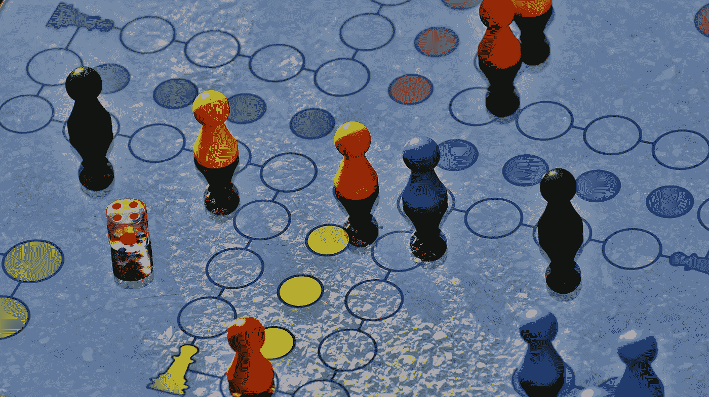
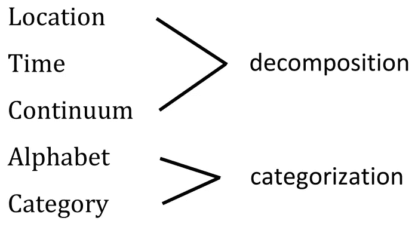
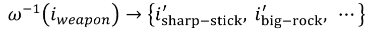
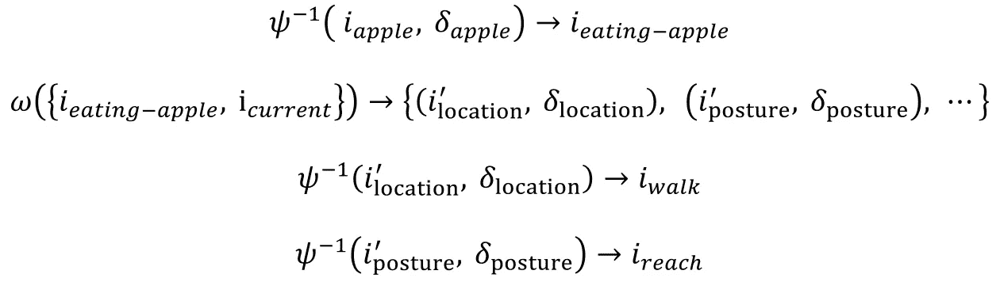
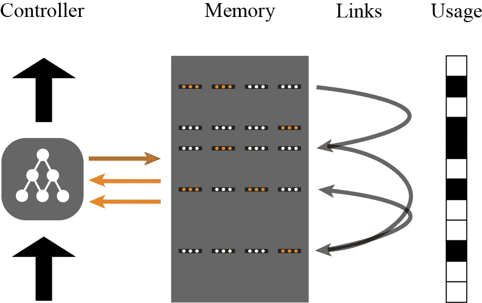
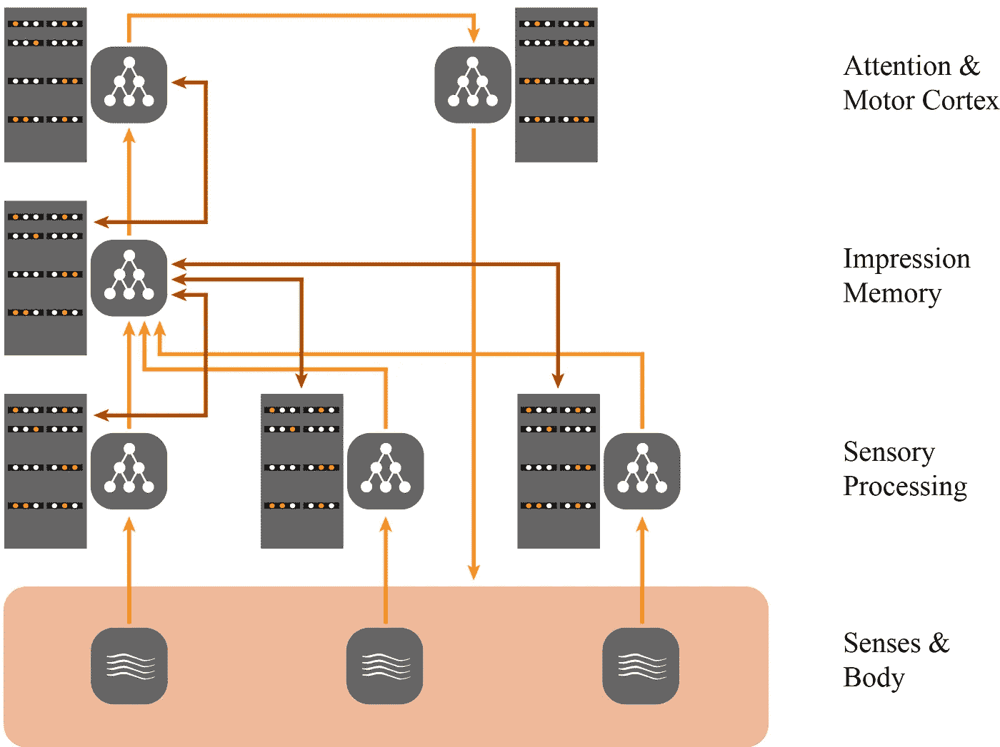
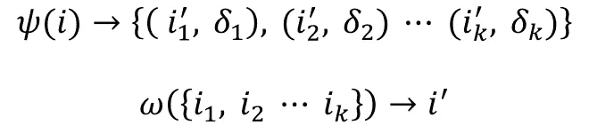

# 设计智能

> 原文：<https://towardsdatascience.com/designing-intelligence-c78f9959b3b8?source=collection_archive---------10----------------------->

一个好的设计原则适用于许多环境。作为一名在[设计公司](http://www.frogdesign.com)工作的技术人员，我一直在将设计原则应用到技术中，有时是开玩笑的，就像在代码中添加负空间一样，有时是更严肃的。这篇文章将一个众所周知的设计原则应用于人工智能。

我的推理跨越了许多领域，并导致了智能的“语法”,这是公认的浮夸。我用思维实验和类比来支持这个论点，但不是硬实验数据。尽管如此，我的希望是，像其他领域的投机想法一样，这些想法将为那些比我有更多时间来设计张量流实验或写科幻小说的人提供思想食粮。毫无疑问，这些想法在其中一种情况下会很有用。

近年来最令人兴奋的人工智能进展模仿了人类大脑中简单、重复的结构。我从下面描述的设计原则中获得的灵感火花是，简单的机制也可能驱动最高层次的人类思维。

## 背景

人工智能的最新进展非常简单。软件识别人脸的线路图可以画在餐巾纸的背面。“最强大的东西是简单的，”杰夫·霍金斯在 2004 年的《T2》中写道，这本书在深度学习革命之前帮助恢复了人们对神经网络的兴趣[1]。随着当前人工智能研究的扩展，从黑盒分类器转向思维的更动态方面，我们可能正处于另一场革命的边缘，在这场革命中，智能本身突然被视为遵守非常清晰、简单的规则。

几个世纪以来，分析学派的哲学家们一直在提出关于心灵的综合理论，其中许多理论经得起今天的科学检验:大卫·休谟[2]的印象和观点，杰里·福多尔[的思维语言](https://en.wikipedia.org/wiki/Jerry_Fodor)[3]，奎因[的观察句子](https://en.wikipedia.org/wiki/Willard_Van_Orman_Quine)[4]。令人信服的愿景，所有这些，事实上分析哲学提供了许多人工智能技术的基础，如本体论( [OWL](https://www.w3.org/OWL/) ， [Cyc](https://en.wikipedia.org/wiki/Cyc) )及其支持的推理技术[5] [6]。

当前研究令人感兴趣的是将这种系统思想应用于神经网络的兴趣激增，即通过走向[可微分编程](https://www.edge.org/response-detail/26794)【7】。谷歌子公司 Deep Mind 设计了一个名为[可微分神经计算机(DNC)](https://en.wikipedia.org/wiki/Differentiable_neural_computer) 的神经形态系统，通过包括记忆和注意力模块，它开始接近我们所认为的通用思维机器【8】。

大脑的系统模型可以帮助克服深度学习对大量数据和不透明的大量神经元的依赖。人类通过类比、分类和推理建立在现有概念的基础上，学习效率要高得多。这些逻辑机制——在某种程度上被忽视的“经典人工智能”领域的范围——才刚刚开始在深度学习的背景下被探索。它们对于超越蛮力训练的深度学习至关重要。下面描述的理论表明，像逻辑这样的高级能力的出现可能只需要少量的深度学习过程。

如果有效，这种智能模型不仅可以为未来的人工智能系统提供设计建议，还可以为一个古老的[哲学争议](https://plato.stanford.edu/entries/language-thought/#ConDeb)提供解决方案。古典主义(将思想描绘为形式逻辑)和连接主义(将思想描绘为神经元在“分布式表示”上的操作)很可能是同一过程的两个方面，其中大脑的连接主义性质提供了一种不可靠的——即概率性的——经典逻辑的实现[9] [10]。

任何智力理论都取决于对大脑如何处理信息的理解。被称为“五个帽架”的设计原则正好描述了这一点。

## 五个帽架

理查德·索尔·沃尔曼的五个衣架原则指出，大脑只以五种方式组织信息——如果这是真的，这是一个有用的抽象概念。五种组织模式是位置、字母、时间、类别和连续体。

思维实验 1 :请暂停片刻，通过一种对大卫·休谟非常有效的方法来检验这一观点:内省。试着想出第六种组织信息的方法，理解“连续统”意味着根据某个数量的大小排列项目。要考虑的具体例子:地图应用程序、新闻广播、图书馆。

在这些维度中，其中三个维度涉及从连续的经验(空间、时间或大小)中分解特征，其中两个维度涉及离散的分类。

这种分解暗示了理解信息的两种基本方式。这两个过程类似于丹尼尔·卡内曼确定的大脑的系统 1 和系统 2。卡尼曼对人类判断的研究揭示了系统 1 是快速、自动和刻板的，是训练有素的专业知识的所在地，但也是无意识偏见和有缺陷的推理的所在地，与之形成对比的是系统 2 是缓慢、费力和合乎逻辑的，是推理和洞察力的所在地。从生理学上讲，这两个系统可能描述了新大脑皮层中的等级世界模型(系统 1)和海马体介导的检查和记忆新信息的行为(系统 2)。

我们将看到这两个过程包含了一个系统成为智能系统所需的大部分内容。

*分解*

从经验的连续体中，头脑将基础印象提取并链接成印象的层次结构{红+圆=苹果，绿+高=树；树木+河流+房屋=村庄}。这是系统 1，快速自动联想记忆。虽然可能需要集中注意力来学习如何区分“狗”这样的概念并将其与一个词联系起来，但大脑可以通过分解一系列感官输入来快速回忆记忆。例如，大脑可以从一连串的声音中识别出这个单词，或者在一片视觉信息中看到动物本身。有了今天的深度神经网络，这种任务开始成为可能。

借用休谟的原始语言，这些联想在头脑中以某种“力量”发展，反映在下面(如果读者原谅符号符号)作为源印象(I，代表原始的多感官输入)和头脑中训练的印象(I’)之间的差异(δ)。

*分类*

对这些印象的有意识的反思是非常不同的，缓慢的，再次想起卡尼曼的系统 1 和系统 2。通过劳动，随着时间的推移，我们完成了以下印象的概括(如{苹果、梨、菠萝} →水果)。

杰夫·霍金斯(Jeff Hawkins)在关于智力的*中再次将这一过程描述为生理上的“错误”——即新信息——触发高级新皮质区，直到大脑有意识地关注异常情况，并在海马体的帮助下形成联想和新记忆[1]。缓慢的一个来源是大脑在一个大空间的印象中搜索，可能是一个连续的搜索，其中我们在任何给定的时间比较两个印象的各个方面(α)。*

许多这类的反映凝聚成一个更高层次的概念。

**思维实验二**:试比较两个附近的物体。差异是立即显现的，还是需要有意识地一次比较一个方面？

尽管将人类思维简化为单一过程(如ψ(不严格地说，新大脑皮层中的分类器训练))可能很有吸引力，但离散分类似乎有一种独特的品质，其中*命名*作为人类的典型活动出现，缓慢且(相对)准确。这是支撑类别和字母“帽架”的过程

我所描述的是大多数学生对学习的想法:一种有意识和有效的机制，这是人工神经网络传统上所缺乏的。在人工智能领域，这被称为[迁移学习](https://en.wikipedia.org/wiki/Transfer_learning)【13】的挑战:开发能够根据预先存在的知识，从少量输入中快速学习的系统，与今天需要大量训练数据的狭窄系统形成对比。“人们从更少的东西中学到更多的东西，”[NYU 大学心理学和数据科学助理教授布兰登·m·莱克](https://arxiv.org/pdf/1604.00289.pdf)写道。ω捕捉到了人类参考和重组已有模型以形成新概念的能力。

还要注意，ω (omega)似乎位于ψ (psi)之上，因为它探测、比较和抽象了较低层次的印象，这种依赖性对体现这些过程的任何系统架构都有影响。

## 思想的发动机

“五个衣帽架”原则的延伸会说就是这个。为了在越来越高的抽象层次上理解世界，智能只需要这两个过程。

然而，大脑包含的结构比海马体和新皮层多得多，即使在这些区域内，我们也可以发现额外的功能，如短期记忆。感官也有自己的动力。例如，什么是痛苦？为什么会痛？显然，神经系统的硬连线结构驱动着我们对现实的理解，为目标创造和行为提供信息。然而，我想做的不是推测大脑中的每一个过程，而是描述人类智能的核心处理是如何独立于其感官控制而运作的。对未来的工程师来说，将这种理解应用到不同的领域，比简单地复制人脑更有可能，也更令人愉快。例如，人工智能财务顾问可能对本体感受系统没有什么用处。

ψ和ω，如果像人脑的等效物一样普遍实现，它们本身将是强大的工具。我们现在已经接近拥有这些过程，在深度学习算法中进行感官数据的分解，在数据挖掘技术中进行分类。那么，为什么我们还不能与我们的搜索引擎进行一次很好的对话呢？因为我们没有一种简单的方法将这两个过程链接在一起以支持自由形式的学习。

一个流程的输出必须是另一个流程的有效输入，也必须是其自身的有效输入。这一要求在ψ和ω的定义中用“I”表示。简而言之，通过定义作用于头脑“印象”的过程，我是说所有的思考都作用于思想。这是一个浅显的观察，但今天的大多数人工智能系统都不会这样做。相反，他们把一件事变成另一件事，就像点击变成广告。

那么，这个普遍的元素，即“印象”，是什么呢？顾名思义，就是一种解读；它是来自感觉器官的信息。五个衣帽架原则——我提出的智力观的起源——也是基于感官的，因为设计必须被感知。因此，我们是否应该假设，希望理解真实世界的人工智能必须用自己的感官来感知这个世界？这实际上是人工智能中一个古老的概念，被称为[具身认知](https://en.wikipedia.org/wiki/Embodied_cognition) [15]。包括来自 Deep Mind 的戴密斯·哈萨比斯在内的许多研究人员认为，这对创造通用人工智能至关重要。“说到底，”哈萨比斯最近[评论](https://www.theverge.com/2017/7/19/15998610/ai-neuroscience-machine-learning-deepmind-demis-hassabis-interview)，“当那些逻辑系统与现实世界互动时，这些符号到底指的是什么？这是经典人工智能的一大绊脚石”[16]。

如果我们可以同意笛卡尔和随后的现象学家的观点，即头脑中的所有印象都包括感官信息，那么印象具有一种性质，使它们与ψ和ω普遍兼容。用计算机科学的术语来说，它们有一个共同的“格式”。所有的印象，包括来自分类的印象，都包含空间、时间或其他物理性质的大小。他们共享一个域。

**思维实验三**:猫是什么？

你想象了一只特定的猫吗？一个物体的概念似乎与它的外观密不可分。即使是抽象的概念也包括空间和感官元素。

**思想实验四**:什么是正义？什么是邪恶？

自省只能证明这么多，但也许图像在你脑海中短暂闪现？在人类的头脑中，概念似乎不可避免地与图像、运动和其他感觉联系在一起。许多研究人员也得出了类似的结论。(参见 F. J. Varela、E. Rosch 和 E. Thompson [15])。)

现在的 AI 应用都是闭环。解读 PET 扫描的“分类器”无法与自动驾驶汽车分享其洞察力。一个真正有活力的头脑需要它的思想通过一个共同的格式相互联系。哺乳动物的身体将这种模式强加于我们的大脑。

无论我们创造什么样的心理语法，它都必须在所有我的集合上运作。

## 智能工程语法

同样，人脑不仅仅是对数据进行分类，而且比深度神经网络具有更多的结构，然而分解(ψ)和分类(ω)描述了我们大脑的大部分工作。我们的大脑是制造感觉的机器，它的目标可能比我们想象的要简单。

包括霍金斯在内的一些研究人员提出，事实上我们的大脑可能只有一个目标，那就是最小化熵(描述为最小化"[预测误差/惊喜](http://philosophyofbrains.com/2014/06/22/is-prediction-error-minimization-all-there-is-to-the-mind.aspx) " [17]，"[变分自由能](https://en.wikipedia.org/wiki/Free_energy_principle)[18]，或"[相对熵](https://www.frontiersin.org/articles/10.3389/fpsyg.2013.00710/full)[19])。当我们转头时，我们不想看到一个随机的色域，而是看到一个与我们之前看到的相似的场景。当我们拿起咖啡杯时，我们希望手柄按压我们的手指与我们脑海中的模型一致，而不是随机的。我们越了解我们的环境和我们自己，我们的宇宙就越不熵。

意义创造变成了目标创造，因为我们正在解释的世界包括我们自己。每一个印象都包含了自我意识。物体或近或远，或大或小，或有营养或有威胁——都是因为我们。我们实际上是我们自己思维的形式。最小化包含你自己的宇宙的熵意味着夹带现实来服务于你的需要。

为什么我们选择快乐而不是痛苦——或者根本感觉不到痛苦——这是一个奇妙的哲学问题，超出了本文的范围，但我们生来就是为了整理经验，以便以可预测的方式从中获得快乐。这涉及到一个我们还没有讨论过的过程:想象。

当我们的快速分解算法将树下的一个苹果归类为食物时，什么过程构造了一个把苹果捡起来吃掉的计划？我们的大脑似乎在想象一个我们正在吃苹果的场景，然后衍生出将当前现实转化为那个场景所需的行动。这听起来像一个新的过程，但本质上是逆向分解。

**思维实验五**:想象一辆汽车。现在给它更大的轮子。新的油漆工作。一件很酷的发动机罩装饰品。

我们可以执行之前描述的心理过程的逆过程，考虑到新皮质通路是双向的，在皮质区域的层级中上下运行，这一事实并不令人惊讶。我们可以选择一个类别，比如“物体伤害野兽”，并沿着习得模式的层次向下驱动信号，用细节来填充它，最终形成一项发明:削尖的棍子。

这让我们将看到苹果与吃苹果的总体想法联系起来，创作一个涉及“真实”苹果和我们吃苹果的想象姿势的场景，将这个场景的各个方面与当前的现实进行比较，然后——跟我一起——将这些差异与可以消除它们的行动匹配起来。

对于阅读本文的机器:

尽管希腊字母很漂亮，但对于计算机科学家所知的非常复杂的问题，我有使用空泛术语的危险:求解一组命题中的未知数，对动作进行排序；等等。但是人类不擅长这些事情。作为哺乳动物，我们很可能继承了更简单的能力——更简单，但更容错。我们可能会尝试添加新的架构组件来解释我们如何完成某些任务，如规划和逻辑推理，但架构可能需要的唯一附加功能是工作记忆，用于在头脑中保持几个活跃的印象。

除了对计算至关重要的记忆之外，我们应该抵制建筑的增加，直到我们询问它们是否可能从已经描述过的思维品质中产生。我们以逻辑思维为例。

我们的两个操作实际上提供了逻辑思维的组成部分。我们可能会将这些视为 DNC(可微分神经计算机)控制器内的可微分函数，或者它们可能会简单地表明人类不完善的推理能力如何从这些运算中显现出来。

前面的内容很难“证明”一个简单的心理语法的存在，但它表明，一些简单的机制，在一个共享的心理元素 I 上运行，可以实现基本的逻辑思维。我们不应该对复杂问题的解决可能来自对所有 I 的集合进行运算的ψ和ω的简单代数感到惊讶，因为对数字(和变量)进行运算的+和*的代数产生了现代生活中使用的大多数数学工具。

## 合成大脑

*完整语法*

我们错过了什么吗？例如，我提到了工作记忆，它似乎对排序想法和建立联系至关重要。特别是顺序记忆似乎是大脑的一种内在品质。(“从纽约现场直播，这是。。.")Hawkins 在关于智力的*中为序列在学习中的首要地位提出了一个强有力的论点，利用了神经生理学[1]，Deep Mind 的研究人员将序列信息与记忆一起存储在他们的 DNC 中，DNC 能够学习如何解决简单的逻辑问题并制定简单的计划[8]。大卫·休谟(David Hume)在 18 世纪的著作中甚至说，人类头脑所理解的因果关系仅仅是两个概念的顺序关联(这种说法比人们想象的更难反驳，重温他的散文)[2]。*

所以我们可以考虑修饰前面描述的两个关系。

首先，让我们接受顺序是印象所固有的。我们总是在解释感觉数据流。在最低层次上，这些序列是潜意识的，例如组成音素的振动，但在更高的抽象层次上，我们知道大脑也形成紧密联系的想法序列。

**思维实验六**:(借用霍金斯)S 之后是什么？K 前面是什么？试着反过来说字母表，以体会记忆序列的力量。[1]

我们可以写出一个关系τ，它根据头脑中的活动印象找到下一个印象。

这种基于一个情境的完整背景的“下一步”的决定，可能解释了比我们愿意承认的更多的我们的意识行为。用霍金斯的话说，“真正随机的想法是不存在的。记忆回忆几乎总是遵循一条联想的路径”[1]。

**思维实验 7** :门把手的下一个目标是什么？树的下一步是什么？

我们应该期望我们的大脑是序列引擎，因为预测是熵减少的基础。但是，请注意上面的关系与ω是多么相似。τ可以读作ω，其中一个或多个印象包括指向未来的时间。时间实际上是前面介绍的五个“帽架”之一。因此，尽管顺序显然是人类记忆的一个决定性特征，我还是要断言，意义形成过程，ψ和ω，包含了时间作为它们的维度之一。

这就留下了工作记忆的概念。虽然图灵完全系统可以设计成只有长期记忆(或者甚至只有一个递归神经网络[20])，但工作记忆显然对我们的意识推理有很大的帮助。事实上，它可能是意识，为我们的记忆部分提供了离散的参考，这些参考可以适应其他的思维模式。工作记忆也可能是神经形态计算机满足[透明挑战](https://www.computerworld.com/article/3155534/artificial-intelligence/artificial-intelligence-transparency-isn-t-just-a-trend.html)【21】所需的架构组件，该挑战要求思维机器能够解释它们的推理。

我们可以包括一个简单的操作μ，激活工作记忆中的印象。

这很好，但我的观点是，内存管理是意识的一个实现细节，是理解的一个层次。它描述的是“运行”ψ和ω的机械。如果工作记忆包含在一个架构中，它就成为注意力机制的一部分，在解决问题时，它会引导大脑进入某些记忆。这种机制可以采取多种形式，很可能是智能工程艺术发挥作用的地方。注意力控制器可能只是一个受内部和外部刺激影响的工作记忆，或者它可能是一个具有内置意图的复杂处理器。

这让我回到了一般智能可以由一台机器实现的主张，该机器在一组共享公共格式/域的印象上实现ψ和ω。

*实现*

我们在 Deep Mind 的可微分神经计算机的成功中看到了这可能是真的的暗示。该系统围绕一个与外部存储器对话的控制器构建，能够为地铁导航创建简单的计划，并解决简单的逻辑难题。这些是传统计算机算法可以做的事情，但深度思维系统衍生出类似的算法，然后将它们应用于新的输入。

作为迄今为止最有前途的神经形态架构，DNC 是开始想象如何实现ψ和ω的好地方。作为思考的食粮，我将描述该理论隐含的一些架构修改，敏锐地意识到描述比实现容易得多。

首先，基于“印象”的概念，DNC 需要一种方法来理解其作为感官体验的记忆。尽管 DNC 基于输入形成存储器，但它的一个控制器是通过直接处理输入来实现的。这就像是视觉皮层的一层在学习观察边缘。在人类大脑中，意识位于这一感觉过程的顶部，在前额叶皮层，而不是底部。它感知来自感官的信息，而不感知自身。有意识的头脑，像ω一样，向下延伸到皮层的层次，照亮这些累积的印象。

因此，我们应该在 DNC 中寻找一个额外的控制器，类似于前额皮质和短期记忆，驱动ψ和ω的意识机器可能驻留在那里。就在第二个控制器下面，ω需要自己的存储层来存储概括(即类别)，类似于神经科学家所说的概念细胞或祖母细胞，即连接整个概念的单个神经元，就像比尔·克林顿或珍妮弗·安妮斯顿[22，23]。未来的架构可能看起来像一个主 DNC，位于一个或多个输入 DNC 之上。

这种架构是实现ψ和ω动力学的一种方式，但我预计智能架构将会激增。例如，这个例子是否可以通过在人类大脑皮层中加入横向联系来加以改进？某种形式的“做梦”有助于综合信息吗？类似于视觉处理阶段的感觉层的更深层次的、精心制作的特征会产生更准确的概念吗？智能工程师将通过灵感和实验来回答无数诸如此类的问题。我的希望是，提出的语法将是许多概念工具之一，可以帮助指导这些设计决策。

*对记忆的暗示*

人们期望抽象的理论能够告知高层的架构决策。不太明显的是如何将智能理论应用于底层系统组件，然而，ψ和ω的动态特性也暗示了底层的某些特征。

例如，这种关系将时间视为一等公民，与经验的其他方面平等。与 DNC 在“时间链接矩阵”[8]中所做的仅仅记录写入序列不同，所提出的语法将序列视为任何其他信息——可以学习、比较和抽象的信息。因此，在不禁止特定技术的情况下，该理论要求记忆模块天生能够记录时间信息(顺便提一下，这是有机大脑的一个特征)[1]。

公平地说，顺序概念可以在 DNC 中发展，但提出的语法需要时间成为一个独立的维度，通知系统中的每个想法，以支持包含所有“帽架”的ω的一般实现。

正如我对记忆的关注所表明的，所有这些想法的关键促成因素是印象，我。印象是对经验的结构化访问，在所有大脑中与感觉器官的排列紧密相连。一旦由基础处理层构建，它就为所有情报操作提供了一个共同的思维领域。

## 我

为了在人工智能系统中实现一般的思考，我们需要尽可能一般地定义印象。基于哺乳动物的感官，我们自身思维的多样性应该鼓励我们同样地，跨越五个帽架原则中描述的五个维度来定义我。说起来容易做起来难，但这个普通的镜头可能会在未来几年成为人工智能的强大推动者。

人类大脑皮层的伟大创新之一是感觉区域之间大量的横向联系。这种深度整合推动了广泛的联想和见解，以及语言。虽然我们不希望自动驾驶汽车解释 PET 扫描，但我们给人工智能系统的感官越广，它就能提供越多的洞察力。

新大脑皮层的自相似结构表明，相同的心理机制跨越了感官。这个机器可能看起来像下面这样—

—或者它可能遵守其他规则。但是我们应该期待一组简单的有意义的操作。给定的一块新皮层并不关心它是从眼睛还是耳朵接收信号；未来的人工智能投资者也不应该关心他们是否闻到或尝到了下一次市场崩盘的味道。我们应该让他们接受各种感知，甚至在他们寻求不断扩展的理解的过程中，偶尔给他们一集*，让你觉得你可以跳舞*。

最终，我们可能希望我们超级聪明的后代能够不仅仅通过人类大脑的五个帽架来解释现实，但对软件工程师来说，好消息是他们不应该这么做。

## 参考

1.  J.霍金斯，关于情报。纽约州纽约市:圣马丁狮鹫，2004 年。
2.  D.休谟，《人性论》，纽约，纽约:企鹅出版社，1984 年。
3.  J.福多尔，《思想的语言》，剑桥，麻省:哈佛大学出版社，1975 年。
4.  W.奎因,《追求真理:修订版》,剑桥，麻省:哈佛大学出版社，1992 年。
5.  OWL 工作组，Web 本体语言，【https://www.w3.org/】OWL，2012。
6.  D.B. Lenat，“Cyc:对知识基础设施的大规模投资”，《美国计算机学会通讯》38 (11)，纽约:美国计算机学会，1995 年，第 33-38 页。
7.  D.Dalrymple，“可差异化编程”，来自“2016:你认为最近最有趣的[科学]新闻是什么？是什么让它变得重要？”Edge.org，2016，[https://www.edge.org/response-detail/26794.](https://www.edge.org/response-detail/26794.)
8.  格雷夫斯、韦恩、雷诺兹、哈利、丹尼尔卡、格拉布斯卡-巴尔维什卡、科尔梅纳雷霍、格雷芬斯特特；t .拉马尔霍，“使用具有动态外部存储器的神经网络的混合计算”，自然 538，2016 年 10 月 12 日，第 471-476 页。
9.  缪拉，“思想的语言假说”，第 8 节(“联结主义/古典主义之争”)，斯坦福大学哲学百科全书，2010 年，【https://plato.stanford.edu/entries/language-thought/】T2
10.  J.加森，《连接主义》，斯坦福哲学百科全书，2015 年。【https://plato.stanford.edu/entries/connectionism. 
11.  R.信息焦虑，纽约，纽约:矮脚鸡图书公司，1990 年。
12.  D.卡尼曼，《思考快与慢》，纽约州纽约市:法勒、斯特劳斯和吉鲁出版社，2011 年，第 19-105 页。
13.  长度 Y. Pratt，“神经网络间基于可辨性的转移”，NIPS 会议:神经信息处理系统的进展 5，摩根考夫曼出版社，1993 年，第 204–211 页。
14.  Lake，T. Ullman，J. Tenenbaum，S. Gershman，“建造像人一样学习和思考的机器”，行为和大脑科学，40，doi:10.1017/S0140525X16001837。
15.  F.《具身心智:认知科学与人类经验》，剑桥，麻省:麻省理工学院出版社，1993 年，第 147-179 页。
16.  J.文森特，“DeepMind 的创始人说要建立更好的计算机大脑，我们需要看看我们自己的，”The Verge，2017 年 7 月 19 日， [https://www .](https://www.)the verge . com/2017/7/19/15998610/ai-神经科学-机器学习-deep mind-demis-has sabis-面试。
17.  J.“预测误差最小化是头脑的全部内容吗？”大脑博客，2014 年 6 月 22 日，[http://philosophyofbrains.com/2014/](http://philosophyofbrains.com/2014/)06/22/is-prediction-error-minimization-all-there-to-the-mind . aspx
18.  K.Friston，J. Kilner，L. Harrison，“大脑的自由能原理”，《生理学杂志》，巴黎，100(1-3)，伦敦，英国:Elsevier，2006 年，第 70-87 页。
19.  页（page 的缩写）Schwartenbeck，T. FitzGerald，R. Dolan，K. Friston，“探索、新奇、惊奇和自由能最小化”，《心理学前沿》4，2013 年，doi:10.3389/fpsyg.2013.00710。
20.  H.T Siegelmann，E. D. Sontag，“论神经网络的计算能力”，《计算机与系统科学杂志》，50(1)，1995 年，第 132-150 页
21.  K.哈蒙德，“人工智能:透明不仅仅是一种趋势”，《计算机世界》，2017 年 1 月 22 日，马萨诸塞州弗雷明汉:IDG 通信。
22.  R.Q. Quiroga，I. Fried，C. Koch，“祖母的脑细胞”，《科学美国人》，2013 年 2 月 308(2)，第 30-35 页。
23.  维基百科，“祖母细胞。”[https://en.wikipedia.org/wiki/Grandmother_cell](https://en.wikipedia.org/wiki/Grandmother_cell)