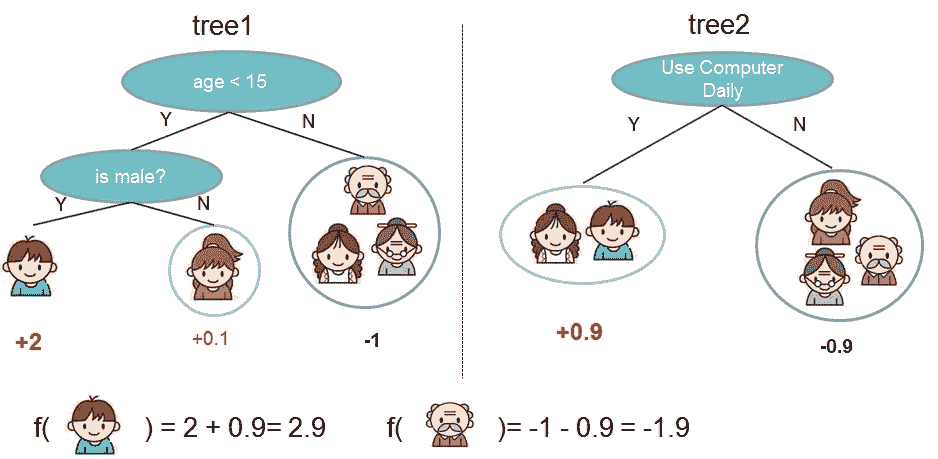

# 用 10 行代码拯救生命:用 XGBoost 检测帕金森

> 原文：<https://towardsdatascience.com/detect-parkinsons-with-10-lines-of-code-intro-to-xgboost-51a4bf76b2e6?source=collection_archive---------7----------------------->

因此，您已经涉足了数据科学，听说过“XGBoost”这个术语，但不知道它是什么。我非常喜欢通过*做*来学习，所以让我们尝试使用 XGBoost 来解决现实生活中的问题:诊断帕金森氏症。

XGBoost 是一种流行的技术，是传统回归/神经网络的一种简洁的替代方法。它代表 E**X**treme**G**radient**Boost**ing，基本上是构建一个决策树来计算梯度。这里有一个来自 [XGBoost 网站](http://xgboost.readthedocs.io/en/latest/model.html)的流行图片作为例子:



Not so menacing now, huh?

这在实践中听起来很简单，但却非常强大。以帕金森氏症检测为例:我们有几个指标可以分析，最终我们需要诊断帕金森氏症(分类！).这对于 XGBoost 来说是一个完美的问题(*特别是因为只有一个输出，所以我们不需要使用多输出包装器——稍后会详细介绍)*。

## 让我们写 10 行代码

让我们从收集一些数据开始。在我的好朋友 [Shlok](https://medium.com/@shlok_85483) 的指引下，我发现了一个格式极佳的数据集:跳到 UCI 的 ML 数据库，下载帕金森氏症数据集`parkinsons.data` ( [这里有一个链接](https://archive.ics.uci.edu/ml/machine-learning-databases/parkinsons/))(如果它消失了，就在[这个回购](https://github.com/pshah123/parkinsons-AI))。它们是 CSV，所以我们可以用熊猫快速解析它们:

```
df = pd.read_csv('parkinsons.data')
```

接下来，我们需要获取特性和标签。除了第一列(名称)之外，所有列都是数字，带有标签的列是“状态”(已经是 0 或 1)。我们暂且忽略它们的意义，盲目分析*(实践中不要这么做)*。这使得我们很方便地快速获得训练数据:

```
features = df.loc[:, df.columns != 'status'].values[:, 1:]
labels = df.loc[:, 'status'].values
```

接下来，我们需要缩放我们的要素，使其介于-1 和 1 之间，以便进行规范化。我们可以用`sklearn`的聪明的`MinMaxScaler`来做到这一点:

```
scaler = MinMaxScaler((-1, 1))
X = scaler.fit_transform(features)
```

目前为止我们有 5 条线。接下来，让我们把它分成训练和测试数据，这样我们可以防止过度拟合。没有太多的数据点，所以让我们将 14%分成测试数据，这次使用`sklearn`的`train_test_split`便利函数:

```
X_r, X_s, Y_r, Y_s = train_test_split(X, labels, test_size=0.14)
```

然后我们使用`xgboost`的 XGBClassifier，它已经为分类而构建，并通过`xgboost`模块(`pip install xgboost`)提供:

```
model = XGBClassifier()
model.fit(X_r, Y_r)
```

这应该需要一瞬间，然后完成树的构建。我们无需花费数小时的训练就能实现融合，这不是很棒吗？

我们现在有 8 行了—缩短它！让我们用来自`sklearn`的`accuracy_score`函数，根据之前的测试集来评估我们的模型，从而结束这个交易:

```
Y_hat = [round(yhat) **for** yhat **in** model.predict(X_test)]
print(accuracy_score(Y_test, Y_hat))
```

您应该可以看到高达 90%的准确度(在测试集上大约为 96.42%！).这已经很惊人了，因为 2007 年的原始论文引用了 91.8±2.0%的分类准确率，2016 年的其他论文引用了 [96.4% (SVM)](https://www.sciencedirect.com/science/article/pii/S1386505616300326) 和 [97%的带有调优(Boosted LogReg)](https://arxiv.org/pdf/1610.08250.pdf) 的准确率；通过一些调整，我们的模型可以远远超过最先进的方法！

就是这样！10 行代码，你就训练了一个完整的帕金森病 XGBoosting 分类器。您可以在`Train.ipynb` Jupyter 笔记本[此处](https://github.com/pshah123/parkinsons-AI)找到此模型的完整源代码以及另一个 UDPRS 数据模型。

## 事后思考

XGBoosting 极其强大，绝对可以成为你下一个项目的有用工具！不过这要深入得多——对于多输出，您需要一个多输出模型(SciKit Learn 有一个很好的包装器),为了更加精确，您需要微调 XGBoost 模型。在之前的 Jupyter 笔记本中(以及下面链接的 repo 中)，我探索了使用 Keras 处理连续数据，但是来自`sklearn`的 MultiOutput 包装器几乎可以作为 Keras 模型的替代。如果你想要更高级的关于微调 XGBoost 的教程，请查看 2016 年的[这篇好文章！](https://www.analyticsvidhya.com/blog/2016/03/complete-guide-parameter-tuning-xgboost-with-codes-python/)

[](https://github.com/pshah123/parkinsons-AI) [## pshah 123/帕金森病-人工智能

### 帕金森-人工智能-使用 XGBoost 和神经网络检测帕金森

github.com](https://github.com/pshah123/parkinsons-AI) 

像这样，还有更多？在 [Aiko AI](https://helloaiko.com) ，我们热爱开源项目以及探索和可视化数据！